## Solution

---
### Prerequisites

**XOR**

[XOR](https://en.wikipedia.org/wiki/Exclusive_or) of zero and a bit results in that bit

$0 \oplus x = x$

> XOR of one and a bit flips that bit

$1 \oplus x = 1 - x$

**Right Shift and Left Shift**

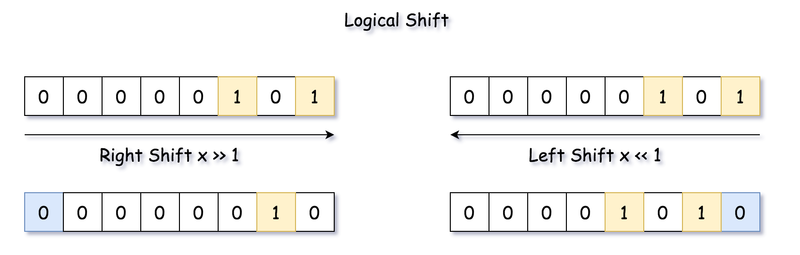

<br/>
<br/>

---
### Overview

> The article is long, and the best approach is the one number 4. In the case of limited time, you could jump to it directly.

There are two standard ways to solve the problem:

- To move along the number and flip bit by bit.

- To construct a 1-bit bitmask which has the same length as the input number, and to get the answer as $bitmask - num$ or $bitmask ^ num$.

    For example, for $\textrm{num} = 5 = (101)_2$ the bitmask is $\textrm{bitmask} = (111)_2$,
    and the complement number is $\textrm{bitmask} \oplus \textrm{num} = (010)_2 = 2$.

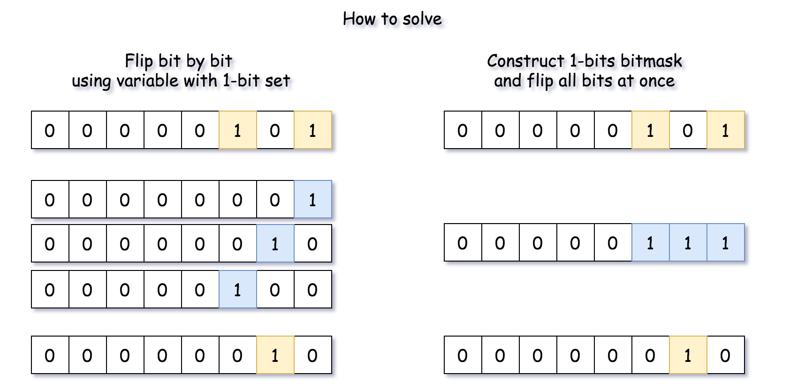

### Approach 1: Flip Bit by Bit

**Algorithm**

- Initiate a 1-bit variable which will be used to flip bits one by one.
Set it to the smallest register $bit = 1$.

- Initiate the marker variable which will be used to stop the loop
over the bits $todo = num$.

- Loop over the bits. While $todo \neq 0$:

- Flip the current bit: $num = num ^ bit$.

- Prepare for the next run. Shift the flip variable to the left and
    `todo` variable to the right.

- Return `num`.

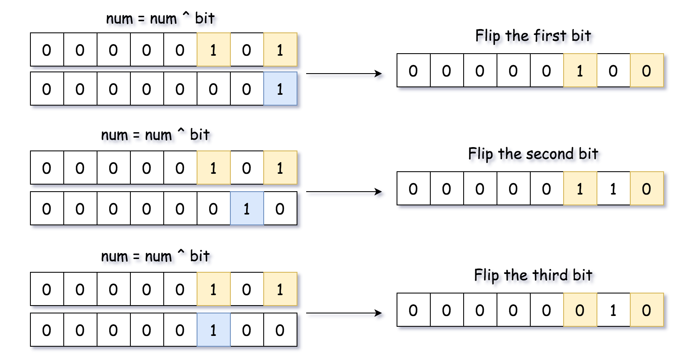

**Implementation**

```python
class Solution:
    def bitwiseComplement(self, N: int) -> int:
        if N == 0:
            return 1
        todo, bit = N, 1
        while todo:
            # Flip the current bit
            N = N ^ bit
            # prepare for the next run
            bit = bit << 1
            todo = todo >> 1
        return N
```

**Complexity**

- Time Complexity: $\mathcal{O}(1)$, since we're doing not more than 32 iterations here.

- Space Complexity: $\mathcal{O}(1)$.
<br/>
<br/>

---
### Approach 2: Compute Bit Length and Construct 1-bit Bitmask

Instead of flipping bits one by one, let's construct a 1-bit bitmask and flip all the bits at once.

There are many ways to do it, let's start with the simplest one:

- Compute bit length of the input number $l = [\log_2 \textrm{num}] + 1$.

- Compute 1-bits bitmask of length $l$: $\textrm{bitmask} = (1 << l) - 1$.

- Return $num ^ bitmask$.

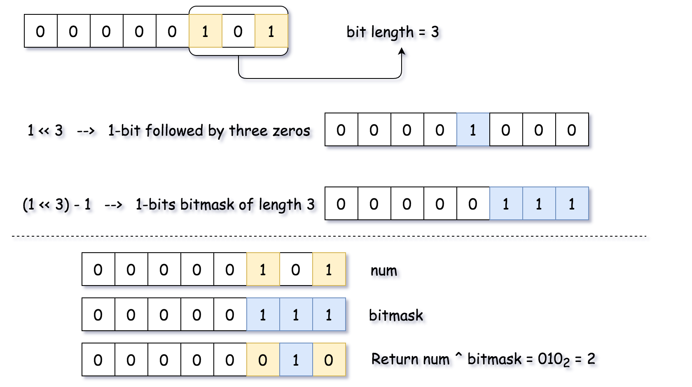

**Implementation**

```python
from math import log2
class Solution:
    def bitwiseComplement(self, N: int) -> int:
        if N == 0:
            return 1
        # l is a length of N in binary representation
        l = floor(log2(N)) + 1
        # bitmask has the same length as N and contains only ones 1...1
        bitmask = (1 << l) - 1
        # Flip all bits
        return bitmask ^ N
```

**Complexity**

- Time Complexity: $\mathcal{O}(1)$.

- Space Complexity: $\mathcal{O}(1)$.
<br/>
<br/>

---
### Approach 3: Built-in Functions to Construct 1-bit Bitmask

Approach 2 could be rewritten with the help of built-in functions: $\text{bit}_{length}$ in Python and `highestOneBit` in Java. The first one is trivial, and `Integer.highestOneBit(int x)` the method in Java returns int with the leftmost bit set in x, i.e. $\text{Integer.highestOneBit}(3) = 2$.

**Implementation**

```python
class Solution:
    def bitwiseComplement(self, N: int) -> int:
        return (1 << N.bit_length()) - 1 - N if N else 1
```

**Complexity**

- Time Complexity: $\mathcal{O}(1)$ because one deals here with integers of not more than 32 bits.

- Space Complexity: $\mathcal{O}(1)$.
<br/>
<br/>

---
### Approach 4: highestOneBit OpenJDK algorithm from Hacker's Delight

The best algorithm for this task is an implementation of `highestOneBit` in OpenJDK. [This implementation is taken from "Hacker's Delight" book](http://hg.openjdk.java.net/jdk8/jdk8/jdk/file/687fd7c7986d/src/share/classes/java/lang/Integer.java#l40).

The idea is to create the same 1-bit bitmask by propagating the highest 1-bit into the lower ones.

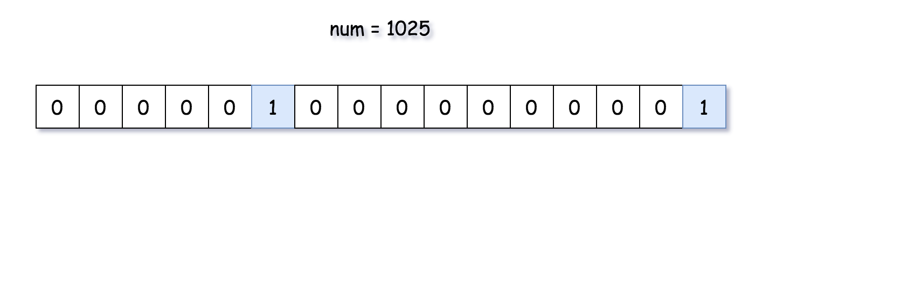

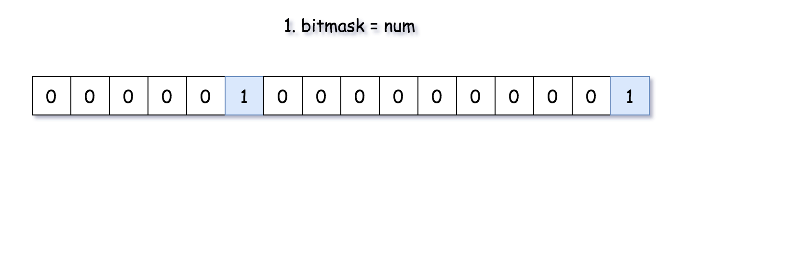

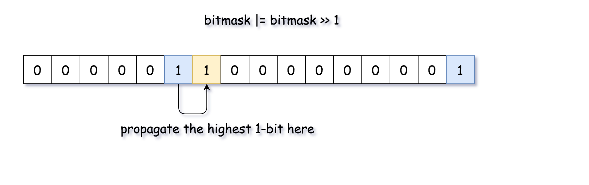

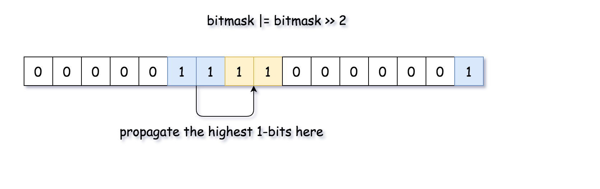

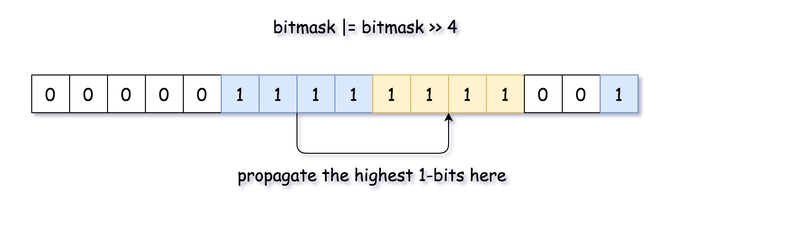

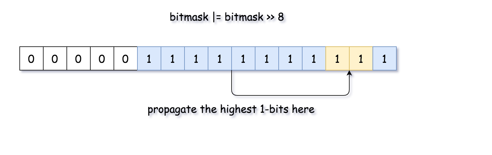

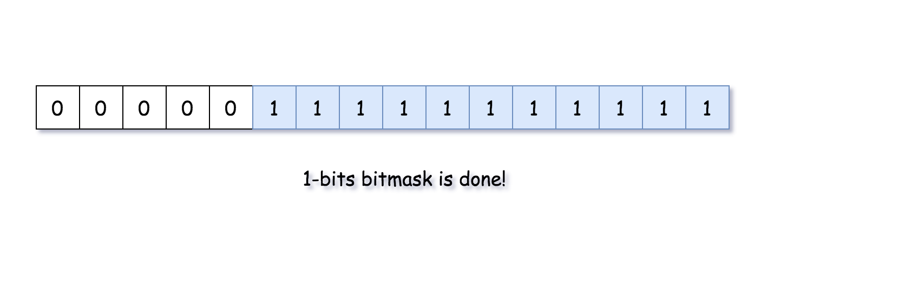

**Implementation**

```python
class Solution:
    def bitwiseComplement(self, N: int) -> int:
        if N == 0:
            return 1
        # bitmask has the same length as N and contains only ones 1...1
        bitmask = N
        bitmask |= (bitmask >> 1)
        bitmask |= (bitmask >> 2)
        bitmask |= (bitmask >> 4)
        bitmask |= (bitmask >> 8)
        bitmask |= (bitmask >> 16)
        # flip all bits
        return bitmask ^ N
```

**Complexity**

- Time Complexity: $\mathcal{O}(1)$.

- Space Complexity: $\mathcal{O}(1)$.

<br/>
<br/>