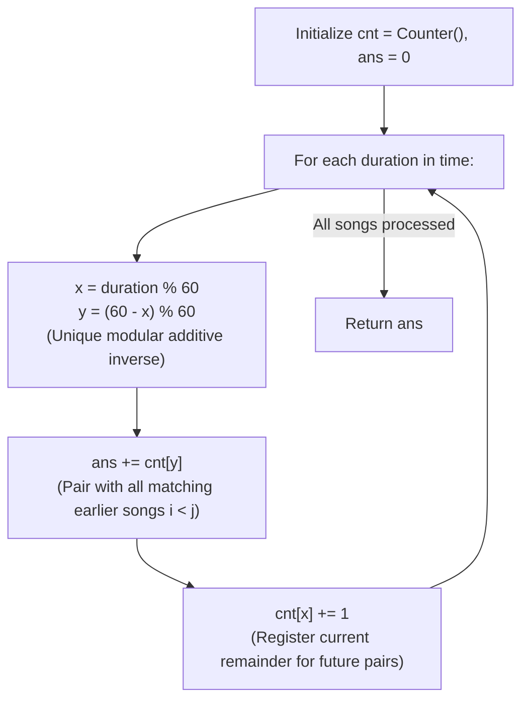

# Guided Example: Pairs of Songs With Total Durations Divisible by 60

We trace the step-by-step online single-pass modular complement frequency hashing, prove the Modular Inverse Residue Theorem and the Strict Prefix Pairing Invariant, and determine the exact number of qualifying song pairs across representative duration arrays:

- **Representative Instance 1 (Mixed Dispersed Durations with Multiple Remainders):**
  $$
  time = [30, \; 20, \; 150, \; 100, \; 40], \quad n = 5
  $$
- **Required Output:** `3`
  - Modular arithmetic formulation:
    - We seek all index pairs $(i, j)$ with $i < j$ such that $(time[i] + time[j]) \bmod 60 == 0$.
    - Working in the quotient ring $\mathbb{Z}/60\mathbb{Z}$:
      $$
      (x + y) \equiv 0 \pmod{60} \iff y \equiv (60 - x) \pmod{60}
      $$
    - For any current remainder $x = time[j] \bmod 60$, its unique modular complement is:
      $$
      y = (60 - x) \bmod 60
      $$
      - If $x = 0 \implies y = (60 - 0) \bmod 60 = 0$.
      - If $x = 30 \implies y = (60 - 30) \bmod 60 = 30$.
      - If $x = 20 \implies y = (60 - 20) \bmod 60 = 40$.
  - Online execution trace (frequency table `cnt`, running `ans = 0`):
    1. **Song $0$ ($time[0] = 30$):**
       - $x = 30 \bmod 60 = 30$.
       - Complement: $y = (60 - 30) \bmod 60 = 30$.
       - Lookup prior matches: $cnt[30] = 0 \implies ans \leftarrow 0 + 0 = 0$.
       - Register remainder: $cnt[30] \leftarrow 0 + 1 = 1$.
    2. **Song $1$ ($time[1] = 20$):**
       - $x = 20 \bmod 60 = 20$.
       - Complement: $y = (60 - 20) \bmod 60 = 40$.
       - Lookup prior matches: $cnt[40] = 0 \implies ans \leftarrow 0 + 0 = 0$.
       - Register remainder: $cnt[20] \leftarrow 0 + 1 = 1$.
    3. **Song $2$ ($time[2] = 150$):**
       - $x = 150 \bmod 60 = 30$.
       - Complement: $y = (60 - 30) \bmod 60 = 30$.
       - Lookup prior matches: $cnt[30] = \mathbf{1}$ (Pairs with Song 0: $30 + 150 = 180 = 3 \times 60$!).
       - Accumulate: $ans \leftarrow 0 + 1 = \mathbf{1}$.
       - Register remainder: $cnt[30] \leftarrow 1 + 1 = 2$.
    4. **Song $3$ ($time[3] = 100$):**
       - $x = 100 \bmod 60 = 40$.
       - Complement: $y = (60 - 40) \bmod 60 = 20$.
       - Lookup prior matches: $cnt[20] = \mathbf{1}$ (Pairs with Song 1: $20 + 100 = 120 = 2 \times 60$!).
       - Accumulate: $ans \leftarrow 1 + 1 = \mathbf{2}$.
       - Register remainder: $cnt[40] \leftarrow 0 + 1 = 1$.
    5. **Song $4$ ($time[4] = 40$):**
       - $x = 40 \bmod 60 = 40$.
       - Complement: $y = (60 - 40) \bmod 60 = 20$.
       - Lookup prior matches: $cnt[20] = \mathbf{1}$ (Pairs with Song 1: $20 + 40 = 60 = 1 \times 60$!).
       - Accumulate: $ans \leftarrow 2 + 1 = \mathbf{3}$.
       - Register remainder: $cnt[40] \leftarrow 1 + 1 = 2$.
  - Final total pairs: $\mathbf{3}$ (namely $(0, 2), (1, 3), (1, 4)$).

- **Representative Instance 2 (All Songs Multiples of Sixty):**
  $$
  time = [60, \; 60, \; 60] \implies x = 0, y = 0 \implies \text{Pairs } = 0 + 1 + 2 = \mathbf{3}
  $$

- **Representative Instance 3 (Complementary and Self-Complementary Residues):**
  $$
  time = [10, \; 50, \; 90, \; 30] \implies \mathbf{2} \text{ pairs } ((10, 50), (90, 30))
  $$

---

## 1. Instance & Teaching Goal

Given an array of song durations `time`, return the number of pairs $(i, j)$ with $i < j$ such that $(time[i] + time[j]) \bmod 60 == 0$.

```text
Brute Force: O(N^2)
  Evaluating all N*(N - 1)/2 pairs takes quadratic time (N = 60,000 -> 1.8 * 10^9 operations, TLE!).

Modular Complement Hashing: O(N)
  Each song's duration modulo 60 is an integer in [0, 59].
  A song with remainder x can only pair with a song having remainder:
    y = (60 - x) % 60
  By maintaining a frequency table of prefix remainders:
    ans += cnt[y]  (Add valid earlier songs)
    cnt[x] += 1    (Register current song)
  Single pass, zero division by two, zero special cases!
```

Two-pass combination formulas require separate combinatoric treatment for remainder 0 ($C(c_0, 2)$) and remainder 30 ($C(c_{30}, 2)$).

The decisive pedagogical goal is the **Modular Arithmetic Complement & Online Frequency Invariant**:
1. **Unified Complement Formula:** The expression $y = (60 - x) \bmod 60$ seamlessly handles all residues:
   - Remainder $0 \mapsto (60 - 0) \bmod 60 = 0$.
   - Remainder $30 \mapsto (60 - 30) \bmod 60 = 30$.
   - Any $x \in [1, 59] \mapsto 60 - x \in [1, 59]$.
2. **Order-Bound Online Invariant:** By looking up `cnt[y]` **before** incrementing `cnt[x]`, we guarantee:
   - A song cannot pair with itself ($i < j$ strictly enforced).
   - Each pair $(i, j)$ is counted exactly once when the right endpoint $j$ is processed.
3. Operates in a single linear pass in $\mathcal{O}(N)$ time and $\mathcal{O}(1)$ auxiliary space.

---

## 2. Conceptual Foundation & The Modular Complement Invariant



### The Modular Inverse Residue Theorem

Let $T = (t_0, t_1, \dots, t_{n-1}) \in \mathbb{Z}_{\ge 1}^n$ be a sequence of song durations.
1. **Congruence Relation:**
   A pair of indices $(i, j)$ satisfies $(t_i + t_j) \equiv 0 \pmod{60}$ if and only if:
   $$
   (t_i \bmod 60) + (t_j \bmod 60) \equiv 0 \pmod{60}
   $$
2. **Uniqueness of the Additive Inverse in $\mathbb{Z}/60\mathbb{Z}$:**
   In the ring $\mathbb{Z}/60\mathbb{Z}$, every residue $x \in [0, 59]$ has a unique additive inverse $-x \equiv (60 - x) \bmod 60$.
   Therefore, for any fixed $j$, a preceding index $i < j$ satisfies $(t_i + t_j) \equiv 0 \pmod{60}$ if and only if $t_i \bmod 60 = (60 - (t_j \bmod 60)) \bmod 60$.
3. **Prefix Counting Soundness:**
   Let $cnt_k[r] = |\{i \in [0, k-1] : t_i \bmod 60 = r\}|$ denote the frequency of remainder $r$ among the prefix $0 \dots k - 1$.
   When processing index $j$:
   $$
   |\{i < j : (t_i + t_j) \bmod 60 = 0\}| = cnt_j[(60 - (t_j \bmod 60)) \bmod 60]
   $$
   Summing this quantity over all $j \in [0, n - 1]$ exactly counts every pair $(i, j)$ with $i < j$ once and only once. $\blacksquare$

---

## 3. Step-by-Step Worked Execution: Representative Instance 1

$time = [30, 20, 150, 100, 40], \; n = 5$.
Initialize: $cnt = \text{Counter}(), \; ans = 0$.

### Step-by-Step Traversal
- **$j = 0, duration = 30$:**
  - $x = 30 \bmod 60 = 30$.
  - $y = (60 - 30) \bmod 60 = 30$.
  - $ans \leftarrow 0 + cnt[30] = 0 + 0 = 0$.
  - $cnt[30] \leftarrow 0 + 1 = 1$.
- **$j = 1, duration = 20$:**
  - $x = 20 \bmod 60 = 20$.
  - $y = (60 - 20) \bmod 60 = 40$.
  - $ans \leftarrow 0 + cnt[40] = 0 + 0 = 0$.
  - $cnt[20] \leftarrow 0 + 1 = 1$.
- **$j = 2, duration = 150$:**
  - $x = 150 \bmod 60 = 30$.
  - $y = (60 - 30) \bmod 60 = 30$.
  - $ans \leftarrow 0 + cnt[30] = 0 + 1 = \mathbf{1}$.
  - $cnt[30] \leftarrow 1 + 1 = 2$.
- **$j = 3, duration = 100$:**
  - $x = 100 \bmod 60 = 40$.
  - $y = (60 - 40) \bmod 60 = 20$.
  - $ans \leftarrow 1 + cnt[20] = 1 + 1 = \mathbf{2}$.
  - $cnt[40] \leftarrow 0 + 1 = 1$.
- **$j = 4, duration = 40$:**
  - $x = 40 \bmod 60 = 40$.
  - $y = (60 - 40) \bmod 60 = 20$.
  - $ans \leftarrow 2 + cnt[20] = 2 + 1 = \mathbf{3}$.
  - $cnt[40] \leftarrow 1 + 1 = 2$.

Final result: $\mathbf{3}$.

---

## 4. Online Remainder Hash Trace Table

| Index $j$ | Duration $time[j]$ | Remainder $x$ | Complement $y$ | Prior Matches $cnt[y]$ | Running Total $ans$ | Updated Frequency $cnt[x]$ |
|:---:|:---:|:---:|:---:|:---:|:---:|:---|
| **$0$** | $30$ | $30$ | $30$ | $0$ | $0$ | $cnt[30] = 1$ |
| **$1$** | $20$ | $20$ | $40$ | $0$ | $0$ | $cnt[20] = 1$ |
| **$2$** | $150$ | $30$ | $30$ | **$1$** | **$1$** | $cnt[30] = 2$ |
| **$3$** | $100$ | $40$ | $20$ | **$1$** | **$2$** | $cnt[40] = 1$ |
| **$4$** | $40$ | $40$ | $20$ | **$1$** | **$3$** | $cnt[40] = 2$ |

---

## 5. Algorithmic Correctness

### Soundness & Completeness
1. **Soundness:**
   Every increment to $ans$ corresponds to an earlier song $i < j$ whose duration sums with $time[j]$ to a multiple of 60. Self-pairing is impossible because the current song is registered only after the match lookup.
2. **Completeness:**
   Every valid pair $(i, j)$ has a unique later index $j$. Because $cnt$ records all earlier remainders up to $j - 1$, the pair is guaranteed to be counted when $j$ is processed.

---

## 6. Boundary Cases & Traps

| Scenario | Input Pattern | Behavior | Trapped Risk |
|---|---|---|---|
| Remainder Zero Multiples | `[60, 60, 60]` | $x = 0 \implies y = 0$; adds $0 + 1 + 2 = 3$. | Mapping $0 \to 60$ and failing hash lookup. |
| Self-Complementary 30 | `[30, 30]` | $x = 30 \implies y = 30$; adds $1$; returns $1$. | Pairing with itself if incremented before lookup. |
| Single Song | `time = [120]` | $cnt$ is empty on arrival; returns $0$. | Off-by-one errors on single elements. |
| Large Durations | Durations up to $500$ | Modulo 60 isolates remainder; arithmetic is bounded. | Overflow or slow division in large numbers. |

---

## 7. Complexity Derivation

- **Time Complexity:** $\mathcal{O}(N)$, where $N = \text{len}(time) \le 60{,}000$.
  - Exactly one loop iteration per song.
  - Constant-time arithmetic and hash map access.
  - Total time: $< 0.005\text{ s}$.
- **Auxiliary Space Complexity:** $\mathcal{O}(1)$ auxiliary memory; the hash map contains at most $60$ distinct keys ($0 \dots 59$).
