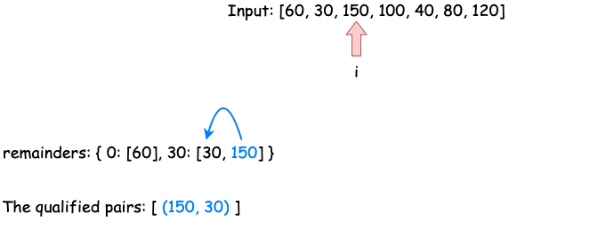
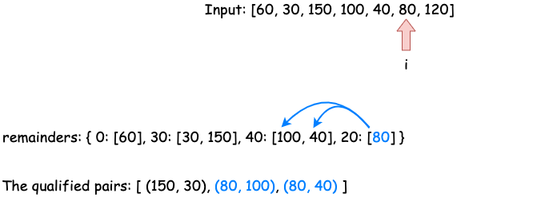
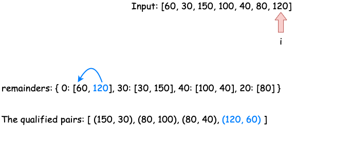

[TOC]

## Video Solution

---

<div>
  <div class="video-container">
    <iframe src="https://player.vimeo.com/video/724348592?texttrack=en-x-autogenerated" frameborder="0"
      allow="autoplay; fullscreen"></iframe>
  </div>
</div>

## Solution

---

### Approach 1: Brute Force

One of the most straightforward approaches would be iterating through the entire array using a nested loop to examine that, for each element  `a` in `time`, whether there is another element `b` such that $(a + b) \% 60 = 0$. Note that this approach might be too brutal to pass an interview.

#### Implementation

```python
class Solution:
    def numPairsDivisibleBy60(self, time: List[int]) -> int:
        ret, n = 0, len(time)
        for i in range(n):
            # j starts with i+1 so that i is always to the left of j
            # to avoid repetitive counting
            for j in range(i + 1, n):
                ret += (time[i] + time[j]) % 60==0
        return ret
```

#### Complexity Analysis

* Time complexity: $\mathcal{O}(n^2)$, when $n$ is the length of the input array. For each item in `time`, we iterate through the rest of the array to find a qualified complement taking $\mathcal{O}(n)$ time.
* Space complexity: $\mathcal{O}(1)$.
<br />

---

### Approach 2: Use an Array to Store Frequencies

#### Intuition

Let's dive deep into the condition $(\text{time}[i] + \text{time}[j]) \% 60 = 0$ to examine the relation between $\text{time}[i]$ and $\text{time}[j]$. Assuming that `a` and `b` are two elements in the input array `time`, we have:

<div align="center">

$$(a+b)\space \% \space60=0 \\
  \Downarrow \\
  ((a \space \% \space 60)+(b \space \% \space 60))\space \% \space 60=0 \\
  \Downarrow \\
  \text{Therefore, either }\begin{cases}
    a \space \% \space60 \&= 0\\
    b \space \% \space60 \&= 0
  \end{cases}
  \text{, or }  (a\space\%\space60)+(b\space\%\space60)=60 \\$$

</div>

You can learn more about the modulo operation [here](https://en.wikipedia.org/wiki/Modulo_operation#Properties_(identities)).

Hence, all we need would be finding the pairs of elements in `time` so they meet these conditions.

#### Algorithm

We would iterate through the input array `time` and for each element `a`, we want to know the number of elements `b` such that:

1. $b \space\%\space 60=0$, $\space \text{if } a \space \% \space 60=0$
2. $b \space \% \space 60=60-a \space\% \space60$, $\space \text{if }  a\space\% \space 60\neq0$

We can use Approach 1 to implement this logic by repeatedly examining the rest of `time` again and again for each element `a`. However, we are able to improve the time complexity by consuming more space - we can store the frequencies of the remainder `a % 60`, so that we can find the number of the complements in $\mathcal{O}(1)$ time.









We would initiate an array `remainders` with size $60$ to record the frequencies of each remainder - as the range of remainders is $[0,59]$.  Then we can loop through the array once and for each element `a` we would:

1. if $a \space \% \space 60=0$, add $\text{remainders}[0]$ to the result; else, add $remainders[60 - a \% 60]$ to the result;
2. update `remainders[a % 60]`.

#### Implementation

```python
class Solution:
    def numPairsDivisibleBy60(self, time: List[int]) -> int:
        remainders = collections.defaultdict(int)
        ret = 0
        for t in time:
            if t % 60 == 0: # check if a%60==0 && b%60==0
                ret += remainders[0]
            else: # check if a%60+b%60==60
                ret += remainders[60-t%60]
            remainders[t % 60] += 1 # remember to update the remainders
        return ret
```

#### Complexity Analysis

* Time complexity: $\mathcal{O}(n)$, when $n$ is the length of the input array because we would visit each element in `time` once.
* Space complexity: $\mathcal{O}(1)$, because the size of the array `remainders` is fixed with $60$.
<br/>
---