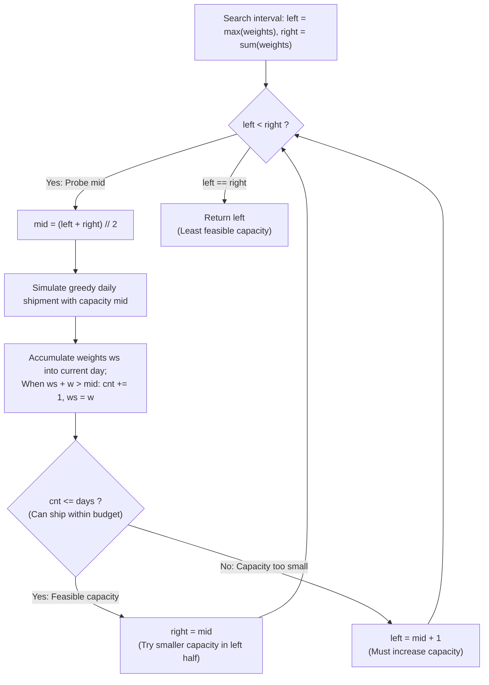

# Guided Example: Capacity To Ship Packages Within D Days

We trace the step-by-step binary search over the monotonic capacity spectrum, prove the Greedy Daily Packing Optimality Lemma and the Monotonic Feasibility Bisection Invariant, and determine the minimal ship capacity across representative cargo schedules:

- **Representative Instance 1 (Consecutively Increasing Package Weights):**
  $$
  weights = [1, \; 2, \; 3, \; 4, \; 5, \; 6, \; 7, \; 8, \; 9, \; 10], \quad days = 5, \quad n = 10
  $$
- **Required Output:** `15`
  - Search space boundaries:
    - **Strict Lower Bound:** $left = \max(weights) = \mathbf{10}$.
      - The ship must carry package 10; any capacity $< 10$ cannot ship package 10 on any day.
    - **Trivial Upper Bound:** $right = \sum weights = 1 + 2 + \dots + 10 = \mathbf{55}$.
      - With capacity $55$, all packages ship together on day 1 ($1 \le 5$ days).
    - Monotonic search interval: $C \in [10, 55]$.
  - Greedy Feasibility Predicate $\text{check}(C)$:
    - Sequentially load packages on day 1.
    - Whenever adding package $w$ causes current day's load $ws + w > C$:
      - Conclude the day, increment day counter $cnt \leftarrow cnt + 1$, and place $w$ as the first package of the next day ($ws \leftarrow w$).
    - Returns `True` if total days required $cnt \le days$, else `False`.
  - Binary search bisection trace:
    1. **Probe 1 ($L = 10, R = 55, \quad M = \lfloor (10 + 55) / 2 \rfloor = 32$):**
       - Day 1: $1+2+3+4+5+6+7 = 28$ ($28 + 8 = 36 > 32$).
       - Day 2: $8 + 9 + 10 = 27 \le 32$.
       - Total days: $2 \le 5$ (Feasible!). Search left half: $R \leftarrow 32$.
    2. **Probe 2 ($L = 10, R = 32, \quad M = 21$):**
       - Day 1: $1+2+3+4+5+6 = 21$.
       - Day 2: $7+8 = 15$.
       - Day 3: $9+10 = 19$.
       - Total days: $3 \le 5$ (Feasible!). Search left half: $R \leftarrow 21$.
    3. **Probe 3 ($L = 10, R = 21, \quad M = 15$):**
       - Day 1: $1+2+3+4+5 = 15$.
       - Day 2: $6+7 = 13$ ($13 + 8 = 21 > 15$).
       - Day 3: $8$ ($8 + 9 = 17 > 15$).
       - Day 4: $9$ ($9 + 10 = 19 > 15$).
       - Day 5: $10$.
       - Total days: $\mathbf{5} \le 5$ (Feasible!). Search left half: $R \leftarrow 15$.
    4. **Probe 4 ($L = 10, R = 15, \quad M = 12$):**
       - Day 1: $1+2+3+4 = 10$.
       - Day 2: $5+6 = 11$.
       - Day 3: $7$.
       - Day 4: $8$.
       - Day 5: $9$.
       - Day 6: $10$.
       - Total days: $6 > 5$ (**Infeasible!** Exceeds 5 days).
       - Search right half: $L \leftarrow 12 + 1 = 13$.
    5. **Probe 5 ($L = 13, R = 15, \quad M = 14$):**
       - Day 1: $1+2+3+4 = 10$.
       - Day 2: $5+6 = 11$.
       - Day 3: $7$.
       - Day 4: $8$.
       - Day 5: $9$.
       - Day 6: $10$.
       - Total days: $6 > 5$ (**Infeasible!**).
       - Search right half: $L \leftarrow 14 + 1 = 15$.
    6. **Convergence ($L = 15, R = 15$):**
       - Interval collapses to single point $15$.
       - Minimal required capacity is $\mathbf{15}$.

- **Representative Instance 2 (Non-Monotonic Weights Across Balanced Days):**
  $$
  weights = [3, 2, 2, 4, 1, 4], \quad days = 3 \implies \mathbf{6}
  $$
  - Day 1: $3 + 2 = 5 \le 6$.
  - Day 2: $2 + 4 = 6 \le 6$.
  - Day 3: $1 + 4 = 5 \le 6$.
  - Total days = 3. Capacity 5 requires 4 days. Result: $\mathbf{6}$.

- **Representative Instance 3 (Sparse Days with Minimal Packages):**
  $$
  weights = [1, 2, 3, 1, 1], \quad days = 4 \implies \mathbf{3}
  $$

---

## 1. Instance & Teaching Goal

A conveyor belt holds packages with weights $weights[i]$ that must be shipped within `days` days in order.
Return the **least weight capacity** of the ship that can transport all packages within `days` days.

```text
The Search Inversion Paradigm:
  Directly computing the optimal partition into `days` groups is a hard continuous DP: O(days * N^2).
  Inverting the question:
    "Given a fixed ship capacity C, what is the minimum number of days needed?"
  Can be answered GREEDILY in O(N) linear time!

Monotonicity of Feasibility:
  - If capacity C is sufficient to ship within `days`, any capacity C' > C is ALSO sufficient.
  - If capacity C is insufficient, any capacity C'' < C is ALSO insufficient.
  Binary search on the capacity range [max(W), sum(W)] finds the optimal capacity in O(N log(sum(W)))!
```

Sorting package weights is explicitly forbidden because shipment must preserve conveyor belt order.

The decisive pedagogical goal is the **Greedy Daily Packing Optimality & Capacity Bisection Invariant**:
1. **Search Space Bounds:**
   - Lower bound: $\max(weights)$ (cannot split an individual package across days).
   - Upper bound: $\sum weights$ (entire payload on day 1).
2. **Greedy Feasibility Invariant:** For a fixed capacity $C$, filling each day up to capacity before advancing to the next minimizes total required days.
3. **Monotonic Step Function:** Total days $D(C)$ decreases monotonically as capacity $C$ increases. Thus, the predicate $P(C) = (D(C) \le days)$ exhibits binary transition `[False, ..., False, True, ..., True]`.
4. Bisection converges in $\mathcal{O}(N \log(\sum W))$ time and $\mathcal{O}(1)$ auxiliary space.

---

## 2. Conceptual Foundation & The Monotonic Capacity Invariant



### The Monotonic Feasibility Bisection Theorem

Let $W = (w_0, w_1, \dots, w_{n-1})$ be the sequence of package weights, and let $D$ be the permitted number of days.
1. **Greedy Daily Packing Optimality Lemma:**
   Let $C \ge \max(W)$ be a candidate ship capacity.
   Consider the greedy schedule that partitions $W$ into days $d_1, d_2, \dots, d_m$ where each day $d_k = [i_k, j_k]$ includes as many packages as possible such that $\sum_{m=i_k}^{j_k} w_m \le C$.
   This greedy choice minimizes the total number of days $m = D(C)$ among all valid partitions with capacity $C$.
   *Proof:*
   Any non-greedy schedule loads strictly fewer packages on some day $k$, forcing subsequent packages into later days. By induction on days, the greedy partition has $j_k^{\text{greedy}} \ge j_k^{\text{any}}$, completing shipment in fewer or equal days.
2. **Monotonicity of Days Function:**
   Let $C_1 < C_2$. Every package group feasible under $C_1$ has total weight $\le C_1 < C_2$ and is therefore feasible under $C_2$.
   Hence, $D(C_2) \le D(C_1)$.
3. **Monotonicity of Feasibility Predicate:**
   Define $P(C) = (D(C) \le D)$.
   Because $D(C)$ is monotonically non-increasing, $P(C)$ is monotonically non-decreasing over $[\max(W), \sum W]$:
   $$
   P(C) = \text{True} \implies P(C') = \text{True} \quad \forall C' \ge C
   $$
4. **Binary Search Correctness:**
   Applying `bisect_left` identifies the unique transition point $C^* = \min \{C : P(C) = \text{True}\}$ in $\mathcal{O}(\log(\sum W - \max W))$ evaluations. $\blacksquare$

---

## 3. Step-by-Step Worked Execution: Representative Instance 1

$weights = [1, 2, 3, 4, 5, 6, 7, 8, 9, 10], \; days = 5$.
$left = 10, \; right = 56$ (inclusive range $10 \dots 55$).

### Binary Search Iterations
- **Probe 1:** $M = (10 + 55) // 2 = 32$.
  - Daily loads: $[1..7]=28, [8..10]=27 \implies 2$ days $\le 5$ (Feasible).
  - Range narrows to $[10, 32]$.
- **Probe 2:** $M = (10 + 32) // 2 = 21$.
  - Daily loads: $[1..6]=21, [7..8]=15, [9..10]=19 \implies 3$ days $\le 5$ (Feasible).
  - Range narrows to $[10, 21]$.
- **Probe 3:** $M = (10 + 21) // 2 = 15$.
  - Daily loads: $[1..5]=15, [6..7]=13, [8]=8, [9]=9, [10]=10 \implies 5$ days $\le 5$ (Feasible).
  - Range narrows to $[10, 15]$.
- **Probe 4:** $M = (10 + 15) // 2 = 12$.
  - Daily loads: $[1..4]=10, [5..6]=11, [7]=7, [8]=8, [9]=9, [10]=10 \implies 6$ days $> 5$ (Infeasible).
  - Range narrows to $[13, 15]$.
- **Probe 5:** $M = (13 + 15) // 2 = 14$.
  - Daily loads: $[1..4]=10, [5..6]=11, [7]=7, [8]=8, [9]=9, [10]=10 \implies 6$ days $> 5$ (Infeasible).
  - Range narrows to $[15, 15]$.

Convergence: Minimal capacity $= \mathbf{15}$.

---

## 4. Binary Search Probe Trace Table

| Probe Step | Lower Bound $L$ | Upper Bound $R$ | Midpoint Capacity $M$ | Simulated Days Needed | Predicate $cnt \le 5$ | Updated Search Range |
|:---:|:---:|:---:|:---:|:---:|:---:|:---:|
| **$1$** | $10$ | $55$ | $32$ | $2$ | **True** | $[10, 32]$ |
| **$2$** | $10$ | $32$ | $21$ | $3$ | **True** | $[10, 21]$ |
| **$3$** | $10$ | $21$ | $15$ | $5$ | **True** | $[10, 15]$ |
| **$4$** | $10$ | $15$ | $12$ | $6$ | **False** | $[13, 15]$ |
| **$5$** | $13$ | $15$ | $14$ | $6$ | **False** | **$[15, 15]$** |

---

## 5. Algorithmic Correctness

### Soundness & Completeness
1. **Soundness:**
   Because the greedy packing strategy provably achieves the minimum possible days for any fixed capacity, confirming $D(C) \le days$ guarantees that $C$ is a physically feasible ship capacity.
2. **Completeness:**
   Since $D(C)$ is monotonic, narrowing the search interval when $D(M) \le days$ or $D(M) > days$ discards only provably redundant or impossible capacities. The global optimum cannot be bypassed.

---

## 6. Boundary Cases & Traps

| Scenario | Input Pattern | Behavior | Trapped Risk |
|---|---|---|---|
| Single Shipping Day | $days = 1$ | Capacity must equal $\sum weights$; returns full sum. | Underestimating upper bound. |
| Days Equal Package Count | $days = len(weights)$ | Each package on its own day; capacity equals $\max(weights)$. | Searching below $\max(weights)$. |
| Single Large Package | `weights = [500], days = 1` | $L = 500, R = 500$; immediately converges to $500$. | Loop termination errors on $L == R$. |
| Consecutive Uneven Chunks | Mixed weights | Greedy partitioning respects contiguous order without sorting. | Sorting packages and altering legal shipments. |

---

## 7. Complexity Derivation

- **Time Complexity:** $\mathcal{O}(N \log(\sum W - \max W))$.
  - The search space size is $\sum W - \max W \le 50{,}000 \times 500 = 2.5 \times 10^7$.
  - The binary search takes $\lceil \log_2(2.5 \times 10^7) \rceil \approx 25$ iterations.
  - Each iteration scans the $N$ weights in $\mathcal{O}(N)$ time.
  - Total operations: $25 \times 50{,}000 = 1.25 \times 10^6 \implies < 0.02\text{ s}$.
- **Auxiliary Space Complexity:** $\mathcal{O}(1)$ auxiliary memory; operates purely on scalar variables for binary search and simulation counters.