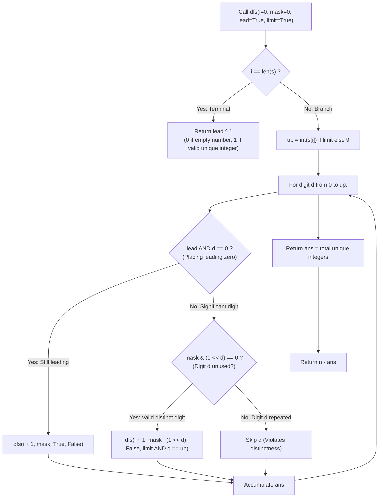

# Guided Example: Numbers With Repeated Digits

We trace the step-by-step evaluation of complementary counting and digit bitmask dynamic programming, prove the Unique-Digit Complement Theorem and the Leading-Zero Bitmask Transition Invariant, and determine the exact count of numbers with repeated digits across representative ranges:

- **Representative Instance 1 (Boundary Range with a Single Repeated Value):**
  $$
  n = 20, \quad s = \text{"20"}, \quad L = 2
  $$
- **Required Output:** `1`
  - Complementary Counting Formulation:
    - Directly counting numbers with repeated digits requires tracking which digits repeat, their multiplicities, and positions.
    - Instead, we invert the counting problem:
      $$
      \text{Repeated}(n) = n - \text{Unique}(n)
      $$
      where $\text{Unique}(n)$ is the number of integers in $[1, n]$ with **strictly pairwise distinct decimal digits**.
  - Verification on $[1, 20]$:
    - Total numbers: $20$.
    - Single-digit numbers: $1, 2, 3, 4, 5, 6, 7, 8, 9$ (All 9 have unique digits).
    - Two-digit numbers $\le 20$: $10, 11, 12, 13, 14, 15, 16, 17, 18, 19, 20$.
      - Exactly one number has a repeated digit: $\mathbf{11}$ (both digits are $1$).
      - Unique two-digit numbers: $10$ numbers.
    - Total unique numbers in $[1, 20]$: $9 + 10 = \mathbf{19}$.
    - Expected output:
      $$
      \text{Repeated}(20) = 20 - 19 = \mathbf{1}
      $$

- **Representative Instance 2 (Span Reaching Hundred Boundary):**
  $$
  n = 100 \implies \text{Unique} = 9 + 81 = 90 \implies 100 - 90 = \mathbf{10}
  $$
  - The 10 numbers with repeated digits are: $11, 22, 33, 44, 55, 66, 77, 88, 99, 100$.

- **Representative Instance 3 (Three-Digit Span):**
  $$
  n = 1000 \implies 1000 - 738 = \mathbf{262}
  $$

---

## 1. Instance & Teaching Goal

Given a positive integer $n$, return the number of positive integers in the range $[1, n]$ that have **at least one repeated digit**.

```text
Direct Counting Nightmare:
  At least one repeated digit = (contains duplicate 0) OR (duplicate 1) OR ... OR (duplicate 9)
  Inclusion-Exclusion across 10 digits creates 2^10 overlapping combinatorial cases!

Complementary Digit DP:
  Answer = n - (integers in [1, n] with ALL DISTINCT digits).
  Formulate Digit DP state: dfs(i, mask, lead, limit)
  - i:      Current digit position (0 to len(str(n)) - 1).
  - mask:   Bitmask of digits already used (subset of {0, 1, ..., 9}).
  - lead:   Boolean: Are we still in leading zeroes? (0 doesn't consume mask if lead=True).
  - limit:  Boolean: Is the choice bounded by the prefix of n?
```

Attempting to count duplicate digits directly leads to intractable state representations that must distinguish duplicate counts ($2, 3, \dots$).

The decisive pedagogical goal is the **Complementary Counting Principle & Digit Bitmask DP Invariant**:
1. **Complementary Inversion:** Counting all-distinct digits is simple because each placed digit $d \in [0, 9]$ must satisfy a single exclusion: bit $d$ is not in $mask$.
2. **Leading Zero Separation:** Leading zeroes must not mark digit $0$ as used, allowing numbers with fewer digits (e.g. $5 = 05$) to use digit $0$ later (e.g. $50$).
3. **Prefix Constraint ($limit$):** When $limit = \text{True}$, digit choices cannot exceed the current decimal digit of $n$.
4. Runs in polynomial time $\mathcal{O}(L \cdot 2^{10} \cdot 10)$, completing in $< 0.01\text{ s}$ for $n \le 10^9$.

---

## 2. Conceptual Foundation & The Digit DP Invariant



### The Unique-Digit Complement Theorem

Let $S_n = \{x \in \mathbb{Z} : 1 \le x \le n\}$, and let $U_n = \{x \in S_n : \text{digits of } x \text{ are pairwise distinct}\}$.
1. **Partition Identity:**
   Every integer in $S_n$ either has all digits pairwise distinct, or has at least one repeated digit.
   Since these two subsets partition $S_n$:
   $$
   |\{x \in S_n : x \text{ has repeated digits}\}| = |S_n| - |U_n| = n - |U_n|
   $$
2. **State Space Definition:**
   Represent each decimal prefix by the quadruple $(i, mask, lead, limit)$ where:
   - $i \in \{0, \dots, L\}$: position from most significant to least significant.
   - $mask \in [0, 2^{10} - 1]$: $\sum_{d \in \text{Used}} 2^d$.
   - $lead \in \{0, 1\}$: $1$ if all positions $< i$ are unwritten (leading zeroes), $0$ otherwise.
   - $limit \in \{0, 1\}$: $1$ if the chosen prefix matches $s[0 \dots i-1]$ exactly, restricting $d \le \text{int}(s[i])$.
3. **Transition Invariant:**
   - At position $i$, choosing digit $d \in [0, up]$ is valid if:
     - $lead = 1$ and $d = 0$: $mask$ remains $0$, $lead$ remains $1$, $limit$ becomes $0$.
     - $d$ is unused: $(mask \gg d) \ \& \ 1 = 0$. Then $mask' = mask \mid (1 \ll d)$, $lead' = 0$, $limit' = (limit \land (d = up))$.
   - Any digit $d$ already present in $mask$ is pruned immediately.
4. **Base Case Completeness:**
   At $i = L$:
   - If $lead = 1$, the sequence constructed was $00\dots0 = 0$, which is outside $[1, n]$. Return $1 \oplus 1 = 0$.
   - If $lead = 0$, a unique integer in $[1, n]$ was constructed. Return $0 \oplus 1 = 1$.
   Memoizing over $(i, mask, lead, limit)$ evaluates $|U_n|$ in $\mathcal{O}(L \cdot 2^{10})$ steps. $\blacksquare$

---

## 3. Step-by-Step Worked Execution: Representative Instance 1

$n = 20, \; s = \text{"20"}, \; L = 2$.
Call: `dfs(0, mask=0, lead=True, limit=True)`.

### Recursive Trace
1. **Root Call ($i = 0, limit = \text{True} \implies up = 2$):**
   - **$d = 0$ (Leading zero):**
     - Calls `dfs(1, mask=0, lead=True, limit=False)`.
     - At $i = 1, limit = \text{False} \implies up = 9$:
       - $d = 0$ (lead True): $\text{dfs}(2, 0, \text{True}, \text{False}) \implies lead \oplus 1 = 0$ (Number 0).
       - $d \in [1, 9]$ (lead False): `dfs(2, 1 << d, False, False) \implies 1` (Numbers $1, 2, \dots, 9$).
       - Branch sum: $9$ unique single-digit numbers.
   - **$d = 1$ ($limit \land (1 == 2) = \text{False} \implies limit = \text{False}$):**
     - Mask becomes $1 \ll 1 = 2$. Calls `dfs(1, mask=2, lead=False, limit=False)`.
     - At $i = 1, up = 9$:
       - Digit $1$ is already in mask ($2 \gg 1 \ \& \ 1 = 1$) $\implies$ **Skipped!** ($11$ is pruned!).
       - Digits $0, 2, 3, 4, 5, 6, 7, 8, 9$ (9 digits) are unused: each leads to valid terminal node $1$.
       - Branch sum: $9$ unique numbers ($10, 12, 13, 14, 15, 16, 17, 18, 19$).
   - **$d = 2$ ($limit \land (2 == 2) = \text{True} \implies limit = \text{True}$):**
     - Mask becomes $1 \ll 2 = 4$. Calls `dfs(1, mask=4, lead=False, limit=True)`.
     - At $i = 1, limit = \text{True} \implies up = \text{int}(s[1]) = 0$:
       - Only $d = 0$ can be chosen.
       - Digit $0$ is not in mask $\implies$ valid!
       - Calls `dfs(2, mask=5, False, True) \implies 1` (Number $20$).
       - Branch sum: $1$ unique number ($20$).

Total unique numbers: $|U_{20}| = 9 + 9 + 1 = \mathbf{19}$.
Final repeated count: $n - |U_{20}| = 20 - 19 = \mathbf{1}$.

---

## 4. Digit Decision State Trace Table

| Digit Position $i$ | Prefix Path | Active Mask | Digit $d$ Chosen | Valid? | Next State $(i+1, mask', lead', limit')$ |
|:---:|:---:|:---:|:---:|:---:|:---:|
| **$0$** | `""` | $0$ | $0$ | Yes (Lead) | $(1, 0, \text{True}, \text{False})$ |
| **$0$** | `""` | $0$ | $1$ | Yes | $(1, 2, \text{False}, \text{False})$ |
| **$0$** | `""` | $0$ | $2$ | Yes | $(1, 4, \text{False}, \text{True})$ |
| **$1$ (from $d=1$)** | `"1"` | $2$ | $0$ | Yes | $(2, 3, \text{False}, \text{False}) \to \mathbf{10}$ |
| **$1$ (from $d=1$)** | `"1"` | $2$ | **$1$** | **Pruned (Duplicate!)** | — |
| **$1$ (from $d=1$)** | `"1"` | $2$ | $2 \dots 9$ | Yes | $(2, \dots, \text{False}, \text{False}) \to \mathbf{12 \dots 19}$ |
| **$1$ (from $d=2$)** | `"2"` | $4$ | $0$ | Yes | $(2, 5, \text{False}, \text{True}) \to \mathbf{20}$ |
| **Total** | — | — | — | — | **$19$ Unique $\implies 20 - 19 = 1$ Repeated** |

---

## 5. Algorithmic Correctness

### Soundness & Completeness
1. **Soundness:**
   A branch is followed only if the chosen digit $d$ is not present in $mask$. Hence, every integer counted by `dfs` has strictly unique decimal digits and lies within $[1, n]$.
2. **Completeness:**
   Every integer from $1$ to $n$ can be uniquely written with appropriate leading zeroes. The tree traversal explores every possible valid digit sequence up to $s$, ensuring that no distinct-digit number is omitted.

---

## 6. Boundary Cases & Traps

| Scenario | Input Pattern | Behavior | Trapped Risk |
|---|---|---|---|
| Single Digit ($n \le 9$) | $n = 9$ | All integers in $[1, 9]$ are unique; returns $9 - 9 = 0$. | Miscounting single-digit zero as valid. |
| First Duplicate ($n = 11$) | $n = 11$ | Prunes $11$; unique count is $10$; returns $11 - 10 = 1$. | Over-pruning valid endpoints. |
| Leading Zero Mask Bug | $d = 0$ when $lead = \text{True}$ | Does not add $0$ to mask, allowing $50$ to use $0$. | Marking $0$ as used during leading zeroes. |
| Upper Bound $10^9$ | $n = 10^9$ | $L = 10$; memoization guarantees execution within milliseconds. | TLE from unmemoized search. |

---

## 7. Complexity Derivation

- **Time Complexity:** $\mathcal{O}(L \cdot 2^{10} \cdot 10)$, where $L = \text{len}(\text{str}(n)) \le 10$.
  - Number of distinct states: $L \times 2^{10} \times 2 \times 2 \le 10 \times 1024 \times 4 \approx 40{,}960$.
  - Each state evaluates at most $10$ digit branches.
  - Total operations: $< 4 \times 10^5 \implies < 0.01\text{ s}$.
- **Auxiliary Space Complexity:** $\mathcal{O}(L \cdot 2^{10})$ for memoization cache and call stack of depth $L \le 10$.