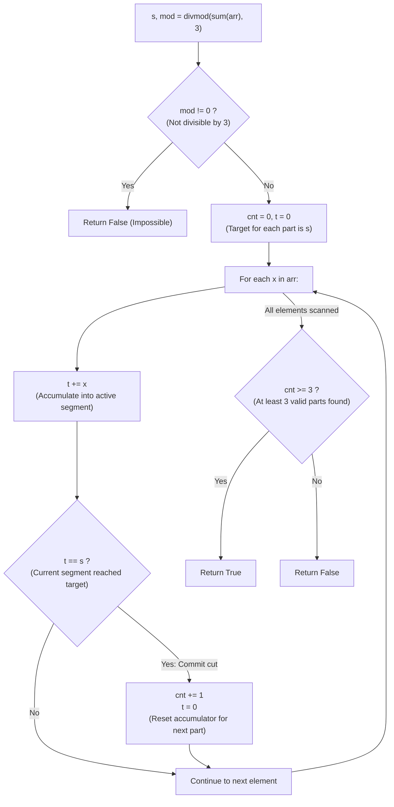

# Guided Example: Partition Array Into Three Parts With Equal Sum

We trace the step-by-step prefix sum trisection and greedy cut accumulation, prove the Forced Target Divisibility Lemma and the Suffix Absorption Invariant, and verify trisection feasibility across representative integer sequences:

- **Representative Instance 1 (Alternating Signs Yielding Three Equal Blocks):**
  $$
  arr = [0, \; 2, \; 1, \; -6, \; 6, \; -7, \; 9, \; 1, \; 2, \; 0, \; 1], \quad n = 11
  $$
- **Required Output:** `true`
  - Step 0 (Divisibility Verification):
    - Compute total sum:
      $$
      S = \sum_{k=0}^{10} arr[k] = 0 + 2 + 1 - 6 + 6 - 7 + 9 + 1 + 2 + 0 + 1 = \mathbf{9}
      $$
    - Compute quotient and remainder modulo 3:
      $$
      s = 9 // 3 = \mathbf{3}, \quad mod = 9 \bmod 3 = 0
      $$
    - Total sum is divisible by 3 ($mod == 0$), so each of the 3 parts must have target sum $s = \mathbf{3}$.
  - Greedy Cut-Point Traversal ($cnt = 0, t = 0$):
    1. **$k = 0$ ($arr[0] = 0$):** $t \leftarrow 0 + 0 = 0 \ne 3$.
    2. **$k = 1$ ($arr[1] = 2$):** $t \leftarrow 0 + 2 = 2 \ne 3$.
    3. **$k = 2$ ($arr[2] = 1$):**
       - $t \leftarrow 2 + 1 = \mathbf{3} == s$ (**First cut formed!**).
       - Segment 1: $arr[0 \dots 2] = [0, 2, 1]$ with sum $3$.
       - Increment cut count: $cnt \leftarrow 0 + 1 = \mathbf{1}$.
       - Reset running segment accumulator: $t \leftarrow 0$.
    4. **$k = 3$ ($arr[3] = -6$):** $t \leftarrow 0 - 6 = -6$.
    5. **$k = 4$ ($arr[4] = 6$):** $t \leftarrow -6 + 6 = 0$.
    6. **$k = 5$ ($arr[5] = -7$):** $t \leftarrow 0 - 7 = -7$.
    7. **$k = 6$ ($arr[6] = 9$):** $t \leftarrow -7 + 9 = 2$.
    8. **$k = 7$ ($arr[7] = 1$):**
       - $t \leftarrow 2 + 1 = \mathbf{3} == s$ (**Second cut formed!**).
       - Segment 2: $arr[3 \dots 7] = [-6, 6, -7, 9, 1]$ with sum $3$.
       - Increment cut count: $cnt \leftarrow 1 + 1 = \mathbf{2}$.
       - Reset running segment accumulator: $t \leftarrow 0$.
    9. **$k = 8$ ($arr[8] = 2$):** $t \leftarrow 0 + 2 = 2$.
    10. **$k = 9$ ($arr[9] = 0$):** $t \leftarrow 2 + 0 = 2$.
    11. **$k = 10$ ($arr[10] = 1$):**
        - $t \leftarrow 2 + 1 = \mathbf{3} == s$ (**Third cut formed!**).
        - Segment 3: $arr[8 \dots 10] = [2, 0, 1]$ with sum $3$.
        - Increment cut count: $cnt \leftarrow 2 + 1 = \mathbf{3}$.
        - Reset: $t \leftarrow 0$.
  - End of loop: $cnt = 3 \ge 3$.
  - Final verdict: $\mathbf{true}$.
  - Three valid non-empty partitions:
    $$
    \underbrace{[0, 2, 1]}_{\text{Sum } = 3}, \quad \underbrace{[-6, 6, -7, 9, 1]}_{\text{Sum } = 3}, \quad \underbrace{[2, 0, 1]}_{\text{Sum } = 3}
    $$

- **Representative Instance 2 (Total Divisible by 3 but Cut Structure Missing):**
  $$
  arr = [0, 2, 1, -6, 6, 7, 9, -1, 2, 0, 1], \quad S = 21, \; s = 7 \implies cnt = 1 < 3 \implies \mathbf{false}
  $$

- **Representative Instance 3 (Zero Target with Surplus Cuts):**
  $$
  arr = [0, \; 0, \; 0, \; 0], \quad S = 0, \; s = 0 \implies cnt = 4 \ge 3 \implies \mathbf{true}
  $$
  - Partitions into: $[0], [0], [0, 0]$, each with sum $0$.

---

## 1. Instance & Teaching Goal

Given an integer array `arr`, return `true` if we can partition the array into **three non-empty parts** with equal sums, otherwise return `false`.

```text
The Search Space Trap:
  Enumerating all pairs of cut indices (i, j) with 0 <= i < j - 1 < n - 1 is O(N^2).

Prefix Trisection Invariant:
  1. If 3 parts have equal sum s, then Total Sum S = 3s.
     If S % 3 != 0, it is mathematically IMPOSSIBLE!
  2. If S % 3 == 0, the target sum is strictly s = S / 3.
  3. Greedily accumulate running sum t. Each time t == s:
     - Increment cut counter cnt += 1.
     - Reset t = 0.
  4. If cnt >= 3 at the end, return true!
```

Checking only $cnt == 3$ fails on zero-target arrays (e.g. `[0, 0, 0, 0]` produces $cnt = 4$ but is completely valid).

The decisive pedagogical goal is the **Prefix Sum Trisection & Suffix Absorption Invariant**:
1. **Forced Target Derivation:** A valid trisection strictly requires $S \equiv 0 \pmod 3$, uniquely setting target $s = S / 3$.
2. **Greedy Cut Isolation:** Finding the earliest prefix of sum $s$ leaves the maximum possible remaining suffix to accommodate the second and third parts.
3. **Suffix Absorption Theorem:** If $cnt \ge 3$, the first cut provides sum $s$, the second cut provides sum $s$, and the remaining elements collectively sum to $S - 2s = 3s - 2s = s$, automatically forming the third non-empty part.
4. Single forward pass in $\mathcal{O}(N)$ time and $\mathcal{O}(1)$ space.

---

## 2. Conceptual Foundation & The Trisection Invariant



### The Suffix Absorption Theorem

Let $A = (a_0, a_1, \dots, a_{n-1})$ be an array of integers with $n \ge 3$, and let $S = \sum_{k=0}^{n-1} a_k$.
1. **Necessary Divisibility Condition:**
   Suppose there exist indices $0 \le i < j - 1 < n - 1$ such that:
   $$
   \sum_{k=0}^i a_k = \sum_{k=i+1}^{j-1} a_k = \sum_{k=j}^{n-1} a_k = s
   $$
   Summing the three parts yields $S = s + s + s = 3s$, meaning $S$ must be a multiple of 3.
2. **Greedy Subarray Cut Optimality:**
   Let $i_1$ be the smallest index such that $\sum_{k=0}^{i_1} a_k = s$.
   If any valid partition exists, setting the first cut at $i_1$ is optimal because it maximizes the length of the remaining suffix $A[i_1 + 1 \dots n - 1]$.
   Similarly, choosing $i_2$ as the earliest index $> i_1$ where $\sum_{k=i_1 + 1}^{i_2} a_k = s$ preserves maximum length for the third part.
3. **Suffix Sum Invariance:**
   Because the total sum of all elements is $3s$:
   $$
   \sum_{k=i_2 + 1}^{n-1} a_k = S - \sum_{k=0}^{i_1} a_k - \sum_{k=i_1 + 1}^{i_2} a_k = 3s - s - s = s
   $$
   Therefore, if the greedy process identifies at least 3 segments with sum $s$ ($cnt \ge 3$), the remaining elements beyond the second cut are guaranteed to sum to $s$.
4. **Non-Emptiness Guarantee:**
   Because $cnt \ge 3$, the array contains at least 3 distinct cut endpoints, ensuring that each of the three parts contains at least one element. $\blacksquare$

---

## 3. Step-by-Step Worked Execution: Representative Instance 1

$arr = [0, 2, 1, -6, 6, -7, 9, 1, 2, 0, 1], \; n = 11$.
$S = 9 \implies s = 3, mod = 0$. Proceed to scan.
Initialize: $cnt = 0, \; t = 0$.

### Step-by-Step Traversal
- $k = 0, x = 0$: $t = 0 \ne 3$.
- $k = 1, x = 2$: $t = 2 \ne 3$.
- $k = 2, x = 1$: $t = 3 == s \implies cnt \leftarrow 1, t \leftarrow 0$. (Cut 1 at $k = 2$).
- $k = 3, x = -6$: $t = -6 \ne 3$.
- $k = 4, x = 6$: $t = 0 \ne 3$.
- $k = 5, x = -7$: $t = -7 \ne 3$.
- $k = 6, x = 9$: $t = 2 \ne 3$.
- $k = 7, x = 1$: $t = 3 == s \implies cnt \leftarrow 2, t \leftarrow 0$. (Cut 2 at $k = 7$).
- $k = 8, x = 2$: $t = 2 \ne 3$.
- $k = 9, x = 0$: $t = 2 \ne 3$.
- $k = 10, x = 1$: $t = 3 == s \implies cnt \leftarrow 3, t \leftarrow 0$. (Cut 3 at $k = 10$).

Termination: $cnt = 3 \ge 3 \implies$ returns `True`.

---

## 4. Segment Cut State Trace Table

| Index $k$ | Element $arr[k]$ | Running Segment Sum $t$ | Target $s$ | Match $t == s$? | Cut Count $cnt$ | Reset State |
|:---:|:---:|:---:|:---:|:---:|:---:|:---|
| **$0$** | $0$ | $0$ | $3$ | False | $0$ | $t = 0$ |
| **$1$** | $2$ | $2$ | $3$ | False | $0$ | $t = 2$ |
| **$2$** | $1$ | $3$ | $3$ | **True (Cut 1)** | **$1$** | **$t \to 0$** |
| **$3$** | $-6$ | $-6$ | $3$ | False | $1$ | $t = -6$ |
| **$4$** | $6$ | $0$ | $3$ | False | $1$ | $t = 0$ |
| **$5$** | $-7$ | $-7$ | $3$ | False | $1$ | $t = -7$ |
| **$6$** | $9$ | $2$ | $3$ | False | $1$ | $t = 2$ |
| **$7$** | $1$ | $3$ | $3$ | **True (Cut 2)** | **$2$** | **$t \to 0$** |
| **$8$** | $2$ | $2$ | $3$ | False | $2$ | $t = 2$ |
| **$9$** | $0$ | $2$ | $3$ | False | $2$ | $t = 2$ |
| **$10$** | $1$ | $3$ | $3$ | **True (Cut 3)** | **$3$** | **$t \to 0$** |

---

## 5. Algorithmic Correctness

### Soundness & Completeness
1. **Soundness:**
   Finding $cnt \ge 3$ segments each summing to $s = S/3$ guarantees that two cuts can be chosen such that the prefix, middle, and suffix each sum to $s$. The non-empty requirement is satisfied because each cut consumes at least one array element.
2. **Completeness:**
   If a valid trisection exists, the greedy strategy of taking the earliest cut point is guaranteed not to eliminate valid future cut points, ensuring that $cnt \ge 3$ will be achieved.

---

## 6. Boundary Cases & Traps

| Scenario | Input Pattern | Behavior | Trapped Risk |
|---|---|---|---|
| Total Not Divisible by 3 | `[1, 1, 2]` | $mod \ne 0$; returns `False` immediately. | Running loop on non-integer targets. |
| Zero Target with Many Cuts | `[0, 0, 0, 0]` | $cnt = 4 \ge 3$; returns `True`. | Requiring strict equality $cnt == 3$. |
| Exactly Three Elements | `[1, 1, 1]` | $s = 1$; cuts after every element; $cnt = 3$; returns `True`. | Off-by-one errors on minimum length. |
| Negative Target | `[-2, -2, -2]` | $s = -2$; cuts after each $-2$; returns `True`. | Sign errors in modulo division. |

---

## 7. Complexity Derivation

- **Time Complexity:** $\mathcal{O}(N)$, where $N = \text{len}(arr) \le 50{,}000$.
  - Computing the total sum takes $\mathcal{O}(N)$.
  - The single forward pass inspects each element once in $\mathcal{O}(N)$.
  - Total runtime: $< 0.003\text{ s}$.
- **Auxiliary Space Complexity:** $\mathcal{O}(1)$ auxiliary memory; operates purely on scalar accumulator variables $s, mod, cnt, t$.
