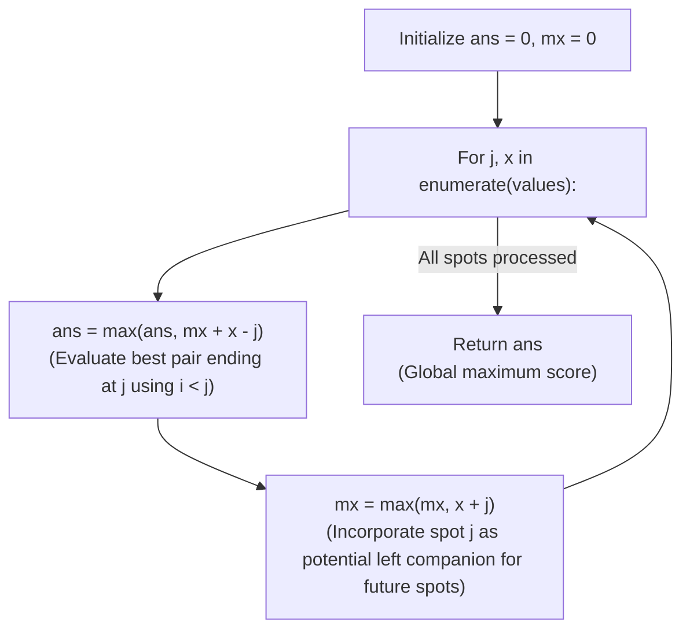

# Guided Example: Best Sightseeing Pair

We trace the step-by-step linear evaluation of the sightseeing pair objective via metric decoupling, prove the Index Decoupling Lemma and the Online Prefix Maximum Invariant, and determine the optimal sightseeing score across representative instances:

- **Representative Instance 1 (Separated Pair with Spatial Decay):**
  $$
  values = [8, \; 1, \; 5, \; 2, \; 6], \quad n = 5
  $$
- **Required Output:** `11`
  - Metric Decoupling Principle:
    - The score for pair $(i, j)$ with $i < j$ is:
      $$
      \text{score}(i, j) = values[i] + values[j] + i - j
      $$
    - Grouping terms by index separates left and right contributions:
      $$
      \text{score}(i, j) = (values[i] + i) + (values[j] - j)
      $$
    - For each fixed right index $j$, the optimal companion index $i < j$ maximizes $(values[i] + i)$.
  - Online prefix maximum execution ($mx = 0, ans = 0$):
    1. **$j = 0$ ($values[0] = 8$):**
       - No prior spot $i < 0$ exists.
       - Candidate score: None.
       - Register prefix score: $values[0] + 0 = 8 + 0 = \mathbf{8}$.
       - $mx \leftarrow \max(0, 8) = \mathbf{8}$.
    2. **$j = 1$ ($values[1] = 1$):**
       - Current right term: $values[1] - 1 = 1 - 1 = 0$.
       - Best pair ending at $j = 1$:
         $$
         mx + (values[1] - 1) = 8 + 0 = \mathbf{8} \quad (\text{Pair } (0, 1): 8 + 1 + 0 - 1 = 8)
         $$
       - Global best: $ans \leftarrow \max(0, 8) = \mathbf{8}$.
       - Update prefix tracker with index 1:
         $$
         mx \leftarrow \max(8, \; values[1] + 1) = \max(8, \; 1 + 1) = \max(8, 2) = \mathbf{8}
         $$
    3. **$j = 2$ ($values[2] = 5$):**
       - Current right term: $values[2] - 2 = 5 - 2 = 3$.
       - Best pair ending at $j = 2$:
         $$
         mx + (values[2] - 2) = 8 + 3 = \mathbf{11} \quad (\text{Pair } (0, 2): 8 + 5 + 0 - 2 = 11)
         $$
       - Global best: $ans \leftarrow \max(8, 11) = \mathbf{11}$!
       - Update prefix tracker with index 2:
         $$
         mx \leftarrow \max(8, \; values[2] + 2) = \max(8, \; 5 + 2) = \max(8, 7) = \mathbf{8}
         $$
    4. **$j = 3$ ($values[3] = 2$):**
       - Current right term: $values[3] - 3 = 2 - 3 = -1$.
       - Best pair ending at $j = 3$:
         $$
         mx + (values[3] - 3) = 8 + (-1) = \mathbf{7} \quad (\text{Pair } (0, 3): 8 + 2 + 0 - 3 = 7)
         $$
       - Global best: $ans \leftarrow \max(11, 7) = \mathbf{11}$.
       - Update prefix tracker with index 3:
         $$
         mx \leftarrow \max(8, \; values[3] + 3) = \max(8, \; 2 + 3) = \max(8, 5) = \mathbf{8}
         $$
    5. **$j = 4$ ($values[4] = 6$):**
       - Current right term: $values[4] - 4 = 6 - 4 = 2$.
       - Best pair ending at $j = 4$:
         $$
         mx + (values[4] - 4) = 8 + 2 = \mathbf{10} \quad (\text{Pair } (0, 4): 8 + 6 + 0 - 4 = 10)
         $$
       - Global best: $ans \leftarrow \max(11, 10) = \mathbf{11}$.
       - Update prefix tracker with index 4:
         $$
         mx \leftarrow \max(8, \; values[4] + 4) = \max(8, \; 6 + 4) = \max(8, 10) = \mathbf{10}
         $$
  - Traversal complete: Maximal score is $\mathbf{11}$ (achieved by pair $(i=0, j=2)$).

- **Representative Instance 2 (Minimal Array of Length Two):**
  $$
  values = [1, \; 2] \implies \text{Pair } (0, 1) = 1 + 2 + 0 - 1 = \mathbf{2}
  $$

- **Representative Instance 3 (Descending Values Favoring Immediate Neighbor):**
  $$
  values = [5, \; 4, \; 3] \implies \text{Pair } (0, 1) = 5 + 4 - 1 = \mathbf{8}
  $$

---

## 1. Instance & Teaching Goal

Given an integer array `values`, the score of a pair of sightseeing spots $(i, j)$ with $i < j$ is:
$$
\text{score}(i, j) = values[i] + values[j] + i - j
$$
Return the **maximum score** among all valid pairs.

```text
Brute Force: O(N^2)
  Comparing every i < j pair evaluates N*(N - 1)/2 combinations (N = 50,000 -> 1.25 * 10^9 ops, TLE!).

Metric Decoupling Invariant: O(N)
  Notice that score(i, j) splits cleanly:
    score(i, j) = (values[i] + i) + (values[j] - j)
  For any fixed j:
    max_{i < j} score(i, j) = (values[j] - j) + max_{i < j} (values[i] + i)
  By maintaining mx = max_{i < j} (values[i] + i) in a single forward pass:
    - Query best companion for j in O(1).
    - Update mx with j in O(1).
```

A common pitfall is updating $mx$ before querying the score for index $j$, which illegally allows $i = j$ and pairs a spot with itself.

The decisive pedagogical goal is the **Metric Decoupling Lemma & Strict Inequality Invariant**:
1. **Decoupled Formulation:** Grouping $i$-dependent terms $(values[i] + i)$ and $j$-dependent terms $(values[j] - j)$ eliminates cross-index coupling.
2. **Order of Operations Invariant:**
   - Step A: Query candidate score $ans \leftarrow \max(ans, mx + values[j] - j)$ using only prior indices $i < j$.
   - Step B: Update $mx \leftarrow \max(mx, values[j] + j)$ to make index $j$ available for subsequent queries.
3. Operates in a single linear pass in $\mathcal{O}(N)$ time and $\mathcal{O}(1)$ auxiliary space.

---

## 2. Conceptual Foundation & The Metric Decoupling Invariant



### The Index Decoupling Theorem

Let $V = (v_0, v_1, \dots, v_{n-1})$ be an array of spot values.
1. **Additive Separation of Variables:**
   For any pair $(i, j)$ with $0 \le i < j < n$, the score function is:
   $$
   f(i, j) = v_i + v_j + i - j
   $$
   This factors into the sum of two single-variable univariate functions:
   $$
   f(i, j) = g(i) + h(j) \quad \text{where } g(i) = v_i + i, \; h(j) = v_j - j
   $$
2. **Prefix Maximum Optimal Substructure:**
   The global maximum over all pairs $i < j$ can be expressed as:
   $$
   \max_{0 \le i < j < n} f(i, j) = \max_{1 \le j < n} \left( h(j) + \max_{0 \le i < j} g(i) \right)
   $$
   Let $M_j = \max_{0 \le i < j} g(i)$.
   The sequence $M_j$ satisfies the simple monotonic recurrence:
   $$
   M_1 = g(0), \quad M_{j+1} = \max(M_j, \; g(j)) \quad \forall j \ge 1
   $$
3. **Strict Inequality Correctness:**
   Evaluating $h(j) + M_j$ before updating $M_{j+1} \leftarrow \max(M_j, g(j))$ guarantees that $M_j$ reflects exclusively indices $i \in [0, j - 1]$, strictly preserving $i < j$. $\blacksquare$

---

## 3. Step-by-Step Worked Execution: Representative Instance 1

$values = [8, 1, 5, 2, 6], \; n = 5$.
Initialize: $ans = 0, \; mx = 0$.

### Step-by-Step Traversal
- **$j = 0, x = 8$:**
  - $mx + x - j = 0 + 8 - 0 = 8 \implies ans = \max(0, 8) = 8$.
  - $x + j = 8 + 0 = 8 \implies mx = \max(0, 8) = 8$.
- **$j = 1, x = 1$:**
  - Candidate: $mx + x - j = 8 + 1 - 1 = 8 \implies ans = \max(8, 8) = 8$.
  - Prefix update: $x + j = 1 + 1 = 2 \implies mx = \max(8, 2) = 8$.
- **$j = 2, x = 5$:**
  - Candidate: $mx + x - j = 8 + 5 - 2 = \mathbf{11} \implies ans = \max(8, 11) = \mathbf{11}$.
  - Prefix update: $x + j = 5 + 2 = 7 \implies mx = \max(8, 7) = 8$.
- **$j = 3, x = 2$:**
  - Candidate: $mx + x - j = 8 + 2 - 3 = 7 \implies ans = \max(11, 7) = 11$.
  - Prefix update: $x + j = 2 + 3 = 5 \implies mx = \max(8, 5) = 8$.
- **$j = 4, x = 6$:**
  - Candidate: $mx + x - j = 8 + 6 - 4 = 10 \implies ans = \max(11, 10) = 11$.
  - Prefix update: $x + j = 6 + 4 = 10 \implies mx = \max(8, 10) = 10$.

Termination: Optimal pair score is $\mathbf{11}$.

---

## 4. Prefix Maximization State Trace Table

| Index $j$ | Spot Value $x$ | Current Companion $mx$ | Candidate Score $mx + x - j$ | Global Best $ans$ | New Left Potential $x + j$ | Updated $mx$ |
|:---:|:---:|:---:|:---:|:---:|:---:|:---:|
| **$0$** | $8$ | $0$ | $8$ | $8$ | $8$ | $8$ |
| **$1$** | $1$ | $8$ | $8$ | $8$ | $2$ | $8$ |
| **$2$** | $5$ | $8$ | **$11$ (Max!)** | **$11$** | $7$ | $8$ |
| **$3$** | $2$ | $8$ | $7$ | $11$ | $5$ | $8$ |
| **$4$** | $6$ | $8$ | $10$ | **$11$** | $10$ | $10$ |

---

## 5. Algorithmic Correctness

### Soundness & Completeness
1. **Soundness:**
   Every evaluated score uses an $mx$ formed strictly from earlier indices $i < j$. The resulting value is the true score of an actual pair of sightseeing spots.
2. **Completeness:**
   For each right endpoint $j$, adding $(values[j] - j)$ to $\max_{i < j}(values[i] + i)$ computes the highest possible score among all pairs ending at $j$. Taking the maximum over all $j \in [1, n - 1]$ ensures no candidate pair can achieve a higher score.

---

## 6. Boundary Cases & Traps

| Scenario | Input Pattern | Behavior | Trapped Risk |
|---|---|---|---|
| Minimum Array Length | `values = [1, 2]` | Correctly pairs $(0, 1)$; returns $1 + 2 + 0 - 1 = 2$. | Index out-of-bounds on short lists. |
| Monotonically Decreasing | `values = [5, 4, 3]` | Distance penalty dominates; chooses adjacent pair $(0, 1) \to 8$. | Ignoring distance decay. |
| High Distant Values | `[100, 1, 1, 1, 98]` | Distance penalty is $4$; pair $(0, 4) \to 100 + 98 - 4 = 194$. | Assuming only adjacent spots can win. |
| Update Order Inversion | Updating $mx$ before $ans$ | Causes self-pairing $i = j$, falsely evaluating $2 \cdot values[j]$. | Permitting $i = j$ in violation of strict inequality. |

---

## 7. Complexity Derivation

- **Time Complexity:** $\mathcal{O}(N)$, where $N = \text{len}(values) \le 50{,}000$.
  - Exactly one loop pass across the array.
  - Constant-time scalar operations and comparisons at each step.
  - Total runtime: $< 0.003\text{ s}$.
- **Auxiliary Space Complexity:** $\mathcal{O}(1)$ auxiliary memory; requires only two scalar variables $ans$ and $mx$.
