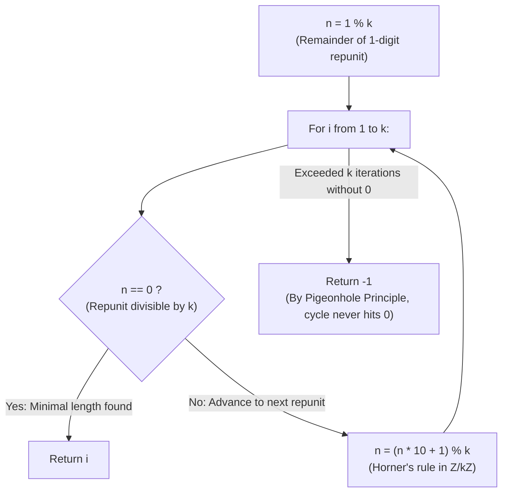

# Guided Example: Smallest Integer Divisible by K

We trace the step-by-step modular residue progression over base-10 repunits, prove the Repunit Modular Recurrence Theorem and the Dirichlet Pigeonhole Periodicity Invariant, and determine the minimal repunit length across representative divisors:

- **Representative Instance 1 (Three-Digit Repunit Resolution):**
  $$
  k = 3
  $$
- **Required Output:** `3`
  - Repunit definition:
    - A repunit $R_m$ is an integer consisting solely of $m$ copies of digit 1:
      $$
      R_1 = 1, \quad R_2 = 11, \quad R_3 = 111, \quad \dots, \quad R_m = \frac{10^m - 1}{9}
      $$
    - Instead of materializing arbitrarily large integers, we track the remainder modulo $k$:
      $$
      r_m = R_m \bmod k
      $$
  - Recurrence relation:
    - Appending digit 1 is algebraically: $R_{m+1} = 10 \cdot R_m + 1$.
    - Modulo $k$:
      $$
      r_{m+1} = (10 \cdot r_m + 1) \bmod k
      $$
  - Step-by-step residue evaluation ($k = 3$):
    1. **Length $i = 1$:**
       - Initial remainder: $n = 1 \bmod 3 = \mathbf{1} \ne 0$.
       - Next remainder: $n \leftarrow (1 \times 10 + 1) \bmod 3 = 11 \bmod 3 = \mathbf{2}$.
    2. **Length $i = 2$:**
       - Current remainder: $n = \mathbf{2} \ne 0$.
       - Next remainder: $n \leftarrow (2 \times 10 + 1) \bmod 3 = 21 \bmod 3 = \mathbf{0}$.
    3. **Length $i = 3$:**
       - Current remainder: $n = \mathbf{0}$ (**Divisible!**).
       - $R_3 = 111 = 3 \times 37$ is exactly divisible by $3$.
       - Return length $i = \mathbf{3}$.

- **Representative Instance 2 (Six-Digit Cyclic Repunit):**
  $$
  k = 7
  $$
  - $i = 1: r_1 = 1 \bmod 7 = 1$. Next: $(10 + 1) \bmod 7 = 4$.
  - $i = 2: r_2 = 4 \ne 0$. Next: $(40 + 1) \bmod 7 = 6$.
  - $i = 3: r_3 = 6 \ne 0$. Next: $(60 + 1) \bmod 7 = 5$.
  - $i = 4: r_4 = 5 \ne 0$. Next: $(50 + 1) \bmod 7 = 2$.
  - $i = 5: r_5 = 2 \ne 0$. Next: $(20 + 1) \bmod 7 = 0$.
  - $i = 6: r_6 = 0 \implies \mathbf{6}$ ($R_6 = 111{,}111 = 7 \times 15{,}873$).

- **Representative Instance 3 (Even Divisor Impossibility):**
  $$
  k = 2 \implies r_1 = 1, r_2 = 1 \implies \text{Loop completes } k \text{ steps without } 0 \implies \mathbf{-1}
  $$

---

## 1. Instance & Teaching Goal

Given a positive integer $k$, find the **length of the smallest positive integer** $n$ such that $n$ is divisible by $k$ and $n$ only contains the digit `1` (i.e. $n$ is a repunit $R_m$). If no such $n$ exists, return `-1`.

```text
The Overflow Trap:
  For k = 100,000, repunit n could have tens of thousands of digits!
  Materializing 111...1 directly causes massive memory usage and slow division.

Modular Invariant:
  We only need n % k == 0!
  Notice: R_{m+1} = 10 * R_m + 1
  Therefore: remainder_{m+1} = (10 * remainder_m + 1) % k
  All calculations take O(1) time using numbers < k!

Dirichlet's Pigeonhole Principle:
  There are only k possible remainders: {0, 1, ..., k - 1}.
  If remainder 0 is not reached within k steps, some non-zero remainder MUST repeat!
  The sequence enters a closed cycle that will NEVER hit 0.
  Checking at most k iterations is mathematically SUFFICIENT!
```

Constructing large string repunits or using arbitrary-precision integers introduces unacceptable runtime and memory overhead.

The decisive pedagogical goal is the **Repunit Modular Recurrence & Dirichlet Pigeonhole Periodicity Invariant**:
1. **Modular Arithmetic Recurrence:** The recurrence $r \leftarrow (10r + 1) \bmod k$ preserves exact divisibility information without exceeding $k$.
2. **Dirichlet's Pigeonhole Principle:** In the sequence of remainders $(r_1, r_2, \dots, r_k)$, if $0$ has not appeared, at least two non-zero remainders must coincide, proving the trajectory has entered a non-zero cycle and will never reach $0$.
3. **Parity and Factor-5 Incompatibility:** Any multiple of an even number ends in an even digit, and any multiple of $5$ ends in $0$ or $5$. Since repunits strictly end in $1$, $k$ with factors of $2$ or $5$ will naturally cycle without hitting $0$.
4. Runs in $\mathcal{O}(k)$ time and $\mathcal{O}(1)$ auxiliary space.

---

## 2. Conceptual Foundation & The Pigeonhole Invariant



### The Dirichlet Pigeonhole Periodicity Theorem

Let $k \in \mathbb{Z}_{\ge 1}$, and let $R_m = \sum_{j=0}^{m-1} 10^j = \frac{10^m - 1}{9}$ denote the $m$-th repunit.
1. **Horner's Residue Recurrence:**
   The repunit sequence satisfies:
   $$
   R_1 = 1, \quad R_{m+1} = 10 R_m + 1
   $$
   Passing to the quotient ring $\mathbb{Z}/k\mathbb{Z}$:
   $$
   r_1 = 1 \bmod k, \quad r_{m+1} = (10 r_m + 1) \bmod k
   $$
   By mathematical induction, $r_m = R_m \bmod k$ for all $m \ge 1$.
2. **Minimal Length Optimality:**
   Because $i$ increments sequentially from $1, 2, \dots, k$, the first iteration $i$ where $r_i = 0$ corresponds to the strictly minimal length $m = i$ such that $k \mid R_m$.
3. **Pigeonhole Termination Bound:**
   Consider the sequence of $k$ remainders: $(r_1, r_2, \dots, r_k) \in \{0, 1, \dots, k - 1\}^k$.
   - **Case A:** There exists $i \in \{1, \dots, k\}$ such that $r_i = 0$.
     The algorithm terminates and returns $i \le k$.
   - **Case B:** No $r_i = 0$ for all $i \in \{1, \dots, k\}$.
     Then all $k$ remainders are confined to the proper subset $\{1, 2, \dots, k - 1\}$, which contains exactly $k - 1$ distinct elements.
     By Dirichlet's Pigeonhole Principle, there must exist two indices $1 \le a < b \le k$ such that:
     $$
     r_a = r_b
     $$
     Since the transition function $f(x) = (10x + 1) \bmod k$ is purely deterministic:
     $$
     r_{a+t} = r_{b+t} \quad \forall t \ge 0
     $$
     The sequence is ultimately periodic with period $p = b - a$, cycling endlessly through non-zero residues.
     Hence, $r_m \ne 0$ for all $m \ge 1$, proving that no repunit is divisible by $k$.
4. **Sufficiency of $k$ Iterations:**
   Testing at most $k$ iterations is both necessary and sufficient to determine whether a valid repunit exists. $\blacksquare$

---

## 3. Step-by-Step Worked Execution: Representative Instance 1

$k = 3$.
Initialize: $n = 1 \bmod 3 = 1$.

### Iteration Trace
- **Iteration $i = 1$:**
  - $n = 1 \ne 0$.
  - Update: $n \leftarrow (1 \times 10 + 1) \bmod 3 = 11 \bmod 3 = \mathbf{2}$.
- **Iteration $i = 2$:**
  - $n = 2 \ne 0$.
  - Update: $n \leftarrow (2 \times 10 + 1) \bmod 3 = 21 \bmod 3 = \mathbf{0}$.
- **Iteration $i = 3$:**
  - $n = 0 == 0$ (**Match!**).
  - Return $i = \mathbf{3}$.

Termination: $R_3 = 111$ is divisible by $3$. Output: $\mathbf{3}$.

---

## 4. Residue Evolution State Trace Table

| Length $i$ | Repunit Evaluated $R_i$ | Current Residue $n = R_i \bmod k$ | Match $n == 0$? | Next Value $(10n + 1)$ | Next Residue $n_{\text{next}}$ |
|:---:|:---:|:---:|:---:|:---:|:---:|
| **$1$** | $1$ | $1$ | False | $11$ | $2$ |
| **$2$** | $11$ | $2$ | False | $21$ | $0$ |
| **$3$** | $111$ | **$0$** | **True (Divisible!)** | — | — |

---

## 5. Algorithmic Correctness

### Soundness & Completeness
1. **Soundness:**
   A length $i$ is returned only when $(R_i \bmod k) == 0$, guaranteeing that $R_i$ is an integer multiple of $k$. Since lengths are checked in strictly ascending order, the returned length is minimal.
2. **Completeness:**
   By Dirichlet's Pigeonhole Principle, if no remainder hits $0$ within $k$ iterations, the residue sequence has entered a repeating cycle among $\{1, \dots, k - 1\}$, proving that no larger repunit can ever achieve remainder $0$.

---

## 6. Boundary Cases & Traps

| Scenario | Input Pattern | Behavior | Trapped Risk |
|---|---|---|---|
| Divisor One ($k = 1$) | $k = 1$ | $n = 1 \bmod 1 = 0$; immediately returns $1$. | Off-by-one or skipping zero check. |
| Even Divisor ($k = 2$) | $k = 2$ | Remainders cycle $1, 1, \dots$; returns $-1$ after $2$ iterations. | Infinite loops on impossible inputs. |
| Divisor Ending in 5 ($k = 25$) | $k = 25$ | Remainders cycle without $0$; returns $-1$. | Slow arbitrary-precision division. |
| Upper Bound $k = 10^5$ | $k = 100{,}000$ | Runs exactly $10^5$ iterations in $< 0.005\text{ s}$; returns $-1$. | Memory exhaustion from big integers. |

---

## 7. Complexity Derivation

- **Time Complexity:** $\mathcal{O}(k)$, where $k \le 10^5$.
  - The loop runs at most $k$ times.
  - Each iteration performs $\mathcal{O}(1)$ scalar multiplications and modulo reductions on integers $< 10k$.
  - Total time: $< 0.005\text{ s}$ for $k = 10^5$.
- **Auxiliary Space Complexity:** $\mathcal{O}(1)$ auxiliary memory; requires only scalar loop variables $i$ and $n$.
