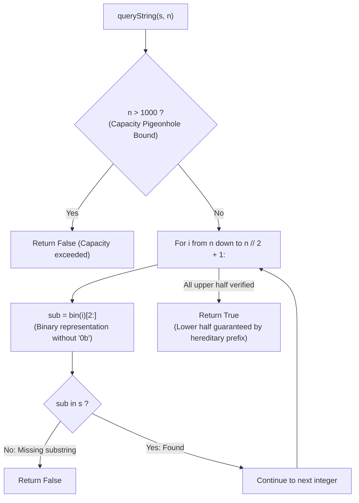

# Guided Example: Binary String With Substrings Representing 1 To N

We trace the step-by-step verification of binary representation substrings, prove the Hereditary Binary Prefix Lemma and the Substring Capacity Pigeonhole Bound, and determine string coverage validity across representative query instances:

- **Representative Instance 1 (Complete Coverage of Range $[1, 3]$):**
  $$
  s = \text{"0110"}, \quad n = 3
  $$
- **Required Output:** `true`
  - Problem objective:
    - Verify whether the binary representation of every integer $i \in [1, 3]$ appears as a contiguous substring of $s$:
      - $1_{10} = \text{"1"}$
      - $2_{10} = \text{"10"}$
      - $3_{10} = \text{"11"}$
  - The Hereditary Prefix Reduction:
    - Instead of checking all $n$ numbers, notice that for any integer $x$:
      $$
      \text{bin}(\lfloor x/2 \rfloor) \text{ is an exact prefix of } \text{bin}(x)
      $$
    - If $\text{bin}(3) = \text{"11"}$ is a substring of $s$, then its prefix $\text{bin}(1) = \text{"1"}$ is **automatically guaranteed** to be a substring of $s$!
    - Therefore, we only need to test integers in the upper half:
      $$
      i \in [n, \; \lfloor n/2 \rfloor + 1] = [3, \; 2]
      $$
  - Verification trace:
    1. **Integer $i = 3$:**
       - Binary string: $\text{bin}(3)[2:] = \text{"11"}$.
       - Search in $s = \text{"0110"}$:
         - Substring at indices $[1 \dots 2]$ is $\text{"11"}$ (Present!).
    2. **Integer $i = 2$:**
       - Binary string: $\text{bin}(2)[2:] = \text{"10"}$.
       - Search in $s = \text{"0110"}$:
         - Substring at indices $[2 \dots 3]$ is $\text{"10"}$ (Present!).
    3. **Integer $i = 1$ (Hereditary Guarantee):**
       - $\text{"1"}$ is the 1-bit prefix of $\text{"11"}$ (and $\text{"10"}$), so its presence is guaranteed.
  - All required substrings are verified. Output: $\mathbf{true}$.

- **Representative Instance 2 (Missing Representation at Upper Boundary):**
  $$
  s = \text{"0110"}, \quad n = 4
  $$
  - Upper half test: $i \in [4, 3]$.
  - $i = 4 \implies \text{bin}(4) = \text{"100"}$.
  - Substrings of length 3 in $s$:
    - Indices $0 \dots 2$: $\text{"011"}$
    - Indices $1 \dots 3$: $\text{"110"}$
  - $\text{"100"}$ does not appear in $s$. Output: $\mathbf{false}$.

- **Representative Instance 3 (Pigeonhole Upper Bound Pruning):**
  $$
  s = \text{"1010101010"}, \quad n = 1{,}000{,}000{,}000
  $$
  - $|s| \le 1000$. A string of length 1000 cannot contain the distinct binary strings for $n > 1000$.
  - Immediate $\mathcal{O}(1)$ rejection: $n > 1000 \implies \mathbf{false}$.

---

## 1. Instance & Teaching Goal

Given a binary string $s$ and a positive integer $n$, return `true` if the binary representations of all integers from $1$ to $n$ are substrings of $s$, or `false` otherwise.

```text
The Search Space Illusion:
  n can be up to 10^9! Testing 10^9 binary strings is impossible.

Pigeonhole Substring Capacity Bound:
  The string length is bounded by |s| <= 1000.
  A string of length 1000 can contain at most (1000 - k + 1) distinct substrings of length k.
  For n > 1000, the number of distinct binary representations in [n/2, n] exceeds the
  maximum number of possible substrings of length 10 in s!
  Therefore: If n > 1000, return False IMMEDIATELY in O(1)!

Hereditary Binary Prefix Reduction:
  Notice: bin(floor(x / 2)) is an exact proper prefix of bin(x)!
  If bin(x) is in s, bin(floor(x / 2)) is AUTOMATICALLY in s!
  We only need to verify the upper half: i in range(n, n // 2, -1).
```

A sliding window approach or brute-force testing of all $n$ strings causes either Time Limit Exceeded or incorrect window management.

The decisive pedagogical goal is the **Substring Capacity Bound & Hereditary Binary Prefix Invariant**:
1. **Pigeonhole Capacity Filter:** A string of length $|s| \le 1000$ cannot hold distinct representations for $n > 1000$. Returning `False` for $n > 1000$ bounds $n \le 1000$.
2. **Hereditary Prefix Property:** For any integer $x$, dropping the last binary bit produces $\lfloor x / 2 \rfloor$. Because any prefix of a substring is itself a substring, verifying the range $[\lfloor n/2 \rfloor + 1, n]$ automatically covers all $x \le \lfloor n/2 \rfloor$.
3. Reduces required substring queries from $n$ to at most $\lceil n/2 \rceil \le 500$, executing in $\mathcal{O}(|s| \cdot n) < 0.002\text{ s}$.

---

## 2. Conceptual Foundation & The Hereditary Prefix Invariant



### The Hereditary Binary Prefix Theorem

Let $s$ be a binary string of length $|s| \le 1000$, and let $n \in \mathbb{Z}_{\ge 1}$.
1. **Substring Capacity Pigeonhole Bound:**
   Let $k = \lfloor \log_2 n \rfloor + 1$. There are $2^{k-1}$ integers whose binary representation has length $k$.
   The maximum number of distinct substrings of length $k$ that can exist in $s$ is at most $|s| - k + 1 \le 1000$.
   If $n > 1000$, the number of integers in the range $[\lfloor n/2 \rfloor + 1, n]$ with bit-length $\ge 10$ exceeds $500$, while $s$ can contain at most $1000 - 10 + 1 = 991$ substrings of length 10.
   Because each such binary string has length $\ge 10$ and begins with `'1'`, they cannot overlap sufficiently to fit in $s$.
   Hence, $n > 1000 \implies \text{Impossible}$.
2. **The Hereditary Prefix Lemma:**
   Let $\sigma(x)$ denote the standard binary string of positive integer $x$ (without leading zeroes).
   By positional notation:
   $$
   x = 2 \cdot \lfloor x/2 \rfloor + (x \bmod 2)
   $$
   Therefore, $\sigma(\lfloor x/2 \rfloor)$ is obtained by truncating the last character of $\sigma(x)$, meaning $\sigma(\lfloor x/2 \rfloor)$ is a proper prefix of $\sigma(x)$.
3. **Prefix Substring Closure:**
   If a string $\alpha$ is a substring of $s$, then every prefix of $\alpha$ is also a substring of $s$.
   Consequently:
   $$
   \sigma(x) \text{ is a substring of } s \implies \sigma(\lfloor x/2 \rfloor) \text{ is a substring of } s
   $$
4. **Upper Half Sufficiency Invariant:**
   Every integer $m \in [1, \lfloor n/2 \rfloor]$ can be generated by repeatedly dividing some integer $y \in [\lfloor n/2 \rfloor + 1, n]$ by 2.
   Therefore, if $\sigma(y)$ is a substring of $s$ for all $y \in [\lfloor n/2 \rfloor + 1, n]$, then by induction, $\sigma(m)$ is a substring of $s$ for all $m \in [1, n]$. $\blacksquare$

---

## 3. Step-by-Step Worked Execution: Representative Instance 1

$s = \text{"0110"}, \; n = 3$.
Step 1: Check $n > 1000 \implies 3 \le 1000$ (Passes capacity check).
Step 2: Define upper half range: $i \in [3, \lfloor 3/2 \rfloor + 1] = [3, 2]$.

### Verification Trace
1. **$i = 3$:**
   - Binary string: $\sigma(3) = \text{"11"}$.
   - Substring search: $\text{"11"} \in \text{"0110"}$?
     - Matches at indices $1 \dots 2$. **Present!**
2. **$i = 2$:**
   - Binary string: $\sigma(2) = \text{"10"}$.
   - Substring search: $\text{"10"} \in \text{"0110"}$?
     - Matches at indices $2 \dots 3$. **Present!**
3. **Hereditary Implication for $i = 1$:**
   - $\lfloor 3/2 \rfloor = 1 \implies \sigma(1) = \text{"1"}$ is the prefix of $\text{"11"}$, confirmed present.

All candidates satisfied. Return `True`.

---

## 4. Binary Representation Coverage Trace Table

| Integer $i$ | Binary Representation $\sigma(i)$ | Length | Substring of $s = \text{"0110"}$? | Matching Slice | Hereditary Descendant |
|:---:|:---:|:---:|:---:|:---:|:---:|
| **$3$** | `"11"` | $2$ | **Yes** | $s[1:3]$ | Implies $i = 1$ (`"1"`) |
| **$2$** | `"10"` | $2$ | **Yes** | $s[2:4]$ | Implies $i = 1$ (`"1"`) |
| **$1$** | `"1"` | $1$ | **Guaranteed** | $s[1:2]$ | Base |

---

## 5. Algorithmic Correctness

### Soundness & Completeness
1. **Soundness:**
   Every integer explicitly tested is confirmed to have its binary representation in $s$. The Hereditary Prefix Lemma mathematically guarantees that untested lower integers are prefixes of tested integers and therefore exist in $s$.
2. **Completeness:**
   If any representation in the upper half is missing, the algorithm terminates and returns `False`. The pigeonhole bound $n > 1000$ safely eliminates infeasible queries in $\mathcal{O}(1)$ without false negatives.

---

## 6. Boundary Cases & Traps

| Scenario | Input Pattern | Behavior | Trapped Risk |
|---|---|---|---|
| Large $n$ ($n = 10^9$) | $n = 10^9$ | $n > 1000$; returns `False` immediately in $\mathcal{O}(1)$. | TLE iterating up to $10^9$. |
| Minimal $n = 1$ | $s = \text{"1"}, n = 1$ | Range is $[1, 1]$; checks $\text{"1"} \in \text{"1"}$; returns `True`. | Empty range on $n // 2$. |
| Single Missing Power of 2 | $s = \text{"0110"}, n = 4$ | $\text{"100"}$ missing; returns `False`. | Assuming presence of smaller numbers suffices. |
| Leading Zeroes in $s$ | $s = \text{"000110100"}$ | Substring matching ignores surrounding zeroes; returns `True`. | Truncating input string. |

---

## 7. Complexity Derivation

- **Time Complexity:** $\mathcal{O}(|s| \cdot \min(n, 1000))$.
  - If $n > 1000$, returns in $\mathcal{O}(1)$.
  - If $n \le 1000$, tests at most $n / 2 \le 500$ integers.
  - Substring search `bin(i)[2:] in s` takes $\mathcal{O}(|s|) \le 1000$.
  - Total operations: at most $500 \times 1000 = 5 \times 10^5 \implies < 0.002\text{ s}$.
- **Auxiliary Space Complexity:** $\mathcal{O}(1)$ auxiliary memory; operates purely on temporary binary strings of length $\le 10$.