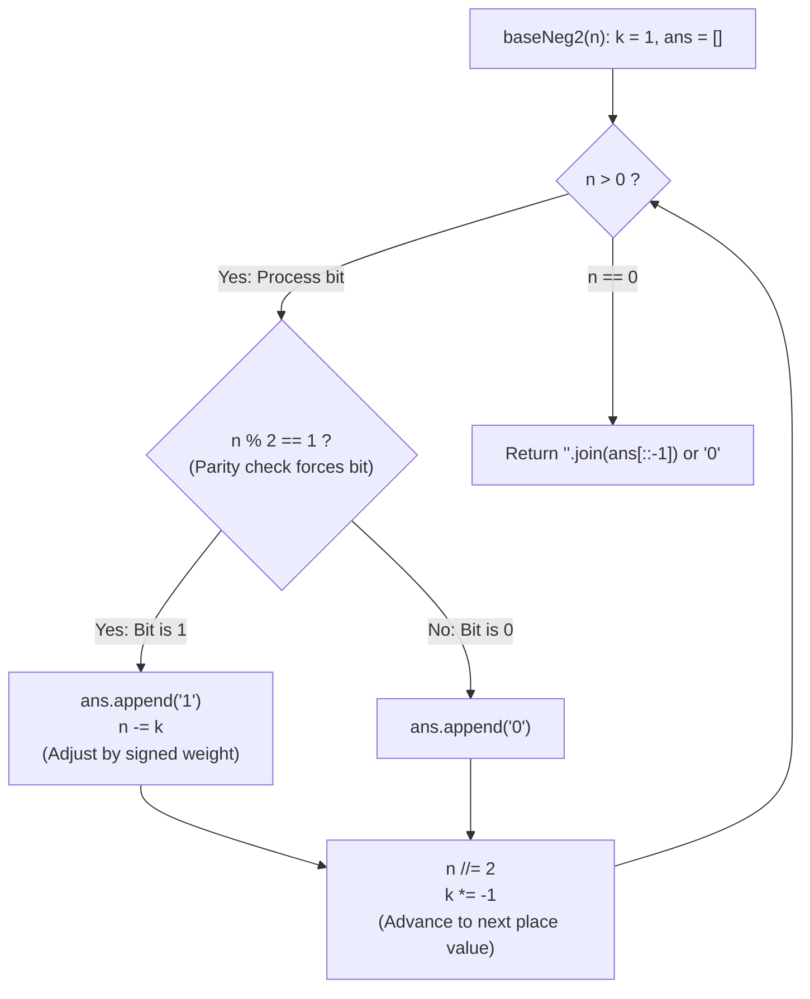

# Guided Example: Convert to Base -2

We trace the step-by-step extraction of negabinary bits using alternating sign normalization, prove the Negabinary Parity Forcing Theorem and the Positive Quotient Invariant, and determine base $-2$ representations across representative integers:

- **Representative Instance 1 (Even Positive Integer with Alternating Powers):**
  $$
  n = 2
  $$
- **Required Output:** `"110"`
  - Negabinary positional basis:
    - Base $-2$ place values alternate signs:
      $$
      (-2)^0 = 1, \quad (-2)^1 = -2, \quad (-2)^2 = 4, \quad (-2)^3 = -8, \quad (-2)^4 = 16
      $$
    - Representation goal:
      $$
      2 = 1 \cdot (-2)^2 + 1 \cdot (-2)^1 + 0 \cdot (-2)^0 = 4 - 2 + 0 = \mathbf{2} \implies \text{"110"}
      $$
  - Parity forcing principle:
    - Since every power $(-2)^p$ for $p \ge 1$ is an even integer, the parity of the current working value uniquely determines the bit $b_p \in \{0, 1\}$:
      $$
      b_p = n \bmod 2
      $$
  - Alternating sign tracking ($k = (-1)^p \in \{+1, -1\}$, residual $n$):
    1. **Position $p = 0$ ($k = 1$):**
       - $n = 2$: $2 \bmod 2 = 0 \implies$ append `'0'`.
       - Divide: $n \leftarrow 2 // 2 = 1$.
       - Toggle sign: $k \leftarrow 1 \times (-1) = -1$.
    2. **Position $p = 1$ ($k = -1$):**
       - $n = 1$: $1 \bmod 2 = 1 \implies$ append `'1'`.
       - Subtract signed place: $n \leftarrow n - k = 1 - (-1) = \mathbf{2}$.
       - Divide: $n \leftarrow 2 // 2 = 1$.
       - Toggle sign: $k \leftarrow (-1) \times (-1) = 1$.
    3. **Position $p = 2$ ($k = 1$):**
       - $n = 1$: $1 \bmod 2 = 1 \implies$ append `'1'`.
       - Subtract signed place: $n \leftarrow n - k = 1 - 1 = \mathbf{0}$.
       - Divide: $n \leftarrow 0 // 2 = 0$.
       - Toggle sign: $k \leftarrow 1 \times (-1) = -1$.
    4. **Loop Exit ($n = 0$):**
       - Collected bits (LSB to MSB): `['0', '1', '1']`.
       - Reversing produces MSB-first binary string: `"110"`.
       - Verification: $1 \times (-2)^2 + 1 \times (-2)^1 + 0 \times (-2)^0 = 4 - 2 + 0 = \mathbf{2}$.

- **Representative Instance 2 (Odd Value with Consecutive Positive and Negative Units):**
  $$
  n = 3 \implies \text{Bits } ['1', '1', '1'] \implies \text{"111"} \quad (4 - 2 + 1 = 3)
  $$

- **Representative Instance 3 (Base Zero Case):**
  $$
  n = 0 \implies \text{Loop skips; returns fallback } \mathbf{"0"}
  $$

- **Representative Instance 4 (Higher Composite):**
  $$
  n = 6 \implies \text{"11010"} \quad (16 - 8 + 0 - 2 + 0 = 6)
  $$

---

## 1. Instance & Teaching Goal

Given an integer $n$, return a binary string representing its representation in **base $-2$** (negabinary). The return string should not contain leading zeros unless the string is `"0"`.

```text
The Negative Remainder Trap:
  Standard division by -2 in Python floors toward -infinity:
    divmod(1, -2) -> (-1, -1)  [Because -2 * (-1) + (-1) = 1]
  A negative remainder is invalid in a binary alphabet {0, 1}!

Alternating Sign Invariant:
  Divide by positive 2, while tracking the sign of the place value k = (-1)^p!
  - If n % 2 == 1:
      Bit is '1'. Subtract the signed place: n -= k.
  - If n % 2 == 0:
      Bit is '0'.
  - Advance to next place: n //= 2, k *= -1.
  Keeps arithmetic clean, non-negative, and free from Euclidean remainder repair!
```

Handling base conversion via repeated division by $-2$ requires repairing negative remainders ($q \leftarrow q + 1, r \leftarrow r + 2$), which introduces subtle off-by-one errors.

The decisive pedagogical goal is the **Negabinary Parity Forcing Theorem & Alternating Sign Normalization**:
1. **Parity Forcing Invariant:** At any stage $p$, all higher terms $(-2)^{p+1}, (-2)^{p+2}, \dots$ are divisible by $2^{p+1}$. Thus, the bit $b_p$ is strictly forced by $n \bmod 2$.
2. **Normalized Even Adjustment:** When $b_p = 1$, subtracting $k = (-1)^p$ from an odd $n$ guarantees that $n - k$ is even, ensuring exact integer division by 2.
3. **Sign Toggle:** Flipping $k \leftarrow -k$ models the alternating sign of $(-2)^p$ without negative modulo operators.
4. Completes in logarithmic $\mathcal{O}(\log n)$ time and $\mathcal{O}(\log n)$ auxiliary space.

---

## 2. Conceptual Foundation & The Alternating Sign Invariant



### The Negabinary Parity Forcing Theorem

Let $N \in \mathbb{Z}_{\ge 0}$, and let $b_m b_{m-1} \dots b_0 \in \{0, 1\}^{m+1}$ be its base $-2$ representation:
$$
N = \sum_{p=0}^m b_p (-2)^p
$$
1. **Uniqueness and Parity Forcing:**
   Every term for $p \ge 1$ is an even integer: $(-2)^p = (-1)^p 2^p = 2 \cdot [(-1)^p 2^{p-1}]$.
   Taking modulo 2 on both sides:
   $$
   N \equiv b_0 (-2)^0 \equiv b_0 \pmod 2
   $$
   Because $b_0 \in \{0, 1\}$, $b_0$ is uniquely determined:
   $$
   b_0 = N \bmod 2
   $$
2. **Inductive Invariant of the Residual:**
   Suppose we have determined the lowest $p$ bits $(b_0, \dots, b_{p-1})$.
   Let $k = (-1)^p$. The remaining value to be represented by the higher powers is:
   $$
   N - \sum_{j=0}^{p-1} b_j (-2)^j = n \cdot 2^p \cdot k
   $$
   When $n$ is odd, choosing $b_p = 1$ removes $1 \cdot (-2)^p = k \cdot 2^p$.
   Factoring out $2^p$, the normalized residual becomes $n - k$.
   - If $k = 1$: $n - 1$ is even.
   - If $k = -1$: $n - (-1) = n + 1$ is even.
   In both cases, $n - k$ is strictly divisible by 2.
3. **Logarithmic Convergence:**
   Dividing $n$ by 2 strictly shrinks the magnitude of $n$ once $n > 2$.
   The loop terminates at $n = 0$ in at most $\lfloor \log_2 N \rfloor + 2$ iterations, producing the exact minimal negabinary string. $\blacksquare$

---

## 3. Step-by-Step Worked Execution: Representative Instance 1

$n = 2$.
Initialize: $k = 1, \; ans = []$.

### Step-by-Step Bit Extraction
1. **Position $p = 0$ ($k = 1$):**
   - $n = 2$: $2 \bmod 2 = 0 \implies$ even.
   - Append `'0'`.
   - Update: $n \leftarrow 2 // 2 = 1$.
   - Next sign: $k \leftarrow 1 \times (-1) = -1$.
2. **Position $p = 1$ ($k = -1$):**
   - $n = 1$: $1 \bmod 2 = 1 \implies$ odd.
   - Append `'1'`.
   - Adjust: $n \leftarrow 1 - (-1) = 2$.
   - Update: $n \leftarrow 2 // 2 = 1$.
   - Next sign: $k \leftarrow (-1) \times (-1) = 1$.
3. **Position $p = 2$ ($k = 1$):**
   - $n = 1$: $1 \bmod 2 = 1 \implies$ odd.
   - Append `'1'`.
   - Adjust: $n \leftarrow 1 - 1 = 0$.
   - Update: $n \leftarrow 0 // 2 = 0$.
   - Next sign: $k \leftarrow 1 \times (-1) = -1$.
4. **Loop Exit ($n = 0$):**
   - $ans = [\text{'0'}, \text{'1'}, \text{'1'}]$.
   - Reverse: `ans[::-1]` $\implies \mathbf{"110"}$.

Final string: `"110"`.

---

## 4. Negabinary State Trace Table

| Position $p$ | Place Value $(-2)^p$ | Sign Factor $k$ | Residual $n$ | Bit Emitted $n \bmod 2$ | Adjusted Residual $n - k$ | Next Residual $n // 2$ | Next Sign $-k$ |
|:---:|:---:|:---:|:---:|:---:|:---:|:---:|:---:|
| **$0$** | $1$ | $+1$ | $2$ | **`0`** | — | $1$ | $-1$ |
| **$1$** | $-2$ | $-1$ | $1$ | **`1`** | $1 - (-1) = 2$ | $1$ | $+1$ |
| **$2$** | $+4$ | $+1$ | $1$ | **`1`** | $1 - 1 = 0$ | $0$ | $-1$ |
| **Final** | — | — | $0$ | **Reversed** | — | — | **`"110"`** |

---

## 5. Algorithmic Correctness

### Soundness & Completeness
1. **Soundness:**
   Every emitted bit $b_p \in \{0, 1\}$ corresponds to the exact signed place value $(-2)^p$. The alternating parity invariant ensures that $\sum b_p (-2)^p$ identically reconstructs the original integer $n$.
2. **Completeness:**
   Because the adjustment $n - k$ is always an even integer, integer division by 2 is exact. The sequence of residuals $n$ converges deterministically to $0$, avoiding infinite cycles.

---

## 6. Boundary Cases & Traps

| Scenario | Input Pattern | Behavior | Trapped Risk |
|---|---|---|---|
| Zero Input | $n = 0$ | Loop condition `while n` is false; fallback `or '0'` returns `"0"`. | Returning empty string `""`. |
| Power of 4 ($n = 4$) | $n = 4$ | Emits `'0'`, `'0'`, `'1'`; reverses to `"100"`. | Unnecessary negative place toggling. |
| Alternating Powers ($n = 6$) | $n = 6$ | Generates `['0', '1', '0', '1', '1']`; reverses to `"11010"`. | Sign desynchronization. |
| Large Integer ($n = 10^9$) | $n = 10^9$ | Runs $\le 33$ iterations in $< 0.0001\text{ s}$. | Memory or recursion limits. |

---

## 7. Complexity Derivation

- **Time Complexity:** $\mathcal{O}(\log n)$.
  - The number of digits in negabinary is at most $\lfloor \log_2 n \rfloor + 2 \le 33$.
  - Each step performs constant-time arithmetic and string appends.
  - Total time: $< 0.0001\text{ s}$.
- **Auxiliary Space Complexity:** $\mathcal{O}(\log n)$ to store the list of characters before reversal.
