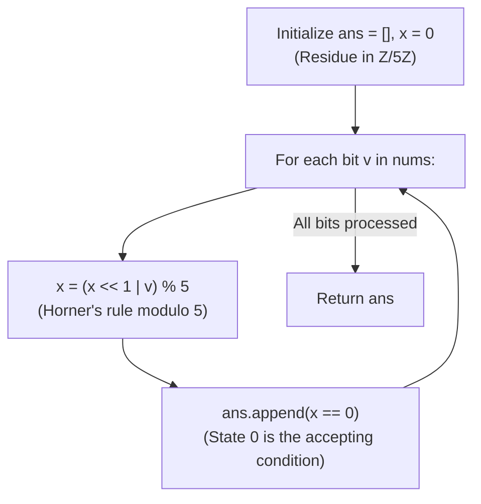

# Guided Example: Binary Prefix Divisible By 5

We trace the step-by-step modular Horner scheme over binary prefixes, prove the Modular Residue Preservation Theorem and the Finite-State DFA Invariant, and determine prefix divisibility across representative binary sequences:

- **Representative Instance 1 (Leading Zero Followed by Bit Transitions):**
  $$
  nums = [0, \; 1, \; 1], \quad n = 3
  $$
- **Required Output:** `[true, false, false]`
  - Mathematical prefix definition:
    - Let $P_i$ be the numeric value of the binary prefix $nums[0 \dots i]$.
    - Appending incoming bit $v \in \{0, 1\}$ is algebraically:
      $$
      P_i = 2 \cdot P_{i-1} + v = (P_{i-1} \ll 1) \mid v
      $$
  - Modular reduction principle:
    - Instead of materializing numbers with up to $100{,}000$ bits, we track only the residue modulo 5:
      $$
      x_i = P_i \bmod 5 = (2 \cdot x_{i-1} + v) \bmod 5 = ((x_{i-1} \ll 1 \mid v)) \bmod 5
      $$
    - The integer $P_i$ is divisible by 5 if and only if $x_i == 0$.
  - Step-by-step execution trace ($x_0 = 0$ initially):
    1. **Prefix $0$ ($nums[0] = 0$):**
       - Operation: $x \leftarrow (0 \ll 1 \mid 0) \bmod 5 = 0 \bmod 5 = \mathbf{0}$.
       - Divisibility check: $x == 0 \implies \mathbf{true}$.
       - Value represents $0_{10}$, which is divisible by 5.
    2. **Prefix $1$ ($nums[1] = 1$):**
       - Operation: $x \leftarrow (0 \ll 1 \mid 1) \bmod 5 = 1 \bmod 5 = \mathbf{1}$.
       - Divisibility check: $x == 0 \implies \mathbf{false}$.
       - Value represents $01_2 = 1_{10} \not\equiv 0 \pmod 5$.
    3. **Prefix $2$ ($nums[2] = 1$):**
       - Operation: $x \leftarrow (1 \ll 1 \mid 1) \bmod 5 = 3 \bmod 5 = \mathbf{3}$.
       - Divisibility check: $x == 0 \implies \mathbf{false}$.
       - Value represents $011_2 = 3_{10} \not\equiv 0 \pmod 5$.
  - Resulting boolean array: `[true, false, false]`.

- **Representative Instance 2 (Successive Divisible Prefixes):**
  $$
  nums = [1, \; 0, \; 1, \; 0]
  $$
  - $P_0 = 1_2 = 1 \implies x = 1 \implies \mathbf{false}$.
  - $P_1 = 10_2 = 2 \implies x = 2 \implies \mathbf{false}$.
  - $P_2 = 101_2 = 5 \implies x = 0 \implies \mathbf{true}$.
  - $P_3 = 1010_2 = 10 \implies x = (0 \ll 1 \mid 0) \bmod 5 = 0 \implies \mathbf{true}$.
  - Output: `[false, false, true, true]`.

- **Representative Instance 3 (All Leading Zeroes):**
  $$
  nums = [0, \; 0, \; 0] \implies [true, true, true]
  $$

---

## 1. Instance & Teaching Goal

Given a binary array `nums`, define $x_i$ as the decimal number represented by the binary prefix $nums[0 \dots i]$.
Return a boolean array `answer` where `answer[i] = true` if and only if $x_i$ is divisible by 5.

```text
The 100,000-Bit BigInteger Trap:
  nums can contain up to 10^5 bits!
  Computing 2^100000 requires tens of thousands of decimal digits, causing severe latency and memory thrashing.

Horner's Modular Residue Invariant:
  Notice that: P_new = 2 * P_old + v
  Taking modulo 5:
    P_new % 5 = (2 * (P_old % 5) + v) % 5
  The state is ALWAYS an integer in {0, 1, 2, 3, 4}!
  - All intermediate calculations stay <= 9 (fits in a single CPU register).
  - Evaluates in O(1) bitwise operations per element.
  - Linear O(N) time with O(1) auxiliary space!
```

Parsing prefix binary strings repeatedly requires $\mathcal{O}(N^2)$ time and allocates quadratic string copies.

The decisive pedagogical goal is the **Horner Modular Scheme & Residue State Invariant**:
1. **Homomorphic Modular Projection:** In the ring $\mathbb{Z}/5\mathbb{Z}$, the linear map $x \mapsto (2x + v) \bmod 5$ preserves exact divisibility without keeping higher quotients.
2. **Bitwise Optimization:** Writing $2x + v$ as `(x << 1) | v` takes advantage of the fact that shifting left zeroes out the least significant bit, which is then cleanly populated by $v \in \{0, 1\}$.
3. **Finite Automaton Analogy:** The algorithm acts as a 5-state Deterministic Finite Automaton (DFA) where state $0$ is the sole accepting state.
4. Single-pass linear scan in $\mathcal{O}(N)$ time and $\mathcal{O}(1)$ auxiliary space.

---

## 2. Conceptual Foundation & The Modular Scheme Invariant



### The Modular Residue Preservation Theorem

Let $B = (b_0, b_1, \dots, b_{n-1}) \in \{0, 1\}^n$ be a binary sequence, and let $P_i = \sum_{k=0}^i b_k 2^{i-k}$ denote the prefix value.
1. **Horner's Linear Recurrence:**
   For all $i \ge 0$:
   $$
   P_0 = b_0, \quad P_i = 2 P_{i-1} + b_i
   $$
2. **Modulo Homomorphism:**
   Modulo arithmetic is compatible with addition and multiplication:
   $$
   P_i \equiv (2 P_{i-1} + b_i) \pmod 5 \equiv (2 (P_{i-1} \bmod 5) + b_i) \pmod 5
   $$
   Let $x_i = P_i \bmod 5$.
   Then the sequence $\{x_i\}$ satisfies the closed recurrence:
   $$
   x_0 = b_0 \bmod 5, \quad x_i = (2 x_{i-1} + b_i) \bmod 5
   $$
3. **Equivalence of Bitwise OR:**
   Because $x_{i-1} \in \{0, 1, 2, 3, 4\}$, the shifted value $x_{i-1} \ll 1 = 2 x_{i-1}$ always has $0$ as its least significant bit.
   Since $b_i \in \{0, 1\}$, the bitwise OR satisfies:
   $$
   (x_{i-1} \ll 1) \mid b_i = 2 x_{i-1} + b_i
   $$
4. **Decidability:**
   $5 \mid P_i \iff P_i \equiv 0 \pmod 5 \iff x_i = 0$.
   Hence, testing $x_i == 0$ strictly decides whether prefix $i$ is divisible by 5. $\blacksquare$

---

## 3. Step-by-Step Worked Execution: Representative Instance 1

$nums = [0, 1, 1], \; n = 3$.
Initialize: $ans = [], \; x = 0$.

### Iteration Trace
- **$i = 0, v = 0$:**
  - Bitwise append: $(0 \ll 1) \mid 0 = 0$.
  - Modulo 5: $x = 0 \bmod 5 = 0$.
  - Check: $0 == 0 \implies \mathbf{True}$.
  - $ans = [\mathbf{True}]$.
- **$i = 1, v = 1$:**
  - Bitwise append: $(0 \ll 1) \mid 1 = 1$.
  - Modulo 5: $x = 1 \bmod 5 = 1$.
  - Check: $1 == 0 \implies \mathbf{False}$.
  - $ans = [\text{True}, \mathbf{False}]$.
- **$i = 2, v = 1$:**
  - Bitwise append: $(1 \ll 1) \mid 1 = 3$.
  - Modulo 5: $x = 3 \bmod 5 = 3$.
  - Check: $3 == 0 \implies \mathbf{False}$.
  - $ans = [\text{True}, \text{False}, \mathbf{False}]$.

Final result: `[true, false, false]`.

---

## 4. Modular Automaton State Trace Table

| Step $i$ | Input Bit $v$ | Previous Residue $x_{\text{prev}}$ | Intermediate $(x_{\text{prev}} \ll 1) \mid v$ | New Residue $x$ | Accepting State $x == 0$? | Emitted Boolean |
|:---:|:---:|:---:|:---:|:---:|:---:|:---:|
| **$0$** | $0$ | $0$ | $0$ | **$0$** | **Yes** | `true` |
| **$1$** | $1$ | $0$ | $1$ | **$1$** | No | `false` |
| **$2$** | $1$ | $1$ | $3$ | **$3$** | No | `false` |

---

## 5. Algorithmic Correctness

### Soundness & Completeness
1. **Soundness:**
   Every boolean emitted is based directly on whether the canonical remainder $x_i = P_i \bmod 5$ equals $0$. Mathematical ring properties ensure that no false positives can occur.
2. **Completeness:**
   Because all intermediate remainders are exact homomorphic images of the true prefix numbers, no valid multiple of 5 can yield a non-zero remainder.

---

## 6. Boundary Cases & Traps

| Scenario | Input Pattern | Behavior | Trapped Risk |
|---|---|---|---|
| All Leading Zeroes | `[0, 0, 0]` | Remainder stays $0$; emits `[true, true, true]`. | Misinterpreting $0$ as non-divisible. |
| Single Bit Array | `[1]` | $x = 1$; returns `[false]`. | Loop bounds errors on size 1. |
| Divisible Prefix Sequence | `[1, 0, 1, 0]` | Values $1, 2, 5, 10 \implies$ emits `[F, F, T, T]`. | Overflowing integer registers on long inputs. |
| Maximum Input ($10^5$ bits) | $n = 100{,}000$ | Memory stays $\mathcal{O}(1)$; runs in $< 0.01\text{ s}$. | Memory blowup from BigInt storage. |

---

## 7. Complexity Derivation

- **Time Complexity:** $\mathcal{O}(N)$, where $N = \text{len}(nums) \le 100{,}000$.
  - Exactly one loop pass of $N$ iterations.
  - Each iteration performs $\mathcal{O}(1)$ primitive CPU operations (shift, OR, modulo).
  - Total runtime: $< 0.01\text{ s}$.
- **Auxiliary Space Complexity:** $\mathcal{O}(1)$ auxiliary memory; requires only one integer register $x$ beyond the output boolean list.
