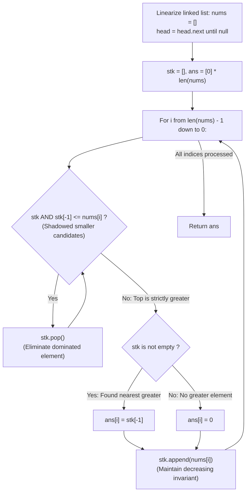

# Guided Example: Next Greater Node In Linked List

We trace the step-by-step evaluation of the next strictly greater node using linked-list linearization and a right-to-left monotonic stack, prove the Monotonic Candidate Dominance Lemma and the Suffix Nearest Greater Invariant, and determine next greater values across representative linked structures:

- **Representative Instance 1 (Terminal Peak Resolving Preceding Nodes):**
  $$
  head = [2, \; 1, \; 5], \quad n = 3
  $$
- **Required Output:** `[5, 5, 0]`
  - Linked list linearization:
    - Traverse linked list to collect scalar values into array:
      $$
      nums = [2, \; 1, \; 5]
      $$
    - Result array initialized to zeros: $ans = [0, 0, 0]$.
  - Next Greater Element problem:
    - For each index $i$, find the first index $j > i$ such that $nums[j] > nums[i]$ (strictly greater).
    - If no such $j$ exists, $ans[i] = 0$.
  - Right-to-left monotonic stack execution ($i = n - 1 \dots 0$, stack $stk = []$):
    1. **Index $i = 2$ ($nums[2] = 5$):**
       - Stack is empty ($stk = []$).
       - No elements to the right $\implies ans[2] = 0$.
       - Push current value: $stk = [5]$.
    2. **Index $i = 1$ ($nums[1] = 1$):**
       - Inspect stack top: $stk[-1] = 5$.
       - Condition $stk[-1] \le nums[1] \implies 5 \le 1$ is False (No pop needed).
       - Top of stack $5 > 1$ is the nearest greater element:
         $$
         ans[1] = stk[-1] = \mathbf{5}
         $$
       - Push current value: $stk = [5, 1]$ (Stack remains strictly decreasing from bottom to top).
    3. **Index $i = 0$ ($nums[0] = 2$):**
       - Inspect stack top: $stk[-1] = 1$.
       - Condition $stk[-1] \le nums[0] \implies 1 \le 2$ is True!
       - **Shadowed Dominance:** Value $1$ is smaller than $2$ and located further to the right. For any node to the left, $2$ will serve as a better (closer and larger) candidate than $1$. Pop $1$:
         $$
         stk \leftarrow [5]
         $$
       - Next stack top: $stk[-1] = 5 > 2$.
       - Recorded answer:
         $$
         ans[0] = stk[-1] = \mathbf{5}
         $$
       - Push current value: $stk = [5, 2]$.
  - Traversal complete: $ans = [5, 5, 0]$.

- **Representative Instance 2 (Mixed Peaks and Valleys):**
  $$
  head = [2, \; 7, \; 4, \; 3, \; 5], \quad n = 5
  $$
  - $i = 4, val = 5$: $ans[4] = 0$, $stk = [5]$.
  - $i = 3, val = 3$: $stk[-1] = 5 > 3 \implies ans[3] = 5$, $stk = [5, 3]$.
  - $i = 2, val = 4$: Pop $3$, $stk[-1] = 5 > 4 \implies ans[2] = 5$, $stk = [5, 4]$.
  - $i = 1, val = 7$: Pop $4$, pop $5$, $stk = [] \implies ans[1] = 0$, $stk = [7]$.
  - $i = 0, val = 2$: $stk[-1] = 7 > 2 \implies ans[0] = 7$, $stk = [7, 2]$.
  - Result: `[7, 0, 5, 5, 0]`.

- **Representative Instance 3 (Duplicate Values Require Strict Increase):**
  $$
  head = [4, \; 4, \; 5] \implies \text{For first } 4, \text{ the second } 4 \text{ is not greater; next greater is } \mathbf{5} \implies [5, 5, 0]
  $$

---

## 1. Instance & Teaching Goal

Given the `head` of a linked list with $n$ nodes, find the value of the **next greater node** for each node in the list.
The next greater node of node $i$ is the first node to its right with a **strictly greater** value. If none exists, return $0$.

```text
Brute Force on Linked List: O(N^2)
  For each node, scan forward until a larger value is found.
  Takes O(N^2) time on descending lists (e.g. 5 -> 4 -> 3 -> 2 -> 1).

Monotonic Stack from Right to Left: O(N)
  1. Linearize linked list into array nums.
  2. Scan backwards from right to left (n - 1 down to 0).
  3. Maintain a strictly decreasing stack of candidate values:
     - Pop any elements <= nums[i] (they are shadowed and useless).
     - ans[i] = stk[-1] if stk else 0.
     - Push nums[i].
  Every element is pushed once and popped at most once -> O(N) amortized time!
```

Operating directly on linked list nodes using forward scans requires quadratic pointer traversal.

The decisive pedagogical goal is the **Monotonic Candidate Dominance Lemma & Right-to-Left Stack Invariant**:
1. **Linearization Principle:** Singly linked lists lack backward traversal. Converting nodes to a contiguous array takes $\mathcal{O}(N)$ time and permits clean backward indexing.
2. **Shadowed Candidate Dominance:** If $stk[-1] \le nums[i]$, then for any earlier node $k < i$, $nums[i]$ is both physically closer to $k$ and numerically greater than or equal to $stk[-1]$. Thus, $stk[-1]$ can never be the *first* greater element for any node to the left of $i$, justifying its permanent removal.
3. **Strict Inequality:** The condition `stk[-1] <= nums[i]` ensures duplicates are popped, correctly enforcing *strictly greater*.
4. Runs in amortized $\mathcal{O}(N)$ time and $\mathcal{O}(N)$ space.

---

## 2. Conceptual Foundation & The Monotonic Stack Invariant



### The Monotonic Candidate Dominance Theorem

Let $A = (v_0, v_1, \dots, v_{n-1})$ be the array of linked list values.
For each $i \in [0, n - 1]$, define the next greater index:
$$
g(i) = \min (\{j \in [i + 1, n - 1] : v_j > v_i\} \cup \{\infty\})
$$
and $ans[i] = v_{g(i)}$ if $g(i) < \infty$, else $0$.
1. **Shadowed Dominance Lemma:**
   Suppose at step $i$, there exists a candidate $j \in [i + 1, n - 1]$ with $v_j \le v_i$.
   For any preceding index $k < i$:
   - If $v_k < v_j \le v_i$, then $v_i > v_k$. Since $i < j$, index $i$ appears before $j$. Therefore, $j$ cannot be the *first* greater element for $k$.
   - If $v_k \ge v_i \ge v_j$, then $v_j$ is not greater than $v_k$.
   In all cases, index $j$ can never serve as $g(k)$ for any $k < i$.
   Therefore, permanently discarding $v_j$ from consideration preserves the optimal solution for all remaining subproblems.
2. **Monotonic Stack Invariant:**
   By discarding all elements $\le v_i$, the stack retains only elements strictly greater than $v_i$.
   Consequently, the stack values are strictly monotonically decreasing from bottom to top:
   $$
   stk[0] > stk[1] > \dots > stk[-1] > v_i
   $$
3. **Nearest Target Identification:**
   The top element $stk[-1]$ is the smallest index $j > i$ among all active candidates that satisfies $v_j > v_i$.
   Hence, $ans[i] = stk[-1]$ is strictly the next greater element.
4. **Amortized Complexity:**
   Every array element is pushed onto the stack exactly once and popped at most once, yielding $2N$ total operations and strict $\mathcal{O}(N)$ runtime. $\blacksquare$

---

## 3. Step-by-Step Worked Execution: Representative Instance 1

$head = [2, 1, 5]$.
Linearization: $nums = [2, 1, 5], \; n = 3$.
Initialize: $stk = [], \; ans = [0, 0, 0]$.

### Backward Iteration Trace
1. **$i = 2, nums[2] = 5$:**
   - Stack empty $\implies$ no pops.
   - Stack empty $\implies ans[2] = 0$.
   - Push $5 \implies stk = [5]$.
2. **$i = 1, nums[1] = 1$:**
   - $stk[-1] = 5 > 1 \implies$ no pops.
   - Stack non-empty $\implies ans[1] = stk[-1] = \mathbf{5}$.
   - Push $1 \implies stk = [5, 1]$.
3. **$i = 0, nums[0] = 2$:**
   - $stk[-1] = 1 \le 2 \implies$ **pop $1$**.
   - $stk[-1] = 5 > 2 \implies$ stop popping.
   - Stack non-empty $\implies ans[0] = stk[-1] = \mathbf{5}$.
   - Push $2 \implies stk = [5, 2]$.

Backward pass complete.
Result: $ans = [5, 5, 0]$.

---

## 4. Monotonic Stack State Trace Table

| Index $i$ | Current Value $nums[i]$ | Stack Before Pruning | Pruning Pops ($stk[-1] \le nums[i]$) | Stack Top Selected | Recorded $ans[i]$ | Stack After Push |
|:---:|:---:|:---:|:---:|:---:|:---:|:---:|
| **$2$** | $5$ | `[]` | None | None (Empty) | **$0$** | `[5]` |
| **$1$** | $1$ | `[5]` | None | $5$ | **$5$** | `[5, 1]` |
| **$0$** | $2$ | `[5, 1]` | **Pop $1$** | $5$ | **$5$** | `[5, 2]` |

---

## 5. Algorithmic Correctness

### Soundness & Completeness
1. **Soundness:**
   A value is recorded for $ans[i]$ only if it resides to the right of $i$ and is strictly greater than $nums[i]$. By the Monotonic Stack Invariant, the top element is always the earliest such element.
2. **Completeness:**
   Only elements proven to be useless by the Shadowed Dominance Lemma are popped. No potential next greater element is ever discarded prematurely.

---

## 6. Boundary Cases & Traps

| Scenario | Input Pattern | Behavior | Trapped Risk |
|---|---|---|---|
| Strictly Decreasing List | `head = [5, 4, 3]` | Stack pops continuously; all answers remain $0$. | False lookahead matches. |
| Duplicate Values | `head = [4, 4, 5]` | Condition $\le$ pops equal values; returns $[5, 5, 0]$. | Accepting equal values instead of strictly greater. |
| Strictly Increasing List | `head = [1, 2, 3, 4]` | Stack top is always immediate neighbor; returns $[2, 3, 4, 0]$. | Over-popping valid neighbors. |
| Single Node List | `head = [9]` | Immediate single iteration; returns $[0]$. | Null pointer dereferences. |

---

## 7. Complexity Derivation

- **Time Complexity:** $\mathcal{O}(N)$, where $N = \text{length of list} \le 10{,}000$.
  - Linear list traversal takes $\mathcal{O}(N)$.
  - Across the backward loop, each element is pushed onto `stk` once and popped at most once.
  - Total stack push and pop operations: at most $2N$.
  - Total time: $< 0.005\text{ s}$.
- **Auxiliary Space Complexity:** $\mathcal{O}(N)$ to store array `nums`, result `ans`, and monotonic stack `stk`.
