## Solution

---

### Overview

We start by copying the individual node values in the linked list `head` into an array (let's call it `values`), which is easier to access and makes the problem a bit more intuitive.

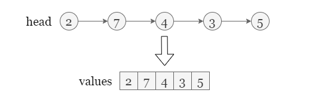

Now the problem becomes, for each value in the array, we need to find the next larger element on its right side.

---

### Approach 1: Monotonic Stack

#### Intuition

Let's start with the most straightforward approach: brute force. That is, to iterate over all elements after $\text{values}[i]$ until finding the first larger element for $\text{values}[i]$. This approach has two nested loops, so it may not pass all test cases.

Instead of using one iteration for each value, can we finish finding all the first larger values in a single traverse? The answer is YES!

Note that we are looking for the **next** greater value. If the value we are currently visiting ($\text{values}[i]$) is larger than the value $\text{values}[smaller]$ on the top of the stack, we can pop `smaller` from the stack to prevent it from being visited again later, and let $\text{values}[i]$ be $\text{values}[smaller]$'s next greater value.

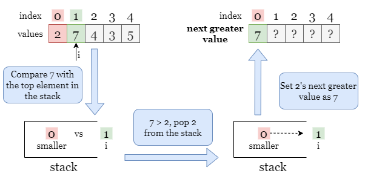

When will the above process stop? When the stack is empty, or $\text{values}[i]$ is not larger than the top element of the stack, we can safely push `i` to stack and move on to the next index $i + 1$. Similarly, if we encounter any value that is larger than $\text{values}[i]$, we can use it to pop `i` from the stack.

Since we want to set the next greater value for each index, we would better push the index `i` instead of the value $\text{values}[i]$ to the stack, so that every time we pop an index from the stack, we can directly update the next greater value for this index. After the iteration over the array stops, indexes left in the stack stand for values that don't have such next greater values, we can just set their next greater values as 0.

Refer to the following slides as an example:

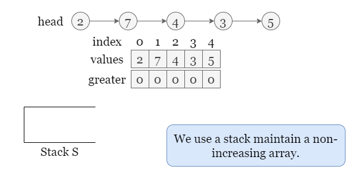

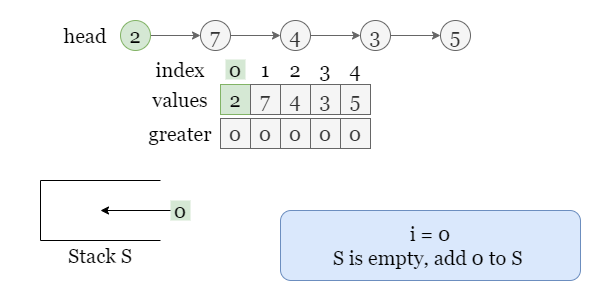

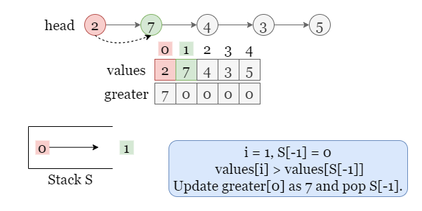

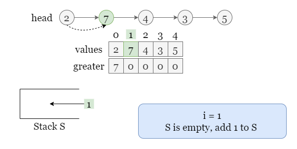

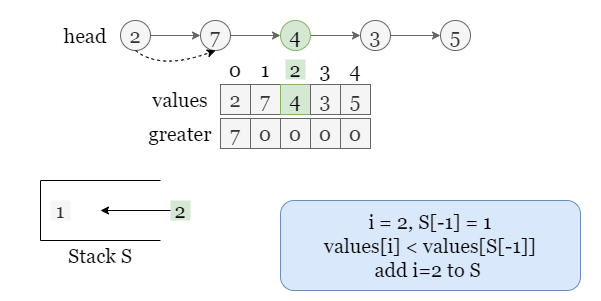

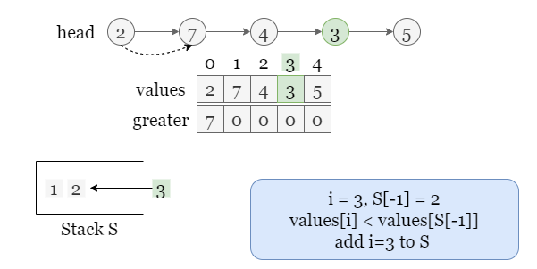

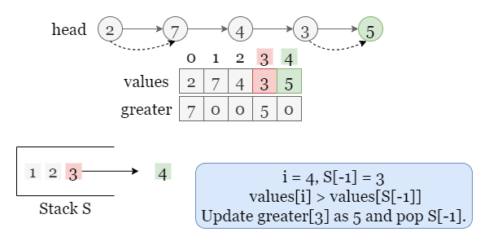

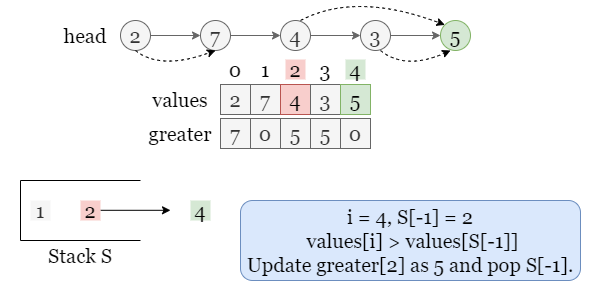

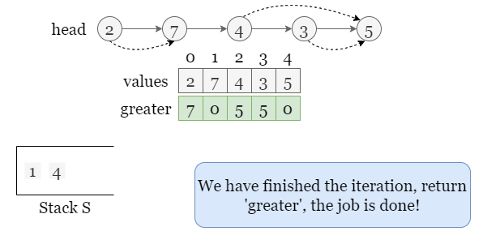

<br>

#### Algorithm

1) Traverse through the linked list `head`, and use an array `values` to store the values of nodes.
2) Initialize an array `answer` with the same size as `values` and an empty stack `stack` to store the previous indexes.
3) Iterate over `values`, before we push each index `i` to `stack`:
- If the value represented by the top element of `stack` (let's call it $\text{values}[smaller]$) is smaller than $\text{values}[i]$, it means that $\text{values}[i]$ is $\text{values}[smaller]$'s larger value. So we pop `smaller` from the `stack`, update $\text{answer}[smaller] = \text{values}[i]$ and repeat this step.
- Otherwise, it means there is no value smaller than $\text{values}[i]$, we add $\text{values}[i]$ to stack and repeat step 3.

#### Implementation

```python
# Definition for singly-linked list.
# class ListNode:
#     def __init__(self, val=0, next=None):
#         self.val = val
#         self.next = next

class Solution:
    def nextLargerNodes(self, head: ListNode) -> List[int]:
        values = []
        while head:
            values.append(head.val)
            head = head.next

        answer = [0] * len(values)
        stack = []

        for i, value in enumerate(values):
            while stack and values[stack[-1]] < value:
                smaller = stack.pop()
                answer[smaller] = value
            stack.append(i)

        return answer
```

#### Complexity Analysis

Let $n$ be the length of the linked list `head`.

* Time complexity: $O(n)$

- We iterate over `head` to record all values in `values`, it takes $O(n)$ time.
- We then iterate over `values` which takes $O(n)$ time.
- During the iteration, there may be multiple operations on the stack, however, each index is pushed to and popped from the stack at most once, so the total time in the worst-case scenario is $O(n)$.
- Therefore, the overall time complexity is $O(n)$.

* Space complexity: $O(n)$

- We used an array `values` to store the values of eery node in `head` which takes $O(n)$ space.
- We used a stack `stack` to maintain a non-increasing sequence, there may be up to $n$ elements in `stack` thus it also takes $O(n)$ space.
- To sum up, the overall space complexity is $O(n)$.

<br/>

---

### Approach 2: Monotonic Stack, 1 Pass

#### Intuition

We can further reduce the number of iterations. In the previous approach, we store node values from the linked list `head` into `values` by the first iteration and find the next greater value in the second iteration. Here we only use one iteration by recording the value from the `head` and updating `stack` in the same iteration step!

Compared to approach 1, the differences are as follows:

- We don't know the size of the linked list `head`, thus we can't initialize an array of equal size. Instead, we start with an empty array `answer` and increment its size during the iteration.
- We don't use the array `values` to store all values from `head`, so we should store both the index and the value of each node to `stack`. Then we can get the value of each node from the index without referring to `values`.

<br>

#### Algorithm

1) Initialize an empty `answer` and an empty stack `stack` to store the previous indexes.
2) Iterate over `head` starting with index $i = 0$, for each current node, and compare the value of `head.val` with the element `[i, val]` on the top of the stack, if `head.val > val`, pop the top element $[\text{top}_{i}, val]$ from the stack and update $answer[\text{top}_{i}] = \text{head.val}$.
3) Push the `[i, head.val]` to the top of `stack`.
4) Add `0` to `answer`, which is the default next larger value for `head.val`.
5) Repeat step 2 until we finish the iteration.

#### Implementation

```python
# Definition for singly-linked list.
# class ListNode:
#     def __init__(self, val=0, next=None):
#         self.val = val
#         self.next = next

class Solution:
    def nextLargerNodes(self, head: ListNode) -> List[int]:
        answer, stack = [], []
        # We use an integer 'cnt' to represent the index.
        cnt = 0

        while head:
        # Set the next greater value of the current value 'head.val' as 0 by default.
            answer.append(0)
            while stack and head.val > stack[-1][1]:
                curr_id, val = stack.pop()
                answer[curr_id] = head.val

            # Add both the index and the value to stack.
            stack.append([cnt, head.val])
            cnt += 1
            head = head.next

        return answer

```

#### Complexity Analysis

Let $n$ be the length of the linked list `head`.

* Time complexity: $O(n)$

- We iterate over `head`. During the iteration, there may be multiple operations on the stack, however, each index `cnt` is pushed to and popped from the stack at most once, so the total time in the worst-case scenario is $O(n)$.
- Therefore, the overall time complexity is $O(n)$.

* Space complexity: $O(n)$

- We only used a stack `stack`, there may be up to $n$ elements in `stack` thus it also takes $O(n)$ space.
- To sum up, the overall space complexity is $O(n)$.

<br/>