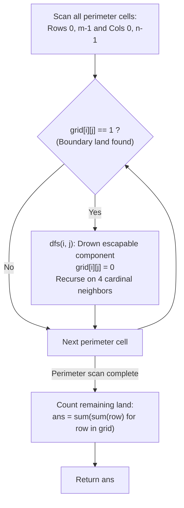

# Guided Example: Number of Enclaves

We trace the step-by-step elimination of boundary-connected land components via multi-source depth-first flood fill, prove the Boundary Reachability Duality Theorem and the Enclave Residue Invariant, and determine the exact count of enclosed land cells across representative grid topologies:

- **Representative Instance 1 (Interior Enclave with Isolated Boundary Cell):**
  $$
  grid = \begin{pmatrix}
  0 & 0 & 0 & 0 \\
  1 & 0 & 1 & 0 \\
  0 & 1 & 1 & 0 \\
  0 & 0 & 0 & 0
  \end{pmatrix}, \quad m = 4, \quad n = 4
  $$
- **Required Output:** `3`
  - Boundary Reachability Duality:
    - A land cell ($1$) can walk off the grid if and only if it belongs to a 4-connected land component that contains at least one cell on the perimeter boundary:
      $$
      \partial \text{Grid} = \{(i, j) : i \in \{0, m-1\} \lor j \in \{0, n-1\}\}
      $$
    - Any land cell that *cannot* walk off the boundary is an **enclave**.
    - **Dual Strategy:** Flood-fill and drown all land cells reachable from the boundary ($1 \to 0$). Count whatever land cells remain.
  - Execution trace:
    1. **Boundary Seed Scan:**
       - Top Row ($i = 0$): all zeroes ($[0, 0, 0, 0]$).
       - Bottom Row ($i = 3$): all zeroes ($[0, 0, 0, 0]$).
       - Left Column ($j = 0$): cell $(1, 0) = 1$ is on the boundary!
       - Right Column ($j = 3$): all zeroes ($[0, 0, 0, 0]$).
    2. **DFS from Boundary Seed $(1, 0)$:**
       - Mutate $grid[1][0] \leftarrow 0$.
       - Check 4 neighbors:
         - Up: $(0, 0) = 0$ (Water).
         - Down: $(2, 0) = 0$ (Water).
         - Left: Out of bounds.
         - Right: $(1, 1) = 0$ (Water).
       - Component consists solely of $(1, 0)$; recursion terminates.
    3. **Grid After Boundary Drowning:**
       $$
       grid = \begin{pmatrix}
       0 & 0 & 0 & 0 \\
       \mathbf{0} & 0 & 1 & 0 \\
       0 & 1 & 1 & 0 \\
       0 & 0 & 0 & 0
       \end{pmatrix}
       $$
    4. **Count Residual Land Enclaves:**
       - Scan entire grid and sum all remaining ones:
         - Row 0: $0$
         - Row 1: $(1, 2) = 1$
         - Row 2: $(2, 1) = 1, \; (2, 2) = 1$
         - Row 3: $0$
       - Total enclosed land cells:
         $$
         1 + 1 + 1 = \mathbf{3}
         $$

- **Representative Instance 2 (Boundary Corridor Drowns Entire Cluster):**
  $$
  grid = \begin{pmatrix}
  0 & 1 & 1 & 0 \\
  0 & 0 & 1 & 0 \\
  0 & 0 & 1 & 0 \\
  0 & 0 & 0 & 0
  \end{pmatrix}
  $$
  - Boundary seed $(0, 1)$ and $(0, 2)$ connect to $(1, 2)$ and $(2, 2)$.
  - DFS drowns $(0, 1) \to (0, 2) \to (1, 2) \to (2, 2) \implies$ all become $0$.
  - Remaining ones: $0$. Output: $\mathbf{0}$.

- **Representative Instance 3 (Isolated Central Land):**
  $$
  grid = \begin{pmatrix}
  0 & 0 & 0 \\
  0 & 1 & 0 \\
  0 & 0 & 0
  \end{pmatrix} \implies \text{No boundary land} \implies \text{Enclave count } = \mathbf{1}
  $$

---

## 1. Instance & Teaching Goal

Given an $m \times n$ binary matrix `grid` (`0` is sea, `1` is land), a move consists of walking from one land cell to an adjacent (4-directional) land cell or off the boundary.
Return the **number of land cells** for which we **cannot walk off the boundary** in any number of moves.

```text
Forward Search (Inefficient):
  Start BFS/DFS from every interior land cell.
  Track whether the search reaches the boundary.
  If it escapes, discard count; if it doesn't, add component size.
  Requires complex state tracking or multi-pass coloring.

Dual Boundary Drowning (Optimal O(M * N)):
  Notice: Any cell that CAN escape touches the boundary!
  - Scan only the 4 perimeter edges.
  - For each boundary land cell, trigger DFS to 'drown' its entire component (set grid[x][y] = 0).
  - After erasing all escapable land, every remaining 1 is guaranteed to be an ENCLAVE!
  - Final answer is simply: sum of all remaining cells in grid!
```

Searching from interior cells requires maintaining visited states and undoing component counts if any branch touches an edge.

The decisive pedagogical goal is the **Boundary Reachability Duality & In-Place Flood-Fill Elimination Invariant**:
1. **Duality Theorem:** The set of land cells that *cannot* walk off the boundary is the exact complement of the union of all connected components intersecting the grid perimeter.
2. **In-Place Eradication:** Mutating $grid[i][j] \leftarrow 0$ during the boundary DFS acts as both a visited marker and permanent removal of non-enclave land, requiring zero auxiliary visited arrays.
3. **Residual Counting:** After boundary flood-filling, a simple nested sum $\sum \sum grid[i][j]$ returns the exact count of enclave cells.
4. Linear time $\mathcal{O}(m \cdot n)$ with $\mathcal{O}(m \cdot n)$ recursion stack.

---

## 2. Conceptual Foundation & The Flood-Fill Invariant



### The Boundary Reachability Duality Theorem

Let $G = (V, E)$ be the grid graph where $V = \{(r, c) : 0 \le r < m, \; 0 \le c < n\}$ and edges connect 4-adjacent cells.
Let $L = \{(r, c) \in V : grid[r][c] = 1\}$ be the set of land cells.
1. **Escape Path Definition:**
   A cell $u \in L$ can walk off the boundary if and only if there exists a path $(u = v_1, v_2, \dots, v_k)$ in the subgraph induced by $L$ such that $v_k \in \partial V$, where the boundary is:
   $$
   \partial V = \{(r, c) \in V : r \in \{0, m-1\} \lor c \in \{0, n-1\}\}
   $$
2. **Connected Component Partition:**
   The induced subgraph $L$ partitions into disjoint connected components $C_1, C_2, \dots, C_p$.
   A cell $u \in C_a$ can escape if and only if component $C_a$ contains at least one boundary cell:
   $$
   \text{Escapable}(C_a) \iff C_a \cap \partial V \ne \emptyset
   $$
3. **Dual Elimination Theorem:**
   The set of enclave cells is the complement:
   $$
   \text{Enclaves} = \bigcup \{C_a : C_a \cap \partial V = \emptyset\}
   $$
   Initiating a traversal from every seed in $L \cap \partial V$ visits and erases $\bigcup \{C_a : C_a \cap \partial V \ne \emptyset\}$.
4. **Residue Equality:**
   After the boundary traversals complete, every cell remaining with value $1$ belongs to a component with $C_a \cap \partial V = \emptyset$.
   Therefore, $\sum_{r=0}^{m-1} \sum_{c=0}^{n-1} grid[r][c] = |\text{Enclaves}|$. $\blacksquare$

---

## 3. Step-by-Step Worked Execution: Representative Instance 1

$grid = \begin{pmatrix} 0 & 0 & 0 & 0 \\ 1 & 0 & 1 & 0 \\ 0 & 1 & 1 & 0 \\ 0 & 0 & 0 & 0 \end{pmatrix}, \; m = 4, \; n = 4$.

### Phase 1: Perimeter Flood-Fill
1. **Perimeter coordinates:**
   - Top/Bottom rows: $(0, 0..3)$ and $(3, 0..3)$ are all $0$.
   - Left/Right columns: $(0..3, 0)$ and $(0..3, 3)$.
2. **Seed found at $(1, 0)$ ($grid[1][0] = 1$):**
   - Call `dfs(1, 0)`:
     - $grid[1][0] \leftarrow 0$.
     - Explore 4 neighbors:
       - Up $(0, 0)$: value $0$.
       - Down $(2, 0)$: value $0$.
       - Left: out of bounds.
       - Right $(1, 1)$: value $0$.
     - DFS returns.
3. **All other perimeter cells are $0$.**

### Phase 2: Counting Enclave Residue
- Row 0: `[0, 0, 0, 0]` $\implies$ sum = $0$.
- Row 1: `[0, 0, 1, 0]` $\implies$ sum = $1$.
- Row 2: `[0, 1, 1, 0]` $\implies$ sum = $2$.
- Row 3: `[0, 0, 0, 0]` $\implies$ sum = $0$.

Total: $0 + 1 + 2 + 0 = \mathbf{3}$.

---

## 4. Grid Mutation and Component State Table

| Cell Coordinate $(r, c)$ | Initial Value | Touches Boundary? | Connected to Boundary? | State After Phase 1 | Final Contribution |
|:---:|:---:|:---:|:---:|:---:|:---:|
| **$(1, 0)$** | $1$ | **Yes** | **Yes** | **$0$ (Drowned)** | $0$ |
| **$(1, 2)$** | $1$ | No | No | **$1$ (Enclave)** | $1$ |
| **$(2, 1)$** | $1$ | No | No | **$1$ (Enclave)** | $1$ |
| **$(2, 2)$** | $1$ | No | No | **$1$ (Enclave)** | $1$ |
| **All others**| $0$ | — | — | $0$ | $0$ |
| **Total** | — | — | — | — | **$3$ Enclaves** |

---

## 5. Algorithmic Correctness

### Soundness & Completeness
1. **Soundness:**
   Every cell erased during Phase 1 has a proven path of 4-adjacent land cells to the grid perimeter. Thus, no true enclave cell is ever mutated to 0.
2. **Completeness:**
   Every boundary land cell is used as a seed for complete connected-component exploration. Any land cell capable of escaping is reached and erased, ensuring that no escapable cell is mistakenly counted in Phase 2.

---

## 6. Boundary Cases & Traps

| Scenario | Input Pattern | Behavior | Trapped Risk |
|---|---|---|---|
| Diagonal Contact Only | Land touches boundary diagonally | 4-directional search ignores diagonals; correctly counts as enclave. | Treating diagonals as connected moves. |
| Entire Grid Land | All cells are `1` | Perimeter seeds drown all cells; returns $0$. | Infinite recursion or double counting. |
| All Sea Grid | All cells are `0` | Perimeter seeds find nothing; sum returns $0$. | Edge case bounds errors. |
| Single Cell Grid | `grid = [[1]]` | Cell is simultaneously on all 4 boundaries; drowns to $0$; returns $0$. | Out of bounds on $m = 1, n = 1$. |

---

## 7. Complexity Derivation

- **Time Complexity:** $\mathcal{O}(m \cdot n)$, where $m \le 500, n \le 500$.
  - Perimeter initialization checks $2(m + n)$ cells.
  - Each land cell is visited at most once during DFS (it is set to $0$ immediately upon entry).
  - The final summation passes over all $m \times n$ cells once.
  - Total operations: $\le 3 \cdot m \cdot n \le 7.5 \times 10^5 \implies < 0.03\text{ s}$.
- **Auxiliary Space Complexity:** $\mathcal{O}(m \cdot n)$ in the worst case for the DFS recursion stack when the grid forms a winding serpentine path.
