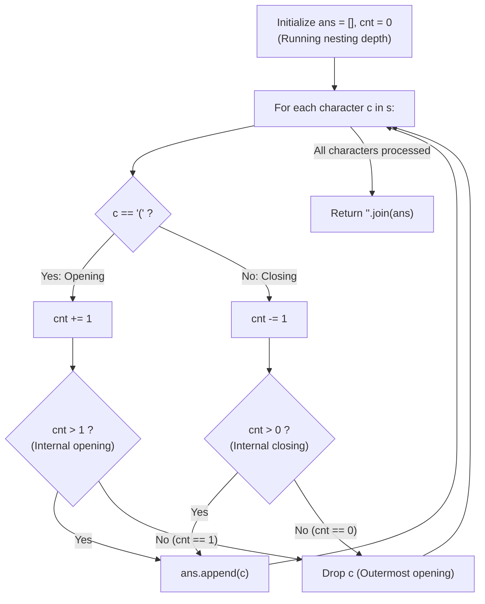

# Guided Example: Remove Outermost Parentheses

We trace the step-by-step filtering of outermost parentheses using Dyck path height profiling, prove the Primitive Decomposition Boundary Theorem and the Streaming Depth Invariant, and determine stripped expressions across representative parentheses strings:

- **Representative Instance 1 (Two Adjacent Nested Primitive Components):**
  $$
  s = \text{"(()())(())"}, \quad |s| = 10
  $$
- **Required Output:** `"()()()"`
  - Primitive decomposition definition:
    - Any valid parentheses string $s$ factors uniquely into primitive blocks $s = P_1 + P_2 + \dots + P_k$.
    - For $s = \text{"(()())(())"}$:
      - First primitive: $P_1 = \text{"(()())"}$, whose interior is $\text{"()()"}$.
      - Second primitive: $P_2 = \text{"(())"}$, whose interior is $\text{"()"}$.
    - Stripping the outermost pair of each primitive produces:
      $$
      \text{"()()"} + \text{"()"} = \mathbf{"()()()"}
      $$
  - Streaming depth filtering invariant:
    - Maintain running nesting depth $cnt$ initialized to 0.
    - For $c = \text{'('}$:
      - Increment depth: $cnt \leftarrow cnt + 1$.
      - If $cnt > 1$: internal opening parenthesis (depth $\ge 2$). Append to `ans`.
      - If $cnt == 1$: outermost boundary opening ($0 \to 1$). **Drop it.**
    - For $c = \text{')'}$:
      - Decrement depth: $cnt \leftarrow cnt - 1$.
      - If $cnt > 0$: internal closing parenthesis (depth remains $\ge 1$). Append to `ans`.
      - If $cnt == 0$: outermost boundary closing ($1 \to 0$). **Drop it.**
  - Step-by-step character traversal:
    1. **$i = 0, c = \text{'('}$:** $cnt \leftarrow 0 + 1 = 1$. Condition $cnt > 1$ False $\implies$ drop $s[0]$.
    2. **$i = 1, c = \text{'('}$:** $cnt \leftarrow 1 + 1 = 2$. $cnt > 1$ True $\implies$ append `'('`.
    3. **$i = 2, c = \text{')'}$:** $cnt \leftarrow 2 - 1 = 1$. $cnt > 0$ True $\implies$ append `')'`.
    4. **$i = 3, c = \text{'('}$:** $cnt \leftarrow 1 + 1 = 2$. $cnt > 1$ True $\implies$ append `'('`.
    5. **$i = 4, c = \text{')'}$:** $cnt \leftarrow 2 - 1 = 1$. $cnt > 0$ True $\implies$ append `')'`.
    6. **$i = 5, c = \text{')'}$:** $cnt \leftarrow 1 - 1 = 0$. Condition $cnt > 0$ False $\implies$ drop $s[5]$ ($P_1$ concludes).
    7. **$i = 6, c = \text{'('}$:** $cnt \leftarrow 0 + 1 = 1$. Condition $cnt > 1$ False $\implies$ drop $s[6]$ ($P_2$ begins).
    8. **$i = 7, c = \text{'('}$:** $cnt \leftarrow 1 + 1 = 2$. $cnt > 1$ True $\implies$ append `'('`.
    9. **$i = 8, c = \text{')'}$:** $cnt \leftarrow 2 - 1 = 1$. $cnt > 0$ True $\implies$ append `')'`.
    10. **$i = 9, c = \text{')'}$:** $cnt \leftarrow 1 - 1 = 0$. Condition $cnt > 0$ False $\implies$ drop $s[9]$ ($P_2$ concludes).
  - Emitted sequence: `['(', ')', '(', ')', '(', ')']`.
  - Joining characters produces: $\mathbf{"()()()"}$.

- **Representative Instance 2 (Pure Minimal Primitives):**
  $$
  s = \text{"()()"} \implies P_1 = \text{"()"}, P_2 = \text{"()"} \implies \text{Empty interior for both} \implies \mathbf{""}
  $$

- **Representative Instance 3 (Deep Single Primitive):**
  $$
  s = \text{"(((())))"} \implies \text{Removes only first and last parentheses} \implies \mathbf{"((()))"}
  $$

---

## 1. Instance & Teaching Goal

Given a valid parentheses string $s$, consider its primitive decomposition $s = P_1 + P_2 + \dots + P_k$.
Return $s$ after removing the outermost parentheses of every primitive component $P_i$.

```text
The Multi-Pass Splitting Temptation:
  1. Scan string to find indices where nesting depth == 0.
  2. Slice each primitive substring P_i.
  3. Strip first and last character of each substring: P_i[1:-1].
  4. Concatenate all slices together.
  Causes repeated memory allocations and string copying!

Single-Pass Streaming Depth Invariant:
  Track the nesting depth cnt directly during one forward scan:
  - If c == '(':
      cnt += 1
      if cnt > 1: keep '('   (Only copy if already inside a primitive!)
  - If c == ')':
      cnt -= 1
      if cnt > 0: keep ')'   (Only copy if still inside a primitive!)
  Zero slicing, zero substring allocations, strict O(N) time!
```

Splitting and copying slices creates unnecessary intermediate string allocations.

The decisive pedagogical goal is the **Dyck Path Height Profile & Streaming Depth Invariant**:
1. **Dyck Boundary Identification:** In any primitive block, the outermost opening parenthesis corresponds to the height step $0 \to 1$, and the outermost closing parenthesis corresponds to the height step $1 \to 0$.
2. **Streaming Filter Invariant:**
   - An opening parenthesis is retained if and only if the updated depth is strictly greater than 1 ($cnt > 1$).
   - A closing parenthesis is retained if and only if the updated depth is strictly greater than 0 ($cnt > 0$).
3. **Concatenation Elimination:** Appending retained characters to a list and performing a single `''.join()` executes in $\mathcal{O}(N)$ time and $\mathcal{O}(N)$ space.

---

## 2. Conceptual Foundation & The Streaming Depth Invariant



### The Primitive Decomposition Boundary Theorem

Let $s$ be a valid parentheses string of length $n$.
1. **Dyck Path Height Formulation:**
   Define the height function $h: \{0, 1, \dots, n\} \to \mathbb{Z}_{\ge 0}$ by $h(0) = 0$ and:
   $$
   h(i) = h(i - 1) + \begin{cases} +1 & \text{if } s[i-1] = \text{'('} \\ -1 & \text{if } s[i-1] = \text{')'} \end{cases}
   $$
   Because $s$ is valid, $h(i) \ge 0$ for all $i$, and $h(n) = 0$.
2. **Primitive Factorization Endpoints:**
   Let $0 = t_0 < t_1 < \dots < t_k = n$ be the indices where $h(t_m) = 0$.
   The substrings $P_m = s[t_{m-1} \dots t_m - 1]$ are precisely the primitive components of $s$.
   For each primitive $P_m$:
   - The opening boundary is at index $t_{m-1}$: $s[t_{m-1}] = \text{'('}$ where height increases from $0$ to $1$.
   - The closing boundary is at index $t_m - 1$: $s[t_m - 1] = \text{')'}$ where height decreases from $1$ to $0$.
   - All intermediate characters $j \in [t_{m-1} + 1, t_m - 2]$ satisfy $h(j) \ge 1$ and $h(j + 1) \ge 1$.
3. **Decision Predicate Soundness:**
   - When processing `'('`: The height increases $h \leftarrow h + 1$. The character is internal to $P_m$ iff the new height $h \ge 2 \iff h > 1$.
   - When processing `')'`: The height decreases $h \leftarrow h - 1$. The character is internal to $P_m$ iff the new height $h \ge 1 \iff h > 0$.
   Therefore, the filter accepts all characters belonging to the interiors of $P_1, \dots, P_k$ and excludes precisely their outermost boundaries. $\blacksquare$

---

## 3. Step-by-Step Worked Execution: Representative Instance 1

$s = \text{"(()())(())"}, \; n = 10$.
Initialize: $ans = [], \; cnt = 0$.

### Character-by-Character Trace
- $i = 0, c = \text{'('}$: $cnt \leftarrow 1$. Condition $cnt > 1$ False $\implies$ drop.
- $i = 1, c = \text{'('}$: $cnt \leftarrow 2$. Condition $cnt > 1$ True $\implies ans = [\text{'('}]$.
- $i = 2, c = \text{')'}$: $cnt \leftarrow 1$. Condition $cnt > 0$ True $\implies ans = [\text{'('}, \text{')'}]$.
- $i = 3, c = \text{'('}$: $cnt \leftarrow 2$. Condition $cnt > 1$ True $\implies ans = [\text{'('}, \text{')'}, \text{'('}]$.
- $i = 4, c = \text{')'}$: $cnt \leftarrow 1$. Condition $cnt > 0$ True $\implies ans = [\text{'('}, \text{')'}, \text{'('}, \text{')'}]$.
- $i = 5, c = \text{')'}$: $cnt \leftarrow 0$. Condition $cnt > 0$ False $\implies$ drop. ($P_1$ finished).
- $i = 6, c = \text{'('}$: $cnt \leftarrow 1$. Condition $cnt > 1$ False $\implies$ drop. ($P_2$ begins).
- $i = 7, c = \text{'('}$: $cnt \leftarrow 2$. Condition $cnt > 1$ True $\implies$ append `'('`.
- $i = 8, c = \text{')'}$: $cnt \leftarrow 1$. Condition $cnt > 0$ True $\implies$ append `')'`.
- $i = 9, c = \text{')'}$: $cnt \leftarrow 0$. Condition $cnt > 0$ False $\implies$ drop. ($P_2$ finished).

Final string: `"".join(ans)` $\implies \mathbf{"()()()"}$.

---

## 4. Dyck Depth State Trace Table

| Index $i$ | Character $c$ | Previous Depth $cnt_{\text{prev}}$ | New Depth $cnt$ | Threshold Condition | Decision | Appended Character |
|:---:|:---:|:---:|:---:|:---:|:---:|:---:|
| **$0$** | `'('` | $0$ | $1$ | $cnt > 1$ (False) | **Drop (Outer Open)** | — |
| **$1$** | `'('` | $1$ | $2$ | $cnt > 1$ (True) | Keep | `'('` |
| **$2$** | `')'` | $2$ | $1$ | $cnt > 0$ (True) | Keep | `')'` |
| **$3$** | `'('` | $1$ | $2$ | $cnt > 1$ (True) | Keep | `'('` |
| **$4$** | `')'` | $2$ | $1$ | $cnt > 0$ (True) | Keep | `')'` |
| **$5$** | `')'` | $1$ | $0$ | $cnt > 0$ (False) | **Drop (Outer Close)** | — |
| **$6$** | `'('` | $0$ | $1$ | $cnt > 1$ (False) | **Drop (Outer Open)** | — |
| **$7$** | `'('` | $1$ | $2$ | $cnt > 1$ (True) | Keep | `'('` |
| **$8$** | `')'` | $2$ | $1$ | $cnt > 0$ (True) | Keep | `')'` |
| **$9$** | `')'` | $1$ | $0$ | $cnt > 0$ (False) | **Drop (Outer Close)** | — |

---

## 5. Algorithmic Correctness

### Soundness & Completeness
1. **Soundness:**
   Every retained character has proven height strictly greater than 0 on both its left and right boundaries, meaning it lies strictly inside a primitive block. Outermost boundary parentheses are unconditionally eliminated.
2. **Completeness:**
   Every interior character of every primitive component satisfies $cnt > 1$ for `'('` and $cnt > 0$ for `')'`. No valid internal parenthesis can be skipped.

---

## 6. Boundary Cases & Traps

| Scenario | Input Pattern | Behavior | Trapped Risk |
|---|---|---|---|
| Single Minimal Primitive | `s = "()"` | $cnt$ reaches $1$ then $0$; both characters dropped; returns `""`. | Emitting boundary elements. |
| Nested Parentheses Chain | `s = "(((())))"` | Drops index $0$ and index $7$; returns `"((()))"`. | Over-pruning internal layers. |
| Repeated Minimal Primitives | `s = "()()()()"` | All characters are outer boundaries; returns `""`. | Memory allocation on empty string. |
| Complex Mixed Depths | `s = "()(())((()))"` | Correctly strips each component; returns `"()(())"`. | Mixed before/after index convention errors. |

---

## 7. Complexity Derivation

- **Time Complexity:** $\mathcal{O}(N)$, where $N = \text{len}(s) \le 10^5$.
  - Exactly one pass over the string $s$.
  - $\mathcal{O}(1)$ integer updates and list appends per character.
  - Final `"".join(ans)` runs in $\mathcal{O}(N)$ linear time.
  - Total time: $< 0.005\text{ s}$.
- **Auxiliary Space Complexity:** $\mathcal{O}(N)$ auxiliary memory to store the list `ans` of retained characters before joining.
