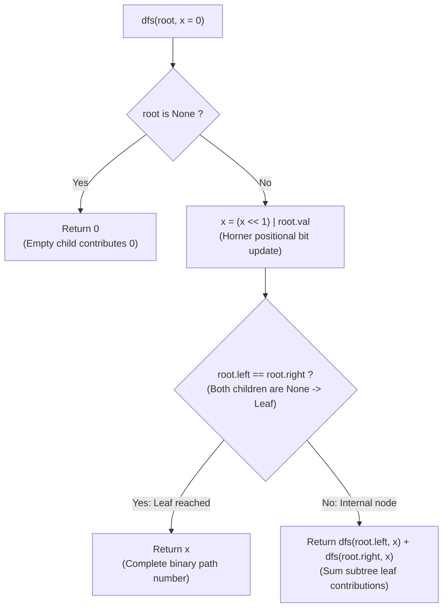

# Guided Example: Sum of Root To Leaf Binary Numbers

We trace the step-by-step depth-first traversal and Horner binary shift accumulation along root-to-leaf paths, prove the Positional Path Recurrence Theorem and the Leaf Path Conservation Invariant, and determine total path sums across representative binary trees:

- **Representative Instance 1 (Perfect Binary Tree with Four Leaves):**
  $$
  root = [1, \; 0, \; 1, \; 0, \; 1, \; 0, \; 1], \quad \text{Height } = 2
  $$
- **Required Output:** `22`
  - Tree path structure:
    - Root: Node $1$ (depth 0).
    - Level 1: Left child $0$, Right child $1$.
    - Level 2 (Leaves):
      - Path 1: $1 \to 0 \to 0 \implies 100_2 = \mathbf{4}$.
      - Path 2: $1 \to 0 \to 1 \implies 101_2 = \mathbf{5}$.
      - Path 3: $1 \to 1 \to 0 \implies 110_2 = \mathbf{6}$.
      - Path 4: $1 \to 1 \to 1 \implies 111_2 = \mathbf{7}$.
    - Expected total sum:
      $$
      4 + 5 + 6 + 7 = \mathbf{22}
      $$
  - Horner shift recurrence ($x_{\text{child}} = (x_{\text{parent}} \ll 1) \mid v$):
    1. **Root Node ($val = 1, x_{\text{in}} = 0$):**
       - $x \leftarrow (0 \ll 1) \mid 1 = \mathbf{1}$.
       - Not a leaf ($root.left \ne root.right$).
       - Recurse on left and right subtrees.
    2. **Left Subtree of Root ($val = 0, x_{\text{in}} = 1$):**
       - $x \leftarrow (1 \ll 1) \mid 0 = \mathbf{2}$ ($10_2$).
       - Recurse left child ($val = 0$):
         - $x \leftarrow (2 \ll 1) \mid 0 = \mathbf{4}$ ($100_2$).
         - Leaf node reached! Return $4$.
       - Recurse right child ($val = 1$):
         - $x \leftarrow (2 \ll 1) \mid 1 = \mathbf{5}$ ($101_2$).
         - Leaf node reached! Return $5$.
       - Subtree sum: $4 + 5 = \mathbf{9}$.
    3. **Right Subtree of Root ($val = 1, x_{\text{in}} = 1$):**
       - $x \leftarrow (1 \ll 1) \mid 1 = \mathbf{3}$ ($11_2$).
       - Recurse left child ($val = 0$):
         - $x \leftarrow (3 \ll 1) \mid 0 = \mathbf{6}$ ($110_2$).
         - Leaf node reached! Return $6$.
       - Recurse right child ($val = 1$):
         - $x \leftarrow (3 \ll 1) \mid 1 = \mathbf{7}$ ($111_2$).
         - Leaf node reached! Return $7$.
       - Subtree sum: $6 + 7 = \mathbf{13}$.
    4. **Global Root Combination:**
       $$
       \text{Total Sum} = 9 + 13 = \mathbf{22}
       $$

- **Representative Instance 2 (Single Zero Node):**
  $$
  root = [0] \implies x = (0 \ll 1) \mid 0 = 0 \implies \text{Leaf returns } \mathbf{0}
  $$

- **Representative Instance 3 (Single Left Child / Asymmetric Path):**
  $$
  root = [1, \; 1] \implies 1 \to 1 \implies 11_2 = \mathbf{3}
  $$

---

## 1. Instance & Teaching Goal

Given the `root` of a binary tree where each node holds `0` or `1`, each root-to-leaf path represents a binary number starting with the most significant bit.
Return the **sum of all numbers** represented by root-to-leaf paths.

```text
The Path Collection Trap:
  Collecting all paths as strings and parsing them:
    ["100", "101", "110", "111"] -> [4, 5, 6, 7] -> sum = 22
  Creates unnecessary string allocations, list buffers, and multi-pass conversions.

Horner's Shift-and-Add Invariant:
  Maintain running integer value x during DFS:
    x = (x << 1) | root.val
  - If root is None: return 0.
  - If root is a LEAF (root.left == root.right): return x.
  - Otherwise: return dfs(root.left, x) + dfs(root.right, x).
  Operates purely on scalar registers with zero auxiliary allocations!
```

Checking whether a node is a leaf using `not root.left and not root.right` can be cleanly expressed as `root.left == root.right` in Python (both are `None`).

The decisive pedagogical goal is the **Positional Path Recurrence & Leaf Path Conservation Invariant**:
1. **Horner's Positional Shift:** When descending from depth $d$ to $d+1$, the existing prefix shifts left by 1 bit ($x \ll 1$), and the current node's bit is placed into the units position using bitwise OR (`| root.val`).
2. **Leaf Boundary Predicate:** A path concludes if and only if both children are null (`root.left == root.right == None`). Returning $x$ immediately at leaves prevents treating intermediate single-child paths as finished numbers.
3. **Null Branch Neutrality:** If an internal node has only one child, the missing child returns $0$ without distorting the sum.
4. Completes in single-pass linear time $\mathcal{O}(N)$ and $\mathcal{O}(H)$ call stack space.

---

## 2. Conceptual Foundation & The Horner Path Invariant



### The Positional Path Recurrence Theorem

Let $T$ be a binary tree with node values $v \in \{0, 1\}$.
1. **Binary Path Value Definition:**
   Let $(u_0, u_1, \dots, u_k)$ be the sequence of nodes along a root-to-leaf path, where $u_0 = root$.
   The integer value represented by this path is:
   $$
   V(u_k) = \sum_{j=0}^k u_j.val \cdot 2^{k-j}
   $$
2. **Horner's Shift Recurrence:**
   The prefix values satisfy:
   $$
   x_0 = u_0.val, \quad x_m = 2 \cdot x_{m-1} + u_m.val = (x_{m-1} \ll 1) \mid u_m.val
   $$
   By induction, $x_k = V(u_k)$.
3. **Leaf Sum Conservation Invariant:**
   Let $\mathcal{L}(u)$ denote the set of all leaves in the subtree rooted at $u$.
   Define the function:
   $$
   S(u, x) = \sum_{L \in \mathcal{L}(u)} V_{\text{from\_root}}(L)
   $$
   - If $u = \text{None}$: $\mathcal{L}(u) = \emptyset \implies S(\text{None}, x) = 0$.
   - If $u$ is a leaf: $\mathcal{L}(u) = \{u\} \implies S(u, x) = x_u$.
   - If $u$ is internal: $\mathcal{L}(u) = \mathcal{L}(u.\text{left}) \cup \mathcal{L}(u.\text{right})$ (disjoint union).
     $$
     S(u, x) = S(u.\text{left}, x_u) + S(u.\text{right}, x_u)
     $$
4. **Global Root Soundness:**
   Invoking $S(root, 0)$ evaluates the exact sum $\sum_{L \in \mathcal{L}(root)} V(L)$ across all leaves in the binary tree. $\blacksquare$

---

## 3. Step-by-Step Worked Execution: Representative Instance 1

$root = [1, 0, 1, 0, 1, 0, 1]$.
Call: `dfs(root, 0)`.

### DFS Call Tree Trace
1. **Node $1$ (Root):**
   - $x \leftarrow (0 \ll 1) \mid 1 = 1$.
   - Internal node $\implies$ recurse left and right with $x = 1$.
2. **Left Child of Root ($val = 0$):**
   - $x \leftarrow (1 \ll 1) \mid 0 = 2$.
   - **Sub-child Left ($val = 0$):**
     - $x \leftarrow (2 \ll 1) \mid 0 = 4$.
     - Both children `None` $\implies$ Leaf! Return **$4$**.
   - **Sub-child Right ($val = 1$):**
     - $x \leftarrow (2 \ll 1) \mid 1 = 5$.
     - Both children `None` $\implies$ Leaf! Return **$5$**.
   - Left branch total: $4 + 5 = \mathbf{9}$.
3. **Right Child of Root ($val = 1$):**
   - $x \leftarrow (1 \ll 1) \mid 1 = 3$.
   - **Sub-child Left ($val = 0$):**
     - $x \leftarrow (3 \ll 1) \mid 0 = 6$.
     - Both children `None` $\implies$ Leaf! Return **$6$**.
   - **Sub-child Right ($val = 1$):**
     - $x \leftarrow (3 \ll 1) \mid 1 = 7$.
     - Both children `None` $\implies$ Leaf! Return **$7$**.
   - Right branch total: $6 + 7 = \mathbf{13}$.
4. **Root Sum:**
   $$
   9 + 13 = \mathbf{22}
   $$

---

## 4. Path Traversal and Leaf Value Trace Table

| Leaf Node Identifier | Path from Root | Binary Sequence | Decimal Evaluation Formula | Decimal Value | Subtree Group |
|:---:|:---:|:---:|:---:|:---:|:---:|
| **Leaf A** | Root $\to$ Left $\to$ Left | $1 \to 0 \to 0$ | $1 \cdot 4 + 0 \cdot 2 + 0 \cdot 1$ | **$4$** | Left Subtree |
| **Leaf B** | Root $\to$ Left $\to$ Right | $1 \to 0 \to 1$ | $1 \cdot 4 + 0 \cdot 2 + 1 \cdot 1$ | **$5$** | Left Subtree |
| **Leaf C** | Root $\to$ Right $\to$ Left | $1 \to 1 \to 0$ | $1 \cdot 4 + 1 \cdot 2 + 0 \cdot 1$ | **$6$** | Right Subtree |
| **Leaf D** | Root $\to$ Right $\to$ Right | $1 \to 1 \to 1$ | $1 \cdot 4 + 1 \cdot 2 + 1 \cdot 1$ | **$7$** | Right Subtree |
| **Total Sum** | — | — | $4 + 5 + 6 + 7$ | **$22$** | Whole Tree |

---

## 5. Algorithmic Correctness

### Soundness & Completeness
1. **Soundness:**
   A value $x$ is returned only when a node is verified to be a leaf (`root.left == root.right == None`). The bit-shift recurrence ensures that $x$ is the exact decimal value of the binary path from the root.
2. **Completeness:**
   Depth-first search visits every node in the binary tree. Because the sum of disjoint leaf sets is associative, summing the return values of left and right children guarantees that all leaves contribute to the final answer.

---

## 6. Boundary Cases & Traps

| Scenario | Input Pattern | Behavior | Trapped Risk |
|---|---|---|---|
| Single Node Tree | `root = [0]` | $x = 0$; leaf check triggers; returns $0$. | Missing single-node base case. |
| Single-Child Branch | `root = [1, 1]` | Left child is leaf ($x = 3$); right child is `None` (returns $0$); sum is $3$. | Counting `None` child as a leaf. |
| All Ones Path | `root = [1, 1, 1]` | Left is $3$, right is $3$; sum is $6$. | Overflow on bit operations. |
| Deep Unbalanced Tree | Skewed line of $1000$ nodes | Recursion depth is $\mathcal{O}(N)$; integer operations remain fast. | Exceeding default recursion limits. |

---

## 7. Complexity Derivation

- **Time Complexity:** $\mathcal{O}(N)$, where $N \le 1000$ is the number of nodes in the binary tree.
  - Every node is visited exactly once.
  - Constant-time bitwise operations `x << 1 | root.val` at each node.
  - Total time: $< 0.001\text{ s}$.
- **Auxiliary Space Complexity:** $\mathcal{O}(H)$, where $H$ is the height of the tree ($H \le N \le 1000$) for the recursion call stack.
