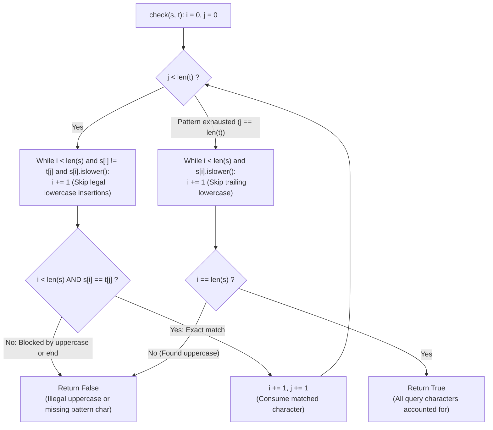

# Guided Example: Camelcase Matching

We trace the step-by-step evaluation of two-pointer constrained subsequence matching, prove the Uppercase Conservation Lemma and the Greedy Earliest Alignment Theorem, and determine pattern validity across representative CamelCase queries:

- **Representative Instance 1 (Queries with Mixed Uppercase Skeletons):**
  $$
  queries = [\text{"FooBar"}, \; \text{"FooBarTest"}, \; \text{"FootBall"}], \quad pattern = \text{"FB"}
  $$
- **Required Output:** `[true, false, true]`
  - CamelCase derivation rule:
    - A query $s$ matches pattern $t$ if and only if $s$ can be formed by inserting **only lowercase letters** into $t$.
    - Equivalent formulation:
      1. $t$ is a subsequence of $s$.
      2. Every character in $s$ that is **not part of the matched subsequence** MUST be lowercase.
      3. No extra uppercase letters may exist anywhere in $s$.
  - Evaluation of queries against $t = \text{"FB"}$:
    1. **Query $s = \text{"FooBar"}$:**
       - Match $t[0] = \text{'F'}$:
         - $s[0] = \text{'F'}$. Match! Advance $i = 1, j = 1$.
       - Match $t[1] = \text{'B'}$:
         - $s[1] = \text{'o'}$: lowercase mismatch $\implies$ skip ($i = 2$).
         - $s[2] = \text{'o'}$: lowercase mismatch $\implies$ skip ($i = 3$).
         - $s[3] = \text{'B'}$: Match! Advance $i = 4, j = 2$ ($t$ fully matched).
       - Check trailing suffix of $s$ ($i = 4 \dots 5$):
         - $s[4] = \text{'a'}$: lowercase $\implies$ skip ($i = 5$).
         - $s[5] = \text{'r'}$: lowercase $\implies$ skip ($i = 6$).
       - Reached end of $s$ with zero leftover uppercase $\implies \mathbf{true}$.
    2. **Query $s = \text{"FooBarTest"}$:**
       - Matches `'F'` at $s[0]$ and `'B'` at $s[3]$.
       - Trailing suffix contains $\text{"Test"}$:
         - $s[6] = \text{'T'}$ is **UPPERCASE**!
         - Uppercase insertion is strictly forbidden $\implies \mathbf{false}$.
    3. **Query $s = \text{"FootBall"}$:**
       - Matches `'F'` at $s[0]$ and `'B'` at $s[4]$.
       - All unconsumed characters (`'o'`, `'o'`, `'t'`, `'a'`, `'l'`, `'l'`) are lowercase.
       - Valid match $\implies \mathbf{true}$.

- **Representative Instance 2 (Extra Uppercase Blocks Early):**
  $$
  queries = [\text{"AbC"}, \; \text{"AbXC"}], \quad pattern = \text{"AbC"}
  $$
  - Query `"AbC"` matches exactly $\implies \mathbf{true}$.
  - Query `"AbXC"`: After `'A'` and `'b'`, encounters `'X'` (uppercase) which does not match `'C'` $\implies \mathbf{false}$.

---

## 1. Instance & Teaching Goal

Given an array of strings `queries` and a string `pattern`, return a boolean array `answer` where `answer[i] = true` if `queries[i]` matches `pattern`.
A query matches `pattern` if lowercase letters can be inserted into `pattern` so that it equals `queries[i]`.

```text
The Pure Subsequence Flaw:
  Testing whether pattern is a subsequence of query:
    "FB" is a subsequence of "FooBarTest" (F...B...T).
  Returning True would be WRONG! 'T' is an unmatchable uppercase letter.

Two-Pointer Lowercase Skip Invariant:
  Pointers i (query s) and j (pattern t):
  - While j < len(t):
      Skip lowercase characters in s:
        while i < len(s) and s[i] != t[j] and s[i].islower(): i += 1
      If i == len(s) or s[i] != t[j]:
        Return False (either exhausted, or hit an illegal uppercase character!)
      Consume both: i += 1, j += 1
  - Skip trailing lowercase characters in s.
  - Return True iff i == len(s).
```

Checking uppercase letter counts alone is insufficient when the pattern contains lowercase letters (e.g., `pattern = "FoBa"`).

The decisive pedagogical goal is the **Constrained Subsequence Alignment & Uppercase Invariant**:
1. **Uppercase Conservation:** Every uppercase letter in the query $s$ must be consumed by an exact match in $t$. Any unconsumed uppercase letter immediately renders the query invalid.
2. **Greedy Earliest Match:** When searching for $t[j]$, skipping lowercase letters is always valid. Matching the earliest occurrence of $t[j]$ maximizes the remaining suffix of $s$ for future pattern characters.
3. **Suffix Cleanliness:** Once all pattern characters are consumed, the remaining suffix of $s$ must consist exclusively of lowercase letters.
4. Completes in linear time $\mathcal{O}(Q \cdot (|s| + |t|))$ and $\mathcal{O}(1)$ auxiliary space.

---

## 2. Conceptual Foundation & The Two-Pointer Invariant



### The Uppercase Conservation & Alignment Theorem

Let $s$ be a query string and $t$ be the pattern.
1. **Formal Derivation Definition:**
   A string $s$ is derivable from $t$ via lowercase insertions if and only if there exists a strictly increasing index mapping $f: \{0, 1, \dots, |t|-1\} \to \{0, 1, \dots, |s|-1\}$ such that:
   - $s[f(j)] = t[j]$ for all $j \in [0, |t|-1]$.
   - For every index $k \notin \text{Im}(f)$, $s[k]$ is a lowercase English letter: $s[k] \in ['a', \dots, 'z']$.
2. **The Uppercase Monomorphism Lemma:**
   Let $U(w)$ be the subsequence of uppercase characters in string $w$.
   If $s$ is derivable from $t$ via lowercase insertions, then $U(s) = U(t)$.
   Any uppercase character in $s$ not matched to an identical uppercase character in $t$ violates derivability.
3. **Greedy Earliest-Match Lemma:**
   Suppose $s$ is derivable from $t$. Let $i_0$ be the smallest index $\ge i$ such that $s[i_0] = t[j]$ and all skipped characters $s[i \dots i_0 - 1]$ are lowercase.
   Matching $t[j]$ at $i_0$ leaves the largest possible remaining suffix $s[i_0 + 1 \dots |s|-1]$ to match the remaining pattern $t[j + 1 \dots |t|-1]$.
   Therefore, the earliest valid match never eliminates any viable completion.
4. **Deterministic Single-Pass Verification:**
   Because the earliest match is optimal, no backtracking is needed. The two-pointer procedure deterministically proves or disproves derivability in $\mathcal{O}(|s| + |t|)$ steps. $\blacksquare$

---

## 3. Step-by-Step Worked Execution: Representative Instance 1

$s = \text{"FooBar"}, \; t = \text{"FB"}$.
$m = 6, \; n = 2$.
Initialize $i = 0, \; j = 0$.

### Character Scan Trace
1. **Match $t[0] = \text{'F'}$ ($j = 0$):**
   - $i = 0: s[0] = \text{'F'}$.
   - Skips: 0. Condition $s[0] == t[0]$ satisfied.
   - Advance: $i \leftarrow 1, \; j \leftarrow 1$.
2. **Match $t[1] = \text{'B'}$ ($j = 1$):**
   - $i = 1: s[1] = \text{'o'}$ (lowercase $\implies i \leftarrow 2$).
   - $i = 2: s[2] = \text{'o'}$ (lowercase $\implies i \leftarrow 3$).
   - $i = 3: s[3] = \text{'B'} == t[1]$.
   - Advance: $i \leftarrow 4, \; j \leftarrow 2$.
3. **Pattern Finished ($j = 2 == n$):**
   - Suffix scan:
     - $i = 4: s[4] = \text{'a'}$ (lowercase $\implies i \leftarrow 5$).
     - $i = 5: s[5] = \text{'r'}$ (lowercase $\implies i \leftarrow 6$).
   - Check completion: $i == 6 == m \implies \mathbf{True}$.

Output for `"FooBar"`: `True`.

---

## 4. Pointer Alignment and Character State Trace Table

| Query Index $i$ | Character $s[i]$ | Pattern Index $j$ | Target $t[j]$ | Character Class | Action / Decision | Resulting $(i, j)$ |
|:---:|:---:|:---:|:---:|:---:|:---:|:---:|
| **$0$** | `'F'` | $0$ | `'F'` | Uppercase | **Exact Match** | $(1, 1)$ |
| **$1$** | `'o'` | $1$ | `'B'` | Lowercase | Skip insertion | $(2, 1)$ |
| **$2$** | `'o'` | $1$ | `'B'` | Lowercase | Skip insertion | $(3, 1)$ |
| **$3$** | `'B'` | $1$ | `'B'` | Uppercase | **Exact Match** | $(4, 2)$ |
| **$4$** | `'a'` | — | — | Lowercase | Skip suffix insertion | $(5, 2)$ |
| **$5$** | `'r'` | — | — | Lowercase | Skip suffix insertion | $(6, 2)$ |
| **Terminal**| End | $2$ | Complete | — | **$i == m \implies \mathbf{True}$** | $(6, 2)$ |

---

## 5. Algorithmic Correctness

### Soundness & Completeness
1. **Soundness:**
   A query is declared `True` only when all pattern characters are matched in sequence and every unconsumed character is verified to be lowercase. No illegal uppercase insertions are permitted.
2. **Completeness:**
   By the Greedy Earliest-Match Lemma, advancing to the first available match preserves all remaining valid alignments. No valid query can be falsely rejected.

---

## 6. Boundary Cases & Traps

| Scenario | Input Pattern | Behavior | Trapped Risk |
|---|---|---|---|
| Unmatched Trailing Uppercase | $s = \text{"FooBarTest"}, t = \text{"FB"}$ | Suffix scan encounters `'T'`; returns `False`. | Treating pattern match as complete without checking suffix. |
| Intervening Uppercase | $s = \text{"ForceFeedBack"}, t = \text{"FB"}$ | Second `'F'` is encountered while expecting `'B'`; returns `False`. | Skipping uppercase characters. |
| Mixed-Case Pattern | $s = \text{"FooBar"}, t = \text{"FoBa"}$ | Matches `'F'`, skips `'o'`, matches `'o'`, matches `'B'`, matches `'a'`; returns `True`. | Assuming pattern only contains uppercase letters. |
| Identical Strings | $s = \text{"AbC"}, t = \text{"AbC"}$ | 1:1 match with zero skips; returns `True`. | Off-by-one pointer bounds. |

---

## 7. Complexity Derivation

- **Time Complexity:** $\mathcal{O}(Q \cdot (|s| + |t|))$, where $Q = \text{len}(queries) \le 100$, $|s| \le 100$, and $|t| \le 100$.
  - For each query, pointers $i$ and $j$ move monotonically forward without backtracking.
  - Number of operations per query is at most $|s| + |t| \le 200$.
  - Total runtime across 100 queries: $\le 2 \times 10^4 \implies < 0.002\text{ s}$.
- **Auxiliary Space Complexity:** $\mathcal{O}(1)$ auxiliary memory; operates in-place using two scalar pointer registers.
