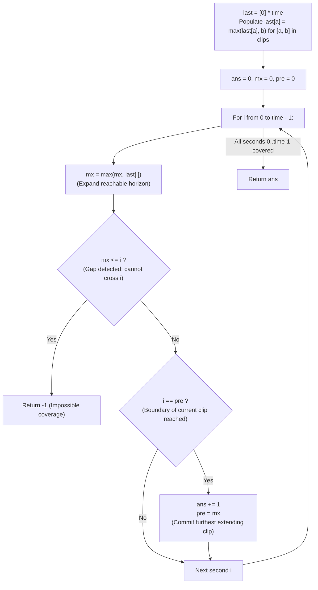

# Guided Example: Video Stitching

We trace the step-by-step greedy interval coverage using maximum reachability projections, prove the Furthest Reach Exchange Lemma and the Jump-Game Horizon Invariant, and determine the minimum clips required to cover the target interval $[0, \text{time}]$ across representative video collections:

- **Representative Instance 1 (Overlapping Multi-Clip Chain):**
  $$
  clips = [[0, 2], [4, 6], [8, 10], [1, 9], [1, 5], [5, 9]], \quad time = 10
  $$
- **Required Output:** `3`
  - Target coverage:
    - Cover the continuous real interval $[0, 10]$ with the minimum number of overlapping clips.
  - Step 1: Compute maximum reach array $last[t]$ for $t \in [0, 9]$:
    - For each start second $a < 10$, record the furthest end second:
      - $last[0] = 2$ (from $[0, 2]$)
      - $last[1] = \max(9, 5) = 9$ (from $[1, 9]$ and $[1, 5]$)
      - $last[4] = 6$ (from $[4, 6]$)
      - $last[5] = 9$ (from $[5, 9]$)
      - $last[8] = 10$ (from $[8, 10]$)
      - All other $t \in \{2, 3, 6, 7, 9\}$ have $last[t] = 0$.
  - Step 2: Greedy jump-game execution ($mx = 0, pre = 0, ans = 0$):
    1. **Second $i = 0$:**
       - Update reach: $mx \leftarrow \max(0, last[0]) = \max(0, 2) = \mathbf{2}$.
       - Gap check: $mx > 0$ (Passes).
       - Boundary reached: $pre == 0 == i$:
         - Commit first clip: $ans \leftarrow 0 + 1 = \mathbf{1}$.
         - Update active horizon: $pre \leftarrow mx = \mathbf{2}$.
    2. **Second $i = 1$:**
       - Update reach: $mx \leftarrow \max(2, last[1]) = \max(2, 9) = \mathbf{9}$.
       - Boundary check: $pre = 2 \ne 1$ (No new clip committed yet).
    3. **Second $i = 2$:**
       - Update reach: $mx \leftarrow \max(9, last[2]) = \max(9, 0) = \mathbf{9}$.
       - Boundary reached: $pre == 2 == i$:
         - Commit second clip: $ans \leftarrow 1 + 1 = \mathbf{2}$.
         - Update active horizon: $pre \leftarrow mx = \mathbf{9}$.
    4. **Seconds $i = 3 \dots 7$:**
       - $mx$ remains $9$. $i < pre = 9$ (Within horizon of clip 2).
    5. **Second $i = 8$:**
       - Update reach: $mx \leftarrow \max(9, last[8]) = \max(9, 10) = \mathbf{10}$.
    6. **Second $i = 9$:**
       - Update reach: $mx \leftarrow \max(10, 0) = 10$.
       - Boundary reached: $pre == 9 == i$:
         - Commit third clip: $ans \leftarrow 2 + 1 = \mathbf{3}$.
         - Update active horizon: $pre \leftarrow mx = \mathbf{10}$.
  - Loop complete ($i = 0 \dots 9$). Full target $[0, 10]$ covered.
  - Total clips selected: $\mathbf{3}$ (e.g. $[0, 2] \cup [1, 9] \cup [8, 10]$).

- **Representative Instance 2 (Unreachable Tail Gap):**
  $$
  clips = [[0, 1], [1, 2]], \quad time = 5
  $$
  - $i = 0: mx = 1, ans = 1, pre = 1$.
  - $i = 1: mx = 2, ans = 2, pre = 2$.
  - $i = 2: mx = \max(2, 0) = 2 \le 2$!
  - **Gap Detected:** At $i = 2$, $mx \le 2$ means no available clip extends past second 2.
  - Return $\mathbf{-1}$.

- **Representative Instance 3 (Single Dominant Clip):**
  $$
  clips = [[0, 5]], \quad time = 5 \implies last[0] = 5 \implies ans = \mathbf{1}
  $$

---

## 1. Instance & Teaching Goal

Given a collection of intervals `clips` where `clips[i] = [start_i, end_i]` and an integer `time`, return the **minimum number of clips** needed to cover $[0, \text{time}]$, or `-1` if impossible.

```text
The O(N log N) Sorting or O(T * N) DP Approach:
  Sorting clips by start time, or filling a 1D DP table DP[t] = min(DP[a] + 1).
  Requires nested loops or explicit sorting.

The Jump-Game Greedy Horizon Invariant (O(N + T)):
  1. Condense all clips into a single max-reach array:
       last[a] = max(last[a], b) for all [a, b] in clips.
  2. Sweep i from 0 to time - 1:
       mx = max(mx, last[i])      (Update furthest reachable frontier)
       if mx <= i: return -1       (Stuck! Cannot bridge interval [i, i + 1])
       if i == pre:                (Reached the end of previous clip's reach)
           ans += 1; pre = mx      (Commit to the clip that reached furthest)
  Achieves optimal O(N + T) linear time with O(T) space!
```

Modeling the problem as an explicit shortest path or sorting-based greedy scan introduces unnecessary complexity.

The decisive pedagogical goal is the **Furthest Reach Exchange Lemma & Jump-Game Horizon Invariant**:
1. **Projection Condensation:** All clips starting at second $a$ can be summarized by their maximal endpoint $\max \{b\}$. Shorter clips starting at $a$ are strictly dominated.
2. **Gap Detection Invariant:** If the furthest reach $mx \le i$, no clip begins on or before $i$ that can reach beyond $i$. The continuum breaks at $i$, proving coverage of $[0, time]$ is impossible.
3. **Lazy Greedy Commitment:** We do not commit to a specific clip when encountering it. Instead, we expand the candidate horizon $mx$, committing to an increment `ans += 1` only when the current coverage boundary `pre` is reached.
4. Linear time $\mathcal{O}(M + T)$ where $M = |clips|$ and $T = time$.

---

## 2. Conceptual Foundation & The Greedy Horizon Invariant



### The Furthest Reach Exchange Theorem

Let $\mathcal{C}$ be a set of intervals covering $[0, T]$, where $T = time$.
1. **Interval Coverage Definition:**
   A sequence of clips $(c_1, c_2, \dots, c_k)$ covers $[0, T]$ if $\bigcup_{j=1}^k [s_j, e_j] \supseteq [0, T]$ and without loss of generality $s_1 \le 0$ and $e_k \ge T$.
2. **The Greedy Exchange Lemma:**
   Suppose a collection of clips has covered $[0, B]$.
   To extend coverage beyond $B$, any valid next clip $c$ must start at some $s_c \le B$.
   Among all candidate clips with $s_c \le B$, choosing the clip that maximizes the endpoint $e_c$ maximizes the newly covered interval $[0, \max e_c]$.
   Any alternative choice $c'$ with $e_{c'} < e_c$ covers a strict subset of $[0, e_c]$. Therefore, replacing $c'$ with $c$ never increases the total number of clips needed.
3. **Horizon Invariant:**
   At each step $i \in [0, T-1]$, $mx = \max_{j \le i} last[j]$ represents the absolute furthest point reachable using clips that start anywhere on or before $i$.
   - If $mx \le i$, no clip can bridge the gap from $i$ to $i + 1$. Coverage is impossible.
   - When the sweep reaches $i = pre$, all points up to $pre$ are covered by the current $ans$ clips. Extending past $pre$ strictly necessitates selecting another clip. Setting $pre \leftarrow mx$ and $ans \leftarrow ans + 1$ commits the optimal furthest extension.
4. **Sufficiency:**
   Completing the loop up to $T - 1$ ensures that $pre \ge T$, guaranteeing complete coverage of $[0, T]$ in the minimum number of clips. $\blacksquare$

---

## 3. Step-by-Step Worked Execution: Representative Instance 1

$clips = [[0, 2], [4, 6], [8, 10], [1, 9], [1, 5], [5, 9]], \; time = 10$.
Populate:
$last = [2, 9, 0, 0, 6, 9, 0, 0, 10, 0]$.
Initialize: $ans = 0, \; mx = 0, \; pre = 0$.

### Sweep Trace ($i = 0 \dots 9$)
- **$i = 0$:**
  - $mx \leftarrow \max(0, last[0]) = 2$.
  - Gap check: $mx = 2 > 0$ (Valid).
  - Boundary: $i == pre$ ($0 == 0$) $\implies ans \leftarrow 1, pre \leftarrow 2$.
- **$i = 1$:**
  - $mx \leftarrow \max(2, last[1]) = \max(2, 9) = 9$.
  - Gap check: $mx = 9 > 1$ (Valid).
  - Boundary: $i = 1 \ne pre = 2$ (No jump).
- **$i = 2$:**
  - $mx \leftarrow \max(9, last[2]) = 9$.
  - Gap check: $mx = 9 > 2$ (Valid).
  - Boundary: $i == pre$ ($2 == 2$) $\implies ans \leftarrow 2, pre \leftarrow 9$.
- **$i = 3 \dots 7$:**
  - $mx$ remains $9$. $i < pre = 9$ (Within horizon).
- **$i = 8$:**
  - $mx \leftarrow \max(9, last[8]) = \max(9, 10) = 10$.
  - Gap check: $mx = 10 > 8$ (Valid).
  - Boundary: $i = 8 \ne pre = 9$.
- **$i = 9$:**
  - $mx \leftarrow \max(10, last[9]) = 10$.
  - Gap check: $mx = 10 > 9$ (Valid).
  - Boundary: $i == pre$ ($9 == 9$) $\implies ans \leftarrow 3, pre \leftarrow 10$.

Sweep terminates. Return $ans = \mathbf{3}$.

---

## 4. Greedy Horizon State Trace Table

| Second $i$ | $last[i]$ | Furthest Reach $mx$ | Gap Check $mx \le i$? | At Boundary $i == pre$? | Clips Committed $ans$ | Next Boundary $pre$ | Active Interval Phase |
|:---:|:---:|:---:|:---:|:---:|:---:|:---:|:---:|
| **$0$** | $2$ | **$2$** | No | **Yes ($0 == 0$)** | **$1$** | **$2$** | Clip 1 committed |
| **$1$** | $9$ | **$9$** | No | No ($1 < 2$) | $1$ | $2$ | Horizon expands to 9 |
| **$2$** | $0$ | **$9$** | No | **Yes ($2 == 2$)** | **$2$** | **$9$** | Clip 2 committed |
| **$3 \dots 7$** | $0$ | **$9$** | No | No ($i < 9$) | $2$ | $9$ | Cruising in horizon |
| **$8$** | $10$ | **$10$** | No | No ($8 < 9$) | $2$ | $9$ | Horizon expands to 10 |
| **$9$** | $0$ | **$10$** | No | **Yes ($9 == 9$)** | **$3$** | **$10$** | Clip 3 committed |
| **Final** | — | **$10$** | — | — | **$3$** | **$10$** | **$[0, 10]$ Covered** |

---

## 5. Algorithmic Correctness

### Soundness & Completeness
1. **Soundness:**
   Whenever $ans$ is incremented, the boundary $pre$ advances to the maximum endpoint reachable from all clips starting on or before $pre$. By the Furthest Reach Exchange Lemma, no other clip selection could cover more territory with the same number of clips.
2. **Completeness:**
   If at any point $mx \le i$, every clip starting on or before $i$ terminates on or before $i$. No clip exists that can cover the half-open interval $(i, i+1]$. Returning $-1$ is mathematically guaranteed to be correct.

---

## 6. Boundary Cases & Traps

| Scenario | Input Pattern | Behavior | Trapped Risk |
|---|---|---|---|
| Initial Gap ($start > 0$) | $clips = [[1, 5]], time = 5$ | At $i = 0$, $mx = 0 \le 0$; returns $-1$. | Assuming coverage starts at 0. |
| Single Clip Sufficiency | $clips = [[0, 5]], time = 5$ | First jump reaches $5$; loop finishes; returns $1$. | Over-counting clips. |
| Mid-Interval Gap | $clips = [[0, 1], [3, 5]], time = 5$ | At $i = 1$, $mx = 1 \le 1$; returns $-1$. | Jumping across gaps. |
| Zero-Length Clips | $clips = [[0, 0], [0, 2]]$ | $last[0]$ takes $\max(0, 2) = 2$; handles seamlessly. | Infinite loops on $[0, 0]$. |

---

## 7. Complexity Derivation

- **Time Complexity:** $\mathcal{O}(M + T)$, where $M = \text{len}(clips) \le 100$ and $T = time \le 100$.
  - One pass to populate $last$ array: $\mathcal{O}(M)$.
  - One linear sweep from $0$ to $T - 1$: $\mathcal{O}(T)$.
  - Total operations: $\le 200 \implies < 0.0005\text{ s}$.
- **Auxiliary Space Complexity:** $\mathcal{O}(T)$ auxiliary memory to store the $last$ array of size $time \le 100$.