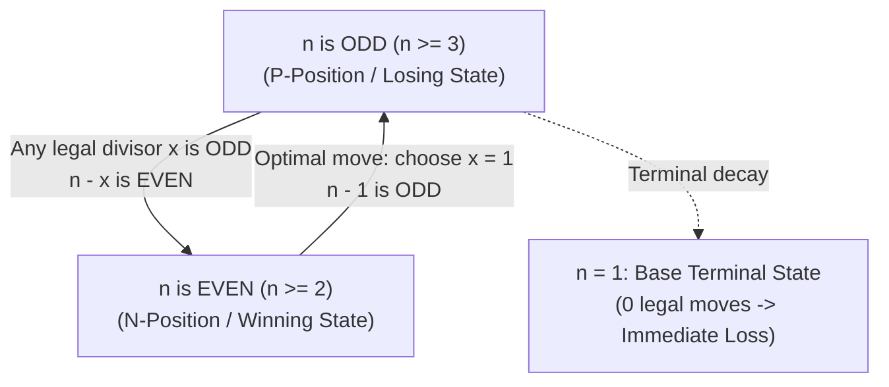

# Guided Example: Divisor Game

We trace the step-by-step game-theoretic analysis of the normal-play subtraction game, prove the Parity Invariant and the Impartial Game N/P-Position Duality Theorem, and determine the optimal winning strategy across representative initial chalkboard numbers:

- **Representative Instance 1 (Minimal Winning State for First Player):**
  $$
  n = 2
  $$
- **Required Output:** `true`
  - Rules of the Divisor Game:
    - Players Alice and Bob take turns (Alice moves first).
    - In each turn with number $n$ on the chalkboard:
      - Choose an integer $x$ such that $0 < x < n$ and $n \bmod x == 0$ (a proper divisor).
      - Replace $n$ with $n - x$.
    - The first player unable to make a move loses.
  - Game trace for $n = 2$:
    1. **Alice's Turn ($n = 2$):**
       - Divisors of $2$ strictly less than $2$: only $x = 1$.
       - Alice chooses $x = 1$.
       - Chalkboard updates: $n \leftarrow 2 - 1 = \mathbf{1}$.
    2. **Bob's Turn ($n = 1$):**
       - Condition $0 < x < 1$ has no integer solutions.
       - Bob has zero legal moves.
       - Bob loses $\implies$ Alice wins! Output: $\mathbf{true}$.

- **Representative Instance 2 (First Non-Trivial Losing State for First Player):**
  $$
  n = 3
  $$
  - Alice's Turn ($n = 3$):
    - Divisors of $3$ strictly less than $3$: only $x = 1$.
    - Alice is forced to choose $x = 1$.
    - Chalkboard updates: $n \leftarrow 3 - 1 = \mathbf{2}$.
  - Bob's Turn ($n = 2$):
    - Bob chooses $x = 1$.
    - Chalkboard updates: $n \leftarrow 2 - 1 = \mathbf{1}$.
  - Alice's Turn ($n = 1$):
    - Alice has no legal moves $\implies$ Alice loses! Output: $\mathbf{false}$.

- **Representative Instance 3 (Base Terminal State):**
  $$
  n = 1 \implies \text{No valid proper divisor exists} \implies \text{Immediate loss} \implies \mathbf{false}
  $$

- **Representative Instance 4 (Higher Even Composite):**
  $$
  n = 4 \implies \text{Alice chooses } x = 1 \to \text{Bob receives } 3 \text{ (losing)} \implies \text{Alice wins} \implies \mathbf{true}
  $$

---

## 1. Instance & Teaching Goal

Given an integer $n$, Alice and Bob take turns choosing a proper divisor $x$ of $n$ and replacing $n$ with $n - x$. A player with no legal moves loses.
Return `true` if Alice wins assuming both players play optimally, and `false` otherwise.

```text
The O(N^2) Dynamic Programming Illusion:
  Many formulate this as DP:
    dp[i] = any(not dp[i - x] for x in range(1, i) if i % x == 0)
  Filling an array up to n = 1000 takes thousands of divisions!

The Mathematical Parity Invariant (O(1)):
  Notice the parity structure of divisors:
  - Any divisor of an ODD number is strictly ODD!
    Odd - Odd = EVEN.
    An odd state FORCES the player to hand an EVEN state to the opponent!
  - An EVEN number always has divisor x = 1!
    Even - 1 = ODD.
    An even state allows the player to ALWAYS hand an ODD state to the opponent!
  - n = 1 is ODD and is a terminal LOSS.
  Therefore:
    Even n <=> Alice wins (True).
    Odd n  <=> Bob wins   (False).
  Optimal solution is simply: n % 2 == 0!
```

Computing memoized game trees or Sprague-Grundy values obscures the mathematical structure.

The decisive pedagogical goal is the **Divisor Parity Invariant & Impartial Game N/P-Position Duality**:
1. **P-Positions (Previous Player Wins / Loss for Active Player):** All odd numbers are losing positions. The terminal state $n = 1$ is odd. Every legal move from an odd state results in an even state.
2. **N-Positions (Next Player Wins / Win for Active Player):** All even numbers are winning positions. From any even number $n \ge 2$, picking $x = 1$ is always a legal move that transitions to the odd losing state $n - 1$.
3. **Decidability:** The game is finite, impartial, and contains no cycles (since $n - x < n$). By the Sprague-Grundy theorem, the outcome is determined purely by parity: `n % 2 == 0`.
4. Evaluates in strictly $\mathcal{O}(1)$ time and $\mathcal{O}(1)$ space.

---

## 2. Conceptual Foundation & The Game Parity Invariant



### The Parity Conservation & Game Duality Theorem

Let $G(n)$ denote the normal-play impartial game played on integer $n \in \mathbb{Z}_{\ge 1}$.
A state is an **N-position** (winning for the player whose turn it is) if there exists at least one legal transition to a **P-position**.
A state is a **P-position** (losing for the player whose turn it is) if every legal transition leads to an **N-position**, or if no legal moves exist.
1. **Base Case ($n = 1$):**
   There is no integer $x$ such that $0 < x < 1$.
   The set of legal moves from $n = 1$ is empty: $\text{Moves}(1) = \emptyset$.
   Therefore, $n = 1$ is a P-position (Losing). $1 \equiv 1 \pmod 2$.
2. **Odd State Forced Transitions:**
   Let $n \ge 3$ be an odd integer.
   Suppose $x$ is a proper divisor of $n$ ($x \mid n$).
   If $x$ were even, then $n = q \cdot x$ would be even, contradicting the fact that $n$ is odd.
   Therefore, every proper divisor $x$ of an odd number is strictly odd.
   Subtracting $x$ from $n$:
   $$
   n - x = \text{odd} - \text{odd} = \text{even}
   $$
   Hence, every legal transition from an odd state leads strictly to an even state:
   $$
   \forall x \in \text{Moves}(n_{\text{odd}}), \quad n - x \text{ is even}
   $$
3. **Even State Controlled Transitions:**
   Let $n \ge 2$ be an even integer.
   The integer $x = 1$ satisfies $0 < 1 < n$ and $n \bmod 1 == 0$.
   Therefore, $x = 1$ is always a legal move from any even state.
   Choosing $x = 1$:
   $$
   n - 1 = \text{even} - 1 = \text{odd}
   $$
   Thus, from every even state, there exists at least one transition to an odd state.
4. **Inductive Parity Theorem:**
   - For all $k < n$, assume even numbers are N-positions and odd numbers are P-positions.
   - If $n$ is even, transitioning via $x = 1$ reaches the odd state $n - 1$, which by hypothesis is a P-position. Thus $n$ is an N-position (Alice wins).
   - If $n$ is odd, every legal move reaches an even state $n - x < n$, which by hypothesis is an N-position. Since every move leads to an N-position, $n$ is a P-position (Alice loses).
   - By strong induction, $G(n)$ is won by Alice $\iff n$ is even $\iff n \bmod 2 == 0$. $\blacksquare$

---

## 3. Step-by-Step Worked Execution: Representative Instances

### Instance 1: $n = 2$
- Alice starts at $n = 2$ (Even).
- Alice chooses $x = 1$ (Divisor: $2 \bmod 1 == 0$).
- Bob receives $n = 1$ (Odd).
- Bob has no legal moves $\implies$ Alice wins (`True`).

### Instance 2: $n = 3$
- Alice starts at $n = 3$ (Odd).
- Alice must pick an odd divisor: only $x = 1$ is available.
- Bob receives $n = 2$ (Even).
- Bob chooses $x = 1$, handing Alice $n = 1$.
- Alice has no legal moves $\implies$ Alice loses (`False`).

### Instance 3: $n = 4$
- Alice starts at $n = 4$ (Even).
- Divisors of $4$: $x \in \{1, 2\}$.
- If Alice chooses $x = 2$, Bob gets $2$ (Even) and Bob would win!
- Optimal Play: Alice chooses $x = 1$, handing Bob $n = 3$ (Odd).
- Bob receives $3$, which is losing. Alice wins (`True`).

---

## 4. Game State and Transition Trace Table

| Integer $n$ | Parity | Available Proper Divisors $x$ | Optimal Move $x$ | Next State $n - x$ | Next State Parity | Game Classification | Alice Outcome |
|:---:|:---:|:---:|:---:|:---:|:---:|:---:|:---:|
| **$1$** | Odd | None | None | None | — | **P-Position (Terminal)** | **Loss (`False`)** |
| **$2$** | Even | $\{1\}$ | $1$ | $1$ | Odd | **N-Position** | **Win (`True`)** |
| **$3$** | Odd | $\{1\}$ | $1$ (Forced) | $2$ | Even | **P-Position** | **Loss (`False`)** |
| **$4$** | Even | $\{1, 2\}$ | **$1$** (Avoids $2$) | $3$ | Odd | **N-Position** | **Win (`True`)** |
| **$5$** | Odd | $\{1\}$ | $1$ (Forced) | $4$ | Even | **P-Position** | **Loss (`False`)** |
| **$6$** | Even | $\{1, 2, 3\}$ | **$1$** (Avoids $3$) | $5$ | Odd | **N-Position** | **Win (`True`)** |

---

## 5. Algorithmic Correctness

### Soundness & Completeness
1. **Soundness:**
   Whenever $n$ is even, Alice can deterministically choose $x = 1$ at every turn, forcing Bob to always face an odd number. Since $n$ strictly decreases and cannot drop below 1, Bob is inevitably forced into the terminal losing state $n = 1$.
2. **Completeness:**
   Whenever $n$ is odd, every proper divisor is odd, so any choice by Alice unconditionally produces an even number. Under optimal counter-play, Bob will repeatedly choose $x = 1$ to return odd numbers to Alice until Alice receives $n = 1$ and loses.

---

## 6. Boundary Cases & Traps

| Scenario | Input Pattern | Behavior | Trapped Risk |
|---|---|---|---|
| Base Loss ($n = 1$) | $n = 1$ | $1 \bmod 2 = 1 \ne 0 \implies$ returns `False`. | Assuming base state is winning. |
| Minimal Win ($n = 2$) | $n = 2$ | $2 \bmod 2 = 0 \implies$ returns `True`. | Edge case division by zero. |
| Non-Optimal Divisor Choice | $n = 4$ | Code returns `True` based on optimal existence ($x = 1$), not sub-optimal paths ($x = 2$). | Simulating random or greedy largest divisor moves. |
| Large Input ($n = 1000$) | $n = 1000$ | $1000 \bmod 2 = 0 \implies$ returns `True` in $\mathcal{O}(1)$. | TLE running recursive minimax trees. |

---

## 7. Complexity Derivation

- **Time Complexity:** $\mathcal{O}(1)$.
  - A single bitwise parity check `n % 2 == 0` (or `(n & 1) == 0`).
  - Executes in a single CPU instruction cycle ($< 1\text{ ns}$).
- **Auxiliary Space Complexity:** $\mathcal{O}(1)$ auxiliary memory; requires zero heap or stack allocation.