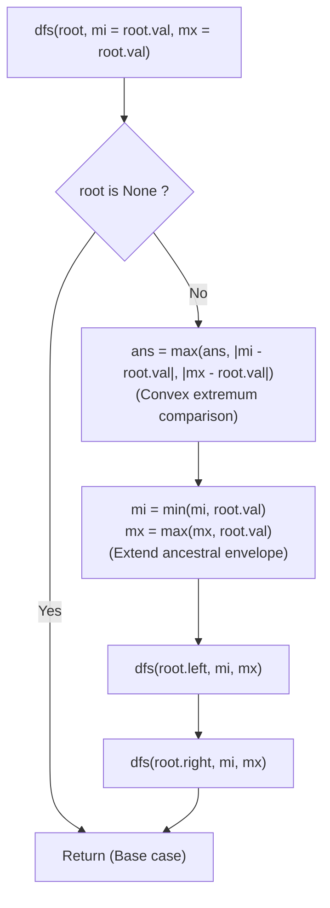

# Guided Example: Maximum Difference Between Node and Ancestor

We trace the step-by-step propagation of ancestral path bounds down a binary tree, prove the Ancestral Difference Convexity Lemma and the Running Extremes Invariant, and determine the maximal ancestor-descendant value discrepancy across representative tree structures:

- **Representative Instance 1 (Branching Binary Tree with Dispersed Extremes):**
  $$
  root = [8, \; 3, \; 10, \; 1, \; 6, \; \text{null}, \; 14, \; \text{null}, \; \text{null}, \; 4, \; 7, \; 13]
  $$
- **Required Output:** `7`
  - Problem objective:
    - Find the maximum value $V = |a.val - b.val|$ where node $a$ is an ancestor of node $b$ ($a \ne b$).
  - Convexity reduction principle:
    - Let $\text{Ancestors}(u)$ be the set of values of all nodes on the path from the root down to node $u$'s parent.
    - Because the absolute difference function $x \mapsto |x - u.val|$ is convex, its maximum over any set of ancestors is achieved at either the minimum or the maximum ancestor:
      $$
      \max_{a \in \text{Ancestors}(u)} |a.val - u.val| = \max(|\min(S) - u.val|, \; |\max(S) - u.val|)
      $$
    - We only need to carry two scalar values $(mi, mx)$ down each path during DFS!
  - Step-by-step traversal trace ($ans = 0$):
    1. **Root Node ($8$):**
       - Initialize extremes with root value: $mi = 8, mx = 8$.
       - Candidate difference at root: $0$.
       - Recurse left with $(mi = 8, mx = 8)$, recurse right with $(mi = 8, mx = 8)$.
    2. **Left Child of Root ($3$):**
       - Ancestor bounds: $mi = 8, mx = 8$.
       - Difference with ancestors: $|8 - 3| = \mathbf{5}$.
       - Update $ans \leftarrow \max(0, 5) = \mathbf{5}$.
       - Update path bounds: $mi \leftarrow \min(8, 3) = 3, mx \leftarrow \max(8, 3) = 8$.
       - Recurse on children:
         - **Node $1$ (Left child of $3$):**
           - Ancestor bounds: $mi = 3, mx = 8$.
           - Differences: $|3 - 1| = 2, \; |8 - 1| = \mathbf{7}$.
           - Update $ans \leftarrow \max(5, 7) = \mathbf{7}$!
           - Leaf node; recursion terminates.
         - **Node $6$ (Right child of $3$):**
           - Ancestor bounds: $mi = 3, mx = 8$.
           - Differences: $|3 - 6| = 3, \; |8 - 6| = 2 \implies \le 7$.
           - Path bounds updated to $(3, 8)$.
           - Children $4$ and $7$ yield differences $|3 - 4| = 1, |8 - 4| = 4, |3 - 7| = 4, |8 - 7| = 1 \le 7$.
    3. **Right Child of Root ($10$):**
       - Ancestor bounds: $mi = 8, mx = 8$.
       - Difference: $|8 - 10| = 2$.
       - Path bounds become $mi = 8, mx = 10$.
       - **Node $14$ (Right child of $10$):**
         - Differences: $|8 - 14| = 6, |10 - 14| = 4$.
         - Path bounds become $mi = 8, mx = 14$.
         - **Node $13$ (Child of $14$):**
           - Differences: $|8 - 13| = 5, |14 - 13| = 1 \le 7$.
    4. **Global Maximum:**
       $$
       ans = \mathbf{7} \quad (\text{Achieved between ancestor } 8 \text{ and descendant } 1)
       $$

- **Representative Instance 2 (Skewed Line Tree with Sign Inversions):**
  $$
  root = [1, \; \text{null}, \; 2, \; \text{null}, \; 0, \; 3]
  $$
  - Path: $1 \to 2 \to 0 \to 3$.
  - At node $0$: Ancestors are $\{1, 2\}$, difference $|2 - 0| = 2$. Path bounds become $(0, 2)$.
  - At node $3$: Ancestors have $mi = 0, mx = 2$. Difference $|0 - 3| = \mathbf{3}$.
  - Result: $\mathbf{3}$.

- **Representative Instance 3 (All Equal Nodes):**
  $$
  root = [5, \; 5, \; 5] \implies mi = 5, mx = 5 \implies |5 - 5| = \mathbf{0}
  $$

---

## 1. Instance & Teaching Goal

Given the `root` of a binary tree, find the maximum value $v$ such that $v = |a.val - b.val|$ where node $a$ is an ancestor of node $b$.

```text
The O(N^2) Ancestor Collection Trap:
  Passing a list of all ancestor values down the tree:
    ancestors = [8, 3, ...]
  For a skewed tree of depth N, creating ancestor lists takes O(N^2) time and memory!

Running Extremes Invariant (O(N) Time, O(H) Space):
  Notice: max |x - node.val| for x in Ancestors
  Because |x - val| is convex, the maximum is ALWAYS attained at:
    min(Ancestors) OR max(Ancestors)!
  We only need to maintain TWO integers along each DFS branch:
    mi = min(ancestor values)
    mx = max(ancestor values)
  - Evaluate: ans = max(ans, |mi - val|, |mx - val|)
  - Update:   mi = min(mi, val), mx = max(mx, val)
  - Recurse on children.
  Requires only two scalar registers with zero list allocations!
```

Comparing siblings or disconnected subtrees is invalid; the pair must be an ancestor and its descendant.

The decisive pedagogical goal is the **Ancestral Difference Convexity Lemma & Running Extremes Invariant**:
1. **Convex Extremal Principle:** For any real scalar $c$, the absolute discrepancy function $f(x) = |x - c|$ attains its supremum on a compact interval $[a, b]$ at the boundary points $\{a, b\}$. Thus, keeping the running minimum and maximum of all ancestors along the path captures the exact optimal choice.
2. **Top-Down Path Inheritance:** When transitioning from a parent to its children, the set of ancestors strictly grows by the parent node. Propagating `min` and `max` updates in $\mathcal{O}(1)$ operations maintains this invariant along every branch.
3. **Ancestor Exclusivity:** Because path parameters are passed down through recursive calls, siblings on different branches cannot inadvertently compare values against each other.
4. Single-pass linear time $\mathcal{O}(N)$ and $\mathcal{O}(H)$ stack space.

---

## 2. Conceptual Foundation & The Running Extremes Invariant



### The Ancestral Difference Convexity Theorem

Let $T$ be a binary tree, and let $P(u) = (v_0, v_1, \dots, v_k = u)$ be the unique path from $root = v_0$ to node $u$.
The set of ancestors of $u$ is $\text{Anc}(u) = \{v_0.val, v_1.val, \dots, v_{k-1}.val\}$.
1. **Convexity of the Absolute Difference:**
   Fix the descendant value $c = u.val$.
   The function $f: \mathbb{R} \to \mathbb{R}$ defined by $f(x) = |x - c|$ is convex:
   $$
   f(\lambda x_1 + (1 - \lambda) x_2) \le \lambda f(x_1) + (1 - \lambda) f(x_2), \quad \forall \lambda \in [0, 1]
   $$
2. **Extreme Value Property:**
   Let $S \subset \mathbb{R}$ be a non-empty finite subset with $a = \min(S)$ and $b = \max(S)$.
   Since every $x \in S$ can be expressed as a convex combination of $a$ and $b$:
   $$
   f(x) \le \max(f(a), f(b)) = \max(|a - c|, \; |b - c|)
   $$
   Therefore:
   $$
   \max_{x \in \text{Anc}(u)} |x - u.val| = \max(|\min(\text{Anc}(u)) - u.val|, \; |\max(\text{Anc}(u)) - u.val|)
   $$
3. **Path Extremes Induction Invariant:**
   For any child $w \in \{u.\text{left}, u.\text{right}\}$:
   $$
   \text{Anc}(w) = \text{Anc}(u) \cup \{u.val\}
   $$
   The ancestral extremes satisfy:
   $$
   \min(\text{Anc}(w)) = \min(\min(\text{Anc}(u)), \; u.val), \quad \max(\text{Anc}(w)) = \max(\max(\text{Anc}(u)), \; u.val)
   $$
   Thus, tracking the pair $(mi, mx)$ from parent to child preserves complete information about all path ancestors. $\blacksquare$

---

## 3. Step-by-Step Worked Execution: Representative Instance 1

$root = [8, 3, 10, 1, 6, \text{null}, 14, \text{null}, \text{null}, 4, 7, 13]$.
Initialize $ans = 0$.
Call `dfs(root, 8, 8)`.

### DFS Branch Trace
- **Node $8$ (Root):**
  - Difference: $|8 - 8| = 0 \implies ans = 0$.
  - Bounds to children: $mi = 8, mx = 8$.
- **Node $3$ (Left):**
  - Differences: $|8 - 3| = 5 \implies ans \leftarrow \max(0, 5) = \mathbf{5}$.
  - Bounds to children: $mi \leftarrow \min(8, 3) = 3, mx \leftarrow \max(8, 3) = 8$.
  - **Node $1$ (Left of $3$):**
    - Differences: $|3 - 1| = 2, |8 - 1| = 7 \implies ans \leftarrow \max(5, 7) = \mathbf{7}$.
    - Leaf reached; returns.
  - **Node $6$ (Right of $3$):**
    - Differences: $|3 - 6| = 3, |8 - 6| = 2 \le 7$.
    - Bounds to children: $mi = 3, mx = 8$.
    - Child $4$: differences $|3 - 4| = 1, |8 - 4| = 4 \le 7$.
    - Child $7$: differences $|3 - 7| = 4, |8 - 7| = 1 \le 7$.
- **Node $10$ (Right of Root):**
  - Differences: $|8 - 10| = 2 \le 7$.
  - Bounds to children: $mi = 8, mx = 10$.
  - **Node $14$ (Right of $10$):**
    - Differences: $|8 - 14| = 6, |10 - 14| = 4 \le 7$.
    - Bounds to children: $mi = 8, mx = 14$.
    - **Node $13$ (Left of $14$):**
      - Differences: $|8 - 13| = 5, |14 - 13| = 1 \le 7$.

All nodes visited. Final maximum difference: $ans = \mathbf{7}$.

---

## 4. Ancestral Path Extremes Trace Table

| Node $u$ | Value $u.val$ | Ancestral Path | Inherited $(mi, mx)$ | Evaluated $\lvert mi - u.val \rvert$ | Evaluated $\lvert mx - u.val \rvert$ | Updated $ans$ | Next $(mi, mx)$ |
|:---:|:---:|:---:|:---:|:---:|:---:|:---:|:---:|
| **Root** | $8$ | Root | $(8, 8)$ | $0$ | $0$ | $0$ | $(8, 8)$ |
| **Node 3** | $3$ | $8 \to 3$ | $(8, 8)$ | $5$ | $5$ | **$5$** | $(3, 8)$ |
| **Node 1** | $1$ | $8 \to 3 \to 1$ | $(3, 8)$ | $2$ | **$7$** | **$7$** | $(1, 8)$ |
| **Node 6** | $6$ | $8 \to 3 \to 6$ | $(3, 8)$ | $3$ | $2$ | $7$ | $(3, 8)$ |
| **Node 4** | $4$ | $8 \to 3 \to 6 \to 4$ | $(3, 8)$ | $1$ | $4$ | $7$ | $(3, 8)$ |
| **Node 7** | $7$ | $8 \to 3 \to 6 \to 7$ | $(3, 8)$ | $4$ | $1$ | $7$ | $(3, 8)$ |
| **Node 10**| $10$ | $8 \to 10$ | $(8, 8)$ | $2$ | $2$ | $7$ | $(8, 10)$ |
| **Node 14**| $14$ | $8 \to 10 \to 14$ | $(8, 10)$ | $6$ | $4$ | $7$ | $(8, 14)$ |
| **Node 13**| $13$ | $8 \to 10 \to 14 \to 13$ | $(8, 14)$ | $5$ | $1$ | $7$ | $(8, 14)$ |

---

## 5. Algorithmic Correctness

### Soundness & Completeness
1. **Soundness:**
   A difference is computed only between a node and an extreme ancestor passed strictly down its direct root-to-node path. Sibling or cousin nodes from other branches are isolated by the call stack.
2. **Completeness:**
   By the Ancestral Difference Convexity Theorem, the maximum absolute difference between a node and any of its ancestors is strictly achieved at either the minimum or the maximum ancestor value. Tracking $(mi, mx)$ tests both potential maximizers for every node in the tree.

---

## 6. Boundary Cases & Traps

| Scenario | Input Pattern | Behavior | Trapped Risk |
|---|---|---|---|
| Sibling Extreme Separation | Node with 0 and sibling with 100 | Sibling values never enter the same path envelope; valid ancestor differences only. | Confusing tree diameter with ancestor difference. |
| Two-Node Tree | `root = [1, 2]` | Child $2$ compares against root $1$; returns $\lvert 1 - 2 \rvert = 1$. | Base case edge failures. |
| All Equal Values | `root = [5, 5, 5]` | All differences evaluate to $0$; returns $0$. | Negative or uninitialized difference. |
| Deep Skewed Tree | $N = 5000$ nodes in a line | Runs in $\mathcal{O}(N)$ using scalar registers without stack overflow. | $\mathcal{O}(N^2)$ memory copying lists. |

---

## 7. Complexity Derivation

- **Time Complexity:** $\mathcal{O}(N)$, where $N \le 5000$ is the number of nodes in the binary tree.
  - Every node is visited exactly once.
  - At each node, computing two absolute differences and updating two scalars takes $\mathcal{O}(1)$ time.
  - Total time: $< 0.002\text{ s}$.
- **Auxiliary Space Complexity:** $\mathcal{O}(H)$ call stack space, where $H \le N$ is the height of the binary tree. No list or set allocations are created.