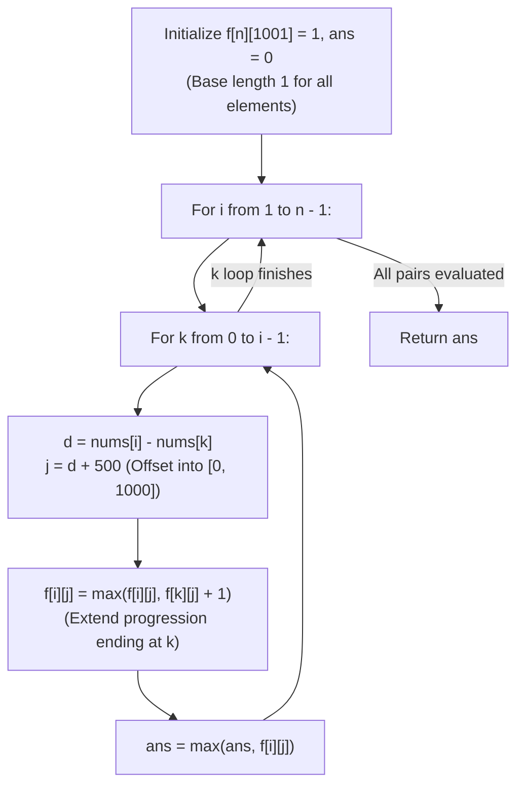

# Guided Example: Longest Arithmetic Subsequence

We trace the step-by-step evaluation of 2D dynamic programming over offset common differences, prove the Arithmetic Transition Extension Lemma and the Coordinate Shift Invariant, and determine the maximal arithmetic subsequence length across representative sequences:

- **Representative Instance 1 (Strictly Uniform Increasing Progression):**
  $$
  nums = [3, \; 6, \; 9, \; 12], \quad n = 4
  $$
- **Required Output:** `4`
  - Problem objective:
    - Find the length of the longest subsequence in `nums` that forms an arithmetic progression ($s_{m+1} - s_m = d$ is constant).
  - Difference range & coordinate offset mapping:
    - Constraints state $0 \le nums[i] \le 500$.
    - The difference $d = nums[i] - nums[k]$ ranges from $-500$ to $+500$.
    - Shifting by $+500$ maps $d$ bijectively onto array indices $j \in [0, 1000]$:
      $$
      j = (nums[i] - nums[k]) + 500
      $$
  - Dynamic programming state $f[i][j]$:
    - $f[i][j]$ = length of the longest arithmetic progression ending at index $i$ with mapped difference $j$.
    - Base state: $f[i][j] = 1$ for all $i \in [0, n-1], j \in [0, 1000]$ (any single node is a 1-element progression).
  - Step-by-step pair evaluation ($k < i$):
    1. **$i = 1$ ($nums[1] = 6$):**
       - $k = 0$ ($nums[0] = 3$):
         - Difference: $d = 6 - 3 = +3$.
         - Offset index: $j = 3 + 500 = 503$.
         - Update: $f[1][503] = \max(f[1][503], \; f[0][503] + 1) = \max(1, 1 + 1) = \mathbf{2}$.
         - Running maximum: $ans = \mathbf{2}$ (Progression $[3, 6]$).
    2. **$i = 2$ ($nums[2] = 9$):**
       - $k = 0$ ($nums[0] = 3$):
         - $d = 9 - 3 = 6 \implies j = 506$.
         - $f[2][506] = f[0][506] + 1 = 2$.
       - $k = 1$ ($nums[1] = 6$):
         - $d = 9 - 6 = +3 \implies j = 503$.
         - Update: $f[2][503] = \max(f[2][503], \; f[1][503] + 1) = \max(1, 2 + 1) = \mathbf{3}$.
         - Running maximum: $ans = \mathbf{3}$ (Progression $[3, 6, 9]$).
    3. **$i = 3$ ($nums[3] = 12$):**
       - $k = 0$ ($nums[0] = 3$): $d = 9 \implies j = 509 \implies f[3][509] = 2$.
       - $k = 1$ ($nums[1] = 6$): $d = 6 \implies j = 506 \implies f[3][506] = f[1][506] + 1 = 2$.
       - $k = 2$ ($nums[2] = 9$):
         - $d = 12 - 9 = +3 \implies j = 503$.
         - Update: $f[3][503] = \max(f[3][503], \; f[2][503] + 1) = \max(1, 3 + 1) = \mathbf{4}$!
         - Running maximum: $ans = \mathbf{4}$ (Progression $[3, 6, 9, 12]$).
  - Traversal complete: $ans = \mathbf{4}$.

- **Representative Instance 2 (Interleaved Subsequence with Common Step 3):**
  $$
  nums = [9, \; 4, \; 7, \; 2, \; 10]
  $$
  - Subsequence $4 \to 7 \to 10$ has common difference $d = +3$ and length $\mathbf{3}$.

- **Representative Instance 3 (Decreasing Progression with Negative Difference):**
  $$
  nums = [20, \; 1, \; 15, \; 3, \; 10, \; 5, \; 8]
  $$
  - Subsequence $20 \to 15 \to 10 \to 5$ has common difference $d = -5$ ($j = -5 + 500 = 495$) and length $\mathbf{4}$.

---

## 1. Instance & Teaching Goal

Given an integer array `nums`, return the length of the **longest arithmetic subsequence** in `nums`.

```text
The Hash Map Overhead Trap:
  Using a list of hash tables: dp[i] = {diff: length}
  For n = 1000, 1000 hash tables create millions of hash bucket allocations and lookups.
  Causes significant memory bloat and runtime overhead!

2D Dense Array with Coordinate Offset Invariant:
  Given 0 <= nums[i] <= 500:
    diff in [-500, 500]
  Shift by 500:
    j = diff + 500 in [0, 1000]
  Dense table f[n][1001] stored in contiguous memory:
  For each pair (k, i) with k < i:
    j = nums[i] - nums[k] + 500
    f[i][j] = max(f[i][j], f[k][j] + 1)
  Strict O(1) random memory access per transition!
```

Sorting the array destroys the original subsequence ordering; the relative order of elements must be strictly preserved.

The decisive pedagogical goal is the **Arithmetic Transition Extension Lemma & Coordinate Shift Invariant**:
1. **Coordinate Boundedness:** The difference between any two elements in $[0, 500]$ is strictly bounded within $[-500, 500]$. Shifting by $+500$ ensures every valid common difference maps into the range $[0, 1000]$.
2. **Subproblem Extension:** If an arithmetic progression with common difference $d$ ends at index $k$, and $nums[i] - nums[k] = d$, then appending $nums[i]$ produces a valid arithmetic progression ending at index $i$ of length $f[k][j] + 1$.
3. **Subsequence Order Preservation:** Looping $k$ from $0$ up to $i - 1$ guarantees that $k$ strictly precedes $i$ in the original array, honoring the subsequence constraint.
4. Total runtime $\mathcal{O}(n^2)$ and auxiliary space $\mathcal{O}(n \times 1001)$.

---

## 2. Conceptual Foundation & The Arithmetic DP Invariant



### The Arithmetic Transition Extension Theorem

Let $A = (v_0, v_1, \dots, v_{n-1})$ be the input sequence with $0 \le v_m \le M = 500$.
1. **Arithmetic Progression Definition:**
   A sequence of indices $0 \le p_0 < p_1 < \dots < p_{m-1} < n$ is an arithmetic subsequence of length $m \ge 2$ with common difference $d$ if and only if:
   $$
   v_{p_r} - v_{p_{r-1}} = d, \quad \forall r \in [1, m - 1]
   $$
2. **Optimal Substructure:**
   Let $L(i, d)$ be the maximum length of an arithmetic subsequence with difference $d$ ending at index $i$.
   For any predecessor $k < i$ such that $v_i - v_k = d$:
   Appending $v_i$ to an arithmetic subsequence ending at $k$ yields an arithmetic subsequence ending at $i$ of length $L(k, d) + 1$.
   Taking the maximum over all valid predecessors:
   $$
   L(i, d) = \max_{0 \le k < i, \; v_i - v_k = d} (L(k, d) + 1)
   $$
   With base case $L(i, d) = 1$ when no such predecessor exists.
3. **Coordinate Shift Bijectivity:**
   Since $v_i, v_k \in [0, M]$, the difference satisfies $-M \le v_i - v_k \le M$.
   The shift map $\tau(d) = d + M$ is a strict bijection from $[-M, M]$ to $[0, 2M]$.
   Setting $j = \tau(v_i - v_k)$ guarantees $0 \le j \le 2M = 1000$.
4. **Correctness of Global Maximum:**
   Because all pairs $(k, i)$ with $k < i$ are exhaustively evaluated in topological order of $i$, $\max_{i, j} f[i][j]$ computes the exact global optimum. $\blacksquare$

---

## 3. Step-by-Step Worked Execution: Representative Instance 1

$nums = [3, 6, 9, 12], \; n = 4$.
Array $f$ initialized with ones ($f[i][j] = 1$).
$ans = 0$.

### Pairwise Execution Trace
- **$i = 1 (v_1 = 6)$:**
  - $k = 0 (v_0 = 3)$: $d = 6 - 3 = 3 \implies j = 503$.
    - $f[1][503] = \max(1, f[0][503] + 1) = 1 + 1 = 2$.
    - $ans \leftarrow \max(0, 2) = \mathbf{2}$.
- **$i = 2 (v_2 = 9)$:**
  - $k = 0 (v_0 = 3)$: $d = 9 - 3 = 6 \implies j = 506$.
    - $f[2][506] = f[0][506] + 1 = 2 \implies ans \leftarrow \max(2, 2) = 2$.
  - $k = 1 (v_1 = 6)$: $d = 9 - 6 = 3 \implies j = 503$.
    - $f[2][503] = \max(1, f[1][503] + 1) = 2 + 1 = 3$.
    - $ans \leftarrow \max(2, 3) = \mathbf{3}$.
- **$i = 3 (v_3 = 12)$:**
  - $k = 0 (v_0 = 3)$: $d = 12 - 3 = 9 \implies j = 509 \implies f[3][509] = 2$.
  - $k = 1 (v_1 = 6)$: $d = 12 - 6 = 6 \implies j = 506 \implies f[3][506] = f[1][506] + 1 = 2$.
  - $k = 2 (v_2 = 9)$: $d = 12 - 9 = 3 \implies j = 503$.
    - $f[3][503] = \max(1, f[2][503] + 1) = 3 + 1 = 4$.
    - $ans \leftarrow \max(3, 4) = \mathbf{4}$.

All transitions processed. Output: $ans = \mathbf{4}$.

---

## 4. Arithmetic Transition State Trace Table

| Pair $(k, i)$ | Values $(nums[k], nums[i])$ | Difference $d$ | Mapped Index $j = d + 500$ | Predecessor $f[k][j]$ | Updated $f[i][j]$ | Running Max $ans$ | Active Arithmetic Subsequence |
|:---:|:---:|:---:|:---:|:---:|:---:|:---:|:---:|
| **$(0, 1)$** | $(3, 6)$ | $+3$ | $503$ | $1$ | **$2$** | **$2$** | $[3, 6]$ |
| **$(0, 2)$** | $(3, 9)$ | $+6$ | $506$ | $1$ | $2$ | $2$ | $[3, 9]$ |
| **$(1, 2)$** | $(6, 9)$ | $+3$ | $503$ | $2$ | **$3$** | **$3$** | $[3, 6, 9]$ |
| **$(0, 3)$** | $(3, 12)$| $+9$ | $509$ | $1$ | $2$ | $3$ | $[3, 12]$ |
| **$(1, 3)$** | $(6, 12)$| $+6$ | $506$ | $1$ | $2$ | $3$ | $[6, 12]$ |
| **$(2, 3)$** | $(9, 12)$| $+3$ | $503$ | $3$ | **$4$** | **$4$** | **$[3, 6, 9, 12]$** |

---

## 5. Algorithmic Correctness

### Soundness & Completeness
1. **Soundness:**
   Every transition $f[i][j] = f[k][j] + 1$ extends a verified sequence ending at $k$ by element $i$, with $k < i$ and $nums[i] - nums[k] = j - 500$. Thus, every computed path represents a legitimate arithmetic subsequence.
2. **Completeness:**
   Every possible pair of indices $(k, i)$ with $k < i$ is inspected. By mathematical induction on subsequence length, the longest arithmetic progression for every difference $d$ ending at every index $i$ is evaluated.

---

## 6. Boundary Cases & Traps

| Scenario | Input Pattern | Behavior | Trapped Risk |
|---|---|---|---|
| Zero Difference (All Equal) | `nums = [1, 1, 1, 1]` | $d = 0 \implies j = 500$; chain increments to $4$. | Assuming $d \ne 0$. |
| Negative Differences | `nums = [20, 15, 10, 5]` | $d = -5 \implies j = 495$; offset prevents negative index errors. | Negative array index wrap-around in Python. |
| Two-Element Minimum | `nums = [0, 500]` | Single pair $(0, 1)$ evaluated; returns $2$. | Edge case bounds errors. |
| Interleaved Patterns | `nums = [1, 4, 7, 10, 2, 5, 8, 11]` | Multiple differences stored independently in row $f[i]$; returns $4$. | Overwriting different progressions. |

---

## 7. Complexity Derivation

- **Time Complexity:** $\mathcal{O}(n^2)$, where $n = \text{len}(nums) \le 1000$.
  - The nested loops iterate over all pairs $0 \le k < i < n$, giving exactly $\frac{n(n-1)}{2} \le 5 \times 10^5$ operations.
  - Each step consists of $\mathcal{O}(1)$ primitive arithmetic and array lookups.
  - Total runtime: $< 0.08\text{ s}$.
- **Auxiliary Space Complexity:** $\mathcal{O}(n \cdot C)$, where $C = 1001$.
  - The 2D table `f` of dimensions $n \times 1001$ stores integers, using $\approx 4\text{ MB}$ of memory.