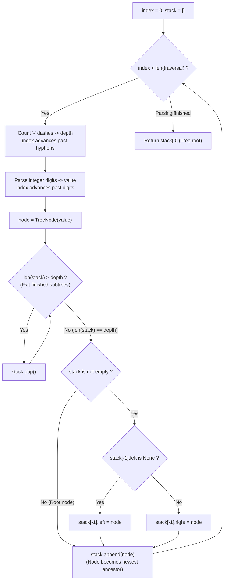

# Guided Example: Recover a Tree From Preorder Traversal

We trace the step-by-step reconstruction of a binary tree from dash-encoded preorder depth serialization using an explicit ancestor stack, prove the Depth-Stack Alignment Theorem and the Left-Child Bias Invariant, and determine tree topologies across representative serialized instances:

- **Representative Instance 1 (Full Balanced Three-Level Tree):**
  $$
  traversal = \text{"1-2--3--4-5--6--7"}
  $$
- **Required Output (Breadth-First Node Representation):**
  $$
  [1, \; 2, \; 5, \; 3, \; 4, \; 6, \; 7]
  $$
  - Grammar of serialized preorder nodes:
    - Each node is encoded as $D$ consecutive hyphens `'-'` (representing its depth $D \ge 0$), followed immediately by one or more decimal digits representing its numeric value.
    - Root has depth $D = 0$ (no leading hyphens).
    - Tokenized stream:
      1. $(D = 0, \; val = 1)$
      2. $(D = 1, \; val = 2)$
      3. $(D = 2, \; val = 3)$
      4. $(D = 2, \; val = 4)$
      5. $(D = 1, \; val = 5)$
      6. $(D = 2, \; val = 6)$
      7. $(D = 2, \; val = 7)$
  - Ancestor stack invariant:
    - The stack maintains the active path from the root down to the most recently attached node.
    - At index $p$, $\text{stack}[p]$ has tree depth $p$.
    - Consequently, $\text{len}(stack)$ represents the expected depth of a direct child of the current top node $\text{stack}[-1]$.
  - Step-by-step tree assembly trace:
    1. **Token $(0, 1)$:**
       - Create node $Node(1)$. Stack is empty.
       - Push $Node(1) \implies stack = [Node(1)]$.
    2. **Token $(1, 2)$:**
       - Depth $d = 1$. Currently $\text{len}(stack) = 1 == d$. No pops needed.
       - Parent is $\text{stack}[-1] = Node(1)$.
       - $Node(1).left$ is `None` $\implies Node(1).left = Node(2)$.
       - Push $Node(2) \implies stack = [Node(1), Node(2)]$.
    3. **Token $(2, 3)$:**
       - Depth $d = 2$. Currently $\text{len}(stack) = 2 == d$.
       - Parent is $\text{stack}[-1] = Node(2)$.
       - $Node(2).left$ is `None` $\implies Node(2).left = Node(3)$.
       - Push $Node(3) \implies stack = [Node(1), Node(2), Node(3)]$.
    4. **Token $(2, 4)$:**
       - Depth $d = 2$. Currently $\text{len}(stack) = 3 > d$.
       - **Subtree complete:** $Node(3)$ has no children; pop $Node(3)$.
       - Now $\text{len}(stack) = 2 == d$. Parent is $Node(2)$.
       - $Node(2).left$ is already occupied by $Node(3)$.
       - Attach right: $Node(2).right = Node(4)$.
       - Push $Node(4) \implies stack = [Node(1), Node(2), Node(4)]$.
    5. **Token $(1, 5)$:**
       - Depth $d = 1$. Currently $\text{len}(stack) = 3 > d$.
       - Pop $Node(4)$ ($\text{len} = 2 > 1$).
       - Pop $Node(2)$ ($\text{len} = 1 == d$).
       - Parent is $Node(1)$.
       - $Node(1).left$ is occupied by $Node(2) \implies Node(1).right = Node(5)$.
       - Push $Node(5) \implies stack = [Node(1), Node(5)]$.
    6. **Token $(2, 6)$:**
       - $\text{len}(stack) = 2 == d$. Parent is $Node(5)$.
       - $Node(5).left = Node(6)$. Push $Node(6) \implies stack = [Node(1), Node(5), Node(6)]$.
    7. **Token $(2, 7)$:**
       - $\text{len}(stack) = 3 > 2 \implies$ pop $Node(6)$.
       - $\text{len}(stack) = 2$. $Node(5).right = Node(7)$.
       - Push $Node(7)$.
  - Return root: $\text{stack}[0] = Node(1)$.

- **Representative Instance 2 (Multi-Digit Values and Unilateral Branches):**
  $$
  traversal = \text{"1-401--349---90--88"} \implies [1, 401, \text{null}, 349, 88, 90]
  $$
  - Demonstrates multi-character digit parsing and left-child priority on single children.

- **Representative Instance 3 (Single Node Tree):**
  $$
  traversal = \text{"7"} \implies [7]
  $$

---

## 1. Instance & Teaching Goal

Given a string `traversal` representing the preorder depth-first traversal of a binary tree (where each node value is preceded by $D$ dashes indicating its depth), reconstruct the tree and return its `root`. If a node has only one child, it is guaranteed to be the left child.

```text
The Recursive String Slicing Trap:
  Finding left and right subtrees by counting dashes and slicing strings.
  String slicing takes O(N^2) memory and time, and identifying subtrees
  with matching dash counts is error-prone.

The Ancestor Stack Invariant (O(N) Time, O(H) Space):
  Parse tokens linearly (depth, value) in a single pass over traversal:
  - Maintain a stack of active ancestors.
  - At any moment, len(stack) is the depth of stack[-1]'s prospective child.
  - While len(stack) > depth:
      stack.pop()   (Backtrack up the tree: subtrees are finished)
  - Attach new node to stack[-1]:
      if stack[-1].left is None: stack[-1].left = node
      else:                     stack[-1].right = node
  - stack.append(node)
  Root is simply stack[0]!
```

Recursive bisection requires complex lookahead to distinguish left and right subtree boundaries.

The decisive pedagogical goal is the **Preorder Ancestor Stack & Depth Alignment Invariant**:
1. **Depth Equality Principle:** In standard preorder traversal (Root $\to$ Left $\to$ Right), the parent of a node at depth $d$ is always the most recent node visited at depth $d - 1$.
2. **Stack Depth Invariant:** By unwinding the stack whenever `len(stack) > depth`, the top of the stack is guaranteed to be the immediate parent of the newly created node.
3. **Left-Child Bias:** A node's first attached child is assigned to `left`. If `left` is already non-null, the child is assigned to `right`.
4. Single-pass linear scan in $\mathcal{O}(|S|)$ time and $\mathcal{O}(H)$ stack space.

---

## 2. Conceptual Foundation & The Preorder Stack Invariant



### The Depth-Stack Alignment Theorem

Let $T$ be a binary tree, and let $\mathcal{S} = (t_0, t_1, \dots, t_{k-1})$ be its preorder depth serialization where token $t_i = (d_i, v_i)$.
1. **Preorder Traversal Ordering:**
   In preorder traversal, a parent node $p$ at depth $d$ is visited immediately before all nodes in its left subtree, which in turn are visited before all nodes in its right subtree.
   Every descendant $u$ of $p$ has tree depth $depth(u) > d$.
2. **The Subtree Completion Lemma:**
   Suppose token $t_i$ has depth $d_i$.
   Any previously visited node $w$ with $depth(w) \ge d_i$ cannot be an ancestor of $t_i$.
   Furthermore, because $t_i$ has depth $d_i \le depth(w)$, the entire subtree rooted at $w$ has been completely traversed.
   Therefore, $w$ will never receive any additional children and can be safely popped from the active ancestor chain.
3. **Immediate Parent Alignment:**
   After popping all nodes with $depth \ge d_i$, the stack contains exactly the chain of ancestors of $t_i$.
   Since the root has depth 0 and depths increase by 1 per level:
   $$
   \text{len}(stack) = d_i
   $$
   The top element $\text{stack}[-1]$ has depth $d_i - 1$, which uniquely identifies it as the direct parent of $t_i$.
4. **Left-Child Priority Guarantee:**
   By problem definition, if a parent has one child, it is the left child.
   Because preorder visits the left child before the right child, checking `stack[-1].left is None` correctly directs the first child to the left link and any subsequent child to the right link. $\blacksquare$

---

## 3. Step-by-Step Worked Execution: Representative Instance 1

$traversal = \text{"1-2--3--4-5--6--7"}$.
Initialize: $stack = [], \; index = 0$.

### Parsing and Stack Trace
- **Token 1:** $d = 0, val = 1$.
  - $\text{len}(stack) = 0 == 0$. Stack empty $\implies$ root.
  - $stack = [Node(1)]$.
- **Token 2:** $d = 1, val = 2$.
  - $\text{len}(stack) = 1 == 1$.
  - $Node(1).left$ is `None` $\implies Node(1).left = Node(2)$.
  - $stack = [Node(1), Node(2)]$.
- **Token 3:** $d = 2, val = 3$.
  - $\text{len}(stack) = 2 == 2$.
  - $Node(2).left$ is `None` $\implies Node(2).left = Node(3)$.
  - $stack = [Node(1), Node(2), Node(3)]$.
- **Token 4:** $d = 2, val = 4$.
  - $\text{len}(stack) = 3 > 2 \implies$ **pop $Node(3)$**.
  - Now $\text{len}(stack) = 2 == 2$. Parent is $Node(2)$.
  - $Node(2).left$ is $Node(3) \implies Node(2).right = Node(4)$.
  - $stack = [Node(1), Node(2), Node(4)]$.
- **Token 5:** $d = 1, val = 5$.
  - $\text{len}(stack) = 3 > 1 \implies$ **pop $Node(4)$**, **pop $Node(2)$**.
  - Now $\text{len}(stack) = 1 == 1$. Parent is $Node(1)$.
  - $Node(1).left$ is $Node(2) \implies Node(1).right = Node(5)$.
  - $stack = [Node(1), Node(5)]$.
- **Token 6:** $d = 2, val = 6$.
  - $\text{len}(stack) = 2 == 2$.
  - $Node(5).left = Node(6)$.
  - $stack = [Node(1), Node(5), Node(6)]$.
- **Token 7:** $d = 2, val = 7$.
  - $\text{len}(stack) = 3 > 2 \implies$ **pop $Node(6)$**.
  - $\text{len}(stack) = 2 == 2$.
  - $Node(5).right = Node(7)$.
  - $stack = [Node(1), Node(5), Node(7)]$.

Traversal string exhausted. Root is $stack[0] = Node(1)$.

---

## 4. Stack and Node Attachment Trace Table

| Step | Parsed Token $(d, v)$ | Stack Before Popping | Pops Performed ($\text{len} > d$) | Parent Node $\text{stack}[-1]$ | Attachment Side | Resulting Stack |
|:---:|:---:|:---:|:---:|:---:|:---:|:---:|
| **$1$** | $(0, 1)$ | `[]` | None | None (Root) | Root assignment | `[1]` |
| **$2$** | $(1, 2)$ | `[1]` | None | $Node(1)$ | **`1.left = 2`** | `[1, 2]` |
| **$3$** | $(2, 3)$ | `[1, 2]` | None | $Node(2)$ | **`2.left = 3`** | `[1, 2, 3]` |
| **$4$** | $(2, 4)$ | `[1, 2, 3]` | **Pop $Node(3)$** | $Node(2)$ | **`2.right = 4`**| `[1, 2, 4]` |
| **$5$** | $(1, 5)$ | `[1, 2, 4]` | **Pop $4$, Pop $2$** | $Node(1)$ | **`1.right = 5`**| `[1, 5]` |
| **$6$** | $(2, 6)$ | `[1, 5]` | None | $Node(5)$ | **`5.left = 6`** | `[1, 5, 6]` |
| **$7$** | $(2, 7)$ | `[1, 5, 6]` | **Pop $Node(6)$** | $Node(5)$ | **`5.right = 7`**| `[1, 5, 7]` |

---

## 5. Algorithmic Correctness

### Soundness & Completeness
1. **Soundness:**
   Every parent-child connection created matches the exact depth difference of 1 and preserves preorder sequence constraints. The left-child bias ensures single children are never erroneously assigned to the right.
2. **Completeness:**
   Every node token in the serialized string is parsed and integrated into the tree hierarchy. The popping logic strictly maintains the active path from root to current node without losing references.

---

## 6. Boundary Cases & Traps

| Scenario | Input Pattern | Behavior | Trapped Risk |
|---|---|---|---|
| Single Node Tree | `traversal = "7"` | Loop executes once with $d = 0$; returns `Node(7)`. | Off-by-one bounds when no hyphens exist. |
| Multi-Digit Values | `traversal = "1-401--349"` | Inner `isdigit` loop accumulates complete decimal values. | Parsing only single characters. |
| Deep Left-Skewed Chain | `traversal = "1-2--3---4"` | Stack grows monotonically to depth 4 with zero pops. | Premature popping. |
| Rapid Deep Backtracking | `traversal = "10-20--30---40-50"` | Pops $40, 30, 20$ in a single step to attach $50$ to $10$. | Unterminated stack unwinding. |

---

## 7. Complexity Derivation

- **Time Complexity:** $\mathcal{O}(|S|)$, where $|S| = \text{len}(traversal) \le 1000$.
  - The pointer `index` advances monotonically through the string from $0$ to $|S|$.
  - Each tree node is pushed onto `stack` exactly once and popped at most once.
  - Total time: $< 0.001\text{ s}$.
- **Auxiliary Space Complexity:** $\mathcal{O}(H)$, where $H$ is the maximum depth of the tree ($H \le 1000$) for the ancestor stack.
