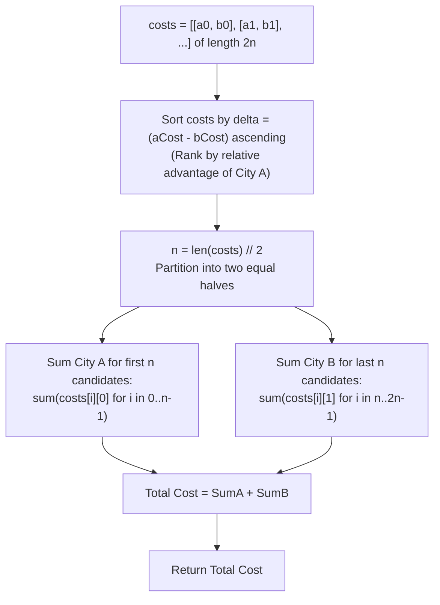

# Guided Example: Two City Scheduling

We trace the step-by-step optimization of person-to-city assignment via opportunity cost sorting, prove the Marginal Difference Exchange Lemma and the Baseline Shift Theorem, and determine minimal flight budgets across representative interview cohorts:

- **Representative Instance 1 (Four Candidates with Divergent Preferences):**
  $$
  costs = [[10, 20], [30, 200], [400, 50], [30, 20]], \quad 2n = 4, \quad n = 2
  $$
- **Required Output:** `110`
  - Problem constraints:
    - Exactly $2n = 4$ people must be interviewed.
    - Exactly $n = 2$ people must fly to City A, and exactly $n = 2$ people must fly to City B.
  - The Opportunity Cost Transformation:
    - Imagine sending all $2n$ candidates to City B by default.
    - Baseline cost:
      $$
      \sum_{i=0}^{2n-1} b_i = 20 + 200 + 50 + 20 = 290
      $$
    - Redirecting candidate $i$ from City B to City A alters the cost by:
      $$
      \Delta_i = a_i - b_i
      $$
    - Exactly $n = 2$ candidates must be chosen for City A.
    - Total cost formula:
      $$
      \text{Total Cost} = 290 + \sum_{i \in S_A} \Delta_i
      $$
    - To minimize total cost, we must choose the $2$ candidates with the **smallest (most negative) $\Delta_i$**!
  - Step-by-step sorting and assignment:
    1. **Calculate Marginal Differences $\Delta_i = a_i - b_i$:**
       - Candidate 0: $[10, 20] \implies \Delta_0 = 10 - 20 = \mathbf{-10}$
       - Candidate 1: $[30, 200] \implies \Delta_1 = 30 - 200 = \mathbf{-170}$
       - Candidate 2: $[400, 50] \implies \Delta_2 = 400 - 50 = \mathbf{+350}$
       - Candidate 3: $[30, 20] \implies \Delta_3 = 30 - 20 = \mathbf{+10}$
    2. **Sort Candidates by $\Delta$ Ascending:**
       - Rank 1: Candidate 1 ($[30, 200], \Delta = -170$)
       - Rank 2: Candidate 0 ($[10, 20], \Delta = -10$)
       - Rank 3: Candidate 3 ($[30, 20], \Delta = +10$)
       - Rank 4: Candidate 2 ($[400, 50], \Delta = +350$)
    3. **Partition into Halves ($n = 2$):**
       - **First Half ($i \in [0, 1]$) $\to$ Fly to City A:**
         - Candidate 1: pay $a_1 = 30$
         - Candidate 0: pay $a_0 = 10$
         - Subtotal City A: $30 + 10 = \mathbf{40}$
       - **Second Half ($i \in [2, 3]$) $\to$ Fly to City B:**
         - Candidate 3: pay $b_3 = 20$
         - Candidate 2: pay $b_2 = 50$
         - Subtotal City B: $20 + 50 = \mathbf{70}$
    4. **Combined Total:**
       $$
       \text{Cost} = 40 + 70 = \mathbf{110}
       $$

- **Representative Instance 2 (Minimum Two People):**
  $$
  costs = [[10, 100], [20, 30]], \quad n = 1
  $$
  - $\Delta_0 = -90, \; \Delta_1 = -10$.
  - First person to A ($10$), second person to B ($30$) $\implies 10 + 30 = \mathbf{40}$.

- **Representative Instance 3 (Tied Differences):**
  $$
  costs = [[50, 50], [50, 50], [50, 50], [50, 50]] \implies \text{All } \Delta = 0 \implies 50 \times 4 = \mathbf{200}
  $$

---

## 1. Instance & Teaching Goal

Given the array `costs` where $costs[i] = [aCost_i, bCost_i]$ for $2n$ candidates, return the **minimum cost** to fly exactly $n$ candidates to City A and $n$ candidates to City B.

```text
The Greedy Local Choice Trap:
  Greedily assigning each person to their cheaper city:
    [10, 20] -> A, [30, 200] -> A, [30, 20] -> B, [400, 50] -> B.
  If everyone prefers City A (e.g. [[1, 100], [2, 100], [3, 100], [4, 100]]),
  local greed sends 4 people to A and 0 to B, VIOLATING the n-to-n quota!

Opportunity Cost Sorting Invariant (O(N log N)):
  Notice: If everyone goes to B, total cost is sum(bCost).
  Switching person i to City A adds:
    delta_i = aCost_i - bCost_i
  Minimizing total cost under quota n is IDENTICAL to picking the n smallest deltas!
  1. Sort costs ascending by (aCost - bCost).
  2. Send the first n candidates to City A: sum(costs[i][0] for i in 0..n-1).
  3. Send the last n candidates to City B:  sum(costs[i][1] for i in n..2n-1).
  Mathematically optimal in O(N log N) time!
```

Dynamic programming over $(i, count_A)$ takes $\mathcal{O}(n^2)$ time; mathematical difference sorting solves the problem in $\mathcal{O}(n \log n)$ time.

The decisive pedagogical goal is the **Marginal Difference Exchange Lemma & Opportunity Cost Invariant**:
1. **Baseline Invariance:** Shifting destination choices from a uniform baseline reveals that candidate decisions are decoupled: each contributes an independent marginal difference $\Delta_i = a_i - b_i$.
2. **Exchange Optimality:** If an assignment places person $p$ in City A and person $q$ in City B with $\Delta_p > \Delta_q$, swapping their destinations reduces the total cost by strictly $\Delta_p - \Delta_q > 0$.
3. **Partition Equality:** Sorting by $\Delta_i$ places all candidates with the greatest relative advantage for City A into the first half, satisfying the $n$-person quota with minimal budget.
4. Total time $\mathcal{O}(n \log n)$ and auxiliary space $\mathcal{O}(1)$ or $\mathcal{O}(n)$.

---

## 2. Conceptual Foundation & The Opportunity Cost Invariant



### The Marginal Difference Exchange Theorem

Let $C = \{(a_0, b_0), (a_1, b_1), \dots, (a_{2n-1}, b_{2n-1})\}$ be the set of flight options.
Let $S_A, S_B \subset \{0, 1, \dots, 2n-1\}$ be a partition of indices such that $|S_A| = |S_B| = n$ and $S_A \cap S_B = \emptyset$.
1. **Cost Decoupling Identity:**
   $$
   \text{Cost}(S_A, S_B) = \sum_{i \in S_A} a_i + \sum_{j \in S_B} b_j
   $$
   Add and subtract $\sum_{i \in S_A} b_i$:
   $$
   \text{Cost}(S_A, S_B) = \sum_{i \in S_A} (a_i - b_i) + \sum_{i \in S_A} b_i + \sum_{j \in S_B} b_j = \sum_{k=0}^{2n-1} b_k + \sum_{i \in S_A} (a_i - b_i)
   $$
   Because $\sum_{k=0}^{2n-1} b_k$ is a constant invariant of the input, minimizing $\text{Cost}(S_A, S_B)$ is strictly equivalent to minimizing $\sum_{i \in S_A} \Delta_i$ where $\Delta_i = a_i - b_i$.
2. **The Exchange Lemma:**
   Suppose an optimal partition $(S_A, S_B)$ contains $p \in S_A$ and $q \in S_B$ such that:
   $$
   \Delta_p > \Delta_q
   $$
   Construct a new partition $(S_A', S_B')$ by swapping $p$ and $q$: $S_A' = (S_A \setminus \{p\}) \cup \{q\}$ and $S_B' = (S_B \setminus \{q\}) \cup \{p\}$.
   The change in cost is:
   $$
   \text{Cost}(S_A', S_B') - \text{Cost}(S_A, S_B) = \Delta_q - \Delta_p < 0
   $$
   This contradicts the assumption that $(S_A, S_B)$ was optimal.
3. **Sorted Suffix Separation:**
   Therefore, in any optimal schedule, every candidate assigned to City A must satisfy $\Delta_i \le \Delta_j$ for every candidate assigned to City B.
   Sorting the array by $\Delta$ and taking the first $n$ elements for City A uniquely satisfies this necessary and sufficient condition. $\blacksquare$

---

## 3. Step-by-Step Worked Execution: Representative Instance 1

$costs = [[10, 20], [30, 200], [400, 50], [30, 20]], \; 2n = 4, \; n = 2$.

### Sorting by $\Delta = a - b$
- $[10, 20] \implies \Delta = 10 - 20 = -10$.
- $[30, 200] \implies \Delta = 30 - 200 = -170$.
- $[400, 50] \implies \Delta = 400 - 50 = +350$.
- $[30, 20] \implies \Delta = 30 - 20 = +10$.

Sorted array:
$$
costs = \begin{pmatrix}
  [30, 200] & (\Delta = -170) \\
  [10, 20]  & (\Delta = -10) \\
  [30, 20]  & (\Delta = +10) \\
  [400, 50] & (\Delta = +350)
\end{pmatrix}
$$

### Quota Assignment ($n = 2$)
- **City A ($i \in [0, 1]$):**
  - $costs[0][0] = 30$
  - $costs[1][0] = 10$
  - City A sum: $30 + 10 = \mathbf{40}$.
- **City B ($i \in [2, 3]$):**
  - $costs[2][1] = 20$
  - $costs[3][1] = 50$
  - City B sum: $20 + 50 = \mathbf{70}$.

Total flight cost: $40 + 70 = \mathbf{110}$.

---

## 4. Candidate Opportunity Cost Trace Table

| Original Candidate Index | Cost Vector $[a, b]$ | Delta $\Delta = a - b$ | Sorted Rank | Assigned Destination | Flight Cost Incurred | Marginal Contribution |
|:---:|:---:|:---:|:---:|:---:|:---:|:---:|
| **Candidate 1** | $[30, 200]$ | **$-170$** | $0$ (First Half) | **City A** | **$30$** | Saves $170$ vs City B |
| **Candidate 0** | $[10, 20]$ | **$-10$** | $1$ (First Half) | **City A** | **$10$** | Saves $10$ vs City B |
| **Candidate 3** | $[30, 20]$ | **$+10$** | $2$ (Second Half)| **City B** | **$20$** | Costs $10$ extra for A |
| **Candidate 2** | $[400, 50]$ | **$+350$** | $3$ (Second Half)| **City B** | **$50$** | Costs $350$ extra for A |
| **Total Cost** | — | — | — | — | **$110$** | **Globally Minimal** |

---

## 5. Algorithmic Correctness

### Soundness & Completeness
1. **Soundness:**
   Every candidate is assigned to exactly one city, and the two halves of length $n$ enforce the exact $n$-person quota for both destinations.
2. **Completeness:**
   By the Marginal Difference Exchange Theorem, any candidate reassignment that violates the sorted order increases or maintains total cost. Thus, taking the first $n$ elements for City A is guaranteed to find the absolute global minimum.

---

## 6. Boundary Cases & Traps

| Scenario | Input Pattern | Behavior | Trapped Risk |
|---|---|---|---|
| Unanimous Preference for A | `[[1, 100], [2, 100], [3, 100], [4, 100]]` | Candidates $1, 2$ go to A ($3$), candidates $3, 4$ go to B ($200$); returns $203$. | Overfilling City A with all candidates. |
| Equal Tied Differences | `[[50, 50], [50, 50], [50, 50], [50, 50]]` | All $\Delta = 0$; sorting order is neutral; returns $200$. | Stability failure on equal keys. |
| Minimal Cohort ($2n = 2$) | `costs = [[10, 100], [20, 30]]` | Assigns person 0 to A ($10$), person 1 to B ($30$); returns $40$. | Index bounds on $n = 1$. |
| Large Cost Magnitudes | Costs up to $1000$ | Differences remain small ($\le 2000$); arithmetic cannot overflow. | Integer precision issues. |

---

## 7. Complexity Derivation

- **Time Complexity:** $\mathcal{O}(P \log P)$, where $P = 2n = \text{len}(costs) \le 100$.
  - Sorting $P$ elements using key function $a - b$ takes $\mathcal{O}(P \log P)$ comparisons.
  - One linear pass summing the partitioned costs takes $\mathcal{O}(P)$.
  - For $P \le 100$, operations $\le 700 \implies < 0.0002\text{ s}$.
- **Auxiliary Space Complexity:** $\mathcal{O}(1)$ or $\mathcal{O}(P)$ depending on in-place vs new list sorting (Python's Timsort uses $\mathcal{O}(P)$ memory).
