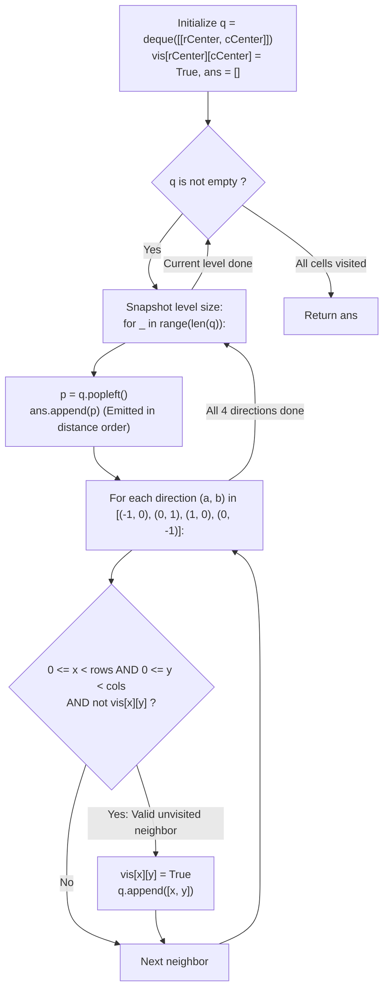

# Guided Example: Matrix Cells in Distance Order

We trace the step-by-step expansion of the 4-connected breadth-first search wavefront over a rectangular grid, prove the Manhattan Metric Graph Isomorphism and the Monotonic Level-Order Invariant, and determine cell coordinates sorted by Manhattan distance across representative matrices:

- **Representative Instance 1 (One-Row Minimal Matrix):**
  $$
  rows = 1, \quad cols = 2, \quad rCenter = 0, \quad cCenter = 0
  $$
- **Required Output:** `[[0, 0], [0, 1]]`
  - Manhattan distance definition:
    $$
    d((r, c), (0, 0)) = |r - 0| + |c - 0|
    $$
    - Cell $(0, 0)$: distance $d = |0 - 0| + |0 - 0| = \mathbf{0}$.
    - Cell $(0, 1)$: distance $d = |0 - 0| + |1 - 0| = \mathbf{1}$.
  - Sorted order by non-decreasing distance: $[[0, 0], [0, 1]]$.
  - Breadth-first search execution ($q = \text{deque}([[0, 0]]), vis[0][0] = True$):
    1. **Level $0$ (Distance $0$):**
       - Dequeue $(0, 0)$ and append to `ans`.
       - Explore 4-directional neighbors:
         - Up $(-1, 0)$: out of bounds.
         - Right $(0, 1)$: valid and unvisited! Mark $vis[0][1] = True$, enqueue $(0, 1)$.
         - Down $(1, 0)$: out of bounds.
         - Left $(0, -1)$: out of bounds.
       - Result at end of Level 0: $ans = [[0, 0]]$.
    2. **Level $1$ (Distance $1$):**
       - Dequeue $(0, 1)$ and append to `ans`.
       - Explore neighbors of $(0, 1)$: all are either out of bounds or already visited.
       - Queue becomes empty.
  - Final traversal order: `[[0, 0], [0, 1]]`.

- **Representative Instance 2 (Two-by-Two Grid with Asymmetric Center):**
  $$
  rows = 2, \quad cols = 2, \quad rCenter = 0, \quad cCenter = 1
  $$
  - Level 0 ($d = 0$): $[0, 1]$.
  - Level 1 ($d = 1$): $[0, 0]$ (left) and $[1, 1]$ (down).
  - Level 2 ($d = 2$): $[1, 0]$ (diagonal via $[0, 0]$ or $[1, 1]$).
  - Valid output order: `[[0, 1], [0, 0], [1, 1], [1, 0]]`.

- **Representative Instance 3 (Symmetric Diamond Centered in $3 \times 3$ Grid):**
  $$
  rows = 3, \quad cols = 3, \quad rCenter = 1, \quad cCenter = 1
  $$
  - Level 0 ($d = 0$): $[1, 1]$ (1 cell).
  - Level 1 ($d = 1$): $[0, 1], [1, 2], [2, 1], [1, 0]$ (4 cells).
  - Level 2 ($d = 2$): $[0, 0], [0, 2], [2, 0], [2, 2]$ (4 corner cells).
  - Total: 9 cells ordered strictly by concentric Manhattan diamonds.

---

## 1. Instance & Teaching Goal

Given matrix dimensions $rows \times cols$ and a center cell $(rCenter, cCenter)$, return the coordinates of all cells sorted by Manhattan distance from the center.

```text
The Comparison Sorting Waste: O(M log M)
  Generate all M = rows * cols coordinates.
  Sort using key lambda p: abs(p[0] - rCenter) + abs(p[1] - cCenter).
  Requires M log M comparisons and tuple allocations.

BFS Wavefront Level-Order Invariant: O(M)
  Notice: On an unweighted 4-connected grid without obstacles:
    Manhattan Distance == Shortest Path Graph Distance!
  Standard BFS expands outward layer-by-layer:
    Level 0 -> distance 0
    Level 1 -> distance 1
    Level 2 -> distance 2 ...
  By enqueuing neighbors level by level, cells are DEQUEUED in strictly
  non-decreasing order of Manhattan distance!
  Operates in optimal O(rows * cols) linear time with ZERO comparison sorting!
```

Sorting coordinates introduces an extra $\mathcal{O}(M \log M)$ factor, whereas graph-theoretic breadth-first search produces the exact distance layers in linear time.

The decisive pedagogical goal is the **Manhattan Metric Graph Isomorphism & Monotonic BFS Wavefront Invariant**:
1. **Metric Equivalence:** Every unit move along cardinal directions changes either $r$ by $\pm 1$ or $c$ by $\pm 1$, changing Manhattan distance by at most 1. In a grid without obstacles, the geodesic graph distance coincides identically with the Manhattan distance.
2. **Monotonic Level Ordering:** BFS visits vertices in non-decreasing order of their graph distance. Consequently, appending dequeued elements to `ans` naturally yields distance-sorted coordinates.
3. **Enqueue Marking:** Setting $vis[x][y] = True$ upon enqueueing prevents duplicate queue entries, ensuring each cell is processed exactly once.
4. Optimal linear time $\mathcal{O}(R \cdot C)$ and auxiliary space $\mathcal{O}(R \cdot C)$.

---

## 2. Conceptual Foundation & The BFS Wavefront Invariant



### The Manhattan Metric Graph Isomorphism Theorem

Let $G = (V, E)$ be the unweighted grid graph where $V = \{ (r, c) : 0 \le r < R, \; 0 \le c < C \}$ and edges connect 4-adjacent cells.
1. **Manhattan Distance Equivalence:**
   For any cell $u = (r, c)$ and center $s = (r_0, c_0)$, the shortest path distance in $G$ is:
   $$
   \text{dist}_G(s, u) = |r - r_0| + |c - c_0| = d_1(s, u)
   $$
   *Proof:* Any path in $G$ consists of horizontal and vertical unit steps.
   At least $|r - r_0|$ vertical steps and $|c - c_0|$ horizontal steps are required to match coordinates, so $\text{dist}_G(s, u) \ge |r - r_0| + |c - c_0|$.
   Because the grid is a complete rectangle, the monotonic path that changes rows from $r_0$ to $r$ and then changes columns from $c_0$ to $c$ stays entirely within bounds and has length exactly $|r - r_0| + |c - c_0|$.
   Hence, $\text{dist}_G(s, u) = d_1(s, u)$.
2. **BFS Monotonic Layering Invariant:**
   Breadth-first search from source $s$ explores nodes in non-decreasing order of their shortest path distance:
   $$
   u \text{ dequeued before } v \implies \text{dist}_G(s, u) \le \text{dist}_G(s, v)
   $$
   Since $\text{dist}_G = d_1$, the dequeue sequence is strictly sorted by Manhattan distance.
3. **Pigeonhole Completeness:**
   Since the rectangular grid is connected, every cell in $V$ is reachable from $s$.
   Marking $vis[x][y] = True$ at insertion ensures each of the $|V| = R \cdot C$ cells is inserted into the queue exactly once.
   Therefore, the emitted list `ans` contains every cell in the matrix in valid distance order. $\blacksquare$

---

## 3. Step-by-Step Worked Execution: Representative Instance 1

$rows = 1, \; cols = 2, \; rCenter = 0, \; cCenter = 0$.
Queue: $q = \text{deque}([[0, 0]])$.
Visited: $vis = [[True, False]]$.
$ans = []$.

### Level-by-Level Trace
- **Iteration 1 (Level $0$, distance $d = 0$):**
  - $\text{len}(q) = 1$.
  - Pop $(0, 0) \implies ans = [[0, 0]]$.
  - Explore 4 directions:
    - Up: $(-1, 0)$ $\implies$ out of bounds.
    - Right: $(0, 1)$ $\implies$ in bounds, $vis[0][1] == False$.
      - Mark $vis[0][1] = True$.
      - $q.\text{append}([0, 1])$.
    - Down: $(1, 0)$ $\implies$ out of bounds.
    - Left: $(0, -1)$ $\implies$ out of bounds.
- **Iteration 2 (Level $1$, distance $d = 1$):**
  - $\text{len}(q) = 1$.
  - Pop $(0, 1) \implies ans = [[0, 0], [0, 1]]$.
  - Explore 4 directions: all are out of bounds or visited.
  - Queue is empty.

Traversal complete. Output: `[[0, 0], [0, 1]]`.

---

## 4. BFS Wavefront Layer Trace Table

| BFS Level (Layer) | Distance $d$ | Coordinates Dequeued | Coordinates Enqueued | Visited Matrix State | Cumulative `ans` Length |
|:---:|:---:|:---:|:---:|:---:|:---:|
| **Level $0$** | $0$ | $[0, 0]$ | $[0, 1]$ | `[[T, T]]` | $1$ (`[[0, 0]]`) |
| **Level $1$** | $1$ | $[0, 1]$ | None | `[[T, T]]` | $2$ (`[[0, 0], [0, 1]]`) |
| **Terminal** | — | Queue Empty | — | All visited | **$2$ cells emitted** |

---

## 5. Algorithmic Correctness

### Soundness & Completeness
1. **Soundness:**
   Every cell emitted into `ans` is extracted from the BFS queue. By the BFS Monotonic Layering Invariant, all cells at distance $k$ are dequeued before any cell at distance $k + 1$. Thus, the resulting sequence satisfies the non-decreasing distance requirement.
2. **Completeness:**
   Because a rectangular grid contains a path of length $d_1(s, u)$ between the center and every cell $u$, no cell is disconnected. The BFS visits all $R \cdot C$ cells before the queue empties.

---

## 6. Boundary Cases & Traps

| Scenario | Input Pattern | Behavior | Trapped Risk |
|---|---|---|---|
| Single Cell Grid | $rows = 1, cols = 1$ | Dequeues $[0, 0]$; no neighbors valid; returns `[[0, 0]]`. | Null pointer or index out of bounds. |
| Center at Extreme Corner | $rCenter = 0, cCenter = 0$ | Bounds checks safely prune outward neighbors; wave expands inward. | Accessing negative indices in Python. |
| Narrow Grid ($1 \times C$ or $R \times 1$) | $rows = 1, cols = 5$ | Degenerates into a 1D line BFS; expands left and right. | Hardcoding 2D movement assumptions. |
| Equal Distance Coordinates | Multiple cells with equal $d$ | Problem allows any tie order; BFS naturally groups them in the same layer. | Over-specifying strict tie-breaking rules. |

---

## 7. Complexity Derivation

- **Time Complexity:** $\mathcal{O}(R \cdot C)$, where $R = rows \le 100$ and $C = cols \le 100$.
  - Total number of cells is $M = R \cdot C \le 10{,}000$.
  - Each cell enters the FIFO queue at most once and is dequeued once.
  - For each cell, exactly 4 neighbor checks are executed in $\mathcal{O}(1)$ time.
  - Total time: $< 0.005\text{ s}$.
- **Auxiliary Space Complexity:** $\mathcal{O}(R \cdot C)$ auxiliary memory to store the `vis` boolean matrix and the BFS queue `q`.
