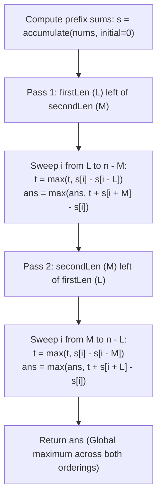

# Guided Example: Maximum Sum of Two Non-Overlapping Subarrays

We trace the step-by-step evaluation of two non-overlapping fixed-length subarrays using prefix sum decoupling and running prefix maximums, prove the Topological Order Duality Theorem and the Online Prefix Maximum Invariant, and determine the maximal combined sum across representative sequences:

- **Representative Instance 1 (Mixed Subarrays with Asymmetric Optimal Order):**
  $$
  nums = [0, \; 6, \; 5, \; 2, \; 2, \; 5, \; 1, \; 9, \; 4], \quad firstLen = 1, \quad secondLen = 2
  $$
- **Required Output:** `20`
  - Problem objective:
    - Select two disjoint contiguous subarrays of lengths $L = 1$ and $M = 2$ to maximize their sum.
  - Topological order duality:
    - Subarray of length $L$ and subarray of length $M$ cannot overlap.
    - Exactly two relative topological orderings are possible:
      1. **Configuration 1 ($L \prec M$):** Subarray of length $1$ appears strictly to the left of subarray of length $2$.
      2. **Configuration 2 ($M \prec L$):** Subarray of length $2$ appears strictly to the left of subarray of length $1$.
    - The global optimum is $\max(\text{Max}(L \prec M), \; \text{Max}(M \prec L))$.
  - Prefix sum array $s$ (length $n + 1 = 10$):
    $$
    s = [0, \; 0, \; 6, \; 11, \; 13, \; 15, \; 20, \; 21, \; 30, \; 34]
    $$
  - Execution trace:
    1. **Pass 1: Configuration $L \prec M$ ($firstLen = 1$ left of $secondLen = 2$):**
       - Right window of length $2$ starts at $i$ ($[i \dots i + 1]$).
       - Sweep $i$ from $1$ to $7$:
         - $i = 1$: Left window $nums[0] = 0 \implies t = 0$. Right window $nums[1..2] = 11 \implies \text{sum} = 0 + 11 = 11$.
         - $i = 2$: Left window $nums[1] = 6 \implies t = \max(0, 6) = \mathbf{6}$. Right window $nums[2..3] = 7 \implies 6 + 7 = 13$.
         - $i = 3$: Left window $nums[2] = 5 \implies t = 6$. Right window $nums[3..4] = 4 \implies 6 + 4 = 10$.
         - $i = 4$: Left window $nums[3] = 2 \implies t = 6$. Right window $nums[4..5] = 7 \implies 6 + 7 = 13$.
         - $i = 5$: Left window $nums[4] = 2 \implies t = 6$. Right window $nums[5..6] = 6 \implies 6 + 6 = 12$.
         - $i = 6$: Left window $nums[5] = 5 \implies t = 6$. Right window $nums[6..7] = 10 \implies 6 + 10 = 16$.
         - $i = 7$: Left window $nums[6] = 1 \implies t = \max(6, 1) = 6$. Right window $nums[7..8] = 9 + 4 = 13 \implies 6 + 13 = \mathbf{19}$.
       - Pass 1 Best: $19$ ($[6]$ and $[9, 4]$).
    2. **Pass 2: Configuration $M \prec L$ ($secondLen = 2$ left of $firstLen = 1$):**
       - Right window of length $1$ starts at $i$ ($[i]$).
       - Sweep $i$ from $2$ to $8$:
         - $i = 2$: Left window $nums[0..1] = 6 \implies t = 6$. Right window $nums[2] = 5 \implies 6 + 5 = 11$.
         - $i = 3$: Left window $nums[1..2] = 11 \implies t = \max(6, 11) = \mathbf{11}$. Right window $nums[3] = 2 \implies 11 + 2 = 13$.
         - $i = 4 \dots 6$: $t$ remains $11$.
         - $i = 7$: Left window candidate $nums[5..6] = 6 \le 11 \implies t = 11$.
           - Right window $nums[7] = \mathbf{9}$.
           - Combined: $t + nums[7] = 11 + 9 = \mathbf{20}$!
         - $i = 8$: Right window $nums[8] = 4 \implies 11 + 4 = 15$.
       - Pass 2 Best: $\mathbf{20}$ (Subarray $[6, 5]$ with sum 11, followed by $[9]$ with sum 9).
    3. **Global Maximum:**
       $$
       ans = \max(19, \; 20) = \mathbf{20}
       $$

- **Representative Instance 2 (Separated Peak Windows):**
  $$
  nums = [3, \; 8, \; 1, \; 3, \; 2, \; 1, \; 8, \; 9, \; 0], \quad firstLen = 3, \quad secondLen = 2
  $$
  - Subarrays $[3, 8, 1]$ (sum 12) and $[8, 9]$ (sum 17) $\implies 12 + 17 = \mathbf{29}$.

- **Representative Instance 3 (Exact Whole Array Partition):**
  $$
  nums = [1, \; 2, \; 3, \; 4], \quad firstLen = 2, \quad secondLen = 2 \implies [1, 2] + [3, 4] = \mathbf{10}
  $$

---

## 1. Instance & Teaching Goal

Given an array `nums` and two integers `firstLen` and `secondLen`, return the **maximum sum of elements in two non-overlapping contiguous subarrays** of lengths `firstLen` and `secondLen`.

```text
The O(N^2) Brute Force Search:
  Try every pair of windows (i, j).
  Check if they overlap (|i - j| >= length).
  Evaluating N^2 combinations is slow and repetitive.

Order Duality & Running Prefix Maximum Invariant (O(N)):
  Any non-overlapping pair has one window strictly to the left of the other:
    Case 1: firstLen on the left, secondLen on the right.
    Case 2: secondLen on the left, firstLen on the right.
  In each case, fix the right window ending at i + M:
    - The left window can be ANY window of length L ending on or before i.
    - Maintain running max t = max(t, sum of left window ending at i).
    - Current best = t + sum of right window ending at i + M.
  Evaluates all non-overlapping pairs in two linear sweeps!
```

Arbitrary window searches require pairwise overlap verification; decomposing the problem by relative order eliminates overlap checks entirely.

The decisive pedagogical goal is the **Topological Order Duality & Online Prefix Maximum Invariant**:
1. **Order Duality Partition:** Two non-overlapping intervals $I_1$ and $I_2$ in a 1D sequence satisfy either $\max(I_1) < \min(I_2)$ or $\max(I_2) < \min(I_1)$. Testing both configurations exhaustively covers all feasible disjoint placements.
2. **Online Running Maximum:** By storing the maximum sum of any window of length $L$ ending on or before index $i$ in scalar $t$, pairing it with the fixed window of length $M$ starting at $i$ takes $\mathcal{O}(1)$ time.
3. **Prefix Sum Integration:** Range sums $s[b] - s[a]$ evaluate arbitrary contiguous window sums in $\mathcal{O}(1)$ time.
4. Linear time $\mathcal{O}(N)$ and auxiliary space $\mathcal{O}(N)$.

---

## 2. Conceptual Foundation & The Prefix Maximum Invariant



### The Topological Order Duality Theorem

Let $A = (v_0, v_1, \dots, v_{n-1})$ be the array, and let $L = firstLen, M = secondLen$ with $L + M \le n$.
Let $I_L = [a, a + L - 1]$ and $I_M = [b, b + M - 1]$ be two contiguous index intervals.
1. **Non-Overlapping Disjunction:**
   $I_L \cap I_M = \emptyset \iff a + L - 1 < b \quad \lor \quad b + M - 1 < a$.
   Therefore, the search space of valid pairs $\mathcal{P}$ partitions into two disjoint sets:
   $$
   \mathcal{P} = \mathcal{P}_{L \prec M} \cup \mathcal{P}_{M \prec L}
   $$
   where $\mathcal{P}_{L \prec M} = \{(a, b) : a + L \le b\}$ and $\mathcal{P}_{M \prec L} = \{(a, b) : b + M \le a\}$.
2. **Decoupling Lemma for $L \prec M$:**
   Fix the start of the right window at index $i = b$.
   The allowed indices for the left window are all $a$ such that $a + L \le i$, which is equivalent to $a \le i - L$.
   $$
   \max_{(a, i) \in \mathcal{P}_{L \prec M}} (\text{Sum}(I_L) + \text{Sum}(I_M)) = \max_{i} \left( \left[\max_{a \le i - L} \text{Sum}([a, a + L - 1])\right] + \text{Sum}([i, i + M - 1]) \right)
   $$
3. **Prefix Maximum Invariant:**
   Define $t_i = \max_{k \le i} (s[k] - s[k - L])$.
   The recurrence $t_i = \max(t_{i-1}, \; s[i] - s[i - L])$ computes this envelope in $\mathcal{O}(1)$ per step.
4. **Global Maximality:**
   Because both $\mathcal{P}_{L \prec M}$ and $\mathcal{P}_{M \prec L}$ are fully explored in two sequential passes, no valid combination is overlooked. $\blacksquare$

---

## 3. Step-by-Step Worked Execution: Representative Instance 1

$nums = [0, 6, 5, 2, 2, 5, 1, 9, 4], \; L = 1, \; M = 2, \; n = 9$.
$s = [0, 0, 6, 11, 13, 15, 20, 21, 30, 34]$.
$ans = 0, \; t = 0$.

### Pass 1: $L = 1 \prec M = 2$
- $i = 1$: $t = \max(0, s[1] - s[0]) = 0$. Right $s[3] - s[1] = 11 \implies ans = 11$.
- $i = 2$: $t = \max(0, s[2] - s[1]) = 6$. Right $s[4] - s[2] = 7 \implies ans = \max(11, 6 + 7) = 13$.
- $i = 3$: $t = \max(6, s[3] - s[2]) = 6$. Right $s[5] - s[3] = 4 \implies ans = 13$.
- $i = 4$: $t = \max(6, s[4] - s[3]) = 6$. Right $s[6] - s[4] = 7 \implies ans = 13$.
- $i = 5$: $t = \max(6, s[5] - s[4]) = 6$. Right $s[7] - s[5] = 6 \implies ans = 13$.
- $i = 6$: $t = \max(6, s[6] - s[5]) = 6$. Right $s[8] - s[6] = 10 \implies ans = \max(13, 16) = 16$.
- $i = 7$: $t = \max(6, s[7] - s[6]) = 6$. Right $s[9] - s[7] = 13 \implies ans = \max(16, 6 + 13) = \mathbf{19}$.

### Pass 2: $M = 2 \prec L = 1$
- Reset $t = 0$.
- $i = 2$: $t = \max(0, s[2] - s[0]) = 6$. Right $s[3] - s[2] = 5 \implies ans = \max(19, 6 + 5) = 19$.
- $i = 3$: $t = \max(6, s[3] - s[1]) = 11$. Right $s[4] - s[3] = 2 \implies ans = 19$.
- $i = 4$: $t = \max(11, s[4] - s[2]) = 11$. Right $s[5] - s[4] = 2 \implies ans = 19$.
- $i = 5$: $t = \max(11, s[5] - s[3]) = 11$. Right $s[6] - s[5] = 5 \implies ans = 19$.
- $i = 6$: $t = \max(11, s[6] - s[4]) = 11$. Right $s[7] - s[6] = 1 \implies ans = 19$.
- $i = 7$: $t = \max(11, s[7] - s[5]) = 11$. Right $s[8] - s[7] = 9 \implies ans = \max(19, 11 + 9) = \mathbf{20}$!
- $i = 8$: $t = \max(11, s[8] - s[6]) = 11$. Right $s[9] - s[8] = 4 \implies ans = \max(20, 11 + 4) = 20$.

Final answer: $ans = \mathbf{20}$.

---

## 4. Dual Sweep State Trace Table

| Sweep Phase | Split Index $i$ | Preceding Window Sum | Running Max Left $t$ | Trailing Window Slice | Trailing Sum | Candidate Total | Best $ans$ |
|:---:|:---:|:---:|:---:|:---:|:---:|:---:|:---:|
| **Pass 1 ($1 \prec 2$)** | $i = 2$ | $nums[1] = 6$ | $6$ | $nums[2 \dots 3]$ | $7$ | $13$ | $13$ |
| **Pass 1 ($1 \prec 2$)** | $i = 7$ | $nums[6] = 1$ | $6$ | $nums[7 \dots 8]$ | $13$ | $19$ | $19$ |
| **Pass 2 ($2 \prec 1$)** | $i = 2$ | $nums[0 \dots 1] = 6$ | $6$ | $nums[2]$ | $5$ | $11$ | $19$ |
| **Pass 2 ($2 \prec 1$)** | $i = 3$ | $nums[1 \dots 2] = 11$| **$11$** | $nums[3]$ | $2$ | $13$ | $19$ |
| **Pass 2 ($2 \prec 1$)** | $i = 7$ | $nums[5 \dots 6] = 6$ | **$11$** | **$nums[7] = 9$** | **$9$** | **$20$** | **$20$** |

---

## 5. Algorithmic Correctness

### Soundness & Completeness
1. **Soundness:**
   In Pass 1, every candidate pair $(I_L, I_M)$ satisfies $\max(I_L) < i \le \min(I_M)$. In Pass 2, every pair satisfies $\max(I_M) < i \le \min(I_L)$. Neither pass permits index overlap.
2. **Completeness:**
   Every pair of non-overlapping intervals in a 1D sequence has one interval preceding the other. Testing all split boundaries $i$ with running maximums covers the entire feasible space.

---

## 6. Boundary Cases & Traps

| Scenario | Input Pattern | Behavior | Trapped Risk |
|---|---|---|---|
| Complete Coverage | $L + M = n$ | Loop runs for exactly one valid split point; returns total sum. | Off-by-one boundary crashes. |
| All Zero Array | `nums = [0, 0, 0, 0, 0]` | All window sums are $0$; returns $0$. | Negative initialization of $t$. |
| Asymmetric Preferred Order | $L$ best after $M$ | Pass 2 captures inverted orientation; returns optimal combination. | Assuming fixed left-to-right order. |
| Equal Lengths ($L = M$) | $L = 2, M = 2$ | Both passes evaluate symmetric configurations; correctly finds max. | Duplicate overcounting. |

---

## 7. Complexity Derivation

- **Time Complexity:** $\mathcal{O}(N)$, where $N = \text{len}(nums) \le 1000$.
  - Computing prefix sums takes $\mathcal{O}(N)$.
  - Pass 1 runs at most $N$ iterations with $\mathcal{O}(1)$ operations.
  - Pass 2 runs at most $N$ iterations with $\mathcal{O}(1)$ operations.
  - Total time: $< 0.001\text{ s}$.
- **Auxiliary Space Complexity:** $\mathcal{O}(N)$ auxiliary memory to store the prefix sum array $s$ of length $N + 1$.