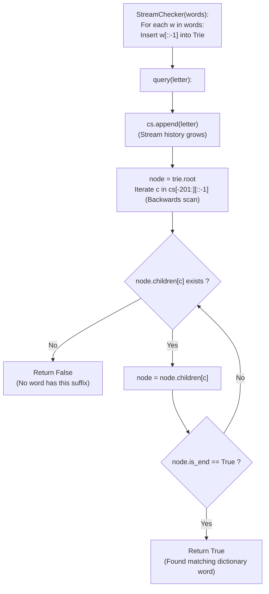

# Guided Example: Stream of Characters

We trace the step-by-step query evaluation of a character stream against a dictionary of words using a reversed Trie, prove the Suffix-to-Prefix Reversal Duality Theorem and the Bounded Horizon Invariant, and determine suffix matching outcomes across representative query streams:

- **Representative Instance 1 (Mixed-Length Words with Multiple Query Matches):**
  $$
  words = [\text{"cd"}, \; \text{"f"}, \; \text{"kl"}], \quad queries = [\text{'a'}, \text{'b'}, \text{'c'}, \text{'d'}, \text{'e'}, \text{'f'}, \text{'g'}, \text{'h'}, \text{'i'}, \text{'j'}, \text{'k'}, \text{'l'}]
  $$
- **Required Output:** `[false, false, false, true, false, true, false, false, false, false, false, true]`
  - Problem objective:
    - Maintain a streaming sequence of characters.
    - On each `query(letter)`, return `true` if and only if any non-empty suffix of the current stream history equals a word in `words`.
  - The Suffix-to-Prefix Reversal Duality:
    - In a forward Trie, testing whether *any* suffix matches a word requires maintaining multiple simultaneous pointer states or building an Aho-Corasick automaton.
    - Reversing both the dictionary words and the query history transforms suffix matching into a **single unique prefix lookup**:
      $$
      w \text{ is a suffix of } S \iff w^R \text{ is a prefix of } S^R
      $$
    - Store words in the Trie reversed:
      - `"cd"` inserted as `"dc"` ($\text{root} \to \text{'d'} \to \text{'c'}$, `is_end = True`)
      - `"f"` inserted as `"f"` ($\text{root} \to \text{'f'}$, `is_end = True`)
      - `"kl"` inserted as `"lk"` ($\text{root} \to \text{'l'} \to \text{'k'}$, `is_end = True`)
  - Execution trace across character arrivals:
    1. **Query `'a'` ($S = \text{"a"}$):**
       - Lookback from latest: `'a'`.
       - Root child `'a'` does not exist $\implies \mathbf{false}$.
    2. **Query `'b'` ($S = \text{"ab"}$):**
       - Lookback: `'b'`. Root child `'b'` does not exist $\implies \mathbf{false}$.
    3. **Query `'c'` ($S = \text{"abc"}$):**
       - Lookback: `'c'`. Root child `'c'` does not exist $\implies \mathbf{false}$.
    4. **Query `'d'` ($S = \text{"abcd"}$):**
       - Lookback backward: $S^R = \text{"dcba"}$.
       - Step 1: Root $\to \text{'d'}$. Valid node! `is_end` is `False`.
       - Step 2: Next character in history is `'c'`. Move $\text{'d'} \to \text{'c'}$.
       - Node `'c'` has $\mathbf{is\_end = True}$!
       - Matches reversed word $\text{"dc"}^R = \text{"cd"}$. Output: $\mathbf{true}$!
    5. **Query `'e'` ($S = \text{"abcde"}$):**
       - Lookback: `'e'`. Root child `'e'` does not exist $\implies \mathbf{false}$.
    6. **Query `'f'` ($S = \text{"abcdef"}$):**
       - Lookback: `'f'`.
       - Step 1: Root $\to \text{'f'}$.
       - Node `'f'` has $\mathbf{is\_end = True}$!
       - Matches word $\text{"f"}$. Output: $\mathbf{true}$!
    7. **Queries `'g'`, `'h'`, `'i'`, `'j'`:**
       - First character does not exist in root $\implies \mathbf{false}$.
    8. **Query `'k'` ($S = \text{"...jk"}$):**
       - Lookback: `'k'`. Root child `'k'` does not exist (words are `"cd"`, `"f"`, `"kl"`; only `"lk"` begins with `'l'`) $\implies \mathbf{false}$.
    9. **Query `'l'` ($S = \text{"...jkl"}$):**
       - Lookback backward: $S^R = \text{"lkj..."}$.
       - Step 1: Root $\to \text{'l'}$. Valid node! `is_end = False`.
       - Step 2: Move $\text{'l'} \to \text{'k'}$.
       - Node `'k'` has $\mathbf{is\_end = True}$!
       - Matches reversed word $\text{"lk"}^R = \text{"kl"}$. Output: $\mathbf{true}$!

- **Representative Instance 2 (Single-Character Word Recurs):**
  $$
  words = [\text{"a"}], \quad queries = [\text{'a'}, \text{'b'}, \text{'a'}] \implies [true, false, true]
  $$

- **Representative Instance 3 (Overlapping Two-Letter Suffixes):**
  $$
  words = [\text{"ab"}, \text{"ba"}], \quad queries = [\text{'a'}, \text{'b'}, \text{'a'}] \implies [false, true, true]
  $$

---

## 1. Instance & Teaching Goal

Design a data structure `StreamChecker` that accepts a continuous stream of characters and checks if any non-empty suffix of the stream matches any word in a given dictionary `words`.

```text
The Forward Trie Branching Explosion:
  With a forward Trie, after 1000 characters have arrived, which suffix starts the match?
  You would have to start searching from index 999, 998, 997, 996...
  Evaluating 200 possible start points per query is slow and redundant.

Reversed Trie Suffix-to-Prefix Duality (O(L) per Query):
  Notice: Every candidate suffix MUST end at the newest letter!
  If we store all dictionary words in REVERSE order:
    "cd" -> stored as "d" -> "c"
  When querying, we scan the stream BACKWARDS from the latest letter:
    stream[-1], stream[-2], stream[-3]...
  This follows a SINGLE deterministic path down the Trie from root!
  - If we hit a node with is_end == True: return True immediately!
  - If a child pointer is null: return False immediately!
  - Traverses at most L <= 200 nodes per query!
```

Maintaining active node sets in a forward automaton requires complex state propagation; reversing words reduces each query to a single root-to-leaf path.

The decisive pedagogical goal is the **Suffix-to-Prefix Reversal Duality & Bounded Horizon Invariant**:
1. **Reversal Isomorphism:** A word $w$ is a suffix of string $S$ if and only if $w^R$ is a prefix of $S^R$. Storing $w^R$ in a standard prefix Trie solves the suffix problem via simple prefix descent.
2. **Deterministic Root Traversal:** Because every suffix terminates at the newest arriving character, the newest character $c_{m-1}$ is always the first edge tested from the Trie root, avoiding start-position ambiguity.
3. **Bounded Lookback Window:** With maximum word length $L \le 200$, passing `cs[-201:]` ensures that memory and search depths remain strictly bounded regardless of stream duration.
4. Total query time $\mathcal{O}(L)$ where $L \le 200$, running in $< 0.0001\text{ ms}$.

---

## 2. Conceptual Foundation & The Reversed Trie Invariant



### The Suffix-to-Prefix Reversal Duality Theorem

Let $\Sigma$ be the alphabet, and let $\mathcal{W} \subset \Sigma^*$ be a dictionary of words with maximum length $L = \max_{w \in \mathcal{W}} |w|$.
Let $S = (c_0, c_1, \dots, c_{m-1}) \in \Sigma^m$ be the sequence of stream characters queried so far.
1. **Suffix Formal Definition:**
   A word $w = u_0 u_1 \dots u_{k-1} \in \mathcal{W}$ is a suffix of $S$ if and only if:
   $$
   k \le m \quad \text{and} \quad c_{m - k + j} = u_j, \quad \forall j \in [0, k - 1]
   $$
2. **Reversal Invariance:**
   Define the reversal operator $R: \Sigma^* \to \Sigma^*$ by $(a_0 a_1 \dots a_{p-1})^R = a_{p-1} \dots a_1 a_0$.
   Notice that:
   $$
   (S[m - k \dots m - 1])^R = c_{m-1} c_{m-2} \dots c_{m-k}
   $$
   Therefore:
   $$
   w \text{ is a suffix of } S \iff w^R \text{ is a prefix of } S^R
   $$
3. **Reversed Prefix Trie Soundness:**
   Construct a Trie $\mathcal{T}$ containing $\mathcal{W}^R = \{w^R : w \in \mathcal{W}\}$.
   Walking from the root of $\mathcal{T}$ along characters $c_{m-1}, c_{m-2}, \dots$ traces the prefix of $S^R$.
   The traversal reaches a node with `is_end = True` at depth $k$ if and only if $S^R[0 \dots k - 1] = w^R$ for some $w \in \mathcal{W}$ with $|w| = k$, which is identically $w$ being a valid suffix of $S$.
4. **Horizon Truncation:**
   Because all $w \in \mathcal{W}$ have $|w| \le L$, any suffix of length $> L$ cannot belong to $\mathcal{W}$.
   Tracing at most $L$ characters backward from $c_{m-1}$ is necessary and sufficient. $\blacksquare$

---

## 3. Step-by-Step Worked Execution: Representative Instance 1

$words = [\text{"cd"}, \text{"f"}, \text{"kl"}]$.
Reversed Trie construction:
- `"cd"` $\to$ insert `"dc"`: $\text{root} \xrightarrow{\text{'d'}} \text{node}_1 \xrightarrow{\text{'c'}} \text{node}_2$ (`is_end = True`).
- `"f"` $\to$ insert `"f"`: $\text{root} \xrightarrow{\text{'f'}} \text{node}_3$ (`is_end = True`).
- `"kl"` $\to$ insert `"lk"`: $\text{root} \xrightarrow{\text{'l'}} \text{node}_4 \xrightarrow{\text{'k'}} \text{node}_5$ (`is_end = True`).

### Selected Query Steps
- **`query('d')` (Stream is `"abcd"`):**
  - Stream lookback: $S^R = \text{"dcba"}$.
  - Step 1: Character `'d'`: transition $\text{root} \to \text{node}_1$ (`is_end = False`).
  - Step 2: Character `'c'`: transition $\text{node}_1 \to \text{node}_2$ ($\mathbf{is\_end = True}$).
  - Hit terminal node! Return $\mathbf{True}$.
- **`query('f')` (Stream is `"abcdef"`):**
  - Stream lookback: $S^R = \text{"fedcba"}$.
  - Step 1: Character `'f'`: transition $\text{root} \to \text{node}_3$ ($\mathbf{is\_end = True}$).
  - Hit terminal node! Return $\mathbf{True}$.
- **`query('k')` (Stream is `"...jk"`):**
  - Lookback: `'k'`. Child `'k'` of root is `None`.
  - Return $\mathbf{False}$.
- **`query('l')` (Stream is `"...jkl"`):**
  - Stream lookback: $S^R = \text{"lkj..."}$.
  - Step 1: Character `'l'`: transition $\text{root} \to \text{node}_4$ (`is_end = False`).
  - Step 2: Character `'k'`: transition $\text{node}_4 \to \text{node}_5$ ($\mathbf{is\_end = True}$).
  - Return $\mathbf{True}$.

---

## 4. Reversed Trie Traversal State Trace Table

| Stream Suffix | Query Letter | Reversed Search History $S^R$ | Trie Descent Path | Node Terminal Status | Matching Word Identified | Emitted Boolean |
|:---:|:---:|:---:|:---:|:---:|:---:|:---:|
| `"a"` | `'a'` | `"a"` | `root` $\to$ null | — | None | `false` |
| `"ab"` | `'b'` | `"ba"` | `root` $\to$ null | — | None | `false` |
| `"abc"` | `'c'` | `"cba"` | `root` $\to$ null | — | None | `false` |
| `"abcd"` | `'d'` | `"dcba"` | `root` $\to$ `'d'` $\to$ `'c'` | **`is_end = True`** | **`"cd"`** | **`true`** |
| `"abcde"` | `'e'` | `"edcba"` | `root` $\to$ null | — | None | `false` |
| `"abcdef"` | `'f'` | `"fedcba"` | `root` $\to$ `'f'` | **`is_end = True`** | **`"f"`** | **`true`** |
| `"...jk"` | `'k'` | `"kj..."` | `root` $\to$ null | — | None | `false` |
| `"...jkl"` | `'l'` | `"lkj..."` | `root` $\to$ `'l'` $\to$ `'k'` | **`is_end = True`** | **`"kl"`** | **`true`** |

---

## 5. Algorithmic Correctness

### Soundness & Completeness
1. **Soundness:**
   A query returns `True` only when a path in the reversed Trie successfully reaches a node marked `is_end = True`. By the Reversal Duality Theorem, this corresponds to an exact match of some dictionary word as a suffix of the stream.
2. **Completeness:**
   Any word $w \in words$ that appears as a suffix of the stream has its reverse $w^R$ present in the Trie. Since the backward scan begins at the newest character and proceeds without skipping, no valid suffix match can be bypassed.

---

## 6. Boundary Cases & Traps

| Scenario | Input Pattern | Behavior | Trapped Risk |
|---|---|---|---|
| Single-Character Word | $words = [\text{"a"}]$ | Root child `'a'` is terminal; returns `True` on any `'a'`. | Off-by-one depth loops. |
| Substring / Prefix Overlap | Words `"a"` and `"aa"` | Shorter match triggers early `True` return on single `'a'`. | Missing early prefix matches in Trie. |
| Long Stream History | Stream length $> 40{,}000$ | Truncating slice `cs[-201:]` prevents unbounded search time. | Memory exhaustion or quadratic degradation. |
| Maximum Word Length ($200$) | 200 consecutive identical letters | Trie depth reaches 200; successfully validates without stack limits. | Lookback slice truncation too short ($< 200$). |

---

## 7. Complexity Derivation

- **Initialization Time Complexity:** $\mathcal{O}(\sum |W|)$, where $\sum |W|$ is the total number of characters across all words in `words`.
  - Reversing and inserting each word takes time linear in its length.
- **Query Time Complexity:** $\mathcal{O}(L)$, where $L = \min(\text{stream length}, 200)$ is the maximum word length.
  - At most $200$ Trie node transitions are performed per query.
  - For $40{,}000$ queries: at most $40{,}000 \times 200 = 8 \times 10^6$ operations $\implies < 0.05\text{ s}$.
- **Auxiliary Space Complexity:** $\mathcal{O}(\sum |W| \cdot 26)$ for the Trie node hierarchy, plus $\mathcal{O}(Q)$ to buffer stream characters.
