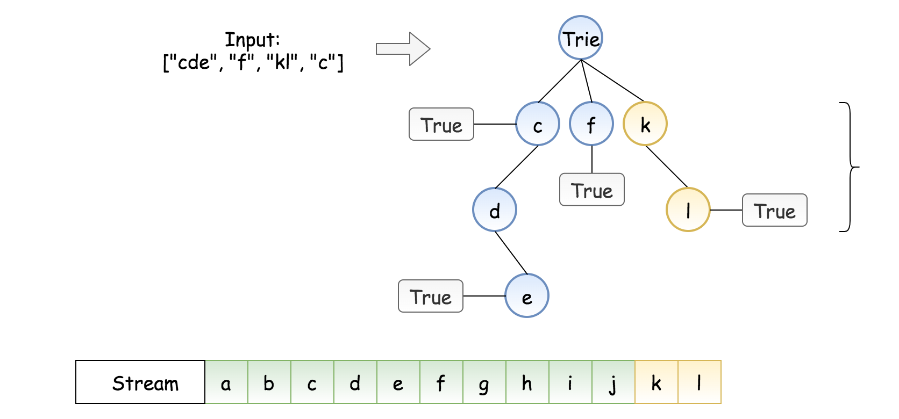
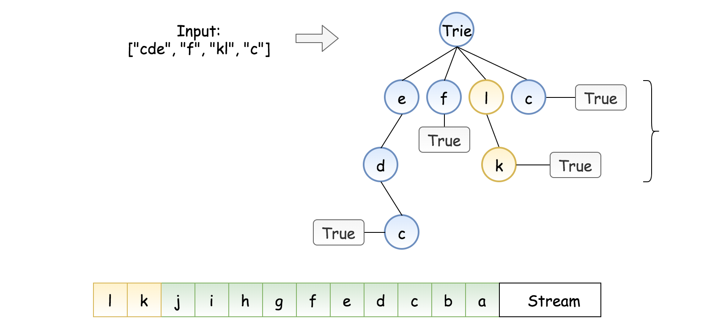
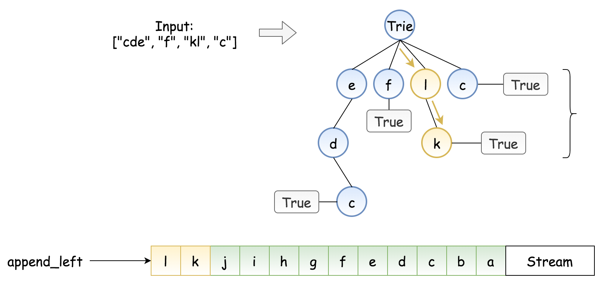

## Solution

---

### Prerequisites

This design article uses [data structure Trie](https://leetcode.com/articles/add-and-search-word/). If you never worked with trie before, you might want to check [this introduction article](https://leetcode.com/articles/add-and-search-word/) first to simplify the further reading.

### Approach 1: Trie

**Trie**

Trie is widely used in real life: autocomplete search, spell checker, T9 predictive text, [IP routing (longest prefix matching)](https://www.researchgate.net/figure/An-example-routing-table-and-the-corresponding-binary-trie-built-from-it_fig3_4236637), [some GCC containers](https://gcc.gnu.org/onlinedocs/libstdc++/ext/pb_ds/trie_based_containers.html).

Trie is something to think about if you're asked to design a structure to dynamically add and search strings.

**Intuition**

The first idea is to add all input words in the trie and then implement a standard search.



*Figure 1. Naive implementation.*

The problem is we don't know how many characters to match. In the example above, should we try to match the last three stream characters "jkl", the last two "kl", or the last one "l"?

The way to solve the problem is to notice that we always know the last character to match. That gives us an idea to build a trie of _reversed_ words, and try to match the _reversed_ stream of characters.



*Figure 2. Trie of the reversed words and the reversed stream of characters.*

This way, instead of multiple choices to match, we always have one path: to match character by character starting from the end of the stream. We could stop once we meet the "end of word" label, which means success. If we can't match a character before we meet that label, that means fail.

**Constructor StreamChecker**

Trie is usually implemented as nested hashmaps.
At each step, one has to verify if the child node to add is already present. If yes, we go one level down. If not, we add the node into a trie and then go one step down. The particularity of the current problem is that we add in the trie the _reversed_ words.

The last thing to discuss is how to store the reversed stream of characters. For that, we need a structure for which `appendleft` / `addFirst` operation takes a constant time. The good choice here is _double ended queue_, it's implemented as [deque](https://docs.python.org/3/library/collections.html#collections.deque) in Python, and as [ArrayDeque](https://docs.oracle.com/javase/8/docs/api/java/util/ArrayDeque.html) in Java.

```python
class StreamChecker:

    def __init__(self, words: List[str]):
        self.trie = {}
        self.stream = deque([])

        for word in set(words):
            node = self.trie
            for ch in word[::-1]:
                if not ch in node:
                    node[ch] = {}
                node = node[ch]
            node['$'] = word
```

**Complexity Analysis**

Let $N$ be the number of input words, and $M$ be the word length.

* Time complexity: $\mathcal{O}(N \cdot M)$.
We have $N$ words to process. At each step, we either examine or create a node in the trie. That takes only $M$ operations.

* Space complexity: $\mathcal{O}(N \cdot M)$.

In the worst case, the newly inserted key doesn't share a prefix with the keys already added in the trie. We have to add $N \cdot M$ new nodes, which takes $\mathcal{O}(N \cdot M)$ space.

**Query Implementation**

The search is very straightforward: we start from the end of the stream and check character by character, going down in trie.



*Figure 3. Search in trie.*

```python
def query(self, letter: str) -> bool:
    self.stream.appendleft(letter)

    node = self.trie
    for ch in self.stream:
        if '$' in node:
            return True
        if not ch in node:
            return False
        node = node[ch]
    return '$' in node
```

Let $M$ be the maximum length of a word length. _i.e._ the depth of trie.

* Time complexity: $\mathcal{O}(M)$

* Space complexity: $\mathcal{O}(M)$ to keep a stream of characters.
One could limit the size of the deque to be equal to the length of the longest input word.

**Implementation**

Let's bring everything together.

```python
class StreamChecker:

    def __init__(self, words: List[str]):
        self.trie = {}
        self.stream = deque([])

        for word in set(words):
            node = self.trie
            for ch in word[::-1]:
                if not ch in node:
                    node[ch] = {}
                node = node[ch]
            node['$'] = word

    def query(self, letter: str) -> bool:
        self.stream.appendleft(letter)

        node = self.trie
        for ch in self.stream:
            if '$' in node:
                return True
            if not ch in node:
                return False
            node = node[ch]
        return '$' in node
```