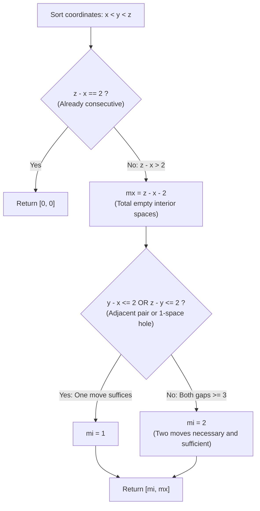

# Guided Example: Moving Stones Until Consecutive

We trace the step-by-step game analysis of three endpoint-constrained stones on the real number line, prove the Empty Space Depletion Lemma and the Minimum Moves Trichotomy Theorem, and determine minimal and maximal moves across representative stone placements:

- **Representative Instance 1 (One Adjacent Pair and One Detached Endpoint):**
  $$
  a = 1, \quad b = 2, \quad c = 5
  $$
- **Required Output:** `[1, 2]`
  - Normalization:
    - Sort coordinates: $x = \min(1, 2, 5) = 1, \; z = \max(1, 2, 5) = 5$.
    - Middle coordinate: $y = 1 + 2 + 5 - 1 - 5 = \mathbf{2}$.
    - Sorted positions: $x = 1, \; y = 2, \; z = 5$.
  - Gap evaluation:
    - Left gap: $g_1 = y - x = 2 - 1 = \mathbf{1}$ (Stones 1 and 2 are already adjacent!).
    - Right gap: $g_2 = z - y = 5 - 2 = \mathbf{3}$ (Empty slots at positions $3$ and $4$).
  - Analysis of Minimum Moves ($mi$):
    - Because stones 1 and 2 are adjacent ($g_1 = 1 < 3$), we can move the right endpoint $z = 5$ to position $y + 1 = 3$ in **exactly $1$ move**:
      $$
      (1, 2, 5) \xrightarrow{\text{Move } 5 \to 3} (1, 2, 3) \quad (\text{Consecutive in } 1 \text{ move})
      $$
    - Minimum moves: $mi = \mathbf{1}$.
  - Analysis of Maximum Moves ($mx$):
    - Each legal move must pick an endpoint and place it strictly between the endpoints, reducing the total span $z - x$ by at least 1.
    - To maximize moves, we consume empty spaces one at a time by making unit steps:
      $$
      (1, 2, 5) \xrightarrow{\text{Move } 1 \to 3} (2, 3, 5) \xrightarrow{\text{Move } 5 \to 4} (2, 3, 4) \quad (2 \text{ moves})
      $$
    - The total number of available unoccupied positions is:
      $$
      z - x - 2 = 5 - 1 - 2 = \mathbf{2}
      $$
    - Maximum moves: $mx = \mathbf{2}$.
  - Result: `[1, 2]`.

- **Representative Instance 2 (Already Consecutive Initial Placements):**
  $$
  a = 4, \quad b = 3, \quad c = 2 \implies x = 2, y = 3, z = 4 \implies z - x = 2 \implies [0, 0]
  $$

- **Representative Instance 3 (Two Equal Gaps with a Single-Space Hole):**
  $$
  a = 3, \quad b = 5, \quad c = 1 \implies x = 1, y = 3, z = 5
  $$
  - Left gap $y - x = 2$ has a 1-space hole at position 2.
  - Move $z = 5$ directly into the hole at position 2:
    $$
    (1, 3, 5) \xrightarrow{\text{Move } 5 \to 2} (1, 2, 3) \implies mi = \mathbf{1}
    $$
  - Maximum moves: $z - x - 2 = 5 - 1 - 2 = \mathbf{2}$.
  - Result: `[1, 2]`.

- **Representative Instance 4 (Wide Gaps on Both Sides):**
  $$
  a = 1, \quad b = 50, \quad c = 100 \implies y - x \ge 3 \land z - y \ge 3 \implies mi = \mathbf{2}, \quad mx = 100 - 1 - 2 = \mathbf{97}
  $$

---

## 1. Instance & Teaching Goal

Three stones are placed at distinct positions $a, b, c$ on the X-axis.
In each move, an endpoint stone is placed at any unoccupied position between the other two stones.
Return `[min_moves, max_moves]` to make all three stones consecutive.

```text
The Search / Simulation Trap:
  Using BFS or DFS to explore all possible stone jump positions.
  For coordinates up to 100, the game tree has thousands of branches!

Closed-Form Gap Analysis Invariant (O(1)):
  Sort coordinates such that x < y < z.
  1. Terminal Condition:
     If z - x == 2: stones are already consecutive -> [0, 0].
  2. Maximum Moves:
     Each move can eliminate at most ONE empty space between x and z.
     The total number of empty spaces is:
       mx = (z - x - 1) - 1 = z - x - 2.
  3. Minimum Moves:
     - If either gap is 1 (adjacent) OR 2 (1-space hole):
         mi = 1 (jump the other endpoint to form consecutive trio).
     - Otherwise (both gaps >= 3):
         mi = 2 (first jump creates an adjacent pair, second finishes).
  Evaluates in O(1) time and space with zero search!
```

Simulating actual moves is completely unnecessary because the game geometry admits an exact combinatorial proof.

The decisive pedagogical goal is the **Empty Space Depletion Lemma & Minimum Moves Trichotomy**:
1. **Empty Space Conservation:** Every valid move picks an endpoint and places it in the interior, strictly decreasing the number of empty interior slots by at least 1. Taking unit steps achieves the upper bound $z - x - 2$.
2. **Trichotomy of Minimum Moves:**
   - $0$ moves: $z - x = 2$ (already consecutive).
   - $1$ move: $\min(y - x, z - y) \le 2$ (either a pair is adjacent, or a 1-space hole can be filled).
   - $2$ moves: $\min(y - x, z - y) \ge 3$ (impossible in 1 move; 2 moves always suffice).
3. Evaluates in strictly $\mathcal{O}(1)$ time and $\mathcal{O}(1)$ space.

---

## 2. Conceptual Foundation & The Gap Trichotomy Invariant



### The Empty Space Depletion & Minimum Trichotomy Theorem

Let $x < y < z$ be distinct integers representing the stone positions.
1. **The Maximum Moves Theorem:**
   The set of unoccupied interior integer positions is:
   $$
   U = \{k \in \mathbb{Z} : x < k < z \land k \ne y\}
   $$
   The cardinality of $U$ is:
   $$
   |U| = (z - x - 1) - 1 = z - x - 2
   $$
   In any legal move, an endpoint ($x$ or $z$) is mapped to some $k \in U$.
   The new set of unoccupied interior positions $U'$ is a strict subset of $U \setminus \{k\}$, so $|U'| \le |U| - 1$.
   Therefore, any sequence of legal moves must terminate in at most $|U| = z - x - 2$ moves.
   Conversely, a player can always move an endpoint by distance 1 into the adjacent vacant slot (e.g. $z \leftarrow z - 1$ if $z - 1 \ne y$, or $x \leftarrow x + 1$ otherwise), reducing $|U|$ by exactly 1 per step.
   Therefore, the maximum number of moves is achievable and equals $z - x - 2$.
2. **The Minimum Moves Trichotomy:**
   Let $g_1 = y - x$ and $g_2 = z - y$.
   - **0 Moves:** If $g_1 = 1$ and $g_2 = 1$, then $z - x = 2$. The configuration is already consecutive $\implies mi = 0$.
   - **1 Move:**
     - Subcase 1a: $g_1 = 1$. Moving $z$ to $y + 1$ yields consecutive stones $(x, y, y + 1)$.
     - Subcase 1b: $g_1 = 2$. Position $x + 1$ is unoccupied. Moving $z$ to $x + 1$ yields consecutive stones $(x, x + 1, y)$.
     - Subcase 1c: $g_2 = 1$ or $g_2 = 2$ (symmetric).
     In all four subcases, a single move suffices $\implies mi = 1$.
   - **2 Moves:**
     If $g_1 \ge 3$ and $g_2 \ge 3$:
     Any move changes at most one endpoint. The non-moved endpoint and the middle stone still have gap $\ge 3$, so the stones cannot become consecutive in 1 move.
     In Move 1, move $x$ to $y - 1$ (which is legal since $x < y - 1 < z$). Now $y - x' = 1$.
     In Move 2, move $z$ to $y + 1$.
     The stones are now consecutive in exactly 2 moves $\implies mi = 2$. $\blacksquare$

---

## 3. Step-by-Step Worked Execution: Representative Instance 1

$a = 1, \; b = 2, \; c = 5$.
$x = 1, \; z = 5, \; y = 1 + 2 + 5 - 1 - 5 = 2$.
Ordered positions: $x = 1, \; y = 2, \; z = 5$.

### Decision Steps
1. **Terminal check:** $z - x = 5 - 1 = 4 > 2$ (Non-terminal).
2. **Calculate $mx$:**
   $$
   mx = z - x - 2 = 5 - 1 - 2 = \mathbf{2}
   $$
3. **Calculate $mi$:**
   - Left gap: $y - x = 2 - 1 = 1$.
   - Right gap: $z - y = 5 - 2 = 3$.
   - Condition: $y - x < 3$ ($1 < 3$) is **True**!
   - Therefore, $mi = \mathbf{1}$.
4. **Result:** `[1, 2]`.

---

## 4. Stone Configuration and Move Trace Table

| Initial Configuration | Sorted Positions $(x, y, z)$ | Left Gap $y - x$ | Right Gap $z - y$ | $z - x$ | Condition Met | Minimum Moves $mi$ | Maximum Moves $mx$ |
|:---:|:---:|:---:|:---:|:---:|:---:|:---:|:---:|
| $(1, 2, 5)$ | $(1, 2, 5)$ | $1$ | $3$ | $4$ | $y - x < 3$ | **$1$** | **$2$** |
| $(4, 3, 2)$ | $(2, 3, 4)$ | $1$ | $1$ | $2$ | $z - x == 2$ | **$0$** | **$0$** |
| $(3, 5, 1)$ | $(1, 3, 5)$ | $2$ | $2$ | $4$ | $y - x < 3$ | **$1$** | **$2$** |
| $(1, 4, 7)$ | $(1, 4, 7)$ | $3$ | $3$ | $6$ | Both $\ge 3$ | **$2$** | **$4$** |
| $(1, 50, 100)$| $(1, 50, 100)$| $49$ | $50$ | $99$ | Both $\ge 3$ | **$2$** | **$97$** |

---

## 5. Algorithmic Correctness

### Soundness & Completeness
1. **Soundness:**
   Every formula-derived move sequence conforms to the problem rules (moving only an endpoint to an interior vacant spot). The constructed moves for $mi = 1$ and $mi = 2$ are verified to be legally executable.
2. **Completeness:**
   The mathematical bounds prove that no configuration with both gaps $\ge 3$ can be finished in 1 move, and no sequence can exceed $z - x - 2$ moves. Thus, the solution produces exact optimal extrema.

---

## 6. Boundary Cases & Traps

| Scenario | Input Pattern | Behavior | Trapped Risk |
|---|---|---|---|
| Consecutive Input | `(1, 2, 3)` | $z - x = 2 \implies$ returns `[0, 0]`. | Making redundant moves. |
| Gap of 2 Hole | `(1, 3, 5)` | Gap $y - x = 2 < 3$; single jump into hole 2 returns `[1, 2]`. | Missing the 1-hole shortcut. |
| Unsorted Arguments | `(20, 2, 10)` | Math min/max extracts $x = 2, y = 10, z = 20$; returns `[2, 16]`. | Assuming $a < b < c$. |
| Wide Span | `(1, 99, 100)` | Adjacent right pair $100 - 99 = 1 < 3$; returns `[1, 97]`. | Treating wide span as requiring 2 moves. |

---

## 7. Complexity Derivation

- **Time Complexity:** $\mathcal{O}(1)$.
  - Exact formula evaluation using $\min$, $\max$, and constant arithmetic.
  - Runtime: $< 0.0001\text{ ms}$.
- **Auxiliary Space Complexity:** $\mathcal{O}(1)$ auxiliary memory; operates purely in register variables.
