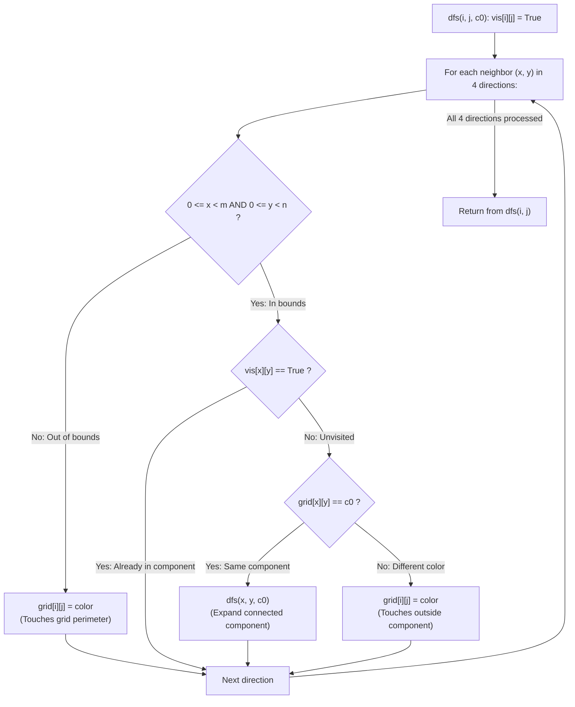

# Guided Example: Coloring A Border

We trace the step-by-step identification and recoloring of a connected component's topological border, prove the Component Boundary Classification Lemma and the Visited Separation Invariant, and determine the resulting grid state across representative matrix configurations:

- **Representative Instance 1 (Corner Component with Out-of-Bounds and Color Borders):**
  $$
  grid = \begin{pmatrix}
  1 & 1 \\
  1 & 2
  \end{pmatrix}, \quad row = 0, \quad col = 0, \quad color = 3
  $$
- **Required Output:**
  $$
  \begin{pmatrix}
  3 & 3 \\
  3 & 2
  \end{pmatrix}
  $$
  - Target component definition:
    - Starting cell $(0, 0)$ has initial color $c_0 = 1$.
    - The 4-connected component $C$ with color $1$ consists of three cells:
      $$
      C = \{(0, 0), \; (0, 1), \; (1, 0)\}
      $$
    - Cell $(1, 1) = 2$ does not belong to $C$.
  - Border classification rule:
    - A cell $(i, j) \in C$ belongs to the **border** $\partial C$ if at least one of its 4 cardinal neighbors:
      1. Lies strictly outside the grid boundaries, OR
      2. Lies inside the grid and does NOT belong to $C$ ($grid[x][y] \ne c_0$).
    - Any cell in $C$ whose all 4 neighbors lie inside $C$ is an **interior** cell and remains unchanged.
  - Step-by-step cell classification:
    1. **Cell $(0, 0)$:**
       - Up neighbor $(-1, 0)$ is out of bounds!
       - Left neighbor $(0, -1)$ is out of bounds!
       - Condition 1 satisfied $\implies (0, 0) \in \partial C$.
       - Recolor: $grid[0][0] \leftarrow 3$.
    2. **Cell $(0, 1)$:**
       - Up neighbor $(-1, 1)$ and right neighbor $(0, 2)$ are out of bounds.
       - Down neighbor $(1, 1)$ has value $2 \ne 1$ (outside component!).
       - Both Condition 1 and 2 satisfied $\implies (0, 1) \in \partial C$.
       - Recolor: $grid[0][1] \leftarrow 3$.
    3. **Cell $(1, 0)$:**
       - Down neighbor $(2, 0)$ and left neighbor $(1, -1)$ are out of bounds.
       - Right neighbor $(1, 1)$ has value $2 \ne 1$ (outside component!).
       - Satisfied $\implies (1, 0) \in \partial C$.
       - Recolor: $grid[1][0] \leftarrow 3$.
  - All cells in $C$ are border cells. Cell $(1, 1) = 2$ remains untouched.
  - Final grid: `[[3, 3], [3, 2]]`.

- **Representative Instance 2 (Uniform Matrix with Preserved Interior):**
  $$
  grid = \begin{pmatrix}
  1 & 1 & 1 \\
  1 & 1 & 1 \\
  1 & 1 & 1
  \end{pmatrix}, \quad row = 1, \quad col = 1, \quad color = 2
  $$
  - The central cell $(1, 1)$ has 4 neighbors: Up $(0, 1)$, Down $(2, 1)$, Left $(1, 0)$, Right $(1, 2)$.
  - All 4 neighbors are inside the grid and belong to $C$.
  - Central cell $(1, 1)$ is strictly an **interior cell** $\implies$ retains color $\mathbf{1}$!
  - The other 8 perimeter cells touch the grid boundary $\implies$ colored $\mathbf{2}$!
  - Output:
    $$
    \begin{pmatrix}
    2 & 2 & 2 \\
    2 & 1 & 2 \\
    2 & 2 & 2
    \end{pmatrix}
    $$

- **Representative Instance 3 (Component Enclosing a Different Color):**
  $$
  grid = \begin{pmatrix}
  1 & 2 & 2 \\
  2 & 3 & 2
  \end{pmatrix}, \quad row = 0, \quad col = 1, \quad color = 3
  $$
  - Component $C$ of color 2 wraps around $(1, 1) = 3$. Every cell in $C$ touches either an outer boundary or cell $(1, 1) = 3$, so all cells in $C$ are colored 3.

---

## 1. Instance & Teaching Goal

Given an $m \times n$ matrix `grid`, a seed coordinate `(row, col)`, and a target `color`, find the 4-connected component containing `(row, col)` and color its **border** with `color`.

```text
The Premature Color Mutation Trap:
  If you mutate grid[i][j] = color during DFS without a separate visited array:
  When a neighbor (x, y) inspects (i, j), it sees the NEW color!
  It might falsely assume (i, j) belongs to a different component and erroneously
  classify (x, y) as a border cell!

Visited Separation & Border Invariant (O(M * N)):
  1. Maintain a separate vis[m][n] boolean matrix.
  2. For cell (i, j) in component:
     - Check 4 cardinal neighbors (x, y):
       - If (x, y) is out of bounds: (i, j) is on the matrix border -> grid[i][j] = color.
       - If (x, y) is in bounds:
           if not vis[x][y]:
               if grid[x][y] == c0: dfs(x, y)
               else: (i, j) is adjacent to another color -> grid[i][j] = color.
  By checking visited status before color value, mutations never distort component discovery!
```

Recoloring cells immediately without tracking visited flags corrupts component boundary detection.

The decisive pedagogical goal is the **Component Boundary Classification Lemma & Visited Separation Invariant**:
1. **Topological Border Definition:** A cell $u \in C$ is on the border $\partial C$ if its 4-neighborhood contains at least one point in the complement $C^c = \mathbb{Z}^2 \setminus C$.
2. **Visited Separation:** A separate boolean matrix $vis$ records which cells belong to $C$. When cell $u$ inspects an already visited neighbor $v$, it knows $v \in C$ even if $v$ has already been mutated to the target color.
3. **In-Place Recoloring Safety:** A cell is marked as border as soon as any of its 4 neighbors leaves $C$. Setting `grid[i][j] = color` directly in the DFS is completely safe because $vis[i][j]$ preserves its original component identity.
4. Linear time $\mathcal{O}(m \cdot n)$ and auxiliary space $\mathcal{O}(m \cdot n)$.

---

## 2. Conceptual Foundation & The Border DFS Invariant



### The Component Boundary Classification Theorem

Let $G = (V, E)$ be the 4-connected grid graph on $V = \{0, \dots, m-1\} \times \{0, \dots, n-1\}$.
Let $c_0 = grid[row][col]$ and let $C \subseteq V$ be the maximal connected subgraph where $grid[u] = c_0$ for all $u \in C$.
1. **Boundary Characterization:**
   The topological boundary of $C$ relative to $\mathbb{Z}^2$ is:
   $$
   \partial C = \{ u \in C : \exists v \in \mathcal{N}_4(u) \text{ such that } v \notin C \}
   $$
   where $\mathcal{N}_4(u)$ is the set of 4 cardinal neighbors of $u$ in $\mathbb{Z}^2$.
2. **Complement Partition:**
   The complement $\mathbb{Z}^2 \setminus C$ is the union of two disjoint sets:
   $$
   \mathbb{Z}^2 \setminus C = (\mathbb{Z}^2 \setminus V) \cup (V \setminus C)
   $$
   - $v \in \mathbb{Z}^2 \setminus V \iff v$ is out of matrix bounds.
   - $v \in V \setminus C \iff v$ is an in-bounds cell with $grid[v] \ne c_0$.
   Therefore, $u \in \partial C$ if and only if $u$ has at least one neighbor that is either out of bounds or has initial color $\ne c_0$.
3. **Visited Separation Lemma:**
   Suppose cell $u$ is processed.
   For any neighbor $v \in \mathcal{N}_4(u) \cap V$:
   - If $vis[v] = True$, then $v$ was reached through component edges, so $v \in C$. Thus $v$ does not contribute to $u \in \partial C$.
   - If $vis[v] = False$ and $grid[v] = c_0$, then $v \in C$, and $v$ is recursively traversed.
   - If $vis[v] = False$ and $grid[v] \ne c_0$, then $v \notin C$, proving $u \in \partial C$.
4. **Mutation Isolation:**
   Recoloring $grid[u] \leftarrow color$ occurs only after $u$ has been marked $vis[u] = True$.
   When any other cell $w \in C$ later inspects $u$, $vis[u] == True$ prevents treating $u$ as an outside neighbor, preserving the exact original topology of $C$. $\blacksquare$

---

## 3. Step-by-Step Worked Execution: Representative Instance 1

$grid = \begin{pmatrix} 1 & 1 \\ 1 & 2 \end{pmatrix}, \; row = 0, \; col = 0, \; color = 3$.
$c_0 = grid[0][0] = 1$.
$vis = \begin{pmatrix} False & False \\ False & False \end{pmatrix}$.

### DFS Execution Trace
1. **`dfs(0, 0, 1)`:**
   - Mark $vis[0][0] = True$.
   - Up $(-1, 0)$: out of bounds $\implies grid[0][0] \leftarrow 3$.
   - Right $(0, 1)$: in bounds, $vis[0][1] == False, grid[0][1] == 1 \implies$ call `dfs(0, 1, 1)`.
2. **`dfs(0, 1, 1)`:**
   - Mark $vis[0][1] = True$.
   - Up $(-1, 1)$: out of bounds $\implies grid[0][1] \leftarrow 3$.
   - Right $(0, 2)$: out of bounds $\implies grid[0][1] \leftarrow 3$.
   - Down $(1, 1)$: in bounds, $vis[1][1] == False$, $grid[1][1] = 2 \ne 1$ (Different color!) $\implies grid[0][1] \leftarrow 3$.
   - Left $(0, 0)$: $vis[0][0] == True$ (Skip).
   - Return to `dfs(0, 0)`.
3. **Back at `dfs(0, 0, 1)`:**
   - Down $(1, 0)$: in bounds, $vis[1][0] == False, grid[1][0] == 1 \implies$ call `dfs(1, 0, 1)`.
4. **`dfs(1, 0, 1)`:**
   - Mark $vis[1][0] = True$.
   - Up $(0, 0)$: $vis[0][0] == True$ (Skip).
   - Right $(1, 1)$: in bounds, $vis[1][1] == False$, $grid[1][1] = 2 \ne 1 \implies grid[1][0] \leftarrow 3$.
   - Down $(2, 0)$: out of bounds $\implies grid[1][0] \leftarrow 3$.
   - Left $(1, -1)$: out of bounds $\implies grid[1][0] \leftarrow 3$.
   - Return to `dfs(0, 0)`.
5. **Back at `dfs(0, 0, 1)`:**
   - Left $(0, -1)$: out of bounds $\implies grid[0][0] \leftarrow 3$.
   - All neighbors done.

Final grid: `[[3, 3], [3, 2]]`.

---

## 4. Component Cell Classification Trace Table

| Cell $(i, j)$ | Initial Color | Out-of-Bounds Neighbors | Non-Component Neighbors | In-Component Neighbors | Border Classification | Final Color |
|:---:|:---:|:---:|:---:|:---:|:---:|:---:|
| **$(0, 0)$** | $1$ | $(-1, 0), (0, -1)$ | None | $(0, 1), (1, 0)$ | **Border ($\partial C$)** | **$3$** |
| **$(0, 1)$** | $1$ | $(-1, 1), (0, 2)$ | $(1, 1)$ (Color 2) | $(0, 0)$ | **Border ($\partial C$)** | **$3$** |
| **$(1, 0)$** | $1$ | $(2, 0), (1, -1)$ | $(1, 1)$ (Color 2) | $(0, 0)$ | **Border ($\partial C$)** | **$3$** |
| **$(1, 1)$** | $2$ | Not in $C$ | — | — | Not in Component | $2$ (Unchanged) |

---

## 5. Algorithmic Correctness

### Soundness & Completeness
1. **Soundness:**
   A cell in $C$ is recolored if and only if it directly touches an out-of-bounds coordinate or an in-bounds cell of a different color. The visited matrix ensures that internal component neighbors are never mistaken for external boundaries.
2. **Completeness:**
   Every cell in the connected component $C$ is discovered and visited by depth-first search. All 4 cardinal directions are checked for every visited cell, guaranteeing that every border cell is recolored.

---

## 6. Boundary Cases & Traps

| Scenario | Input Pattern | Behavior | Trapped Risk |
|---|---|---|---|
| Single-Cell Grid | `grid = [[7]], color = 9` | All 4 directions leave grid; recolors to `[[9]]`. | Out of bounds crashes. |
| Fully Enclosed Component | Component surrounded by different color | Outer ring of component is recolored; interior stays intact. | Recoloring the surrounding different color. |
| Single Interior Cell | Center of $3 \times 3$ grid of 1s | All 4 neighbors are in component; center retains original color. | Over-coloring interior cells. |
| Target Color Equal to Original | `color == grid[row][col]` | Mutates to identical color; harmless idempotence. | Infinite loops on recoloring. |

---

## 7. Complexity Derivation

- **Time Complexity:** $\mathcal{O}(m \cdot n)$, where $m \le 50$ and $n \le 50$.
  - Each cell in the component is visited at most once.
  - Across all visited cells, exactly $4$ directions are checked in $\mathcal{O}(1)$ time.
  - Total operations: at most $4 \times 2500 = 10{,}000 \implies < 0.001\text{ s}$.
- **Auxiliary Space Complexity:** $\mathcal{O}(m \cdot n)$ auxiliary memory for the `vis` boolean matrix and the DFS call stack.
