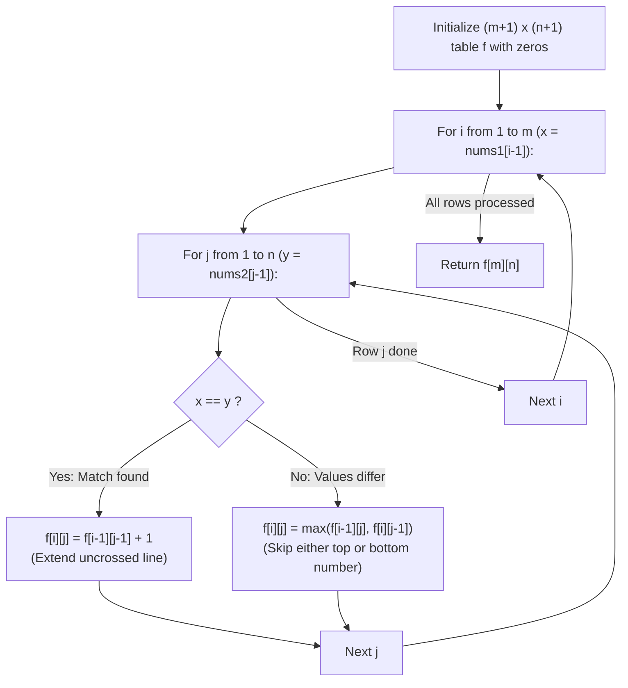

# Guided Example: Uncrossed Lines

We trace the step-by-step evaluation of maximum non-intersecting line segments between two parallel sequences, prove the Geometric Non-Crossing Lemma and the Longest Common Subsequence (LCS) Isomorphism Theorem, and determine maximal uncrossed line counts across representative arrays:

- **Representative Instance 1 (Crossing Inversion Requiring Optimal Selection):**
  $$
  nums1 = [1, \; 4, \; 2], \quad nums2 = [1, \; 2, \; 4]
  $$
- **Required Output:** `2`
  - Problem objective:
    - Draw connecting lines between identical numbers $nums1[i] == nums2[j]$.
    - No two lines may intersect, and no endpoint can be shared.
  - The Geometric Non-Crossing Invariant:
    - Place $nums1$ on the top horizontal line $y = 1$ at positions $x = 0, 1, 2$.
    - Place $nums2$ on the bottom horizontal line $y = 0$ at positions $x = 0, 1, 2$.
    - A line connects $(i, 1)$ to $(j, 0)$.
    - Two lines $(i_1, j_1)$ and $(i_2, j_2)$ with $i_1 < i_2$ do NOT intersect if and only if:
      $$
      j_1 < j_2
      $$
    - If $j_1 \ge j_2$, the lines cross in the plane!
  - Candidate matching pairs:
    - Number $1$: index $0$ in $nums1$, index $0$ in $nums2$ $\implies (0, 0)$.
    - Number $4$: index $1$ in $nums1$, index $2$ in $nums2$ $\implies (1, 2)$.
    - Number $2$: index $2$ in $nums1$, index $1$ in $nums2$ $\implies (2, 1)$.
  - Crossing conflict between $4$ and $2$:
    - For line $(1, 2)$ (connecting $4$) and line $(2, 1)$ (connecting $2$):
      $$
      i_1 = 1 < i_2 = 2 \quad \text{but} \quad j_1 = 2 > j_2 = 1 \implies \text{Lines Cross!}
      $$
    - We must choose either $(1, 2)$ or $(2, 1)$, but never both.
  - Compatible subsets:
    - Subset A: $\{(0, 0), (1, 2)\}$ (matches $1$ and $4$): $0 < 1$ and $0 < 2$ (Valid, size 2).
    - Subset B: $\{(0, 0), (2, 1)\}$ (matches $1$ and $2$): $0 < 2$ and $0 < 1$ (Valid, size 2).
  - Maximum uncrossed lines: $\mathbf{2}$.
  - The 2D DP Table $f[i][j]$ (rows: $nums1$, cols: $nums2$):
    $$
    \begin{pmatrix}
    \text{Base} & \emptyset & 1 & 2 & 4 \\
    \emptyset & 0 & 0 & 0 & 0 \\
    1 & 0 & \mathbf{1} & 1 & 1 \\
    4 & 0 & 1 & 1 & \mathbf{2} \\
    2 & 0 & 1 & \mathbf{2} & \mathbf{2}
    \end{pmatrix}
    $$
    - $f[3][3] = \mathbf{2}$.

- **Representative Instance 2 (Repeated Values with Multiple Crossings):**
  $$
  nums1 = [2, 5, 1, 2, 5], \quad nums2 = [10, 5, 2, 1, 5, 2] \implies \text{LCS} = (5, 1, 2) \text{ or } (2, 1, 5) \implies \mathbf{3}
  $$

- **Representative Instance 3 (Completely Reversed Unique Order):**
  $$
  nums1 = [1, 2, 3, 4], \quad nums2 = [4, 3, 2, 1] \implies \text{All pair matchings cross} \implies \mathbf{1}
  $$

---

## 1. Instance & Teaching Goal

Given two integer arrays `nums1` and `nums2`, return the **maximum number of connecting lines** that can be drawn between identical values $nums1[i] == nums2[j]$ such that no two lines intersect.

```text
The Geometric Intersection Dilemma:
  Connecting nums1[i] to nums2[j] creates a line segment in R^2.
  Do we need computational geometry, segment intersection tests, or sweeping lines?

LCS Isomorphism Theorem (O(M * N)):
  Notice: Top indices strictly increase (i1 < i2 < ... < ik).
  No lines cross IF AND ONLY IF bottom indices strictly increase (j1 < j2 < ... < jk)!
  Therefore:
    Any valid uncrossed connection set corresponds 1-to-1 with a
    COMMON SUBSEQUENCE of nums1 and nums2!
  Maximizing uncrossed lines is IDENTICAL to finding the
  Longest Common Subsequence (LCS)!
  Solved cleanly via classical 2D dynamic programming in O(M * N) time!
```

Geometric segment intersection tests are completely replaced by standard monotonic sequence alignment.

The decisive pedagogical goal is the **Geometric Non-Crossing Lemma & LCS Isomorphism**:
1. **Geometric Non-Crossing Lemma:** Two segments $(i_1, 1) \leftrightarrow (j_1, 0)$ and $(i_2, 1) \leftrightarrow (j_2, 0)$ with $i_1 < i_2$ do not intersect if and only if $j_1 < j_2$.
2. **Order Preservation:** Preserving relative index order on both lines means matching elements appear in strictly increasing positions in both arrays, which is the definition of a common subsequence.
3. **Optimal Substructure:** If $nums1[i-1] == nums2[j-1]$, the match can be included to yield $f[i-1][j-1] + 1$. Otherwise, we discard one endpoint via $\max(f[i-1][j], f[i][j-1])$.
4. Polynomial time $\mathcal{O}(m \cdot n)$ and auxiliary space $\mathcal{O}(m \cdot n)$ (or $\mathcal{O}(n)$).

---

## 2. Conceptual Foundation & The LCS Isomorphism Invariant



### The Geometric Non-Crossing & LCS Isomorphism Theorem

Let line segments be drawn in $\mathbb{R}^2$ between top points $(i, 1)$ and bottom points $(j, 0)$.
1. **The Non-Crossing Condition:**
   Consider two segments $L_1$ from $(i_1, 1)$ to $(j_1, 0)$ and $L_2$ from $(i_2, 1)$ to $(j_2, 0)$ with $i_1 < i_2$.
   Any point on $L_1$ has coordinates $P_1(t) = ((1 - t)i_1 + tj_1, \; 1 - t)$ for $t \in [0, 1]$.
   Any point on $L_2$ has coordinates $P_2(t) = ((1 - t)i_2 + tj_2, \; 1 - t)$ for $t \in [0, 1]$.
   $L_1$ and $L_2$ intersect if and only if there exists $t^* \in [0, 1]$ such that $P_1(t^*) = P_2(t^*)$.
   Equating X-coordinates at $t^*$:
   $$
   (1 - t^*)i_1 + t^* j_1 = (1 - t^*)i_2 + t^* j_2 \iff (1 - t^*)(i_2 - i_1) + t^*(j_2 - j_1) = 0
   $$
   Define $\Delta(t) = (1 - t)(i_2 - i_1) + t(j_2 - j_1)$.
   Since $\Delta(t)$ is affine:
   - At $t = 0$: $\Delta(0) = i_2 - i_1 > 0$ (since $i_1 < i_2$).
   - If $j_2 > j_1$: then $j_2 - j_1 > 0 \implies \Delta(t) > 0$ for all $t \in [0, 1]$, so no intersection occurs!
   - If $j_2 \le j_1$: then $\Delta(1) = j_2 - j_1 \le 0$. By the Intermediate Value Theorem, $\Delta(t^*) = 0$ for some $t^* \in (0, 1]$, meaning the segments intersect!
   Therefore, $L_1$ and $L_2$ do not intersect $\iff j_1 < j_2$.
2. **LCS Isomorphism:**
   A valid family of $k$ uncrossed lines is an ordered set of index pairs:
   $$
   (i_1, j_1) < (i_2, j_2) < \dots < (i_k, j_k) \quad \text{such that } nums1[i_r] = nums2[j_r]
   $$
   Since $i_1 < i_2 < \dots < i_k$ and $j_1 < j_2 < \dots < j_k$, the values $v_r = nums1[i_r] = nums2[j_r]$ form a common subsequence of $nums1$ and $nums2$.
   Conversely, any common subsequence of length $k$ produces $k$ valid uncrossed lines.
   Therefore, the maximum number of uncrossed lines is identically the length of the Longest Common Subsequence of $nums1$ and $nums2$. $\blacksquare$

---

## 3. Step-by-Step Worked Execution: Representative Instance 1

$nums1 = [1, 4, 2], \; nums2 = [1, 2, 4], \; m = 3, \; n = 3$.
Table $f$ initialized to $(3 + 1) \times (3 + 1) = 4 \times 4$ zeros.

### Table Evaluation Step-by-Step
- **Row $i = 1$ ($x = nums1[0] = 1$):**
  - $j = 1$ ($y = nums2[0] = 1$): $x == y \implies f[1][1] = f[0][0] + 1 = \mathbf{1}$.
  - $j = 2$ ($y = nums2[1] = 2$): $x \ne y \implies f[1][2] = \max(f[0][2], f[1][1]) = \max(0, 1) = 1$.
  - $j = 3$ ($y = nums2[2] = 4$): $x \ne y \implies f[1][3] = \max(f[0][3], f[1][2]) = 1$.
- **Row $i = 2$ ($x = nums1[1] = 4$):**
  - $j = 1$ ($y = 1$): $4 \ne 1 \implies f[2][1] = \max(f[1][1], f[2][0]) = 1$.
  - $j = 2$ ($y = 2$): $4 \ne 2 \implies f[2][2] = \max(f[1][2], f[2][1]) = 1$.
  - $j = 3$ ($y = 4$): $4 == 4 \implies f[2][3] = f[1][2] + 1 = 1 + 1 = \mathbf{2}$!
- **Row $i = 3$ ($x = nums1[2] = 2$):**
  - $j = 1$ ($y = 1$): $2 \ne 1 \implies f[3][1] = \max(f[2][1], f[3][0]) = 1$.
  - $j = 2$ ($y = 2$): $2 == 2 \implies f[3][2] = f[2][1] + 1 = 1 + 1 = \mathbf{2}$!
  - $j = 3$ ($y = 4$): $2 \ne 4 \implies f[3][3] = \max(f[2][3], f[3][2]) = \max(2, 2) = \mathbf{2}$.

Final answer: $f[3][3] = \mathbf{2}$.

---

## 4. 2D State Recurrence Trace Matrix

| $nums1 \backslash nums2$ | $\emptyset$ ($j = 0$) | $1$ ($j = 1$) | $2$ ($j = 2$) | $4$ ($j = 3$) | Active Decision Applied |
|:---:|:---:|:---:|:---:|:---:|:---:|
| **$\emptyset$ ($i = 0$)** | $0$ | $0$ | $0$ | $0$ | Empty prefix base case |
| **$1$ ($i = 1$)** | $0$ | **$1$** ($1 == 1$) | $1$ | $1$ | Initial line drawn $(0 \leftrightarrow 0)$ |
| **$4$ ($i = 2$)** | $0$ | $1$ | $1$ | **$2$** ($4 == 4$) | Extends $(1 \leftrightarrow 1)$ to $(4 \leftrightarrow 4)$ |
| **$2$ ($i = 3$)** | $0$ | $1$ | **$2$** ($2 == 2$) | **$2$** | Extends $(1 \leftrightarrow 1)$ to $(2 \leftrightarrow 2)$ |

---

## 5. Algorithmic Correctness

### Soundness & Completeness
1. **Soundness:**
   Every transition in the recurrence constructs an uncrossed line matching by pairing matching elements whose relative order strictly matches earlier pairs.
2. **Completeness:**
   Standard LCS dynamic programming explores both options (matching the current pair or discarding either element) and takes the maximum, guaranteeing the global optimum over all topological common subsequences.

---

## 6. Boundary Cases & Traps

| Scenario | Input Pattern | Behavior | Trapped Risk |
|---|---|---|---|
| Disjoint Alphabets | `nums1 = [1, 2], nums2 = [3, 4]` | No characters equal; returns $0$. | Negative index lookups. |
| All Elements Equal | `nums1 = [7, 7, 7], nums2 = [7, 7]` | Diagonal transitions everywhere; returns $\min(m, n) = 2$. | Overcounting duplicates at same index. |
| Completely Inverted Sequence | `[1, 2, 3]` and `[3, 2, 1]` | Any two lines cross; returns $1$. | Allowing crossed connections. |
| Single-Element Sequences | `nums1 = [5], nums2 = [1, 5, 5]` | Matches first occurrence of 5; returns $1$. | Loop boundary underflow. |

---

## 7. Complexity Derivation

- **Time Complexity:** $\mathcal{O}(m \cdot n)$, where $m = \text{len}(nums1) \le 500$ and $n = \text{len}(nums2) \le 500$.
  - The nested loops visit each of the $(m + 1)(n + 1) \le 251{,}001$ cells once.
  - Each cell performs $\mathcal{O}(1)$ comparisons and arithmetic operations.
  - Total time: $< 0.05\text{ s}$.
- **Auxiliary Space Complexity:** $\mathcal{O}(m \cdot n)$ auxiliary memory for the 2D DP matrix $f$ (can be compressed to $\mathcal{O}(n)$ using a 1D rolling array).
