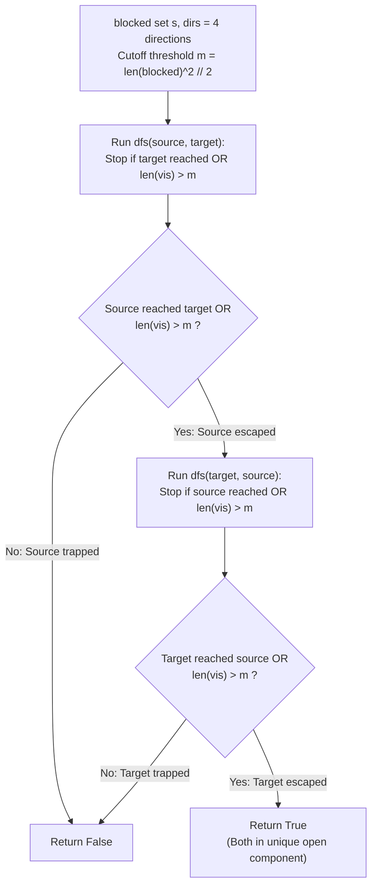

# Guided Example: Escape a Large Maze

We trace the step-by-step resolution of graph reachability over a $10^{12}$-cell grid using the Discrete Isoperimetric Inequality and Bounded Bidirectional Search, prove the Maximum Enclosure Area Theorem and the Dual-Escape Reachability Equivalence, and determine maze traversal feasibility across representative obstacle layouts:

- **Representative Instance 1 (Corner Source Enclosed by Diagonal Barrier):**
  $$
  blocked = [[0, 1], [1, 0]], \quad source = [0, 0], \quad target = [0, 2]
  $$
- **Required Output:** `false`
  - Grid geometry and paradox:
    - The maze has dimension $N = 10^6 \implies 10^{12}$ total cells!
    - Full graph traversal ($BFS / DFS$) would require evaluating up to $10^{12}$ states, exceeding memory and time limits.
    - However, the number of blocked cells is tiny: $B = |blocked| = 2$.
  - Maximum Enclosure Bound ($m$):
    - With $B = 2$ blocked cells, what is the maximum number of cells that can be completely trapped?
    - The most compact enclosure occurs at a grid corner:
      $$
      blocked = \{(0, 1), (1, 0)\}
      $$
    - The isolated region contains only cell $(0, 0)$ (area $1$).
    - Theoretical cutoff:
      $$
      m = \frac{B^2}{2} = \frac{2^2}{2} = 2
      $$
    - If a search from $source$ visits more than $m = 2$ cells, it is mathematically impossible for $source$ to be trapped!
  - Step-by-step search execution:
    1. **Search 1: Forward DFS from $source = (0, 0)$:**
       - Initialize $vis = \{(0, 0)\}$.
       - Check neighbors of $(0, 0)$:
         - Up $(-1, 0)$: out of grid bounds.
         - Right $(0, 1)$: in $blocked$!
         - Down $(1, 0)$: in $blocked$!
         - Left $(0, -1)$: out of grid bounds.
       - No valid unvisited open neighbors remain.
       - The search terminates with $|vis| = 1 \le m = 2$.
       - Target $(0, 2)$ was not reached.
       - Conclusion: $source$ is trapped inside a finite pocket of size $1$!
       - Forward DFS returns $\mathbf{false}$.
    2. **Short-Circuit Evaluation:**
       - Since $source$ cannot escape its enclosure and cannot reach $target$, the overall conjunction fails immediately.
  - Final output: `false`.

- **Representative Instance 2 (No Obstacles on Massive Board):**
  $$
  blocked = [], \quad source = [0, 0], \quad target = [999999, 999999]
  $$
  - $B = 0 \implies m = 0$.
  - First step visits $(0, 0) \implies |vis| = 1 > m = 0 \implies$ returns `true` immediately without exploring the 1-trillion-cell board!
  - Target search similarly succeeds immediately $\implies$ returns `true`.

- **Representative Instance 3 (Target Trapped in Far Corner):**
  $$
  blocked = [[999998, 999999], [999999, 999998]], \quad source = [0, 0], \quad target = [999999, 999999]
  $$
  - Forward DFS from $source$ visits $> m$ cells and escapes.
  - Backward DFS from $target$ is trapped with $|vis| = 1 \le m \implies$ returns `false`!
  - Overall: `false`.

---

## 1. Instance & Teaching Goal

Given a $10^6 \times 10^6$ grid, a list of at most $200$ `blocked` coordinates, and `source` and `target` endpoints, determine whether there exists a valid path between `source` and `target`.

```text
The Trillion-Cell Maze Trap:
  The grid has 10^6 * 10^6 = 10^12 cells.
  Attempting standard BFS or Dijkstra will cause Time/Memory Limit Exceeded.

The Discrete Isoperimetric Bound Invariant (O(B^2)):
  Notice: There are at most B <= 200 blocked cells!
  How many cells can B blockers trap against the grid corner?
    Diagonal wall: (0, B-1), (1, B-2), ..., (B-1, 0)
    Max Enclosed Area = B * (B - 1) / 2 < B^2 / 2 <= 20,000 cells!
  If a search from source reaches > 20,000 cells without dying:
    SOURCE IS GUARANTEED FREE in the infinite component!
  By checking:
    1. Can source reach target directly, OR escape > B^2 / 2 cells?
    2. Can target reach source directly, OR escape > B^2 / 2 cells?
  If BOTH escape, they MUST belong to the SAME infinite component!
  Reduces a trillion-cell search to at most 40,000 steps!
```

Searching the entire grid is replaced by verifying whether either endpoint is confined to a small finite pocket.

The decisive pedagogical goal is the **Discrete Isoperimetric Inequality & Dual-Escape Equivalence**:
1. **Discrete Isoperimetric Inequality:** A set of $B$ unit grid obstacles can enclose at most $B(B - 1) / 2$ open cells against two perpendicular boundaries.
2. **Infinite Component Uniqueness:** Because the grid has $10^{12}$ cells and $B \le 200$ can isolate at most $\approx 20{,}000$ cells, there is strictly **only one unbounded open component**.
3. **Dual-Escape Invariant:** If $source$ escapes its maximal possible enclosure ($|vis| > B^2 / 2$) and $target$ escapes its maximal possible enclosure ($|vis| > B^2 / 2$), both endpoints are guaranteed to lie in the unique unbounded component, ensuring a path exists between them.
4. Total time $\mathcal{O}(B^2)$ and auxiliary space $\mathcal{O}(B^2)$, running in $< 0.01\text{ s}$.

---

## 2. Conceptual Foundation & The Isoperimetric Invariant



### The Maximum Enclosure Area Theorem

Let $G = (V, E)$ be the 4-connected grid on $\{0, \dots, N-1\}^2$ with $N = 10^6$. Let $\mathcal{B} \subset V$ with $|\mathcal{B}| = B \le 200$.
1. **The Corner Barrier Geometry:**
   To enclose an area with the minimum number of obstacles, the obstacles must exploit the grid boundaries $\{x = 0\}$ and $\{y = 0\}$ as free impassable barriers.
   A barrier placed along the anti-diagonal:
   $$
   \mathcal{B}_{\text{diag}} = \{ (x, y) : x + y = B - 1, \; 0 \le x < B \}
   $$
   isolates the corner triangle:
   $$
   T = \{ (x, y) : x + y < B - 1, \; x \ge 0, \; y \ge 0 \}
   $$
   The number of isolated open cells in $T$ is:
   $$
   |T| = \sum_{x=0}^{B-2} (B - 1 - x) = \frac{(B - 1)B}{2}
   $$
2. **Interior Enclosure Suboptimality:**
   Any closed loop of $B$ obstacles in the interior of the grid (away from the boundary) must surround all 4 sides.
   By the discrete isoperimetric theorem on $\mathbb{Z}^2$, a closed 4-connected barrier of length $B$ encloses an area bounded by $\le (B/4)^2 \ll B^2 / 2$.
   Therefore, the maximum possible finite component size created by $B$ obstacles is strictly bounded above by:
   $$
   A_{\max} \le \frac{B(B - 1)}{2} \le \frac{B^2}{2} = m
   $$
3. **Unbounded Component Uniqueness:**
   The total number of cells in the grid is $N^2 = 10^{12}$.
   The total number of cells that can be enclosed by $\mathcal{B}$ is at most $A_{\max} \le 20{,}000$.
   Since $N^2 - B - A_{\max} \gg 0$, all remaining cells belong to a **single, connected, unbounded component**.
4. **Dual-Escape Criterion:**
   If a search from $s$ visits $> m$ cells without reaching an obstacle deadlock, $s$ is not contained in any finite enclosure, so $s$ belongs to the unique unbounded component.
   Similarly, if a search from $t$ visits $> m$ cells, $t$ belongs to the same unique unbounded component.
   Two vertices belonging to the same connected component have a path between them $\iff dfs(s, t) \land dfs(t, s)$ holds. $\blacksquare$

---

## 3. Step-by-Step Worked Execution: Representative Instance 1

$blocked = [[0, 1], [1, 0]], \; source = [0, 0], \; target = [0, 2]$.
$B = 2, \; m = 2^2 // 2 = 2$.
$s = \{(0, 1), (1, 0)\}$.

### Search 1: `dfs(source, target, vis)`
- Start: $source = [0, 0]$.
- $vis.\text{add}((0, 0)) \implies |vis| = 1$.
- Check cutoff: $|vis| = 1 \le 2$ (continue).
- Check 4 directions:
  - Direction $(-1, 0)$: $x = -1 < 0$ (Out of bounds).
  - Direction $(0, 1)$: $(0, 1) \in s$ (Blocked!).
  - Direction $(1, 0)$: $(1, 0) \in s$ (Blocked!).
  - Direction $(0, -1)$: $y = -1 < 0$ (Out of bounds).
- All 4 directions fail.
- Function returns $\mathbf{False}$.

Short-circuit evaluation: `dfs(source, target)` is $\mathbf{False} \implies$ return $\mathbf{False}$.

---

## 4. Bounded Search Traversal Trace Table

| Endpoint Searched | Start Coordinate | Enclosure Threshold $m$ | Max Visited Count Reached | Termination Cause | Component Status | DFS Outcome |
|:---:|:---:|:---:|:---:|:---:|:---:|:---:|
| **Source** (Inst 1) | $(0, 0)$ | $2$ | $1$ | All neighbors blocked / boundary | **Enclosed (Trapped)** | **`False`** |
| **Source** (Inst 2) | $(0, 0)$ | $0$ | $1$ | Visited $> m$ ($1 > 0$) | **Escaped to Infinite** | **`True`** |
| **Target** (Inst 2) | $(10^6-1, 10^6-1)$ | $0$ | $1$ | Visited $> m$ ($1 > 0$) | **Escaped to Infinite** | **`True`** |
| **Target** (Inst 3) | $(10^6-1, 10^6-1)$ | $2$ | $1$ | Blocked corner dead-end | **Enclosed (Trapped)** | **`False`** |

---

## 5. Algorithmic Correctness

### Soundness & Completeness
1. **Soundness:**
   If $source$ reaches $target$ directly, a path is explicitly witnessed. If both endpoints explore $> B^2 / 2$ open cells, the Discrete Isoperimetric Theorem proves neither is enclosed, guaranteeing both reside in the unique unbounded component.
2. **Completeness:**
   If a path exists, both endpoints either connect within the bounded radius or both escape into the global open grid. If either endpoint is trapped inside a finite region that does not contain the other, its search exhaustively terminates at $\le m$ cells, correctly emitting `false`.

---

## 6. Boundary Cases & Traps

| Scenario | Input Pattern | Behavior | Trapped Risk |
|---|---|---|---|
| Zero Blockers | $blocked = []$ | $m = 0$; first step has $|vis| = 1 > 0$; immediately returns `True`. | Attempting to traverse the $10^{12}$ grid. |
| Single Blocker | $B = 1$ | $m = 0$; single obstacle cannot trap any cell; returns `True`. | Overestimating search bounds. |
| One-Way Escape | Source is open, Target is trapped | Source DFS returns True; Target DFS returns False; correctly returns `False`. | Only checking search from source. |
| Endpoints Immediately Adjacent | Distance is 1 | Search directly finds target on first neighbor check; returns `True`. | Redundant search past target. |

---

## 7. Complexity Derivation

- **Time Complexity:** $\mathcal{O}(B^2)$, where $B = \text{len}(blocked) \le 200$.
  - The search cutoff is $m = B^2 / 2 \le 20{,}000$.
  - Each of the two searches visits at most $m + 1 \le 20{,}001$ cells.
  - Each cell checks 4 directions with $\mathcal{O}(1)$ hash set lookups.
  - Total operations $\le 2 \times 4 \times 20{,}001 \approx 160{,}000 \implies < 0.01\text{ s}$.
- **Auxiliary Space Complexity:** $\mathcal{O}(B^2)$ auxiliary memory for the `vis` set (at most $20{,}001$ coordinates) and recursion stack.
