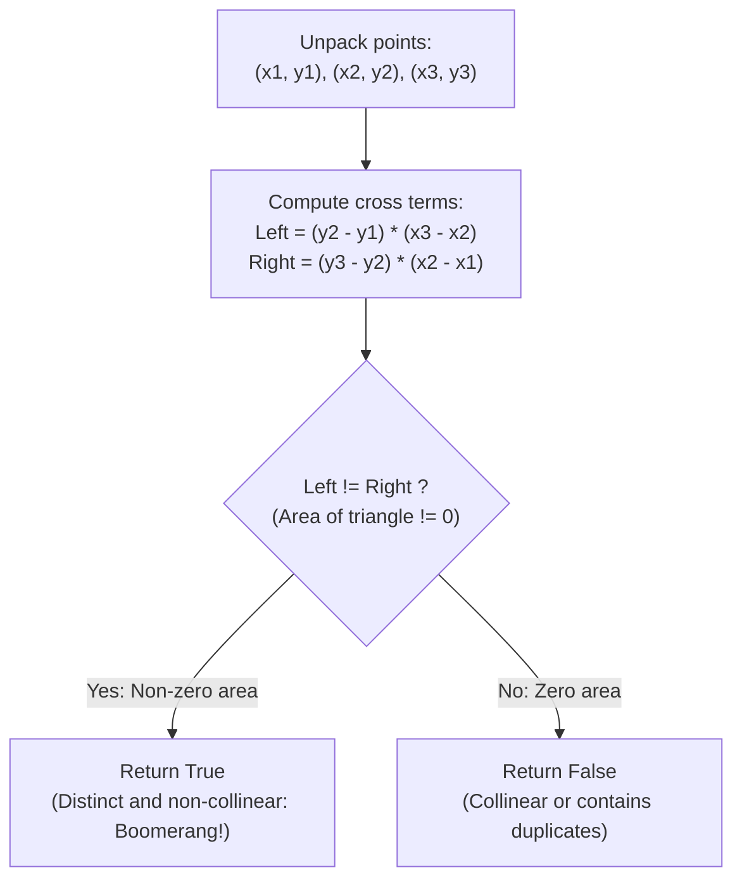

# Guided Example: Valid Boomerang

We trace the step-by-step geometric verification of three planar points using the 2D Cross Product Determinant, prove the Signed Area Non-Degeneracy Theorem and the Simultaneous Distinctness Lemma, and determine boomerang validity across representative planar configurations:

- **Representative Instance 1 (Non-Collinear Planar Triangle):**
  $$
  points = [[1, 1], \; [2, 3], \; [3, 2]]
  $$
- **Required Output:** `true`
  - Problem definition:
    - A set of three points $P_1 = (x_1, y_1), P_2 = (x_2, y_2), P_3 = (x_3, y_3)$ is a **boomerang** if and only if:
      1. All three points are pairwise distinct: $P_1 \ne P_2 \land P_2 \ne P_3 \land P_1 \ne P_3$.
      2. The three points do not lie on a single straight line (non-collinear).
  - The 2D Cross Product Transformation:
    - Instead of computing slopes $\frac{\Delta y}{\Delta x}$ (which risks division-by-zero on vertical lines and floating-point roundoff errors), construct consecutive edge vectors:
      $$
      \vec{u} = P_2 - P_1 = (x_2 - x_1, \; y_2 - y_1) = (2 - 1, \; 3 - 1) = (1, \; 2)
      $$
      $$
      \vec{v} = P_3 - P_2 = (x_3 - x_2, \; y_3 - y_2) = (3 - 2, \; 2 - 3) = (1, \; -1)
      $$
    - The 2D cross product (determinant of the $2 \times 2$ coordinate matrix) is:
      $$
      \vec{u} \times \vec{v} = (x_2 - x_1)(y_3 - y_2) - (y_2 - y_1)(x_3 - x_2)
      $$
    - Substituting values:
      $$
      \vec{u} \times \vec{v} = (1)(-1) - (2)(1) = -1 - 2 = -3
      $$
    - Rearranged product equality test:
      $$
      (y_2 - y_1)(x_3 - x_2) \overset{?}{\ne} (y_3 - y_2)(x_2 - x_1)
      $$
      $$
      (2)(1) = 2 \quad \text{vs} \quad (-1)(1) = -1 \implies 2 \ne -1
      $$
    - The products are unequal ($\vec{u} \times \vec{v} = -3 \ne 0$).
    - The signed area is non-zero, proving the points are distinct and non-collinear!
  - Output: `true`.

- **Representative Instance 2 (Collinear Diagonal Line):**
  $$
  points = [[1, 1], \; [2, 2], \; [3, 3]]
  $$
  - $\vec{u} = (1, 1), \; \vec{v} = (1, 1)$.
  - $(y_2 - y_1)(x_3 - x_2) = (1)(1) = 1$.
  - $(y_3 - y_2)(x_2 - x_1) = (1)(1) = 1$.
  - Equality holds ($1 == 1 \implies \vec{u} \times \vec{v} = 0$). Output: `false`.

- **Representative Instance 3 (Duplicate Points):**
  $$
  points = [[0, 0], \; [1, 1], \; [1, 1]] \implies \vec{v} = (0, 0) \implies \vec{u} \times \vec{v} = 0 \implies \text{false}
  $$

- **Representative Instance 4 (Vertical Collinear Line with $\Delta x = 0$):**
  $$
  points = [[7, 0], \; [7, 50], \; [7, 100]] \implies (50)(0) == (50)(0) == 0 \implies \text{false}
  $$

---

## 1. Instance & Teaching Goal

Given three coordinates $P_1, P_2, P_3$, determine if they form a boomerang (three distinct, non-collinear points).

```text
The Slope Division Trap:
  Checking if slope(P1, P2) == slope(P2, P3):
    slope = (y2 - y1) / (x2 - x1)
  If x2 == x1 (vertical line), division by ZERO crashes the program!
  Using floats (slope == slope) causes precision issues on large coordinates.
  Also requires separate pairwise distinct checks (P1 != P2, P2 != P3, P1 != P3).

The 2D Cross Product Determinant Invariant (O(1)):
  Cross multiplication converts slope equality into an integer identity:
    (y2 - y1) * (x3 - x2) != (y3 - y2) * (x2 - x1)
  Theorem:
    This SINGLE integer inequality simultaneously guarantees:
    1. Points are pairwise distinct (any duplicate forces cross product to 0).
    2. Points are non-collinear (parallel vectors force cross product to 0).
    3. Handles vertical and horizontal lines with ZERO divisions!
  Evaluates in O(1) time and space!
```

Avoiding division eliminates floating-point error and singularity handling in one unified integer expression.

The decisive pedagogical goal is the **2D Cross Product & Simultaneous Non-Degeneracy Invariant**:
1. **Geometric Signed Area:** The quantity $(x_2 - x_1)(y_3 - y_2) - (y_2 - y_1)(x_3 - x_2)$ equals twice the signed area of $\triangle P_1 P_2 P_3$.
2. **Simultaneous Distinctness & Collinearity Detection:** If any two points are identical, the displacement vector between them is $\vec{0}$, forcing the cross product to $0$. If all three are distinct, the cross product is $0$ if and only if the vectors are collinear.
3. **Cross-Product Rearrangement:** Testing `(y2 - y1) * (x3 - x2) != (y3 - y2) * (x2 - x1)` evaluates non-zero area in exact integer arithmetic.
4. Total time $\mathcal{O}(1)$ and auxiliary space $\mathcal{O}(1)$.

---

## 2. Conceptual Foundation & The Determinant Invariant



### The Signed Area Non-Degeneracy Theorem

Let $P_1 = (x_1, y_1), P_2 = (x_2, y_2), P_3 = (x_3, y_3) \in \mathbb{R}^2$.
1. **Area Determinant Identity:**
   The signed area $A$ of the triangle formed by $P_1, P_2, P_3$ is given by:
   $$
   2A = \det \begin{pmatrix} x_2 - x_1 & y_2 - y_1 \\ x_3 - x_2 & y_3 - y_2 \end{pmatrix} = (x_2 - x_1)(y_3 - y_2) - (y_2 - y_1)(x_3 - x_2)
   $$
2. **The Simultaneous Distinctness & Collinearity Lemma:**
   $2A \ne 0 \iff (P_1, P_2, P_3)$ form a boomerang.
   *Proof:*
   - **Case A (Points Not Pairwise Distinct):**
     - If $P_1 = P_2$: then $x_2 - x_1 = 0$ and $y_2 - y_1 = 0 \implies 2A = 0(y_3 - y_2) - 0(x_3 - x_2) = 0$.
     - If $P_2 = P_3$: then $x_3 - x_2 = 0$ and $y_3 - y_2 = 0 \implies 2A = (x_2 - x_1)0 - (y_2 - y_1)0 = 0$.
     - If $P_1 = P_3$: then $\vec{P_2 P_3} = -\vec{P_1 P_2}$, so $\vec{v} = -\vec{u} \implies \vec{u} \times (-\vec{u}) = 0$.
     In all cases of duplicate points, $2A = 0$.
   - **Case B (Points Distinct and Collinear):**
     If all three points are distinct and lie on a common line $L$, then $\vec{u}$ and $\vec{v}$ are non-zero vectors parallel to $L$.
     Hence $\vec{v} = c \vec{u}$ for some scalar $c \ne 0$.
     Then $\vec{u} \times \vec{v} = c (\vec{u} \times \vec{u}) = 0$.
   - **Case C (Points Distinct and Non-Collinear):**
     If the points are distinct and non-collinear, they form a non-degenerate triangle with positive Euclidean area $A > 0$.
     Hence $2A \ne 0$.
   Therefore, $2A \ne 0$ if and only if the three points are distinct and non-collinear. $\blacksquare$

---

## 3. Step-by-Step Worked Execution: Representative Instance 1

$points = [[1, 1], [2, 3], [3, 2]]$.
Unpack:
- $(x_1, y_1) = (1, 1)$
- $(x_2, y_2) = (2, 3)$
- $(x_3, y_3) = (3, 2)$

### Arithmetic Evaluation
- Difference terms:
  - $y_2 - y_1 = 3 - 1 = 2$
  - $x_3 - x_2 = 3 - 2 = 1$
  - $y_3 - y_2 = 2 - 3 = -1$
  - $x_2 - x_1 = 2 - 1 = 1$
- Cross-multiplied products:
  $$
  \text{Term 1} = (y_2 - y_1) \times (x_3 - x_2) = 2 \times 1 = \mathbf{2}
  $$
  $$
  \text{Term 2} = (y_3 - y_2) \times (x_2 - x_1) = (-1) \times 1 = \mathbf{-1}
  $$
- Inequality check:
  $$
  \text{Term 1} \ne \text{Term 2} \iff 2 \ne -1 \implies \mathbf{True}
  $$

Final result: `true`.

---

## 4. Geometric Cross Product Trace Table

| Point Triple $[P_1, P_2, P_3]$ | Vector $\vec{u} = P_2 - P_1$ | Vector $\vec{v} = P_3 - P_2$ | $(y_2 - y_1)(x_3 - x_2)$ | $(y_3 - y_2)(x_2 - x_1)$ | Products Unequal? | Boomerang Valid? |
|:---:|:---:|:---:|:---:|:---:|:---:|:---:|
| $[(1, 1), (2, 3), (3, 2)]$ | $(1, 2)$ | $(1, -1)$ | **$2$** | **$-1$** | $2 \ne -1$ (**Yes**) | **`true`** |
| $[(1, 1), (2, 2), (3, 3)]$ | $(1, 1)$ | $(1, 1)$ | **$1$** | **$1$** | $1 \ne 1$ (No) | **`false`** |
| $[(0, 0), (0, 2), (2, 0)]$ | $(0, 2)$ | $(2, -2)$ | **$4$** | **$0$** | $4 \ne 0$ (**Yes**) | **`true`** |
| $[(0, 0), (1, 1), (1, 1)]$ | $(1, 1)$ | $(0, 0)$ | **$0$** | **$0$** | $0 \ne 0$ (No) | **`false`** |
| $[(7, 0), (7, 50), (7, 100)]$| $(0, 50)$ | $(0, 50)$ | **$0$** | **$0$** | $0 \ne 0$ (No) | **`false`** |

---

## 5. Algorithmic Correctness

### Soundness & Completeness
1. **Soundness:**
   If the formula returns `true`, the cross product is non-zero, mathematically guaranteeing both pairwise distinctness and non-collinearity.
2. **Completeness:**
   Any valid boomerang has non-zero signed triangle area. The cross product captures all orientations and all lines (including vertical lines) without failure modes.

---

## 6. Boundary Cases & Traps

| Scenario | Input Pattern | Behavior | Trapped Risk |
|---|---|---|---|
| Vertical Line | `[[7, 0], [7, 50], [7, 100]]` | Both $x$-differences are $0$; products both equal $0$; returns `false`. | Division by zero in $\Delta y / \Delta x$. |
| Duplicate Points | `[[0, 0], [1, 1], [1, 1]]` | Zero vector produces product $0$; returns `false`. | Forgetting distinctness constraint. |
| Coincident First/Last | `[[1, 1], [2, 2], [1, 1]]` | Vectors are opposite $(1, 1)$ and $(-1, -1)$; product diff is $0$; returns `false`. | Only checking adjacent pairs. |
| Negative Coordinates | Coordinates $< 0$ | Standard integer arithmetic preserves signs; correctly computes area. | Modulo or unsigned overflow. |

---

## 7. Complexity Derivation

- **Time Complexity:** $\mathcal{O}(1)$.
  - Fixed operations: 4 subtractions, 2 multiplications, 1 inequality comparison.
  - Runtime: $< 0.0001\text{ ms}$.
- **Auxiliary Space Complexity:** $\mathcal{O}(1)$ auxiliary memory; operates purely in register variables.
