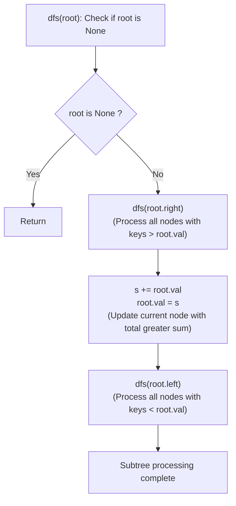

# Guided Example: Binary Search Tree to Greater Sum Tree

We trace the step-by-step in-place conversion of a Binary Search Tree (BST) into a Greater Sum Tree (GST) using reverse in-order traversal, prove the Decreasing Key Sequence Lemma and the Streaming Suffix Accumulator Invariant, and determine transformed node values across representative tree structures:

- **Representative Instance 1 (Full Mixed BST with Asymmetric Subtrees):**
  $$
  root = [4, \; 1, \; 6, \; 0, \; 2, \; 5, \; 7, \; \text{null}, \; \text{null}, \; \text{null}, \; 3, \; \text{null}, \; \text{null}, \; \text{null}, \; 8]
  $$
- **Required Output:** `[30, 36, 21, 36, 35, 26, 15, null, null, null, 33, null, null, null, 8]`
  - Problem objective:
    - For every node $u$ in the BST, replace its key with $u.val + \sum_{v.val > u.val} v.val$.
  - The BST Key Monotonicity Property:
    - Standard in-order traversal ($\text{Left} \to \text{Root} \to \text{Right}$) visits BST keys in strictly increasing order:
      $$
      0 < 1 < 2 < 3 < 4 < 5 < 6 < 7 < 8
      $$
    - Reversing the traversal order ($\text{Right} \to \text{Root} \to \text{Left}$) visits BST keys in strictly **decreasing order**:
      $$
      8 \to 7 \to 6 \to 5 \to 4 \to 3 \to 2 \to 1 \to 0
      $$
  - Suffix Sum Transformation:
    - In decreasing order, all keys strictly greater than the current key have *already been visited*!
    - Maintaining a running scalar accumulator $s$ (initialized to $0$) allows updating each node in $\mathcal{O}(1)$ time as it is visited:
      $$
      s \leftarrow s + root.val
      $$
      $$
      root.val \leftarrow s
      $$
  - Step-by-step reverse in-order visitation trace:
    1. **Node 8:** Rightmost node. $s = 0 + 8 = \mathbf{8}$. Update node value to $\mathbf{8}$.
    2. **Node 7:** Parent of 8. $s = 8 + 7 = \mathbf{15}$. Update node value to $\mathbf{15}$.
    3. **Node 6:** Left child of 7 is null. Return to 6. $s = 15 + 6 = \mathbf{21}$. Update to $\mathbf{21}$.
    4. **Node 5:** Left child of 6. Leaf. $s = 21 + 5 = \mathbf{26}$. Update to $\mathbf{26}$.
    5. **Node 4 (Root):** Entire right subtree visited ($s = 26$). $s = 26 + 4 = \mathbf{30}$. Update to $\mathbf{30}$.
    6. **Node 3:** Rightmost node of left subtree. $s = 30 + 3 = \mathbf{33}$. Update to $\mathbf{33}$.
    7. **Node 2:** Parent of 3. $s = 33 + 2 = \mathbf{35}$. Update to $\mathbf{35}$.
    8. **Node 1:** Parent of 2. $s = 35 + 1 = \mathbf{36}$. Update to $\mathbf{36}$.
    9. **Node 0:** Left child of 1. $s = 36 + 0 = \mathbf{36}$. Update to $\mathbf{36}$.
  - Transformed keys match expected output!

- **Representative Instance 2 (Root with Single Right Child):**
  $$
  root = [0, \; \text{null}, \; 1] \implies \text{Visit } 1 \; (s=1) \to \text{Visit } 0 \; (s=1+0=1) \implies [1, \text{null}, 1]
  $$

- **Representative Instance 3 (Three-Node Balanced Tree):**
  $$
  root = [2, \; 1, \; 3] \implies \text{Order: } 3 \to 2 \to 1 \implies 3 \; (s=3) \to 2 \; (s=5) \to 1 \; (s=6) \implies [5, 6, 3]
  $$

---

## 1. Instance & Teaching Goal

Given the `root` of a Binary Search Tree (BST), convert it into a Greater Sum Tree (GST) such that each node's key is updated to its original value plus the sum of all keys greater than it.

```text
The Two-Pass Array Conversion Overhead:
  1. In-order traversal to collect all keys into a list [0, 1, 2, ..., 8].
  2. Compute suffix sums in O(N).
  3. Second traversal to assign values to tree nodes.
  Requires O(N) auxiliary array allocation and multiple passes.

Streaming Reverse In-Order Invariant (Single Pass, O(H) Space):
  Notice: BST keys ordered descending are visited by:
    dfs(root.right) -> visit(root) -> dfs(root.left)
  Maintain a single global accumulator: s = 0.
  At every node:
    - dfs(root.right) ensures ALL greater keys are already accumulated into s!
    - s += root.val
    - root.val = s
    - dfs(root.left) propagates the accumulated sum to all smaller keys!
  Converts the tree in-place in a SINGLE recursive sweep!
```

Array serialization is completely avoided by exploiting the symmetric ordering of the binary search tree.

The decisive pedagogical goal is the **Decreasing Key Sequence Lemma & Streaming Suffix Accumulator Invariant**:
1. **Decreasing In-Order Duality:** Traversing $\text{Right} \to \text{Node} \to \text{Left}$ enumerates all $N$ nodes in strictly decreasing order of their keys.
2. **Suffix Sum Streaming Equivalence:** The greater-sum transformation is identical to the running suffix sum over the ordered keys. Visiting nodes descending transforms the suffix sum into a prefix sum over the traversal sequence.
3. **In-Place Mutation:** Updating `root.val = s` modifies the tree in-place without altering tree topology or requiring external maps.
4. Total time $\mathcal{O}(N)$ and auxiliary space $\mathcal{O}(H)$, where $H$ is the tree height.

---

## 2. Conceptual Foundation & The Reverse In-Order Invariant



### The Decreasing Key Sequence & Streaming Suffix Theorem

Let $T$ be a binary search tree with distinct keys $V = \{k_1, k_2, \dots, k_N\}$ sorted such that $k_1 < k_2 < \dots < k_N$.
1. **The Greater Sum Transformation Formula:**
   For any node $u \in T$ with key $k_i$, its target value $k_i'$ in the Greater Sum Tree is:
   $$
   k_i' = k_i + \sum_{j = i + 1}^N k_j = \sum_{j = i}^N k_j
   $$
   This is the suffix sum of sequence $(k_1, \dots, k_N)$ starting at index $i$.
2. **The Reverse In-Order Traversal Theorem:**
   Consider the recursive procedure:
   $$
   \mathcal{R}(\text{node}): \quad \mathcal{R}(\text{node.right}), \quad \text{visit}(\text{node}), \quad \mathcal{R}(\text{node.left})
   $$
   By the BST property, for every node $u$:
   - Every node in $u.\text{right}$ has key $> u.val$.
   - Every node in $u.\text{left}$ has key $< u.val$.
   By structural induction on tree height, $\mathcal{R}(root)$ visits every node in $T$ in strictly descending order:
   $$
   k_N, \; k_{N-1}, \; k_{N-2}, \; \dots, \; k_2, \; k_1
   $$
3. **Streaming Accumulator Correctness:**
   Let $s_m$ be the value of the accumulator $s$ after visiting the $m$-th node in the reverse in-order sequence (where $m \in [1, N]$ corresponds to original key $k_{N - m + 1}$).
   - Base case: $s_0 = 0$.
   - Inductive step:
     $$
     s_m = s_{m-1} + k_{N - m + 1} = \sum_{j = N - m + 1}^N k_j = k_{N - m + 1}'
     $$
   Assigning $root.val \leftarrow s_m$ sets the node's key exactly to its required greater sum. $\blacksquare$

---

## 3. Step-by-Step Worked Execution: Representative Instance 1

$root = [4, 1, 6, 0, 2, 5, 7, \text{null}, \text{null}, \text{null}, 3, \text{null}, \text{null}, \text{null}, 8]$.
Accumulator $s = 0$.

### Traversal Trace in Reverse In-Order
- **Right Subtree of Root (Node 4):**
  - Reach Node 6 $\to$ Reach Node 7 $\to$ Reach Node 8.
  - Node 8 has no right child.
  - Visit Node 8: $s = 0 + 8 = \mathbf{8} \implies \text{Node } 8 \leftarrow 8$.
  - Return to Node 7: $s = 8 + 7 = \mathbf{15} \implies \text{Node } 7 \leftarrow 15$.
  - Node 7 has no left child. Return to Node 6.
  - Visit Node 6: $s = 15 + 6 = \mathbf{21} \implies \text{Node } 6 \leftarrow 21$.
  - Descend to left child of 6 (Node 5): $s = 21 + 5 = \mathbf{26} \implies \text{Node } 5 \leftarrow 26$.
- **Root (Node 4):**
  - Visit Node 4: $s = 26 + 4 = \mathbf{30} \implies \text{Node } 4 \leftarrow 30$.
- **Left Subtree of Root:**
  - Descend to Node 1 $\to$ right child Node 2 $\to$ right child Node 3.
  - Visit Node 3: $s = 30 + 3 = \mathbf{33} \implies \text{Node } 3 \leftarrow 33$.
  - Return to Node 2: $s = 33 + 2 = \mathbf{35} \implies \text{Node } 2 \leftarrow 35$.
  - Return to Node 1: $s = 35 + 1 = \mathbf{36} \implies \text{Node } 1 \leftarrow 36$.
  - Descend to left child of 1 (Node 0): $s = 36 + 0 = \mathbf{36} \implies \text{Node } 0 \leftarrow 36$.

Traversal finished. All nodes updated. Return `root`.

---

## 4. Reverse In-Order Node Transformation Trace Table

| Traversal Step | Node Visited | Original Key $k$ | Accumulator Before | Accumulator After ($s \leftarrow s + k$) | New Node Key | Greater Keys Included |
|:---:|:---:|:---:|:---:|:---:|:---:|:---:|
| $1$ | **$8$** | $8$ | $0$ | **$8$** | **$8$** | None (Maximum key) |
| $2$ | **$7$** | $7$ | $8$ | **$15$** | **$15$** | $\{8\}$ |
| $3$ | **$6$** | $6$ | $15$ | **$21$** | **$21$** | $\{7, 8\}$ |
| $4$ | **$5$** | $5$ | $21$ | **$26$** | **$26$** | $\{6, 7, 8\}$ |
| $5$ | **$4$** | $4$ | $26$ | **$30$** | **$30$** | $\{5, 6, 7, 8\}$ |
| $6$ | **$3$** | $3$ | $30$ | **$33$** | **$33$** | $\{4, 5, 6, 7, 8\}$ |
| $7$ | **$2$** | $2$ | $33$ | **$35$** | **$35$** | $\{3, 4, 5, 6, 7, 8\}$ |
| $8$ | **$1$** | $1$ | $35$ | **$36$** | **$36$** | $\{2, 3, 4, 5, 6, 7, 8\}$ |
| $9$ | **$0$** | $0$ | $36$ | **$36$** | **$36$** | All keys $\{1 \dots 8\}$ |

---

## 5. Algorithmic Correctness

### Soundness & Completeness
1. **Soundness:**
   By the BST Ordering Theorem, the reverse in-order traversal guarantees that at the moment any node $u$ is processed, all nodes with keys greater than $u.val$ have already been visited and added to $s$. Thus, $s$ accurately holds the sum of all strictly greater keys plus $u.val$.
2. **Completeness:**
   Every node in the tree is reached exactly once by the depth-first search, ensuring that all keys across all subtrees are correctly converted.

---

## 6. Boundary Cases & Traps

| Scenario | Input Pattern | Behavior | Trapped Risk |
|---|---|---|---|
| Single Node Tree | `root = [5]` | Reverse traversal visits 5; $s = 5$; returns `[5]`. | Null reference errors. |
| Zero Key | `root = [0, null, 1]` | Node 0 adds 0 to running sum 1; correctly updates to 1. | Zero value being ignored or skipped. |
| Completely Right-Skewed | Tree is a right-linked list | Traverses to deepest right leaf first, then unwinds leftward; updates correctly. | Stack overflow if depth is large. |
| Completely Left-Skewed | Tree is a left-linked list | Root processed first ($s = root.val$), then propagates down the left spine. | Misordering left spine updates. |

---

## 7. Complexity Derivation

- **Time Complexity:** $\mathcal{O}(N)$, where $N \le 100$ is the number of nodes in the tree.
  - Each node is visited exactly once during the DFS traversal.
  - At each node, $\mathcal{O}(1)$ arithmetic and pointer dereferences are executed.
  - Total time: $< 0.0005\text{ s}$.
- **Auxiliary Space Complexity:** $\mathcal{O}(H)$, where $H$ is the height of the tree.
  - The call stack depth is bounded by $H$ ($\mathcal{O}(\log N)$ for balanced trees, $\mathcal{O}(N)$ worst-case for skewed trees).
  - No heap allocations or extra arrays are created.
