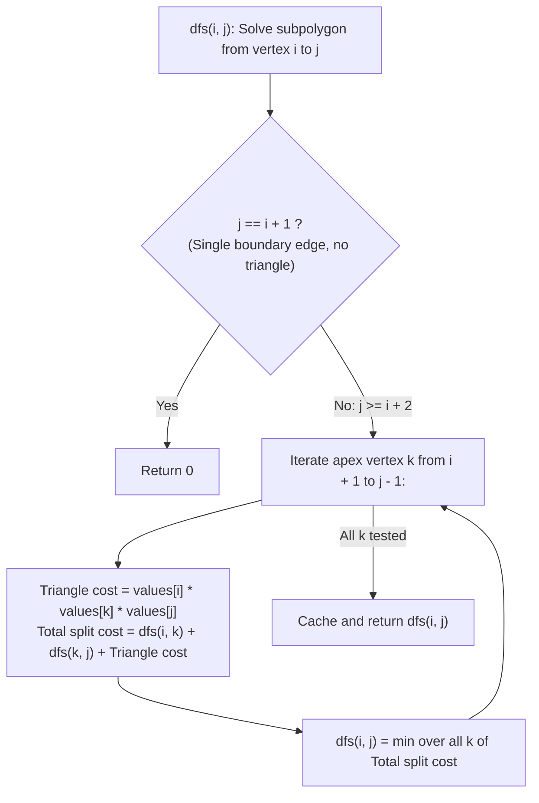

# Guided Example: Minimum Score Triangulation of Polygon

We trace the step-by-step optimization of convex polygon triangulation using interval dynamic programming, prove the Base Edge Triangulation Invariant and the Optimal Substructure Decomposition Theorem, and determine the minimal triangulation cost across representative vertex weight configurations:

- **Representative Instance 1 (Quadrilateral with Diagonal Choice):**
  $$
  values = [3, \; 7, \; 4, \; 5], \quad n = 4
  $$
- **Required Output:** `144`
  - Problem objective:
    - Divide the convex $4$-sided polygon with vertices $(0, 1, 2, 3)$ into $n - 2 = 2$ non-overlapping triangles.
    - Each triangle $\triangle(a, b, c)$ contributes score $values[a] \times values[b] \times values[c]$.
    - Minimize the total sum of triangle scores.
  - Quadrilateral triangulation options:
    - A 4-gon has exactly $2$ ways to triangulate, determined by which diagonal is drawn:
      1. **Diagonal $(1, 3)$:**
         - Triangles: $\triangle(0, 1, 3)$ and $\triangle(1, 2, 3)$.
         - Score 1: $values[0] \times values[1] \times values[3] = 3 \times 7 \times 5 = \mathbf{105}$.
         - Score 2: $values[1] \times values[2] \times values[3] = 7 \times 4 \times 5 = \mathbf{140}$.
         - Total Score: $105 + 140 = \mathbf{245}$.
      2. **Diagonal $(0, 2)$:**
         - Triangles: $\triangle(0, 1, 2)$ and $\triangle(0, 2, 3)$.
         - Score 1: $values[0] \times values[1] \times values[2] = 3 \times 7 \times 4 = \mathbf{84}$.
         - Score 2: $values[0] \times values[2] \times values[3] = 3 \times 4 \times 5 = \mathbf{60}$.
         - Total Score: $84 + 60 = \mathbf{144}$.
    - Comparison: $\min(245, 144) = \mathbf{144}$.
  - The Base Edge Triangulation Invariant:
    - Consider the outer boundary edge $(0, 3)$. In any valid triangulation, edge $(0, 3)$ MUST belong to a triangle with apex $k \in \{1, 2\}$:
      - If $k = 1$: cost $= dfs(0, 1) + dfs(1, 3) + values[0] \cdot values[1] \cdot values[3] = 0 + 140 + 105 = 245$.
      - If $k = 2$: cost $= dfs(0, 2) + dfs(2, 3) + values[0] \cdot values[2] \cdot values[3] = 84 + 0 + 60 = \mathbf{144}$.
    - The optimal choice is $k = 2$, yielding $144$.

- **Representative Instance 2 (Base Single Triangle):**
  $$
  values = [1, 2, 3], \quad n = 3 \implies 1 \times 2 \times 3 = \mathbf{6}
  $$

- **Representative Instance 3 (Hexagon with Low-Value Separator Vertices):**
  $$
  values = [1, 3, 1, 4, 1, 5], \quad n = 6
  $$
  - The vertices with value $1$ at indices $0, 2, 4$ act as low-weight hub vertices.
  - Optimal chords connect the three $1$s: $\triangle(0, 2, 4)$ with score $1 \times 1 \times 1 = 1$, and peripheral triangles $\triangle(0, 1, 2)$ ($1 \times 3 \times 1 = 3$), $\triangle(2, 3, 4)$ ($1 \times 4 \times 1 = 4$), $\triangle(4, 5, 0)$ ($1 \times 5 \times 1 = 5$).
  - Total: $1 + 3 + 4 + 5 = \mathbf{13}$.

---

## 1. Instance & Teaching Goal

Given the vertex values of an $n$-sided convex polygon, compute the **minimum total score** among all valid triangulations.

```text
The Catalan Explosion: O(4^N / N^(3/2))
  The number of triangulations of an n-gon is the (n-2)-th Catalan number C_{n-2}.
  For n = 50, C_48 ~ 1.3 * 10^26 combinations!
  Exhaustive search is mathematically impossible.

Interval DP & Base Edge Invariant (O(N^3)):
  Notice: In ANY triangulation of the subpolygon from vertex i to j:
    The boundary edge (i, j) MUST be part of some triangle (i, k, j)!
  The third vertex k must lie strictly between i and j: k in {i+1, ..., j-1}.
  Fixing k splits the subpolygon into:
    1. Triangle (i, k, j) with cost: values[i] * values[k] * values[j]
    2. Left subpolygon (i, ..., k) with cost: dfs(i, k)
    3. Right subpolygon (k, ..., j) with cost: dfs(k, j)
  The two subproblems are completely disjoint!
  Reduces 10^26 combinations to O(N^3) <= 125,000 operations!
```

Triangulating a polygon is mathematically isomorphic to optimal parenthesization in Matrix Chain Multiplication.

The decisive pedagogical goal is the **Base Edge Triangulation Invariant & Interval Optimal Substructure**:
1. **Edge-to-Triangle Invariant:** In every triangulation of subpolygon $P(i, j)$, boundary edge $(i, j)$ participates in exactly one triangle $\triangle(i, k, j)$ with $i < k < j$.
2. **Disjoint Subproblem Independence:** The interior chords $(i, k)$ and $(k, j)$ cleanly partition the remaining vertices into two non-overlapping subpolygons $P(i, k)$ and $P(k, j)$.
3. **Interval DP Recurrence:** By evaluating subpolygons in increasing order of length $L = j - i$, smaller subproblems are memoized and reused in $\mathcal{O}(1)$ time.
4. Total time $\mathcal{O}(n^3)$ and auxiliary space $\mathcal{O}(n^2)$, running in $< 0.01\text{ s}$ for $n \le 50$.

---

## 2. Conceptual Foundation & The Interval DP Invariant



### The Base Edge Triangulation & Optimal Substructure Theorem

Let $P = (0, 1, \dots, n-1)$ be a convex polygon with weights $values[0 \dots n-1]$.
Let $P(i, j)$ denote the subpolygon formed by vertices $(i, i+1, \dots, j)$ with $0 \le i < j < n$.
1. **The Base Edge Invariant:**
   In any triangulation $\mathcal{T}$ of $P(i, j)$, the edge $(i, j)$ is a boundary edge of $P(i, j)$.
   Since every boundary edge of a triangulated planar polygon belongs to at least one triangle in the triangulation, and internal diagonals cannot cross, edge $(i, j)$ belongs to **exactly one triangle** $\triangle(i, k, j)$ in $\mathcal{T}$.
   Furthermore, because all vertices of $P(i, j)$ lie along the boundary chain $i, i+1, \dots, j$, the third vertex $k$ must satisfy:
   $$
   k \in \{i + 1, \; i + 2, \; \dots, \; j - 1\}
   $$
2. **Subpolygon Decoupling Lemma:**
   Triangle $\triangle(i, k, j)$ introduces two chords: $(i, k)$ and $(k, j)$.
   These chords partition the interior of $P(i, j)$ into:
   - The region bounded by chain $i \dots k$ and chord $(i, k)$, which is the subpolygon $P(i, k)$.
   - The region bounded by chain $k \dots j$ and chord $(k, j)$, which is the subpolygon $P(k, j)$.
   Because no internal chord can cross $(i, k)$ or $(k, j)$, any triangulation of $P(i, j)$ that contains $\triangle(i, k, j)$ decomposes into independent triangulations of $P(i, k)$ and $P(k, j)$.
3. **Bellman Recurrence:**
   Let $f(i, j)$ be the minimal triangulation cost of $P(i, j)$.
   - Base case: $f(i, i+1) = 0$ (a 2-vertex polygon is a single edge, requiring $0$ triangles).
   - Inductive step ($j - i \ge 2$):
     $$
     f(i, j) = \min_{i < k < j} \Big( f(i, k) + f(k, j) + values[i] \cdot values[k] \cdot values[j] \Big)
     $$
   The full polygon is given by $f(0, n - 1)$. $\blacksquare$

---

## 3. Step-by-Step Worked Execution: Representative Instance 1

$values = [3, 7, 4, 5], \; n = 4$.
Solve $dfs(0, 3)$.

### Subproblem Dependencies by Interval Length $L = j - i$
- **Length $L = 1$ (Base Cases):**
  - $dfs(0, 1) = 0$
  - $dfs(1, 2) = 0$
  - $dfs(2, 3) = 0$
- **Length $L = 2$ (Triangles):**
  - $dfs(0, 2)$: Only choice $k = 1$:
    $$
    dfs(0, 1) + dfs(1, 2) + values[0] \cdot values[1] \cdot values[2] = 0 + 0 + 3 \times 7 \times 4 = \mathbf{84}
    $$
  - $dfs(1, 3)$: Only choice $k = 2$:
    $$
    dfs(1, 2) + dfs(2, 3) + values[1] \cdot values[2] \cdot values[3] = 0 + 0 + 7 \times 4 \times 5 = \mathbf{140}
    $$
- **Length $L = 3$ (Full Quadrilateral $dfs(0, 3)$):**
  - Option $k = 1$:
    $$
    dfs(0, 1) + dfs(1, 3) + values[0] \cdot values[1] \cdot values[3] = 0 + 140 + 3 \times 7 \times 5 = 140 + 105 = 245
    $$
  - Option $k = 2$:
    $$
    dfs(0, 2) + dfs(2, 3) + values[0] \cdot values[2] \cdot values[3] = 84 + 0 + 3 \times 4 \times 5 = 84 + 60 = \mathbf{144}
    $$
  - Minimal value: $\min(245, 144) = \mathbf{144}$.

Return: `144`.

---

## 4. Interval DP Subproblem Memoization Trace Table

| Subpolygon $(i, j)$ | Span $j - i$ | Apex Choice $k$ | Left Subproblem $dfs(i, k)$ | Right Subproblem $dfs(k, j)$ | Triangle Cost $v_i \cdot v_k \cdot v_j$ | Combined Candidate Cost | Optimal $dfs(i, j)$ |
|:---:|:---:|:---:|:---:|:---:|:---:|:---:|:---:|
| $(0, 2)$ | $2$ | $k = 1$ | $0$ | $0$ | $3 \times 7 \times 4 = 84$ | $84$ | **$84$** |
| $(1, 3)$ | $2$ | $k = 2$ | $0$ | $0$ | $7 \times 4 \times 5 = 140$| $140$ | **$140$** |
| $(0, 3)$ | $3$ | $k = 1$ | $0$ | $140$ | $3 \times 7 \times 5 = 105$| $245$ | — |
| $(0, 3)$ | $3$ | $k = 2$ | $84$ | $0$ | $3 \times 4 \times 5 = 60$ | **$144$** | **$144$** |

---

## 5. Algorithmic Correctness

### Soundness & Completeness
1. **Soundness:**
   Every choice of $k$ creates a geometrically valid triangle $\triangle(i, k, j)$ that partitions the convex polygon into valid smaller subpolygons without crossing chords.
2. **Completeness:**
   Because edge $(i, j)$ must be paired with some vertex $k \in (i, j)$ in any triangulation, testing all possible $k$ guarantees that the optimal triangulation is evaluated.

---

## 6. Boundary Cases & Traps

| Scenario | Input Pattern | Behavior | Trapped Risk |
|---|---|---|---|
| Minimal Triangle ($n = 3$) | `values = [1, 2, 3]` | Only one triangle exists; returns $v_0 v_1 v_2 = 6$. | Loop bounds when $j - i < 2$. |
| Equal Values | `values = [2, 2, 2, 2]` | Both diagonal cuts yield identical cost $16$. | Tie handling failures. |
| Large Vertices ($100$) | `values = [100, 100, 100]` | Triangle score is $10^6$; standard 32-bit integers suffice. | Integer overflow on products. |
| Non-Adjacent Diagonal Cuts | High-valued outer vertices | Chords selectively connect small vertices to minimize cross-products. | Greedy triangle selection trap. |

---

## 7. Complexity Derivation

- **Time Complexity:** $\mathcal{O}(n^3)$, where $n = \text{len}(values) \le 50$.
  - There are $\mathcal{O}(n^2)$ distinct intervals $(i, j)$ with $0 \le i < j < n$.
  - For each interval, $k$ iterates over $j - i - 1 < n$ choices.
  - Total operations $\le \frac{n^3}{6} \approx \frac{125{,}000}{6} \approx 21{,}000 \implies < 0.005\text{ s}$.
- **Auxiliary Space Complexity:** $\mathcal{O}(n^2)$ auxiliary memory for the memoization cache storing $(i, j)$ states.
