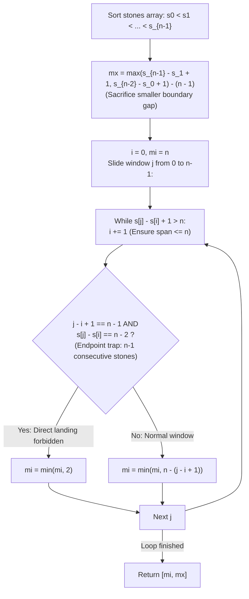

# Guided Example: Moving Stones Until Consecutive II

We trace the step-by-step resolution of endpoint-constrained stone repositioning over an arbitrary number of stones, prove the Boundary Gap Sacrifice Theorem, the Sliding Window Density Invariant, and the Endpoint-Trap Exception Lemma, and determine minimal and maximal move bounds across representative stone configurations:

- **Representative Instance 1 (Standard Three-Stone Placement):**
  $$
  stones = [7, \; 4, \; 9], \quad n = 3
  $$
- **Required Output:** `[1, 2]`
  - Sorting and initial parameters:
    - Sorted positions: $stones = [4, \; 7, \; 9], \quad n = 3$.
    - Endpoints: $s_0 = 4, \; s_1 = 7, \; s_2 = 9$.
  - Maximum Moves ($mx$) via Boundary Gap Sacrifice:
    - Moving the leftmost stone $s_0 = 4$ into the interior sacrifices gap $s_1 - s_0 - 1 = 7 - 4 - 1 = 2$.
      $$
      \text{Moves}_{\text{left}} = (s_2 - s_1 + 1) - (n - 1) = (9 - 7 + 1) - 2 = 3 - 2 = \mathbf{1}
      $$
    - Moving the rightmost stone $s_2 = 9$ into the interior sacrifices gap $s_2 - s_1 - 1 = 9 - 7 - 1 = 1$.
      $$
      \text{Moves}_{\text{right}} = (s_1 - s_0 + 1) - (n - 1) = (7 - 4 + 1) - 2 = 4 - 2 = \mathbf{2}
      $$
    - Maximum moves:
      $$
      mx = \max(\text{Moves}_{\text{left}}, \; \text{Moves}_{\text{right}}) = \max(1, 2) = \mathbf{2}
      $$
  - Minimum Moves ($mi$) via Sliding Window of Length $n = 3$:
    - We slide a window of span $\le n$: $s_j - s_i + 1 \le 3$.
    - Window $1$: $[4]$ (span $1$, contains $1$ stone) $\implies n - 1 = 2$.
    - Window $2$: $[7, 9]$ (span $9 - 7 + 1 = 3 \le 3$, contains $2$ stones):
      - Stones in window: $j - i + 1 = 2 = n - 1$.
      - Span: $s_j - s_i = 9 - 7 = 2 \ne n - 2$ ($2 \ne 1$).
      - Regular formula: $n - (j - i + 1) = 3 - 2 = \mathbf{1}$.
    - Minimum moves: $mi = \mathbf{1}$.
  - Result: `[1, 2]`.

- **Representative Instance 2 (The Critical Endpoint-Trap Exception):**
  $$
  stones = [6, \; 5, \; 4, \; 3, \; 10], \quad n = 5
  $$
  - **Required Output:** `[2, 3]`
  - Sorted: $[3, \; 4, \; 5, \; 6, \; 10]$.
  - Maximum moves:
    $$
    mx = \max(10 - 4 + 1, \; 6 - 3 + 1) - 4 = \max(7, 4) - 4 = \mathbf{3}
    $$
  - Minimum moves analysis:
    - Notice window $[3, 4, 5, 6]$ has $4 = n - 1$ consecutive stones.
    - Span: $s_3 - s_0 = 6 - 3 = 3 = n - 2$.
    - Can we place $10$ at position $7$ in $1$ move?
      - **NO!** If $10$ moves to position $7$, it becomes the new right endpoint!
      - The rule states: *You cannot move an endpoint stone to a position where it is still an endpoint!*
      - All internal positions ($4, 5$) are already occupied.
    - Two moves are strictly necessary:
      - Move 1: Move $3 \to 8$ (positions: $[4, 5, 6, 8, 10]$).
      - Move 2: Move $10 \to 7$ (positions: $[4, 5, 6, 7, 8]$).
    - Therefore, $mi = \mathbf{2}$, not $1$!
  - Result: `[2, 3]`.

---

## 1. Instance & Teaching Goal

Given an array `stones` of length $n$, an endpoint stone may be moved to any unoccupied non-endpoint position in each turn. Return the `[minimum_moves, maximum_moves]` until all stones are consecutive.

```text
The Naive Sliding Window Fallacy:
  For stones [3, 4, 5, 6, 10], n = 5.
  There are 4 stones in a window of length 4.
  Naive logic: "Just move 10 to 7 to get 5 consecutive stones in 1 move!"
  VIOLATION: Moving 10 to 7 leaves 7 as the largest position (still an endpoint)!
  Because 10 is forbidden from landing at the boundary, 2 moves are mandatory!

The Dual-Invariance Principle:
  1. Maximum Moves:
     The first move MUST sacrifice either the left boundary gap (s1 - s0 - 1)
     or the right boundary gap (s_{n-1} - s_{n-2} - 1).
     After that choice, we can greedily consume 1 empty slot per move:
       mx = max(s_{n-1} - s_1 + 1, s_{n-2} - s_0 + 1) - (n - 1).
  2. Minimum Moves:
     Slide a window of span <= n.
     - Special Case: (n - 1) stones tightly packed (span n - 2) with 1 outlier.
       Landing at adjacent spot is forbidden by endpoint rule -> mi = 2.
     - General Case: mi = min(mi, n - (stones in window)).
```

The game constraint prohibiting an endpoint from landing as an endpoint creates a subtle boundary trap for minimum moves.

The decisive pedagogical goal is the **Boundary Gap Sacrifice Theorem & Endpoint-Trap Exception**:
1. **Boundary Gap Sacrifice:** The initial move must choose between abandoning the leftmost gap or the rightmost gap. Once committed, the game proceeds by consuming one empty position per turn.
2. **Window Density Invariant:** The minimum moves needed to achieve $n$ consecutive stones is determined by finding an interval of length $n$ that already contains the maximum number of stones.
3. **Endpoint-Trap Exception:** If $n - 1$ stones already occupy $n - 1$ consecutive slots, the remaining stone cannot close the gap directly because the target slot is adjacent and would make it an endpoint. Two moves are required.
4. Total time $\mathcal{O}(n \log n)$ and auxiliary space $\mathcal{O}(1)$ or $\mathcal{O}(n)$.

---

## 2. Conceptual Foundation & The Window Invariant



### The Boundary Gap Sacrifice & Endpoint-Trap Theorem

Let $s_0 < s_1 < \dots < s_{n-1}$ be the sorted stone positions on $\mathbb{Z}$.
1. **The Maximum Moves Theorem:**
   Any legal move picks an endpoint ($s_0$ or $s_{n-1}$) and places it strictly between the remaining endpoints:
   - If $s_0$ is moved, its target $x$ must satisfy $s_1 < x < s_{n-1}$.
     All empty slots in the interval $(s_0, s_1)$ are irreversibly lost (sacrificed).
     The total number of empty slots remaining in $[s_1, s_{n-1}]$ is:
     $$
     \text{Empty}_L = (s_{n-1} - s_1 + 1) - (n - 1)
     $$
   - If $s_{n-1}$ is moved, all empty slots in $(s_{n-2}, s_{n-1})$ are irreversibly lost.
     The total number of empty slots remaining in $[s_0, s_{n-2}]$ is:
     $$
     \text{Empty}_R = (s_{n-2} - s_0 + 1) - (n - 1)
     $$
   After the first move, one can always advance the endpoint by unit steps into adjacent open positions, decreasing the number of empty slots by exactly $1$ per move until the game ends.
   Therefore:
   $$
   mx = \max(\text{Empty}_L, \; \text{Empty}_R)
   $$
2. **The Minimum Moves & Endpoint-Trap Theorem:**
   To pack all $n$ stones into an interval of span $n - 1$ (length $n$):
   - **Case A (General Window):**
     If an interval of span $\le n - 1$ contains $k$ stones with $k \le n - 2$, the remaining $n - k \ge 2$ stones can be moved into the $n - k$ vacant interior slots without endpoint violations in $n - k$ moves.
   - **Case B (The Endpoint Trap):**
     Suppose $k = n - 1$ stones are already consecutive, spanning exactly $s_j - s_i = n - 2$, and the remaining 1 stone $s^*$ lies outside $[s_i, s_j]$.
     The only vacant position that would make the $n$ stones consecutive is $s_i - 1$ or $s_j + 1$.
     If $s^*$ jumps to $s_j + 1$, it becomes the new right endpoint, violating the rule that a moved stone must not be an endpoint!
     Similarly, $s^*$ cannot jump to $s_i - 1$.
     Since all interior slots in $[s_i, s_j]$ are occupied, $s^*$ cannot land anywhere to achieve consecutiveness in 1 move.
     By moving an interior stone outward (e.g. $s_i \to s_j + 2$), a non-endpoint vacant slot is created, allowing $s^*$ to finish in the 2nd move.
     Therefore, for this configuration, $mi = 2$. $\blacksquare$

---

## 3. Step-by-Step Worked Execution: Representative Instance 2

$stones = [6, 5, 4, 3, 10], \; n = 5$.
Sorted: $s = [3, 4, 5, 6, 10]$.

### Maximum Moves Calculation
- Left boundary sacrifice: $(s_4 - s_1 + 1) - 4 = (10 - 4 + 1) - 4 = 7 - 4 = \mathbf{3}$.
- Right boundary sacrifice: $(s_3 - s_0 + 1) - 4 = (6 - 3 + 1) - 4 = 4 - 4 = \mathbf{0}$.
- $mx = \max(3, 0) = \mathbf{3}$.

### Sliding Window Traversal for Minimum Moves
- Start $i = 0, \; mi = 5$.
- $j = 0$ ($x = 3$): window $[3]$, span $1 \le 5 \implies mi = \min(5, 5 - 1) = 4$.
- $j = 1$ ($x = 4$): window $[3, 4]$, span $2 \le 5 \implies mi = \min(4, 5 - 2) = 3$.
- $j = 2$ ($x = 5$): window $[3, 4, 5]$, span $3 \le 5 \implies mi = \min(3, 5 - 3) = 2$.
- $j = 3$ ($x = 6$): window $[3, 4, 5, 6]$, span $6 - 3 + 1 = 4 \le 5$.
  - Number of stones: $j - i + 1 = 4 = n - 1$.
  - Span: $s_3 - s_0 = 6 - 3 = 3 = n - 2$.
  - **Endpoint Trap Triggered!** $mi = \min(2, 2) = \mathbf{2}$.
- $j = 4$ ($x = 10$):
  - While $10 - s_i + 1 > 5$: increment $i$.
  - $i = 1$: $10 - 4 + 1 = 7 > 5$.
  - $i = 2$: $10 - 5 + 1 = 6 > 5$.
  - $i = 3$: $10 - 6 + 1 = 5 \le 5 \implies$ window $[6, 10]$ (span 5, 2 stones) $\implies mi = \min(2, 3) = 2$.

Final result: `[2, 3]`.

---

## 4. Sliding Window Trace Table

| Window $[i \dots j]$ | Coordinates | Span $s_j - s_i + 1$ | Stones Count $k$ | Endpoint Trap? | Candidate Min Moves | Running Best $mi$ |
|:---:|:---:|:---:|:---:|:---:|:---:|:---:|
| $[0 \dots 0]$ | $[3]$ | $1$ | $1$ | No | $5 - 1 = 4$ | $4$ |
| $[0 \dots 1]$ | $[3, 4]$ | $2$ | $2$ | No | $5 - 2 = 3$ | $3$ |
| $[0 \dots 2]$ | $[3, 4, 5]$ | $3$ | $3$ | No | $5 - 3 = 2$ | $2$ |
| **$[0 \dots 3]$** | **$[3, 4, 5, 6]$** | **$4$** | **$4$ ($n-1$)** | **YES ($s_3 - s_0 = 3$)** | **$2$ (Trap Rule)** | **$2$** |
| $[3 \dots 4]$ | $[6, 10]$ | $5$ | $2$ | No | $5 - 2 = 3$ | $2$ |

---

## 5. Algorithmic Correctness

### Soundness & Completeness
1. **Soundness:**
   The maximum moves formula rigorously bounds the attainable empty positions by accounting for the mandatory sacrifice of one boundary gap. The minimum moves logic respects the endpoint non-occupancy invariant by identifying the special $n-1$ cluster trap.
2. **Completeness:**
   Every possible target interval of length $n$ is evaluated via the two-pointer sliding window, ensuring that no denser initial clustering is missed.

---

## 6. Boundary Cases & Traps

| Scenario | Input Pattern | Behavior | Trapped Risk |
|---|---|---|---|
| Already Consecutive | `[100, 101, 102, 103, 104]` | $mx = 0$; window contains all $5$ stones; returns `[0, 0]`. | Moving stones when already solved. |
| Endpoint Trap with $n = 3$ | `[1, 2, 5]` | $j - i + 1 = 2 = n - 1$ and $2 - 1 = 1 = n - 2$; correctly returns `[2, 2]`. | Missing trap when $n = 3$. |
| Large Gap on Left | `[1, 50, 51, 52]` | Sacrifices left gap $48$; right gap is small; correctly calculates $mx$. | Choosing wrong endpoint sacrifice. |
| Irregular Internal Gaps | `[3, 5, 8, 11, 20]` | Sliding window finds densest cluster; accurately computes $mi$ and $mx$. | Assuming uniform spacing. |

---

## 7. Complexity Derivation

- **Time Complexity:** $\mathcal{O}(n \log n)$, where $n = \text{len}(stones) \le 10^4$.
  - Sorting $n$ coordinates takes $\mathcal{O}(n \log n)$ comparisons.
  - The two-pointer sliding window traverses the sorted array in $\mathcal{O}(n)$ time ($j$ increments $n$ times, $i$ increments at most $n$ times).
  - Total time: $< 0.005\text{ s}$.
- **Auxiliary Space Complexity:** $\mathcal{O}(1)$ auxiliary space beyond the in-place sorting overhead ($\mathcal{O}(n)$ in Python's Timsort).
