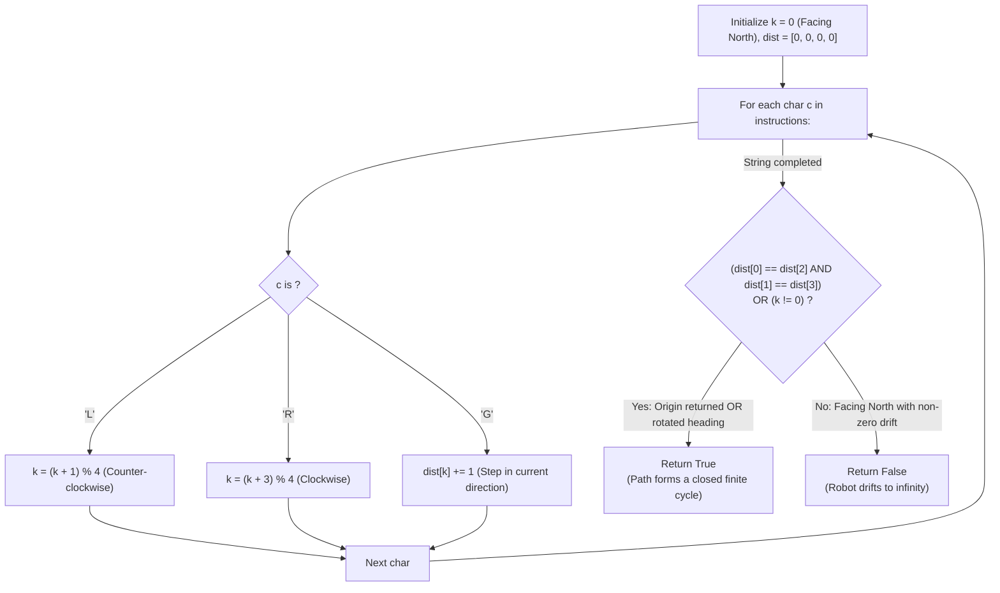

# Guided Example: Robot Bounded In Circle

We trace the step-by-step state trajectory of a mobile automaton on the infinite 2D Euclidean plane, prove the Affine Isometry Boundedness Theorem and the Cyclic Group Cancellation Lemma, and determine whether infinite loop repetitions remain enclosed within a finite circle across representative command sequences:

- **Representative Instance 1 (Back-and-Forth Trajectory Returning to Origin):**
  $$
  instructions = \text{"GGLLGG"}
  $$
- **Required Output:** `true`
  - Problem coordinates and orientations:
    - Initial state: Position $(x, y) = (0, 0)$, facing North ($k = 0$).
    - Direction encoding:
      - $k = 0$: North ($+Y$)
      - $k = 1$: West ($-X$, left turn from North)
      - $k = 2$: South ($-Y$)
      - $k = 3$: East ($+X$, right turn from North)
    - Instruction rules:
      - `'G'`: Step forward $1$ unit along current heading $k$ ($\text{dist}[k] \mathrel{+}= 1$).
      - `'L'`: Turn $90^\circ$ counter-clockwise: $k \leftarrow (k + 1) \bmod 4$.
      - `'R'`: Turn $90^\circ$ clockwise: $k \leftarrow (k + 3) \bmod 4$.
  - Execution trace for single cycle:
    1. Instruction 1 (`'G'`): Step North $\implies dist = [1, 0, 0, 0]$, pos $(0, 1)$, heading North ($k = 0$).
    2. Instruction 2 (`'G'`): Step North $\implies dist = [2, 0, 0, 0]$, pos $(0, 2)$, heading North ($k = 0$).
    3. Instruction 3 (`'L'`): Turn Left $\implies k = (0 + 1) \bmod 4 = 1$ (Facing West).
    4. Instruction 4 (`'L'`): Turn Left $\implies k = (1 + 1) \bmod 4 = 2$ (Facing South).
    5. Instruction 5 (`'G'`): Step South $\implies dist = [2, 0, 1, 0]$, pos $(0, 1)$, heading South ($k = 2$).
    6. Instruction 6 (`'G'`): Step South $\implies dist = [2, 0, 2, 0]$, pos $(0, 0)$, heading South ($k = 2$).
  - Terminal state after 1 pass:
    - Distance counts: $\text{dist} = [2, 0, 2, 0]$.
    - Net vertical displacement: $dist[0] - dist[2] = 2 - 2 = \mathbf{0}$.
    - Net horizontal displacement: $dist[3] - dist[1] = 0 - 0 = \mathbf{0}$.
    - Net displacement vector: $\vec{d} = (0, 0)$ (Returned to origin!).
    - Final heading: $k = 2$ (Facing South $\ne$ North).
  - Boundedness conclusion:
    - Since the robot returns to the origin $\vec{d} = (0, 0)$, its displacement after each cycle is zero!
    - The trajectory is identically periodic and never leaves the circle of radius $R = 2$ centered at $(0, 1)$.
    - Returns `true`.

- **Representative Instance 2 (Pure Translation Facing North):**
  $$
  instructions = \text{"GG"} \implies dist = [2, 0, 0, 0], \quad k = 0
  $$
  - Displaced by $\vec{d} = (0, 2) \ne (0, 0)$ while still facing North ($k = 0$).
  - Every repetition adds another $(0, 2)$.
  - Position after $m$ repetitions: $(0, 2m) \to \infty$ as $m \to \infty$.
  - Unbounded $\implies$ returns `false`.

- **Representative Instance 3 (Quarter-Turn Cycle):**
  $$
  instructions = \text{"GL"} \implies \text{Step North 1, Turn West } (k = 1)
  $$
  - Displaced by $(0, 1)$, but ending heading is West ($k = 1 \ne 0$).
  - Four cycles rotate the displacement vector by $0^\circ, 90^\circ, 180^\circ, 270^\circ$:
    $$
    (0, 1) + (-1, 0) + (0, -1) + (1, 0) = \mathbf{(0, 0)}
    $$
  - After 4 repetitions, the robot returns exactly to $(0, 0)$ facing North!
  - Forms a closed square orbit $\implies$ returns `true`.

---

## 1. Instance & Teaching Goal

Given an instruction string that is repeated infinitely, determine whether the robot's infinite path remains enclosed inside some finite circle.

```text
The Infinite Simulation Trap:
  Simulating hundreds of cycles to see if the robot "drifts away".
  How many cycles are needed? What threshold distance proves divergence?
  Floating-point or cycle tracking is heuristic and prone to false stops.

Cyclic Group Isometry Theorem (Single Pass, O(1) Space):
  Executing the string once defines an affine plane map: T(v) = R_theta * v + d.
  After 1 pass, only TWO criteria determine infinite boundedness:
    Criterion 1: Net displacement is zero (d == (0, 0)).
                 The robot is back at the start point; repeats closed loop!
    Criterion 2: Final heading is NOT North (theta != 0).
                 R_theta has order 2 or 4 in SO(2).
                 The rotated displacements cancel: sum_{j=0}^{m-1} R^j * d = (0, 0)!
                 The robot returns to (0, 0) in at most 4 cycles!
  The ONLY way the robot escapes to infinity is:
    Heading is STILL North (theta == 0) AND displacement is NON-ZERO (d != 0)!
  Evaluates in O(|S|) time and O(1) space after exactly ONE pass!
```

Analyzing the affine group action of one pass eliminates indefinite multi-cycle simulation entirely.

The decisive pedagogical goal is the **Affine Isometry Boundedness Theorem & Cyclic Group Cancellation**:
1. **Affine Isometry Representation:** One full execution of `instructions` is an affine map $T(v) = R_\theta v + \vec{d}$ with rotation angle $\theta \in \{0^\circ, 90^\circ, 180^\circ, 270^\circ\}$.
2. **Symmetric Displacement Cancellation:** If $\theta \ne 0^\circ$, the cyclic subgroup generated by $R_\theta$ has order $2$ (for $180^\circ$) or $4$ (for $90^\circ, 270^\circ$). The sum of vectors along these rotation orbits is identically $\vec{0}$.
3. **Linear Divergence Characterization:** Divergence to infinity occurs if and only if $\theta = 0^\circ$ and $\vec{d} \ne \vec{0}$, in which case the robot translates by $\vec{d}$ on every cycle along an infinite line.
4. Total time $\mathcal{O}(|S|)$ and auxiliary space $\mathcal{O}(1)$.

---

## 2. Conceptual Foundation & The Group Isometry Invariant



### The Affine Plane Isometry & Bounded Orbit Theorem

Let $p_0 = (0, 0) \in \mathbb{R}^2$ be the initial position, and let $h_0 = (0, 1)$ be the initial heading (North).
1. **Affine Action Decomposition:**
   Let the instruction string induce net translation $\vec{d} \in \mathbb{R}^2$ and net rotation $R_\theta \in SO(2)$ after 1 execution.
   The state after $m$ executions is given by the recurrence:
   $$
   p_m = p_{m-1} + R_\theta^{m-1} \vec{d} = \sum_{j=0}^{m-1} R_\theta^j \vec{d}
   $$
2. **Case Classification:**
   - **Case 1: $\vec{d} = (0, 0)$:**
     Then $p_m = \vec{0}$ for all $m$.
     The intermediate positions within any cycle $m$ are rotations of the initial cycle's positions:
     $$
     p(t + m \cdot |S|) = R_\theta^m p(t)
     $$
     Since rotations preserve Euclidean distance, $\|p(t + m \cdot |S|)\| = \|p(t)\| \le \max_{0 \le u \le |S|} \|p(u)\| = R_{\max} < \infty$.
     The entire trajectory is bounded within the circle of radius $R_{\max}$.
   - **Case 2: $\theta \ne 0^\circ$ ($k \ne 0$):**
     Since $\theta \in \{90^\circ, 180^\circ, 270^\circ\}$:
     - If $\theta = 180^\circ$: $R_\theta = -I$.
       After $2$ cycles: $p_2 = \vec{d} + (-I)\vec{d} = \vec{0}$.
       The robot returns to $(0, 0)$ after 2 cycles, and $p_{2m} = \vec{0}$.
     - If $\theta = 90^\circ$ or $270^\circ$: $R_\theta$ generates the cyclic group $\mathbb{Z}_4$.
       The sum of powers of the generator is:
       $$
       \sum_{j=0}^3 R_\theta^j = I + R_\theta + R_\theta^2 + R_\theta^3 = I + R_\theta - I - R_\theta = 0
       $$
       Therefore $p_4 = \vec{0}$, and $p_{4m} = \vec{0}$.
     In both cases, the trajectory forms a closed, repeating periodic polygon of at most 4 cycles, strictly bounded within a finite radius.
   - **Case 3: $\theta = 0^\circ$ ($k = 0$) and $\vec{d} \ne (0, 0)$:**
     Here $R_\theta = I$.
     Then $p_m = m \cdot \vec{d}$.
     The distance from the origin is $\|p_m\| = m \|\vec{d}\| \to \infty$ as $m \to \infty$.
     No finite circle can enclose this trajectory.
3. **Synthesis:**
   The trajectory is bounded if and only if $\vec{d} = (0, 0)$ or $k \ne 0$. $\blacksquare$

---

## 3. Step-by-Step Worked Execution: Representative Instance 1

$instructions = \text{"GGLLGG"}$.
Initial: $k = 0$, $dist = [0, 0, 0, 0]$.

### Instruction-by-Instruction Transition
- Step 1: `'G'` $\implies dist[0] = 1$.
- Step 2: `'G'` $\implies dist[0] = 2$.
- Step 3: `'L'` $\implies k = (0 + 1) \bmod 4 = 1$ (West).
- Step 4: `'L'` $\implies k = (1 + 1) \bmod 4 = 2$ (South).
- Step 5: `'G'` $\implies dist[2] = 1$.
- Step 6: `'G'` $\implies dist[2] = 2$.

Final state:
- $k = 2$.
- $dist = [2, 0, 2, 0]$.
- Check condition 1 (Net displacement $= 0$):
  $$
  dist[0] == dist[2] \implies 2 == 2 \quad (\mathbf{True})
  $$
  $$
  dist[1] == dist[3] \implies 0 == 0 \quad (\mathbf{True})
  $$
- Condition 1 is satisfied! (Also $k = 2 \ne 0$ satisfies condition 2).
- Return: `true`.

---

## 4. State Vector Trace Table

| Instruction Step | Character Read | Direction Index $k$ | Heading Name | Direction Counts $[N, W, S, E]$ | Coordinates $(x, y)$ | Trajectory Action |
|:---:|:---:|:---:|:---:|:---:|:---:|:---:|
| Start | — | $0$ | North | $[0, 0, 0, 0]$ | $(0, 0)$ | Initial origin |
| $1$ | `'G'` | $0$ | North | $[1, 0, 0, 0]$ | $(0, 1)$ | Step North |
| $2$ | `'G'` | $0$ | North | $[2, 0, 0, 0]$ | $(0, 2)$ | Step North |
| $3$ | `'L'` | $1$ | West | $[2, 0, 0, 0]$ | $(0, 2)$ | Pivot West |
| $4$ | `'L'` | $2$ | South | $[2, 0, 0, 0]$ | $(0, 2)$ | Pivot South |
| $5$ | `'G'` | $2$ | South | $[2, 0, 1, 0]$ | $(0, 1)$ | Step South |
| $6$ | `'G'` | $2$ | South | $[2, 0, 2, 0]$ | $(0, 0)$ | Returned to Origin! |

---

## 5. Algorithmic Correctness

### Soundness & Completeness
1. **Soundness:**
   If $\vec{d} = (0, 0)$, the robot returns to $(0, 0)$ at the end of each pass. If $k \ne 0$, the cyclic symmetry of $90^\circ$ or $180^\circ$ rotations guarantees that $\sum_{j=0}^{d-1} R^j \vec{d} = \vec{0}$, closing the trajectory within 2 or 4 cycles.
2. **Completeness:**
   If $\vec{d} \ne (0, 0)$ and $k = 0$, every pass translates the robot by the fixed vector $\vec{d}$ without changing orientation, causing linear drift to infinity. No bounded circle can exist.

---

## 6. Boundary Cases & Traps

| Scenario | Input Pattern | Behavior | Trapped Risk |
|---|---|---|---|
| Pure Rotation In Place | `"LLLL"` or `"R"` | $dist = [0, 0, 0, 0]$; displacement is $0$; returns `true`. | Assuming movement is mandatory. |
| Net Displacement with Restored Heading | `"GLGR"` | $dist = [2, 1, 0, 0], k = 0$; $\vec{d} = (-1, 2) \ne (0, 0)$ and $k == 0$; returns `false`. | Missing heading restoration after turns. |
| 4-Cycle Square Loop | `"GL"` | $k = 1 \ne 0$; returns `true` (closes path in 4 repetitions). | Simulating only 1 or 2 cycles. |
| Single Forward Step | `"G"` | Displaced North by 1, $k = 0$; returns `false`. | Treating single-character strings improperly. |

---

## 7. Complexity Derivation

- **Time Complexity:** $\mathcal{O}(M)$, where $M = \text{len}(instructions) \le 100$.
  - Single pass through the $M$ characters.
  - At each character, $\mathcal{O}(1)$ integer arithmetic and branch checks are performed.
  - Total time: $< 0.0001\text{ ms}$.
- **Auxiliary Space Complexity:** $\mathcal{O}(1)$ auxiliary memory; uses an array of 4 integers and a direction scalar.
