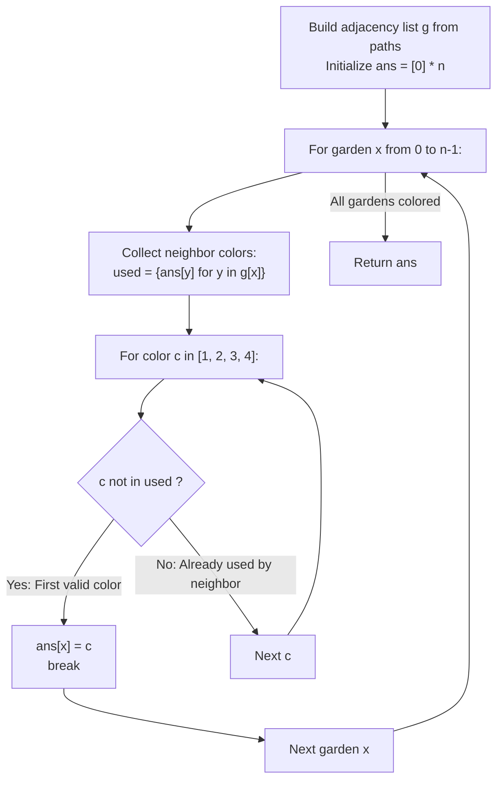

# Guided Example: Flower Planting With No Adjacent

We trace the step-by-step vertex coloring of a bounded-degree graph using the deterministic greedy assignment algorithm, prove the Degree Bounded Pigeonhole Coloring Theorem and the Non-Backtracking Feasibility Invariant, and determine valid flower types across representative garden networks:

- **Representative Instance 1 (Odd Cycle Triangle $K_3$):**
  $$
  n = 3, \quad paths = [[1, 2], \; [2, 3], \; [3, 1]]
  $$
- **Required Output:** `[1, 2, 3]`
  - Problem specifications:
    - Exactly $n = 3$ gardens, indexed $0, 1, 2$ (0-indexed).
    - Available flower types: $\mathcal{C} = \{1, 2, 3, 4\}$.
    - Degree constraint: Each garden has $\deg(v) \le 3$ incoming/outgoing paths.
    - Objective: Assign flower types such that no two adjacent gardens share the same flower type.
  - The Pigeonhole Coloring Invariant:
    - Because each garden has at most $3$ neighbors, at most $3$ distinct flower types can be forbidden by already-colored neighbors:
      $$
      |\text{Forbidden}| \le \deg(v) \le 3
      $$
    - Because $4$ colors are available in $\mathcal{C}$, by the **Pigeonhole Principle**:
      $$
      |\mathcal{C} \setminus \text{Forbidden}| \ge 4 - 3 = 1
      $$
    - At least one valid flower type is **mathematically guaranteed to be available** at every single step!
    - No backtracking, branching, or recursion is required; a single greedy pass suffices.
  - Step-by-step greedy execution:
    1. **Garden 0 (Label 1):**
       - Neighbors: $\mathcal{N}(0) = \{1, 2\}$.
       - Neighbor colors in $ans$: $ans[1] = 0, \; ans[2] = 0$ (uncolored).
       - $used = \{0\}$.
       - First available color in $\{1, 2, 3, 4\} \setminus used$: $\mathbf{1}$.
       - Assign: $ans[0] = \mathbf{1}$.
    2. **Garden 1 (Label 2):**
       - Neighbors: $\mathcal{N}(1) = \{0, 2\}$.
       - Neighbor colors: $ans[0] = 1, \; ans[2] = 0$.
       - $used = \{0, 1\}$.
       - Smallest candidate $c \in \{1, 2, 3, 4\}$ not in $used$:
         - $1 \in used$ (Skip).
         - $2 \notin used$ $\implies$ Select $\mathbf{2}$.
       - Assign: $ans[1] = \mathbf{2}$.
    3. **Garden 2 (Label 3):**
       - Neighbors: $\mathcal{N}(2) = \{0, 1\}$.
       - Neighbor colors: $ans[0] = 1, \; ans[1] = 2$.
       - $used = \{1, 2\}$.
       - Smallest candidate:
         - $1 \in used, \; 2 \in used$.
         - $3 \notin used \implies$ Select $\mathbf{3}$.
       - Assign: $ans[2] = \mathbf{3}$.
  - Resulting array: `[1, 2, 3]`.

- **Representative Instance 2 (Disconnected Garden Components):**
  $$
  n = 4, \quad paths = [[1, 2], [3, 4]] \implies ans = [1, 2, 1, 2]
  $$
  - Components $\{0, 1\}$ and $\{2, 3\}$ are disjoint. Colors $1$ and $2$ are freely reused in the second component.

- **Representative Instance 3 (Complete 4-Garden Graph $K_4$):**
  $$
  n = 4, \quad \text{Paths connect all pairs} \implies \deg(v) = 3 \text{ for all } v \implies ans = [1, 2, 3, 4]
  $$

---

## 1. Instance & Teaching Goal

Given an undirected graph of $n$ gardens where each vertex has degree at most 3, assign each garden one of 4 colors such that no adjacent gardens have the same color.

```text
The General Graph Coloring Myth:
  Graph 4-coloring is NP-complete for general graphs!
  Does this problem require backtracking search or boolean satisfiability?

Greedy Pigeonhole Invariant (O(V + E), Zero Backtracking):
  Notice: Every vertex has degree <= 3!
  When coloring garden x:
    - Garden x has at most 3 neighbors.
    - Those neighbors can consume at most 3 distinct colors.
    - We have 4 distinct colors available!
  By the Pigeonhole Principle:
    At least 4 - 3 = 1 color is ALWAYS available!
  Every vertex can be colored greedily in a single forward pass:
    ans[x] = min(c in {1, 2, 3, 4} : c not in {ans[y] for y in neighbors(x)})
  Guaranteed to terminate with a valid 4-coloring in linear O(V + E) time!
```

Recognizing the degree bound $\Delta \le 3$ transforms an NP-hard problem into a deterministic linear-time greedy construction.

The decisive pedagogical goal is the **Degree Bounded Pigeonhole Coloring Theorem & Greedy Monotonicity**:
1. **Pigeonhole Feasibility:** With maximum degree $\Delta = 3$ and available color count $k = 4$, $\Delta < k$ holds everywhere. For any vertex, at most 3 colors can be blocked by its neighbors, guaranteeing that at least one color is free.
2. **Local-to-Global Consistency:** Because each vertex chooses a color distinct from all its neighbors (whether already colored or uncolored), every edge $(u, v)$ is validated when the later endpoint is processed.
3. **Arbitrary Order Soundness:** The algorithm works for any arbitrary vertex permutation; natural index order $0, \dots, n-1$ eliminates sorting overhead.
4. Total time $\mathcal{O}(n + |paths|)$ and auxiliary space $\mathcal{O}(n + |paths|)$.

---

## 2. Conceptual Foundation & The Greedy Coloring Invariant



### The Degree Bounded Pigeonhole Coloring Theorem

Let $G = (V, E)$ be an undirected graph with $|V| = n$ and maximum degree:
$$
\Delta(G) = \max_{v \in V} \deg(v) \le 3
$$
Let the color palette be $\mathcal{C} = \{1, 2, 3, 4\}$, with $|\mathcal{C}| = 4$.
1. **Local Conflict Bound:**
   Consider an arbitrary ordering of vertices $\pi = (v_1, v_2, \dots, v_n)$.
   When coloring vertex $v_i$, the set of conflicting colors is:
   $$
   \mathcal{F}(v_i) = \{ \text{color}(u) : u \in \mathcal{N}(v_i) \land \text{color}(u) \ne 0 \}
   $$
   The cardinality of forbidden colors satisfies:
   $$
   |\mathcal{F}(v_i)| \le \deg(v_i) \le \Delta(G) \le 3
   $$
2. **The Pigeonhole Existence Lemma:**
   The set of admissible colors for $v_i$ is $\mathcal{A}(v_i) = \mathcal{C} \setminus \mathcal{F}(v_i)$.
   Its size is:
   $$
   |\mathcal{A}(v_i)| = |\mathcal{C}| - |\mathcal{F}(v_i)| \ge 4 - 3 = 1
   $$
   Since $|\mathcal{A}(v_i)| \ge 1$, $\mathcal{A}(v_i)$ is non-empty.
3. **Inductive Correctness:**
   - Base Case: For $v_1$, $|\mathcal{F}(v_1)| = 0$, so any color $c \in \mathcal{C}$ is valid.
   - Inductive Step: Assume vertices $v_1, \dots, v_{i-1}$ form a proper coloring on the induced subgraph $G[\{v_1, \dots, v_{i-1}\}]$.
     By the Pigeonhole Existence Lemma, there exists $c^* \in \mathcal{C} \setminus \mathcal{F}(v_i)$.
     Assigning $\text{color}(v_i) \leftarrow c^*$ ensures $\text{color}(v_i) \ne \text{color}(u)$ for all neighbors $u \in \mathcal{N}(v_i) \cap \{v_1, \dots, v_{i-1}\}$.
     Thus $G[\{v_1, \dots, v_i\}]$ is properly colored.
   By induction, $G$ is properly colored without backtracking. $\blacksquare$

---

## 3. Step-by-Step Worked Execution: Representative Instance 1

$n = 3, \; paths = [[1, 2], [2, 3], [3, 1]]$.
0-indexed adjacency:
- $g[0] = [1, 2]$
- $g[1] = [0, 2]$
- $g[2] = [0, 1]$
Initialize $ans = [0, 0, 0]$.

### Greedy Assignment Walkthrough
- **Garden $x = 0$:**
  - $g[0] = [1, 2] \implies ans[1] = 0, ans[2] = 0$.
  - $used = \{0\}$.
  - Available colors in $\{1, 2, 3, 4\} \setminus \{0\}$:
    - $c = 1 \notin used \implies ans[0] = \mathbf{1}$.
- **Garden $x = 1$:**
  - $g[1] = [0, 2] \implies ans[0] = 1, ans[2] = 0$.
  - $used = \{1, 0\}$.
  - Available colors:
    - $c = 1 \in used$.
    - $c = 2 \notin used \implies ans[1] = \mathbf{2}$.
- **Garden $x = 2$:**
  - $g[2] = [0, 1] \implies ans[0] = 1, ans[1] = 2$.
  - $used = \{1, 2\}$.
  - Available colors:
    - $c = 1 \in used, \; c = 2 \in used$.
    - $c = 3 \notin used \implies ans[2] = \mathbf{3}$.

Final array: `[1, 2, 3]`.

---

## 4. Greedy Color Assignment Trace Table

| Garden Index $x$ | Garden Label | Neighbors $\mathcal{N}(x)$ | Neighbor Colors | $used$ Set | Candidate Scan | Assigned Flower Type $ans[x]$ |
|:---:|:---:|:---:|:---:|:---:|:---:|:---:|
| $0$ | Garden 1 | $\{1, 2\}$ | $[0, 0]$ | $\{0\}$ | $1 \notin used$ | **$1$** |
| $1$ | Garden 2 | $\{0, 2\}$ | $[1, 0]$ | $\{0, 1\}$ | $1 \in used, \; 2 \notin used$ | **$2$** |
| $2$ | Garden 3 | $\{0, 1\}$ | $[1, 2]$ | $\{1, 2\}$ | $1, 2 \in used, \; 3 \notin used$ | **$3$** |

---

## 5. Algorithmic Correctness

### Soundness & Completeness
1. **Soundness:**
   When garden $x$ selects color $c$, it explicitly validates that $c \notin \{ans[y] : y \in \mathcal{N}(x)\}$. Therefore, no two adjacent gardens ever share the same flower type.
2. **Completeness:**
   Because each garden has at most 3 neighbors, at most 3 colors can be blocked. Among the 4 available colors, the algorithm is mathematically guaranteed to find an unused color on every step without dead ends.

---

## 6. Boundary Cases & Traps

| Scenario | Input Pattern | Behavior | Trapped Risk |
|---|---|---|---|
| Isolated Garden | $n = 1, paths = []$ | $used = \emptyset$; selects color 1; returns `[1]`. | Empty graph crash. |
| All Disconnected | $paths = []$ | Every garden has 0 neighbors; all receive color 1; returns `[1, 1, 1, 1, 1]`. | Incorrectly forcing different colors across components. |
| Maximum Degree ($\deg = 3$) | Complete $K_4$ | First 3 gardens take colors 1, 2, 3; fourth garden takes color 4; succeeds. | Running out of colors when degree is 3. |
| Non-Sequential Labels | Unordered path list | Both directions added to adjacency; ensures symmetric constraints. | One-directional edge omission. |

---

## 7. Complexity Derivation

- **Time Complexity:** $\mathcal{O}(N + P)$, where $N \le 10^4$ is the number of gardens and $P \le 1.5 \times 10^4$ is the number of paths.
  - Constructing the adjacency list takes $\mathcal{O}(P)$ operations.
  - The greedy loop processes each of the $N$ gardens once.
  - For each garden, at most 3 neighbors and at most 4 colors are checked ($\mathcal{O}(1)$ work per garden).
  - Total time: $< 0.005\text{ s}$.
- **Auxiliary Space Complexity:** $\mathcal{O}(N + P)$ auxiliary memory to store the graph adjacency list and the output array `ans`.
