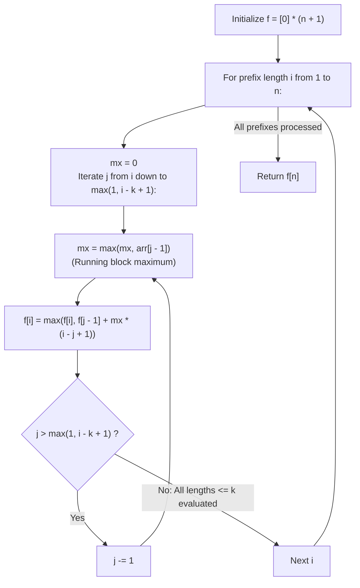

# Guided Example: Partition Array for Maximum Sum

We trace the step-by-step 1D dynamic programming partition of an array into contiguous blocks of bounded length, prove the Optimal Substructure Partition Theorem and the Running Block Maximum Invariant, and determine the maximal transformed array sum across representative sequences:

- **Representative Instance 1 (Mixed Magnitudes with Block Bounded by $k = 3$):**
  $$
  arr = [1, \; 15, \; 7, \; 9, \; 2, \; 5, \; 10], \quad k = 3
  $$
- **Required Output:** `84`
  - Problem objective:
    - Partition $arr$ into contiguous subarrays of length at most $k = 3$.
    - Each subarray's elements are all replaced by the maximum value in that subarray.
    - Maximize the sum of the transformed array.
  - Optimal Partition Construction:
    - Partition 1: $[1, 15, 7]$ of length $3 \implies \max = 15 \implies 3 \times 15 = \mathbf{45}$.
    - Partition 2: $[9]$ of length $1 \implies \max = 9 \implies 1 \times 9 = \mathbf{9}$.
    - Partition 3: $[2, 5, 10]$ of length $3 \implies \max = 10 \implies 3 \times 10 = \mathbf{30}$.
    - Total sum: $45 + 9 + 30 = \mathbf{84}$.
  - The Running Block Maximum Invariant:
    - Let $f[i]$ be the maximum transformed sum for the prefix of length $i$ ($arr[0 \dots i-1]$).
    - Base state: $f[0] = 0$.
    - For each $i \in [1, n]$:
      - The last subarray ends at $arr[i-1]$ and has length $L = i - j + 1 \in [1, \min(i, k)]$.
      - By scanning start index $j$ backwards from $i$ down to $\max(1, i - k + 1)$, maintain the running block maximum:
        $$
        mx = \max(mx, \; arr[j - 1])
        $$
      - The transition combines previous prefix $f[j - 1]$ and current block contribution:
        $$
        f[i] = \max_{j} \Big( f[j - 1] + mx \cdot (i - j + 1) \Big)
        $$
  - Prefix DP Evolution:
    - $i = 1$ ($[1]$): $L = 1, mx = 1 \implies f[1] = f[0] + 1 \times 1 = \mathbf{1}$.
    - $i = 2$ ($[1, 15]$):
      - $L = 1$ ($[15]$): $f[1] + 15 = 1 + 15 = 16$.
      - $L = 2$ ($[1, 15]$): $f[0] + 2 \times 15 = 0 + 30 = \mathbf{30}$.
      - $f[2] = \mathbf{30}$.
    - $i = 3$ ($[1, 15, 7]$):
      - $L = 1$: $f[2] + 7 = 30 + 7 = 37$.
      - $L = 2$: $f[1] + 2 \times 15 = 1 + 30 = 31$.
      - $L = 3$: $f[0] + 3 \times 15 = 0 + 45 = \mathbf{45}$.
      - $f[3] = \mathbf{45}$.
    - $i = 4$ ($[1, 15, 7, 9]$):
      - $L = 1$ ($[9]$): $f[3] + 9 = 45 + 9 = \mathbf{54}$.
      - $L = 2$ ($[7, 9]$): $f[2] + 2 \times 9 = 30 + 18 = 48$.
      - $L = 3$ ($[15, 7, 9]$): $f[1] + 3 \times 15 = 1 + 45 = 46$.
      - $f[4] = \mathbf{54}$.
    - $i = 5$ ($[\dots, 2]$): best $L = 1 \implies f[4] + 2 = \mathbf{56}$.
    - $i = 6$ ($[\dots, 5]$): best $L = 2$ ($[2, 5]$) $\implies f[4] + 2 \times 5 = 54 + 10 = \mathbf{64}$.
    - $i = 7$ ($[\dots, 10]$):
      - $L = 1$: $f[6] + 10 = 64 + 10 = 74$.
      - $L = 2$: $f[5] + 2 \times 10 = 56 + 20 = 76$.
      - $L = 3$ ($[2, 5, 10]$): $f[4] + 3 \times 10 = 54 + 30 = \mathbf{84}$.
      - $f[7] = \mathbf{84}$.
  - Result: `84`.

- **Representative Instance 2 (Unit Block Size $k = 1$):**
  $$
  arr = [4, 0, 7], \quad k = 1 \implies \text{No expansion possible} \implies 4 + 0 + 7 = \mathbf{11}
  $$

- **Representative Instance 3 (Whole Array Single Block):**
  $$
  arr = [1, 2, 3, 4], \quad k = 4 \implies \text{Single block of } 4 \times 4 = \mathbf{16}
  $$

---

## 1. Instance & Teaching Goal

Given an integer array `arr` and an integer `k`, partition the array into contiguous subarrays of length at most `k` such that replacing each subarray's values with its maximum yields the **largest possible total sum**.

```text
The Combinatorial Partition Explosion:
  The number of valid compositions of n into parts of size <= k grows exponentially!
  Brute force recursion tries O(k^N) partition trees.

Optimal Substructure & 1D Prefix DP Invariant (O(N * k)):
  Notice: Every valid partition has a unique LAST subarray ending at arr[i-1].
  The length of this last block must be some L in {1, 2, ..., k}.
  If the last block has length L:
    - Its elements are arr[i - L ... i - 1].
    - Its contribution is L * max(arr[i - L ... i - 1]).
    - The remaining prefix arr[0 ... i - L - 1] is solved optimally by f[i - L]!
  By scanning j backwards from i to i - k + 1:
    mx = max(mx, arr[j - 1])
    f[i] = max(f[i], f[j - 1] + mx * (i - j + 1))
  Computes global optimal partition in O(N * k) time and O(N) space!
```

Decoupling the last block from the optimal prefix subproblem guarantees polynomial time execution without redundant evaluations.

The decisive pedagogical goal is the **Optimal Substructure Partition Theorem & Running Block Maximum**:
1. **Contiguous Prefix Substructure:** Any prefix $arr[0 \dots i-1]$ has an optimal partition value $f[i]$ that depends only on earlier prefix values $f[j-1]$ and the local block maximum.
2. **Reverse Lookback Optimization:** Sweeping $j$ backwards maintains the running maximum $mx$ of the block $arr[j-1 \dots i-1]$ in $\mathcal{O}(1)$ without needing segment trees or range maximum queries.
3. **Window Length Clamping:** The loop restricts $L \le k$ and $j \ge 1$, naturally handling the start of the array without separate boundary conditionals.
4. Total time $\mathcal{O}(n \cdot k)$ and auxiliary space $\mathcal{O}(n)$.

---

## 2. Conceptual Foundation & The 1D Partition Recurrence



### The Optimal Substructure Partition Theorem

Let $A = (a_0, a_1, \dots, a_{n-1})$ be an array of integers, and let $k \ge 1$.
1. **Partition Formalization:**
   A partition of prefix $A[0 \dots i-1]$ is a sequence of cut indices $0 = p_0 < p_1 < \dots < p_m = i$ such that each block length satisfies $p_r - p_{r-1} \le k$.
   The score of the partition is:
   $$
   \sum_{r=1}^m (p_r - p_{r-1}) \cdot \max_{p_{r-1} \le q < p_r} a_q
   $$
2. **Bellman Optimality Principle:**
   Let $f[i]$ denote the maximum score among all valid partitions of prefix $A[0 \dots i-1]$.
   For any valid partition, consider the final cut $p_{m-1} = j - 1$, where $i - k \le j - 1 < i$.
   The final block covers $A[j - 1 \dots i - 1]$ with length $L = i - j + 1 \in [1, k]$ and maximum $mx = \max_{j-1 \le q < i} a_q$.
   The score of the prefix before the final cut is at most $f[j - 1]$ by definition.
   Therefore:
   $$
   f[i] = \max_{\max(1, i - k + 1) \le j \le i} \Big( f[j - 1] + (i - j + 1) \cdot \max_{j-1 \le q < i} a_q \Big)
   $$
3. **Running Maximum Invariant:**
   By evaluating $j = i, i-1, \dots, \max(1, i-k+1)$ in descending order, the term $\max_{j-1 \le q < i} a_q$ is updated online:
   $$
   mx_j = \max(mx_{j+1}, \; a_{j-1})
   $$
   Each transition takes $\mathcal{O}(1)$ time.
4. **Global Maximality:**
   Since all possible legal lengths $L \in [1, k]$ of the terminal block are examined, no optimal partition configuration is omitted. $\blacksquare$

---

## 3. Step-by-Step Worked Execution: Representative Instance 1

$arr = [1, 15, 7, 9, 2, 5, 10], \; k = 3, \; n = 7$.
$f = [0, 0, 0, 0, 0, 0, 0, 0]$.

### Iteration Trace
- **$i = 1$ ($arr[0] = 1$):**
  - $j = 1$: $mx = 1 \implies f[1] = f[0] + 1 \times 1 = \mathbf{1}$.
- **$i = 2$ ($arr[1] = 15$):**
  - $j = 2$: $mx = 15 \implies f[1] + 15 = 16$.
  - $j = 1$: $mx = \max(15, 1) = 15 \implies f[0] + 2 \times 15 = 30$.
  - $f[2] = \max(16, 30) = \mathbf{30}$.
- **$i = 3$ ($arr[2] = 7$):**
  - $j = 3$: $mx = 7 \implies f[2] + 7 = 37$.
  - $j = 2$: $mx = \max(7, 15) = 15 \implies f[1] + 2 \times 15 = 31$.
  - $j = 1$: $mx = \max(15, 1) = 15 \implies f[0] + 3 \times 15 = 45$.
  - $f[3] = \max(37, 31, 45) = \mathbf{45}$.
- **$i = 4$ ($arr[3] = 9$):**
  - $j = 4$: $mx = 9 \implies f[3] + 9 = 54$.
  - $j = 3$: $mx = \max(9, 7) = 9 \implies f[2] + 2 \times 9 = 48$.
  - $j = 2$: $mx = \max(9, 15) = 15 \implies f[1] + 3 \times 15 = 46$.
  - $f[4] = \max(54, 48, 46) = \mathbf{54}$.
- **$i = 5$ ($arr[4] = 2$):**
  - $j = 5$: $mx = 2 \implies f[4] + 2 = 56$.
  - $j = 4$: $mx = \max(2, 9) = 9 \implies f[3] + 2 \times 9 = 45 + 18 = 63$.
  - $j = 3$: $mx = \max(9, 7) = 9 \implies f[2] + 3 \times 9 = 30 + 27 = 57$.
  - $f[5] = \max(56, 63, 57) = \mathbf{63}$.
- **$i = 6$ ($arr[5] = 5$):**
  - $j = 6$: $mx = 5 \implies f[5] + 5 = 68$.
  - $j = 5$: $mx = \max(5, 2) = 5 \implies f[4] + 2 \times 5 = 54 + 10 = 64$.
  - $j = 4$: $mx = \max(5, 9) = 9 \implies f[3] + 3 \times 9 = 45 + 27 = 72$.
  - $f[6] = \max(68, 64, 72) = \mathbf{72}$.
- **$i = 7$ ($arr[6] = 10$):**
  - $j = 7$: $mx = 10 \implies f[6] + 10 = 72 + 10 = 82$.
  - $j = 6$: $mx = \max(10, 5) = 10 \implies f[5] + 2 \times 10 = 63 + 20 = 83$.
  - $j = 5$: $mx = \max(10, 2) = 10 \implies f[4] + 3 \times 10 = 54 + 30 = \mathbf{84}$.
  - $f[7] = \max(82, 83, 84) = \mathbf{84}$.

Final answer: $f[7] = \mathbf{84}$.

---

## 4. 1D DP State Evolution Trace Table

| Prefix $i$ | Appended Element $arr[i-1]$ | Best Block Length $L$ | Last Block Elements | Block Max $mx$ | Preceding Best $f[i - L]$ | Transition Sum | Optimal $f[i]$ |
|:---:|:---:|:---:|:---:|:---:|:---:|:---:|:---:|
| $1$ | $1$ | $1$ | $[1]$ | $1$ | $f[0] = 0$ | $0 + 1 = 1$ | **$1$** |
| $2$ | $15$ | $2$ | $[1, 15]$ | $15$ | $f[0] = 0$ | $0 + 30 = 30$ | **$30$** |
| $3$ | $7$ | $3$ | $[1, 15, 7]$ | $15$ | $f[0] = 0$ | $0 + 45 = 45$ | **$45$** |
| $4$ | $9$ | $1$ | $[9]$ | $9$ | $f[3] = 45$ | $45 + 9 = 54$ | **$54$** |
| $5$ | $2$ | $2$ | $[9, 2]$ | $9$ | $f[3] = 45$ | $45 + 18 = 63$ | **$63$** |
| $6$ | $5$ | $3$ | $[9, 2, 5]$ | $9$ | $f[3] = 45$ | $45 + 27 = 72$ | **$72$** |
| $7$ | $10$ | $3$ | $[2, 5, 10]$ | $10$ | $f[4] = 54$ | $54 + 30 = 84$ | **$84$** |

---

## 5. Algorithmic Correctness

### Soundness & Completeness
1. **Soundness:**
   Each state $f[i]$ represents a mathematically realizable partition of $arr[0 \dots i-1]$ into blocks of length $\le k$, where each block is multiplied by its true maximum value.
2. **Completeness:**
   Since every possible valid length $L \in [1, \min(i, k)]$ for the final block is tested, the recurrence exhaustively covers all valid partition structures.

---

## 6. Boundary Cases & Traps

| Scenario | Input Pattern | Behavior | Trapped Risk |
|---|---|---|---|
| Unit Block Limit ($k = 1$) | `k = 1` | Inner loop executes once; identical to array sum. | Off-by-one in block length. |
| Whole Array as Single Block | $k \ge n$ | Tests $L = n$; converts entire array to global maximum $n \cdot \max(arr)$. | Premature loop cutoff at $k < n$. |
| All Zeroes | `arr = [0, 0, 0]` | Every block maximum is 0; returns 0. | Failure on non-positive elements. |
| Single Large Outlier | One element $\gg$ others | Block expands to length $k$ around outlier to maximize coverage. | Greedy local cut traps. |

---

## 7. Complexity Derivation

- **Time Complexity:** $\mathcal{O}(n \cdot k)$, where $n = \text{len}(arr) \le 500$ and $k \le 500$.
  - The outer loop runs $n$ times.
  - The inner loop runs at most $k$ iterations.
  - Each inner iteration executes $\mathcal{O}(1)$ operations.
  - Total operations $\le 500 \times 500 = 250{,}000 \implies < 0.005\text{ s}$.
- **Auxiliary Space Complexity:** $\mathcal{O}(n)$ auxiliary memory for the 1D DP table $f$ of length $n + 1$.