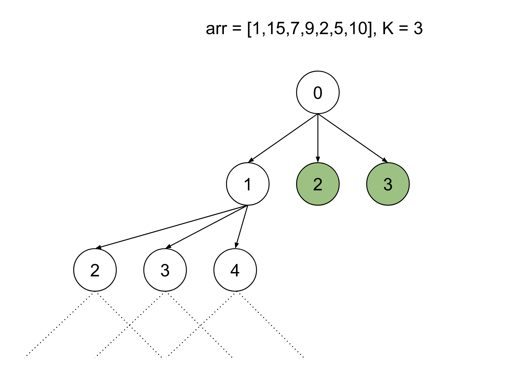

[TOC]

## Solution

---

### Overview

We have an array of `N` integers which we can partition into any number of subarrays such that each subarray can have at most a length of `k`. After partitioning the array, the values in each subarray will change to the maximum value in that subarray. We need to find the maximum sum of all these subarrays.

We can observe that for each element, we have two options: choose this element in the current subarray or choose to end the current subarray before this element and start another one from this element. The brute force approach is to enumerate every possible combination.

There are two key characteristics of this problem that we should note. First, if we choose an element in a subarray, it cannot be reused in another subarray, i.e., each decision we make is affected by the previous decisions we have made. Second, the problem asks us to maximize the sum when choosing the subarrays. These are two common characteristics of dynamic programming problems, and as such we will approach this problem using dynamic programming.

> Dynamic programming is a programming paradigm in which we break a problem into sub-problems, store the result of each sub-problem, and use it when required. If you are unfamiliar with dynamic programming, we recommend checking out [Dynamic Programming Explore Card](https://leetcode.com/explore/featured/card/dynamic-programming/).

---

### Approach 1: Top-Down Dynamic Programming

#### Intuition

At every index, we can decide the length of the subarray with this index as the starting point, denoted as `start`. We can choose a subarray of any length from `1` to `k`.

Let's start from the index `0`; we will iterate over the elements and keep the maximum value we have found so far in the variable `currMax`. When we choose to end the subarray, we will assume each element in it to be the maximum value in that subarray. For each element, we will find the total sum if we choose to keep this subarray. This will be equal to the sum of the current subarray and the maximum sum we can get from the rest of the array.

The sum of the current subarray will be $currMax * length of subarray$ because each element's value will be changed to `currMax`. For the sum of the remaining array, we will make the recursive call to the function with the next index as the starting element of the array. For each index, we will choose subarrays of all lengths up to `k` and return the maximum of all these options. The base condition in the recursive function would be when we have iterated over the complete array in which case we should return `0`.

This recursive approach will have repeated subproblems, as shown in the figure below. Notice that the subtrees with the green node as root are repeated, signifying that we must solve these subproblems more than once.



Each node in the image represents an index of `arr`.

To address this issue, the first time we calculate `sum` for a certain index, we will store the value in an array; this value represents the maximum sum we can get from the elements at indices from the `start` index to the end of the array. The next time we need to calculate the sum for this position, we can look up the result in constant time. This technique is known as memoization, and it helps us avoid recalculating repeated subproblems.

#### Algorithm

1. Initialize an empty array `dp` with all values as `-1` denoting the answer is not calculated yet. Also, initialize `N` as the length of the array `arr`.
2. Define the recursive function `maxSum()`  which takes the array `arr`, an integer `k`, memoization array `dp` and the current position as `start`.
3. Base condition: If the `start` is more than or equal to the size of `arr` then return `0`.
4. If we have already calculated the result before for this index, i.e. $\text{dp}[start]$ is not equal to `-1`, then return it instead of performing recursion.
5. Iterate over the elements from `start` to `start+k`, or the end of the array if there are fewer than `k` elements left, for each index `i`:

1. Store the maximum we have seen so far in the variable `currMax`.
2. Find the sum with the current index as the ending point of the subarray; this will be equal to $currMax * (i - start + 1) + maxSum(arr, k, dp, I + 1)$. The term $i - start + 1$ is the length of the subarray from index `start` to `i` inclusive.
3. Since we need the maximum sum of all our options,  we take the max of all the possible sums and store them as `ans`.
6. After iterating over all possible subarrays, return `ans` and also store it in the variable $\text{dp}[start]$.
7.  Call `maxSum()` and return answer.

#### Implementation

```cpp
class Solution {
public:
    int maxSum(vector<int>& arr, int k, int dp[], int start) {
        int N = arr.size();

        if (start >= N) {
            return 0;
        }

        // Return the already calculated answer.
        if (dp[start] != -1) {
            return dp[start];
        }

        int currMax = 0, ans = 0;
        int end = min(N, start + k);
        for (int i = start; i < end; i++) {
            currMax = max(currMax, arr[i]);
            // Store the maximum of all options for the current subarray.
            ans = max(ans, currMax * (i - start + 1) + maxSum(arr, k, dp, i + 1));
        }

        // Store the answer to be reused.
        return dp[start] = ans;
    }

    int maxSumAfterPartitioning(vector<int>& arr, int k) {
        int dp[arr.size()];
        memset(dp, -1, sizeof(dp));

        return maxSum(arr, k, dp, 0);
    }
};
```

#### Complexity Analysis

Let $N$ be the number of elements in the array, and $K$ is the maximum length of a subarray.

* Time complexity: $O(N \cdot K)$

  The time complexity for the recursion with memoization is equal to the number of times `maxSum()` is called times the average time of `maxSum()`. The number of calls to `maxSum()` is $N$ because each non-memoized call will call `maxSum()` only once. Each memoized call will take $O(1)$ time, while for the non-memoized call, we iterate over most $K$ elements ahead of it. Hence, the total time complexity equals $O(N \cdot K)$.

* Space complexity: $O(N)$

  The result for each  `start` index will be stored in `dp`, and `start` can have the values from `0` to `N`; thus, the space required is $O(N)$. Also, the stack space needed for recursion is equal to the maximum number of active function calls which will be $N$, one for each index. Hence, the space complexity will equal $O(N)$.
  <br/>

---

### Approach 2: Bottom-Up Dynamic Programming

#### Intuition

In the previous approach, the recursive calls incurred stack space. This can be avoided by applying the same approach in an iterative manner which is generally faster than the top-down approach.

In this approach, we start from $start = N$, which is our base case in the previous approach; the value for this index will be `0`. Then we iterate over elements from index $N - 1$ to `0` and assume this index to be the starting point of the subarray like in the previous approach. We will choose the ending point as one of the next `k` indices by iterating over them with `i`. Similar to the previous approach we will keep the maximum element in the variable `currMax`. The sum of the current subarray would be $currMax * (i - start + 1)$ because the subarray will be from index `start` to `i` so the length will be $i - start + 1$. The total sum with the current subarray will be $currMax * (i - start + 1) + dp[i + 1]$, here, $dp[i + 1]$ is the answer for the remaining array that we have already calculated. The value of $\text{dp}[start]$ will be updated as follows:

> $\text{dp}[start] = max(\text{dp}[start], dp[j + 1] + currMax * (j - start + 1));$

The answer for the problem would be at $\text{dp}[0]$ similar to the top-down approach.

#### Algorithm

1. Initialize an empty memoization array `dp` with all elements as `0`. Also, initialize `N` as the length of the array `arr`.
2. Iterate over the indices from $N - 1$ to `0`  with `start`:

1. Iterate over the next `k` elements, or till the end of the array if there are fewer than `k` elements, using `i`:
2. Store the maximum element so far as the variable `currMax`.
3. Store the value $\text{dp}[start]$ as $max(\text{dp}[start], dp[i + 1] + currMax * (i - start + 1))$.
3. Return $\text{dp}[0]$ after iterating over all elements.

#### Implementation

```cpp
class Solution {
public:
    int maxSumAfterPartitioning(vector<int>& arr, int k) {
        int N = arr.size();

        int dp[N + 1];
        memset(dp, 0, sizeof(dp));

        for (int start = N - 1; start >= 0; start--) {
            int currMax = 0;
            int end = min(N, start + k);

            for (int i = start; i < end; i++) {
                currMax = max(currMax, arr[i]);
                // Store the maximum of all options for the current subarray.
                dp[start] = max(dp[start], dp[i + 1] + currMax * (i - start + 1));
            }
        }
        return dp[0];
    }
};
```

#### Complexity Analysis

Let $N$ be the number of elements in the array, and $K$ is the maximum length of a subarray.

* Time complexity: $O(N \cdot K)$

  We iterate over all elements from $N - 1$ to `0`, and, for each of them, iterate over at most $K$ elements so the time complexity is equal to $O(N \cdot K)$.

* Space complexity: $O(N)$

  The result for each `start` index will be stored in `dp`, and `start` can have the values from `0` to `N`; thus, the space required is $O(N)$.
  <br/>

> **Note**: If we observe closely the above approach we need only the last $K$ previously calculated answers to find the answer for the current index `start`. This is because the length of the subarray cannot be more than $K$, even though we have stored all $N$ answers in the array `dp`. We can change the size of array `dp` to store only the last $K$ results and then use them to calculate the answers. This will reduce the space complexity to $O(K)$, which is a significant reduction when $K$ is small. At worst, when $K$ is equal to $N$, the space complexity will still be $O(N)$. The time complexity of this approach is $O(N \cdot K)$. The following code is written using this approach:

```cpp
class Solution {
public:
    int maxSumAfterPartitioning(vector<int>& arr, int k) {
        int N = arr.size();
        int K = k + 1;

        int dp[k + 1];
        memset(dp, 0, sizeof(dp));

        for (int start = N - 1; start >= 0; start--) {
            int currMax = 0;
            int end = min(N, start + k);

            for (int i = start; i < end; i++) {
                currMax = max(currMax, arr[i]);
                dp[start % K] = max(dp[start % K], dp[(i + 1) % K] + currMax * (i - start + 1));
            }
        }
        return dp[0];
    }
};
```

---