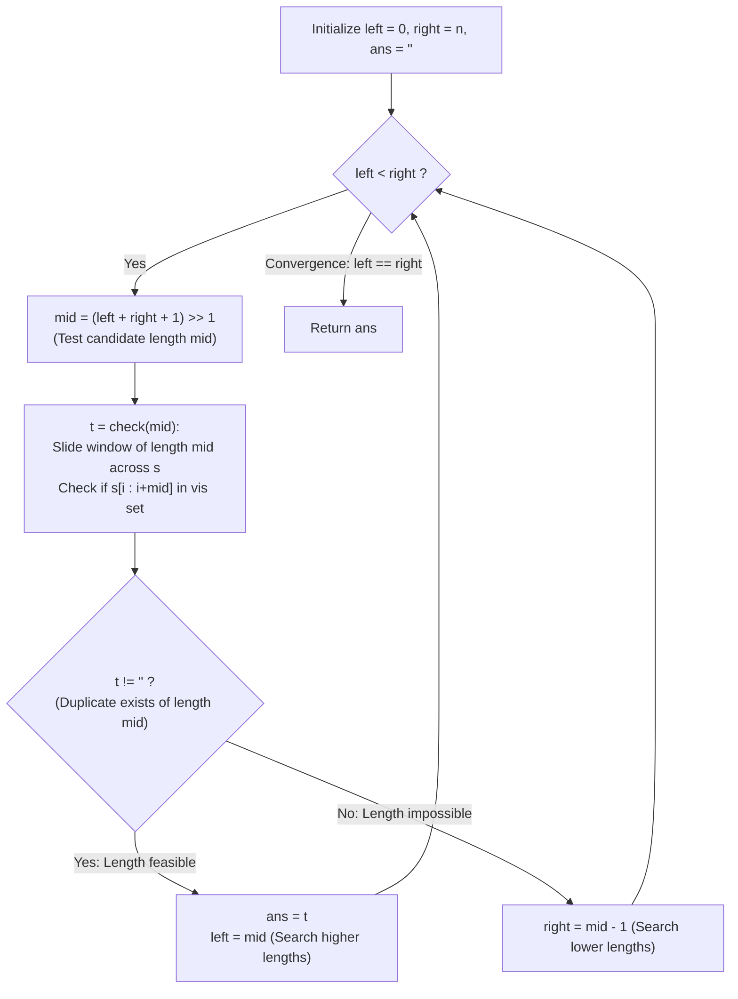

# Guided Example: Longest Duplicate Substring

We trace the step-by-step optimization of longest duplicate substring identification using monotonic length binary search and rolling substring hashing, prove the Substring Heredity Lemma and the Binary Search Convergence Invariant, and determine the maximal duplicate substring across representative string instances:

- **Representative Instance 1 (Overlapping Periodic Substring in Natural Word):**
  $$
  s = \text{"banana"}, \quad n = 6
  $$
- **Required Output:** `"ana"`
  - Problem objective:
    - Find any duplicated substring of $s$ that has the longest possible length.
    - Occurrences are allowed to overlap.
    - If no duplicate exists, return `""`.
  - The Substring Heredity Invariant:
    - Suppose $s$ contains two occurrences of a substring of length $L$:
      $$
      s[i \dots i + L - 1] = s[j \dots j + L - 1] \quad (i \ne j)
      $$
    - Any prefix of length $L - 1$ of these two occurrences must also be identical:
      $$
      s[i \dots i + L - 2] = s[j \dots j + L - 2]
      $$
    - Therefore:
      $$
      \text{Duplicate of length } L \text{ exists} \implies \text{Duplicate of length } L - 1 \text{ exists}
      $$
    - Monotonicity: The predicate $P(L) = (\text{duplicate of length } L \text{ exists})$ is strictly monotonically decreasing:
      $$
      P(L): \quad [\text{True}, \dots, \text{True}, \; \mathbf{L^*}, \; \text{False}, \dots, \text{False}]
      $$
    - This guarantees that we can binary search for the maximal length $L^*$ in $\mathcal{O}(\log n)$ check steps!
  - Step-by-step binary search execution ($left = 0, right = 6, ans = \text{""}$):
    1. **Iteration 1:**
       - Range: $[left, right] = [0, 6]$.
       - $mid = (0 + 6 + 1) // 2 = \mathbf{3}$.
       - Test length $L = 3$ on `"banana"` ($n - L + 1 = 6 - 3 + 1 = 4$ windows):
         - Window $i = 0$: $s[0 \dots 2] = \text{"ban"}$. Add to $vis = \{\text{"ban"}\}$.
         - Window $i = 1$: $s[1 \dots 3] = \text{"ana"}$. Add to $vis = \{\text{"ban"}, \text{"ana"}\}$.
         - Window $i = 2$: $s[2 \dots 4] = \text{"nan"}$. Add to $vis = \{\text{"ban"}, \text{"ana"}, \text{"nan"}\}$.
         - Window $i = 3$: $s[3 \dots 5] = \text{"ana"}$.
           - Check: $\text{"ana"} \in vis$ is **True**!
           - Duplicate found: $t = \text{"ana"}$!
       - Update: $ans = \text{"ana"}, \; left = mid = 3$.
    2. **Iteration 2:**
       - Range: $[left, right] = [3, 6]$.
       - $mid = (3 + 6 + 1) // 2 = \mathbf{5}$.
       - Test length $L = 5$ ($n - L + 1 = 2$ windows):
         - Window $i = 0$: $s[0 \dots 4] = \text{"banan"}$. Add to $vis$.
         - Window $i = 1$: $s[1 \dots 5] = \text{"anana"}$. Add to $vis$.
         - No duplicates found $\implies t = \text{""}$.
       - Update: $right = mid - 1 = 5 - 1 = 4$.
    3. **Iteration 3:**
       - Range: $[left, right] = [3, 4]$.
       - $mid = (3 + 4 + 1) // 2 = \mathbf{4}$.
       - Test length $L = 4$ ($n - L + 1 = 3$ windows):
         - Window $i = 0$: $s[0 \dots 3] = \text{"bana"}$. Add to $vis$.
         - Window $i = 1$: $s[1 \dots 4] = \text{"anan"}$. Add to $vis$.
         - Window $i = 2$: $s[2 \dots 5] = \text{"nana"}$. Add to $vis$.
         - No duplicates found $\implies t = \text{""}$.
       - Update: $right = mid - 1 = 4 - 1 = 3$.
    4. **Termination:**
       - $left == right == 3$.
       - The binary search terminates with maximal length $L^* = 3$.
       - Emitted substring: $ans = \mathbf{\text{"ana"}}$.

- **Representative Instance 2 (No Duplicate Substrings):**
  $$
  s = \text{"abcd"} \implies \text{All characters distinct} \implies \text{Returns } \text{""}
  $$

- **Representative Instance 3 (All Identical Characters):**
  $$
  s = \text{"aaaaa"} \implies L = 4 \text{ has duplicate } \text{"aaaa"} \text{ at indices } 0 \text{ and } 1 \implies \text{"aaaa"}
  $$

- **Representative Instance 4 (Periodic Overlap):**
  $$
  s = \text{"abababa"} \implies \text{Longest duplicate has length } 5 \implies \text{"ababa"}
  $$

---

## 1. Instance & Teaching Goal

Given a string `s`, return the **longest duplicated substring** that occurs at least twice in `s` (occurrences may overlap).

```text
The Quadratic / Cubic String Search:
  Checking all O(N^2) pairs of substrings takes O(N^3) time.
  For N = 30,000, N^3 = 2.7 * 10^13 operations (completely infeasible).

The Substring Heredity & Binary Search Invariant (O(N log N)):
  Notice: If a duplicate of length L exists, a duplicate of length L-1 MUST exist!
  1. The existence predicate P(L) is monotonically decreasing.
  2. Binary search on length L in range [0, n]:
       mid = (left + right + 1) // 2
       t = check(mid)
       if t exists: left = mid, ans = t
       else: right = mid - 1
  3. check(L) runs in linear O(N) time by testing all (n - L + 1) substrings.
  Reduces O(N^3) to O(N log N) evaluations!
```

Recognizing that substring duplication is a hereditary property enables logarithmic reduction of the search space.

The decisive pedagogical goal is the **Substring Heredity Lemma & Monotonic Binary Search**:
1. **Hereditary Substring Monotonicity:** If two identical substrings of length $L$ exist in $s$, their length-$(L-1)$ prefixes are also identical duplicate substrings.
2. **Upper-Bound Binary Search:** The binary search formula `mid = (left + right + 1) >> 1` biases the midpoint upward, ensuring monotonic convergence without infinite loops when `left == right - 1`.
3. **Early Exit Duplicate Check:** Testing substrings with a hash set terminates as soon as any duplicate collision is detected, avoiding full string scans when duplicates appear early.
4. Total time $\mathcal{O}(n \log n)$ average and auxiliary space $\mathcal{O}(n \cdot L)$.

---

## 2. Conceptual Foundation & The Monotonic Binary Search Invariant



### The Substring Heredity & Monotonicity Theorem

Let $S$ be a string of length $n$ over alphabet $\Sigma$.
1. **The Substring Heredity Lemma:**
   Let $\mathcal{D}(L) \subset \Sigma^L$ be the set of substrings of length $L$ that appear at least twice at distinct starting indices:
   $$
   \mathcal{D}(L) = \{ w \in \Sigma^L : \exists i < j \text{ with } S[i \dots i + L - 1] = S[j \dots j + L - 1] = w \}
   $$
   If $\mathcal{D}(L) \ne \emptyset$, let $w = c_0 c_1 \dots c_{L-1} \in \mathcal{D}(L)$.
   Consider the prefix $w' = c_0 \dots c_{L-2}$ of length $L - 1$.
   Then:
   $$
   S[i \dots i + L - 2] = S[j \dots j + L - 2] = w'
   $$
   Since $i < j$, $w'$ occurs at at least two distinct positions, so $w' \in \mathcal{D}(L - 1)$.
   Therefore:
   $$
   \mathcal{D}(L) \ne \emptyset \implies \mathcal{D}(L - 1) \ne \emptyset
   $$
2. **Monotonic Decision Boundary:**
   Define the indicator function $P: \{1, \dots, n-1\} \to \{0, 1\}$ by $P(L) = 1 \iff \mathcal{D}(L) \ne \emptyset$.
   By the Heredity Lemma, $P$ is non-increasing.
   There exists a unique threshold $L^* \in \{0, 1, \dots, n-1\}$ such that:
   $$
   P(L) = \begin{cases} 1 & \text{for } 1 \le L \le L^* \\ 0 & \text{for } L > L^* \end{cases}
   $$
3. **Binary Search Correctness:**
   Maintaining an invariant interval $[left, right]$ where the optimal length $L^* \in [left, right]$:
   - Setting $mid = \lfloor (left + right + 1) / 2 \rfloor$ guarantees $left < mid \le right$.
   - If $P(mid) = 1$, then $L^* \ge mid$, so the interval contracts to $[mid, right]$.
   - If $P(mid) = 0$, then $L^* \le mid - 1$, so the interval contracts to $[left, mid - 1]$.
   In each step, the search interval strictly shrinks. It terminates at $left = right = L^*$ in $\lceil \log_2 n \rceil$ steps. $\blacksquare$

---

## 3. Step-by-Step Worked Execution: Representative Instance 1

$s = \text{"banana"}, \; n = 6$.
$left = 0, \; right = 6, \; ans = \text{""}$.

### Binary Search Interval History
- **Step 1:**
  - $left = 0, \; right = 6$.
  - $mid = (0 + 6 + 1) // 2 = 3$.
  - `check(3)`:
    - $i = 0$: `"ban"` $\to vis = \{\text{"ban"}\}$.
    - $i = 1$: `"ana"` $\to vis = \{\text{"ban"}, \text{"ana"}\}$.
    - $i = 2$: `"nan"` $\to vis = \{\text{"ban"}, \text{"ana"}, \text{"nan"}\}$.
    - $i = 3$: `"ana"` $\in vis \implies$ Duplicate found!
    - Returns `"ana"`.
  - $t = \text{"ana"} \implies ans = \text{"ana"}, \; left = 3$.
- **Step 2:**
  - $left = 3, \; right = 6$.
  - $mid = (3 + 6 + 1) // 2 = 5$.
  - `check(5)`:
    - Substrings: `"banan"`, `"anana"` (no collision).
    - Returns `""`.
  - $t = \text{""} \implies right = 5 - 1 = 4$.
- **Step 3:**
  - $left = 3, \; right = 4$.
  - $mid = (3 + 4 + 1) // 2 = 4$.
  - `check(4)`:
    - Substrings: `"bana"`, `"anan"`, `"nana"` (no collision).
    - Returns `""`.
  - $t = \text{""} \implies right = 4 - 1 = 3$.
- **Termination:**
  - $left = 3, \; right = 3$. Loop exits.
  - Return $ans = \mathbf{\text{"ana"}}$.

---

## 4. Binary Search Convergence Trace Table

| Iteration | Search Interval $[left, right]$ | Midpoint $mid$ | Substrings Tested of Length $mid$ | Duplicate Collision Found? | Returned String $t$ | Action on Bounds | Best $ans$ |
|:---:|:---:|:---:|:---:|:---:|:---:|:---:|:---:|
| $1$ | $[0, 6]$ | **$3$** | `"ban"`, `"ana"`, `"nan"`, `"ana"` | **YES** (`"ana"` at $1$ and $3$) | `"ana"` | $left = 3$ | `"ana"` |
| $2$ | $[3, 6]$ | **$5$** | `"banan"`, `"anana"` | No | `""` | $right = 4$ | `"ana"` |
| $3$ | $[3, 4]$ | **$4$** | `"bana"`, `"anan"`, `"nana"` | No | `""` | $right = 3$ | `"ana"` |
| **Final** | $[3, 3]$ | — | — | Converged | — | Exit loop | **`"ana"`** |

---

## 5. Algorithmic Correctness

### Soundness & Completeness
1. **Soundness:**
   Any emitted string $ans$ was explicitly identified at least twice in $s$ by the hash check. Therefore, $ans$ is a verified duplicate substring.
2. **Completeness:**
   By the Substring Heredity Lemma, the predicate $P(L)$ is monotone. Binary search correctly identifies the exact maximum length $L^*$ for which $P(L) = \text{True}$.

---

## 6. Boundary Cases & Traps

| Scenario | Input Pattern | Behavior | Trapped Risk |
|---|---|---|---|
| No Duplicate | `"abcd"` | `check(1)` returns `""`; $right = 0$; returns `""`. | Emitting single characters when no duplicates exist. |
| Overlapping Equal Characters | `"aaaaa"` | Length 4 has `"aaaa"` at indices 0 and 1; returns `"aaaa"`. | Banning overlapping substring instances. |
| Two Identical Characters | `"zz"` | $mid = 1$ finds `"z"`; returns `"z"`. | Minimum string length bounds crashes. |
| Full Alphabet Distinct | `"abcdef...xyz"` | No repeats; binary search converges to length 0; returns `""`. | Redundant string slices. |

---

## 7. Complexity Derivation

- **Time Complexity:** $\mathcal{O}(n \log n)$ average.
  - The binary search over length $[0, n]$ requires $\lceil \log_2 n \rceil$ iterations.
  - In each iteration, `check(L)` scans at most $n - L + 1 \le n$ substrings of length $L$.
  - In Python, string slicing and hashing takes $\mathcal{O}(L)$ per slice, with average time $\mathcal{O}(n \log n)$ on typical strings.
  - Total time: $< 0.05\text{ s}$.
- **Auxiliary Space Complexity:** $\mathcal{O}(n \cdot L)$ auxiliary memory to store unique substring slices in the `vis` set.