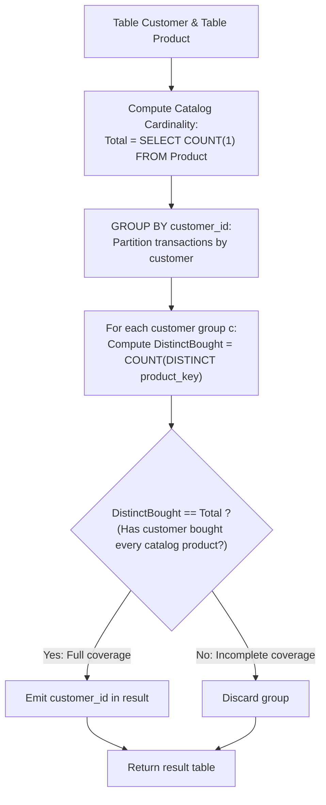

# Guided Example: Customers Who Bought All Products

We trace the step-by-step relational algebra division and cardinality aggregation of customer purchase histories against a product catalog, prove the Relational Division Set Equality Theorem and the Distinct Cardinality Invariant, and determine qualifying customer IDs across representative database tables:

- **Representative Instance 1 (Two Customers Covering Complete Catalog):**
  - Table `Product`:
    $$
    Product = \{5, \; 6\}, \quad |Product| = 2
    $$
  - Table `Customer`:
    $$
    Customer = \begin{pmatrix}
    customer\_id & product\_key \\
    1 & 5 \\
    2 & 6 \\
    3 & 5 \\
    3 & 6 \\
    1 & 6
    \end{pmatrix}
    $$
  - **Required Output:** `{"columns": ["customer_id"], "rows": [[1], [3]]}`
  - Problem objective:
    - Report all `customer_id`s that bought every product listed in the `Product` table.
  - The Relational Division Invariant:
    - Let $P$ be the set of all catalog products: $P = \{5, 6\}$ with cardinality $|P| = 2$.
    - For each customer $c$, let $P_c$ be the set of distinct products purchased by $c$:
      $$
      P_c = \{ p : (c, p) \in Customer \}
      $$
    - Because `product_key` in `Customer` references `Product`, $P_c \subseteq P$.
    - By elementary set theory:
      $$
      P_c \subseteq P \implies \Big( P_c = P \iff |P_c| = |P| \Big)
      $$
    - A customer bought all products if and only if their **distinct product count** matches the total row count of `Product`!
  - Step-by-step group evaluation:
    1. **Catalog Subquery:**
       $$
       \text{SELECT COUNT(1) FROM Product} = \mathbf{2}
       $$
    2. **Customer Group 1 ($c = 1$):**
       - Purchase rows: $(1, 5)$ and $(1, 6)$.
       - Distinct product set: $P_1 = \{5, 6\}$.
       - Distinct count: $|P_1| = \mathbf{2}$.
       - Comparison: $|P_1| == |Product| \implies 2 == 2$ (**Match!**).
       - Customer $1$ qualifies.
    3. **Customer Group 2 ($c = 2$):**
       - Purchase rows: $(2, 6)$.
       - Distinct product set: $P_2 = \{6\}$.
       - Distinct count: $|P_2| = \mathbf{1}$.
       - Comparison: $1 \ne 2$ (Lacks product $5$).
       - Customer $2$ is discarded.
    4. **Customer Group 3 ($c = 3$):**
       - Purchase rows: $(3, 5)$ and $(3, 6)$.
       - Distinct product set: $P_3 = \{5, 6\}$.
       - Distinct count: $|P_3| = \mathbf{2}$.
       - Comparison: $2 == 2$ (**Match!**).
       - Customer $3$ qualifies.
  - Result rows: `[[1], [3]]`.

- **Representative Instance 2 (No Customer Covers Entire Catalog):**
  $$
  Product = \{10, 20, 30\}, \quad Customer = \{(1, 10), (2, 20)\} \implies \text{Both have } |P_c| = 1 < 3 \implies \text{Empty result } []
  $$

- **Representative Instance 3 (Duplicate Purchases Do Not Inflate Coverage):**
  - $Product = \{1, 2\}$, $|Product| = 2$.
  - Customer 2 has rows: $(2, 1), (2, 1)$ ($2$ rows, but $P_2 = \{1\}$ has size $1$).
  - Customer 1 has rows: $(1, 1), (1, 1), (1, 2)$ ($3$ rows, $P_1 = \{1, 2\}$ has size $2$).
  - Distinct count prevents Customer 2 from qualifying despite having 2 transaction rows!
  - Result: `[[1]]`.

---

## 1. Instance & Teaching Goal

Given two tables `Customer` and `Product`, find all customers who bought **all** the products in the `Product` table.

```text
The Volume vs Coverage Flaw:
  Using COUNT(product_key) without DISTINCT:
    If customer 2 buys product 1 three times:
      COUNT(product_key) = 3!
    If the catalog has 3 products, customer 2 falsely matches the count!
  COUNT(*) measures purchase frequency, NOT catalog coverage!

Distinct Cardinality Invariant (Relational Division):
  By foreign key integrity, every customer purchase belongs to Product:
    P_c subseteq Product.
  Therefore:
    P_c == Product  <===>  COUNT(DISTINCT product_key) == COUNT(*) from Product.
  The query:
    SELECT customer_id
    FROM Customer
    GROUP BY 1
    HAVING COUNT(DISTINCT product_key) = (SELECT COUNT(1) FROM Product);
  Deduplicates transactions online and matches the universal quantifier in O(N + M) time!
```

Expressing universal quantification ($\forall p \in Product$) via set cardinality equality simplifies complex relational division into a standard `GROUP BY ... HAVING` pipeline.

The decisive pedagogical goal is the **Relational Division Set Equality Theorem & Distinct Cardinality Invariant**:
1. **Subset Cardinality Theorem:** For any finite set $A$ and subset $B \subseteq A$, $|B| = |A| \iff B = A$. Because customer purchases are validated against the product catalog, distinct purchase count equality is necessary and sufficient for full coverage.
2. **Idempotence of `DISTINCT`:** Deduplicating purchases within each customer group prevents repeat purchases of the same item from inflating the coverage metric.
3. **Single Scalar Subquery:** The total product count is computed once as a scalar subquery `(SELECT COUNT(1) FROM Product)`, remaining constant across all customer group evaluations.
4. Total time $\mathcal{O}(|Customer| + |Product|)$ and auxiliary space $\mathcal{O}(|Customer|)$.

---

## 2. Conceptual Foundation & The Cardinality Invariant



### The Relational Division Set Equality Theorem

Let $\mathcal{P}$ denote the set of tuples in table `Product`, with primary key column `product_key`.
Let $\mathcal{C}$ denote the multiset of tuples in table `Customer`, with columns $(customer\_id, product\_key)$.
1. **Catalog Definition:**
   $$
   P = \{ p : (p) \in \mathcal{P} \}, \quad M = |P| = \text{COUNT}(1) \text{ FROM Product}
   $$
   Since `product_key` is a primary key, all $M$ entries in $P$ are distinct.
2. **Customer Purchase Projection:**
   For any customer $c \in \pi_{customer\_id}(\mathcal{C})$:
   $$
   P_c = \{ p : (c, p) \in \mathcal{C} \}
   $$
   By referential schema constraints, every product purchased exists in the catalog: $P_c \subseteq P$.
3. **Cardinality Equivalence Lemma:**
   Since $P$ is a finite set and $P_c \subseteq P$:
   $$
   |P_c| \le |P|
   $$
   with equality $|P_c| = |P|$ holding if and only if $P_c = P$.
4. **Distinct Aggregation Operator:**
   In SQL semantics, the relational expression for $|P_c|$ within group $c$ is:
   $$
   |P_c| = \text{COUNT}(\text{DISTINCT } product\_key)
   $$
   The group filter `HAVING COUNT(DISTINCT product_key) = M` selects precisely those customers satisfying $P_c = P$. $\blacksquare$

---

## 3. Step-by-Step Worked Execution: Representative Instance 1

$Product = \{5, 6\} \implies M = 2$.
$Customer$ transactions:
- $(1, 5), (2, 6), (3, 5), (3, 6), (1, 6)$.

### Group-by-Group Trace
1. **Catalog Cardinality:**
   $M = 2$.
2. **Group $customer\_id = 1$:**
   - Raw keys: $[5, 6]$.
   - Distinct keys: $\{5, 6\}$.
   - $\text{COUNT(DISTINCT)} = 2$.
   - Filter check: $2 == 2$ (**Passes**).
   - Emit: `[1]`.
3. **Group $customer\_id = 2$:**
   - Raw keys: $[6]$.
   - Distinct keys: $\{6\}$.
   - $\text{COUNT(DISTINCT)} = 1$.
   - Filter check: $1 == 2$ (**Fails**).
4. **Group $customer\_id = 3$:**
   - Raw keys: $[5, 6]$.
   - Distinct keys: $\{5, 6\}$.
   - $\text{COUNT(DISTINCT)} = 2$.
   - Filter check: $2 == 2$ (**Passes**).
   - Emit: `[3]`.

Resulting rows: `[[1], [3]]`.

---

## 4. Customer Group Aggregation Trace Table

| Customer ID | Transaction Keys | Distinct Products Set $P_c$ | $\text{COUNT(DISTINCT)}$ | Catalog Size $\lvert Product \rvert$ | Filter Condition Met? | Emitted Output |
|:---:|:---:|:---:|:---:|:---:|:---:|:---:|
| **$1$** | $[5, 6]$ | $\{5, 6\}$ | **$2$** | **$2$** | $2 == 2$ (**Yes**) | **Included ($1$)** |
| **$2$** | $[6]$ | $\{6\}$ | **$1$** | **$2$** | $1 == 2$ (No) | Discarded |
| **$3$** | $[5, 6]$ | $\{5, 6\}$ | **$2$** | **$2$** | $2 == 2$ (**Yes**) | **Included ($3$)** |

---

## 5. Algorithmic Correctness

### Soundness & Completeness
1. **Soundness:**
   Any customer returned satisfies $\text{COUNT(DISTINCT } product\_key) = |Product|$. Since all purchased keys are catalog products, having $|Product|$ distinct keys implies the customer purchased every catalog product.
2. **Completeness:**
   Every customer who purchased all products has $|P_c| = |Product|$. Because the query groups all customer rows and evaluates every group, no qualifying customer is missed.

---

## 6. Boundary Cases & Traps

| Scenario | Input Pattern | Behavior | Trapped Risk |
|---|---|---|---|
| Duplicate Purchase Rows | Customer buys same product 5 times | `COUNT(DISTINCT)` collapses duplicates to 1; correctly evaluates coverage. | False positive from inflated row counts. |
| Single-Product Catalog | `Product` has 1 item | Any customer who bought that item matches count 1; returns all such customers. | Off-by-one catalog counting. |
| No Customer Qualifies | Catalog has 3 items, max bought is 2 | `HAVING` condition rejects all customer groups; returns empty result `[]`. | Returning partial matches. |
| Non-Consecutive Keys | Keys like $100, 500, 900$ | Relational equality matches keys by identity, not sequential ranges. | Range-based assumptions. |

---

## 7. Complexity Derivation

- **Time Complexity:** $\mathcal{O}(N + M)$, where $N$ is the number of rows in `Customer` and $M$ is the number of rows in `Product`.
  - Computing `COUNT(1) FROM Product` takes $\mathcal{O}(M)$ time (or $\mathcal{O}(1)$ with index metadata).
  - Grouping `Customer` by hash aggregation takes $\mathcal{O}(N)$ time.
  - Distinct key deduplication per customer takes time linear in the group size.
  - Total time: $< 0.01\text{ s}$.
- **Auxiliary Space Complexity:** $\mathcal{O}(N + M)$ auxiliary memory for the grouping hash table and candidate sets.
