## Solution

---

### Overview

> **Problem reference:** Find all $\text{customer}_{id}$ who bought all products in the `Product` table. Then, return the result table in any order.

We need to compare the `Customer` and `Product` tables to find the customers who bought all the products. This operation is called **division** in relational algebra.

---

### Approach 1: Count how many products each customer bought

#### Intuition

We can simply think that if the number of distinct products the customer bought is the same as the number of products in the `Product` table, the customer is considered to buy all products. Thus, we can group the `Customer` table with $\text{customer}_{id}$ to count the number of products each customer bought and compare it with the number of rows in the `Product` table. We do not need to use the `DISTINCT` keyword because $\text{product}_{key}$ is the primary key of the `Product` table.

#### Algorithm

1. Use `GROUP BY` to group the `Customer` table by $\text{customer}_{id}$.
2. Compare the number of products each customer bought and the number of products in the `Product` table on the `HAVING` clause.

#### Implementation

```mysql []
SELECT
  customer_id
FROM
  Customer
GROUP BY
  customer_id
HAVING
  COUNT(DISTINCT product_key) = (
    SELECT
      COUNT(product_key)
    FROM
      Product
  );
```

### Approach 2: Use nested subquery with Cartesian Product - Alternative

#### Intuition

We can find the customers who bought all products in the `Product` table using the _division_ operation. _Division_ is the operation of relational algebra. We can get the tuples of the relation that includes all tuples of the other relation by using _division_.

### Relational Model

#### Concepts

Before we talk about relational algebra, we need to know the basic concepts of **relational database (RDB)** and **structured query language (SQL)**. The English computer scientist, [Edgar F. Codd](https://en.wikipedia.org/wiki/Edgar_F._Codd) issued a paper _"Relational Completeness of Data Base Sublanguages,"_ while he was working at IBM. He suggested a **relational model** in this paper, based on the **relation** and **set theory** in mathematics. The relational model explains the relationship between relations.

#### Relation, Attribute, and Tuple

We can simply think of the **relation** as a **table**. As you see in the below image, we call a column an **attribute** and a row a **tuple** in the relational model. Thus, `Customer` is the relation, `customer_id` is the attribute, and a set of `customer_id` and `product_key`, such as `(1, 5)`, is the tuple.

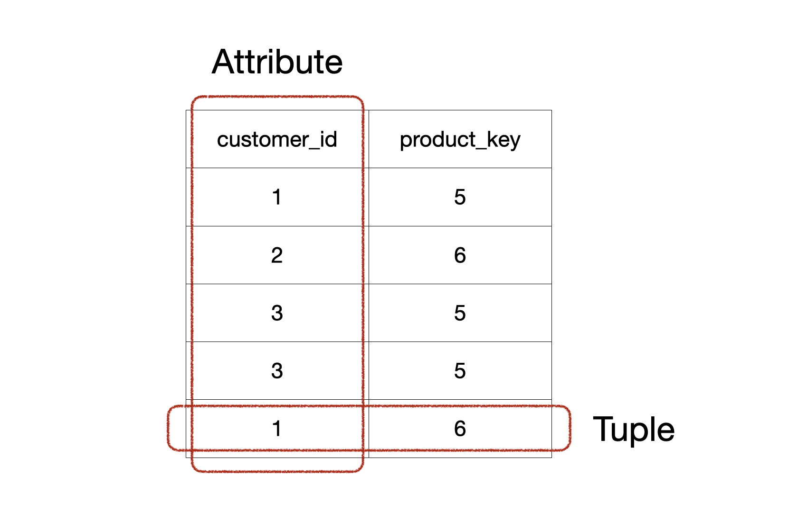

### Relational Data Language

There are two kinds of languages to handle the relational model, **relational algebra** and **relational calculus**. We can express relational algebra as relational calculus and also vice versa.

#### Relational Algebra

**Relational algebra** is a procedural language. Thus, it specifies the order and explains **how** to get the result. SQL includes some features from relational algebra, which means some features would be replaced with others.

#### Relational Calculus

**Relational calculus** is a non-procedural language. Thus, it does not specify the order and just explains **what** result we want to get. There are two kinds of relational calculus, **tuple relational calculus** and **domain relational calculus**. SQL extends the concept of relational calculus, especially tuple relational calculus.

### Relational Algebra

#### Set and Relational Operation

There are two types of operations in relational algebra, **set operations** and **relational operations**.

##### Set Operation

We can use the set operations in mathematics with relation because the relation is a **set** of tuples. Thus, there are 4 set operations that we can use.

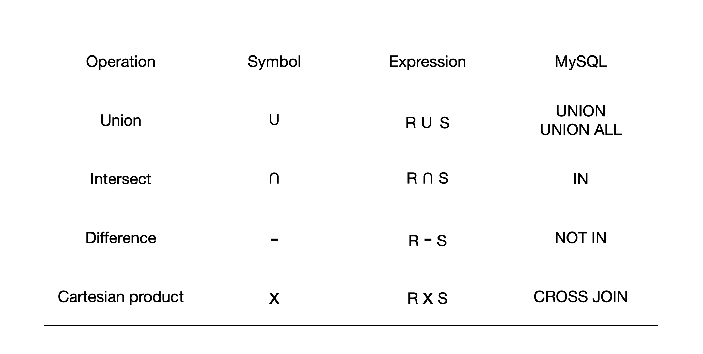

##### Relational Operation

Relational operation handles the structure and characteristics of a relation. There are five relational operations. As we said, SQL includes some features from relational algebra, but it does not include _division_.

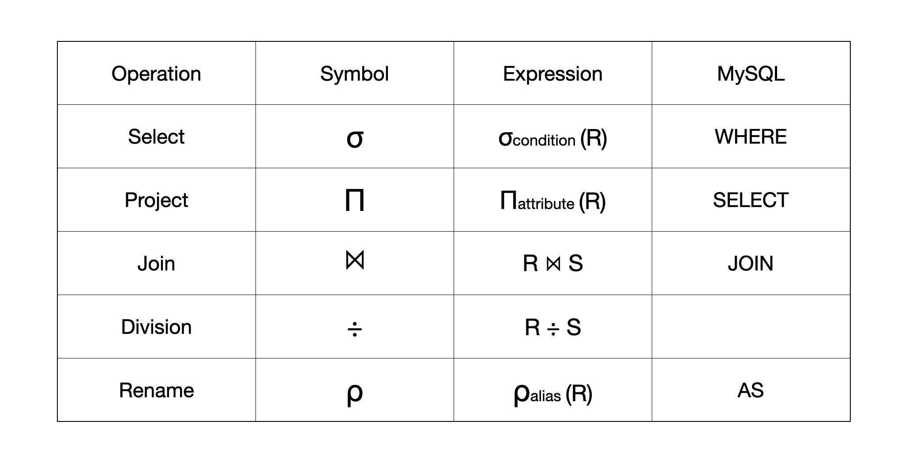

#### Primitive and Compositive Operation

Operations are also separated into two groups, **primitive** and **compositive**.

##### Primitive Operation

A primitive operation is an operation that can **not** be replaced with other operations. _Union_, _difference_, _cartesian product_, _select_, _project_, and _rename_ are the primitive operation.

##### Compositive Operation

A compositive operation is an operation that could be replaced with multiple primitive operations. _Intersect_, _join_, and _division_ are the compositive operations. For example, _intersect_ could be replaced with nested _difference_, and _division_ with _difference_ and _cartesian product_. We need to use the compositive operation for expressiveness. It would be much more readable if we expressed the operation only with a single keyword instead of using multiple ones.

### _Division_ in SQL

There is **no** straightforward way to use _division_ in SQL because of the difference between the relation and table. The relation is almost the same as the table. However, the concept of relation is from a set in mathematics, and it does not allow duplicated tuples. However, we can insert or manage duplicated rows in RDB if we do not use any keys. Hence, we get duplicated tuples if we use the _division_ in SQL, even though it needs to return unique ones.

We can replace the _division_ with other primitive operations, especially _difference_ and _cartesian product_.

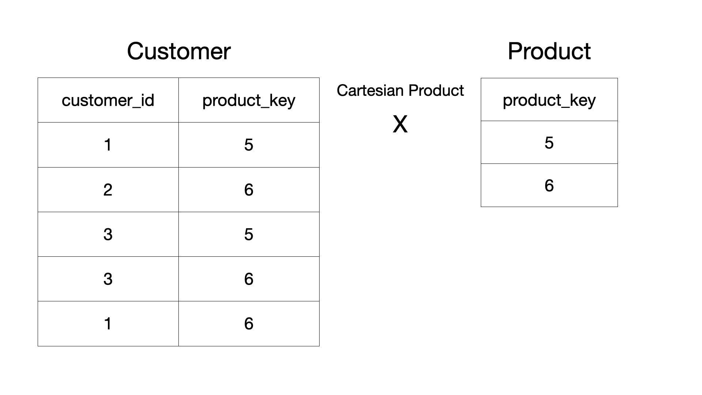

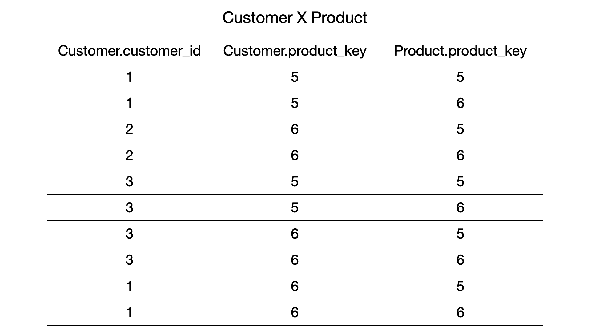

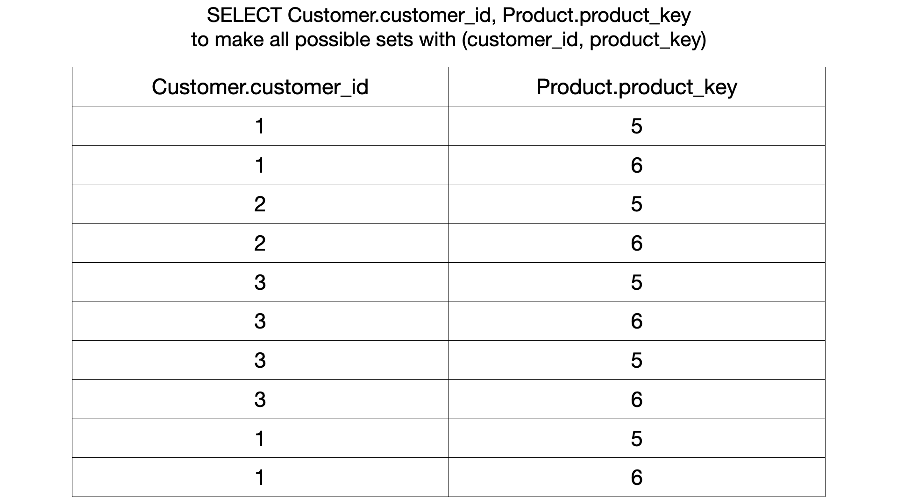

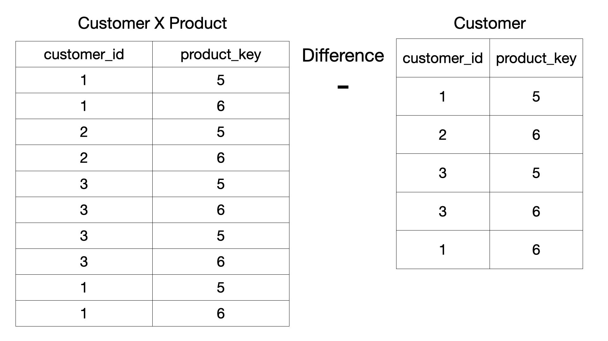

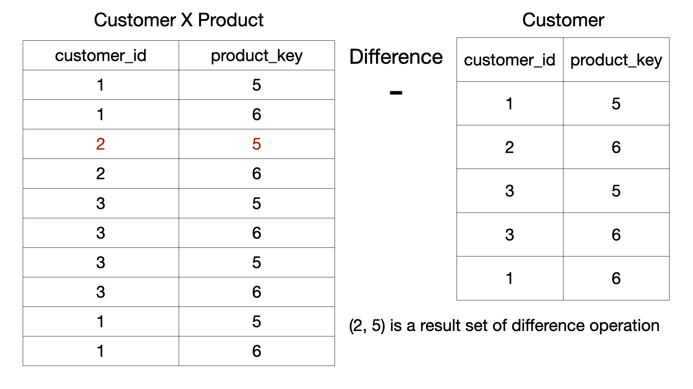

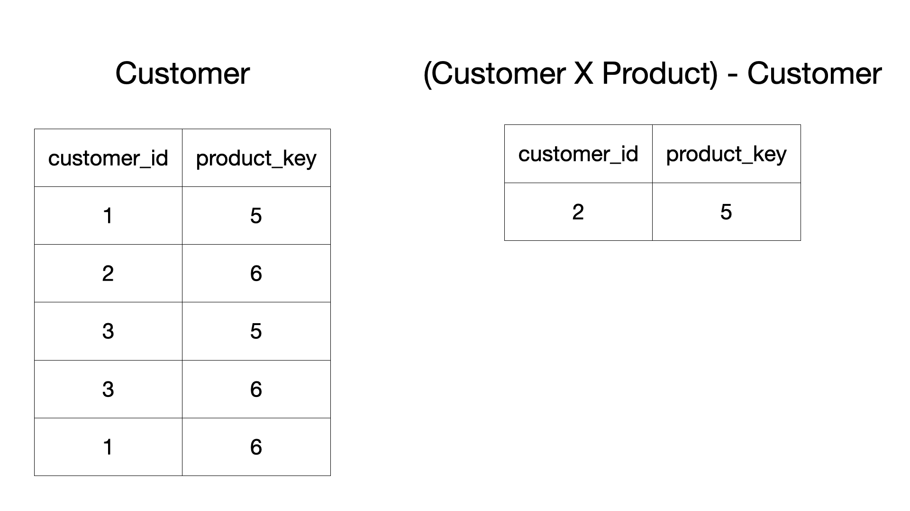

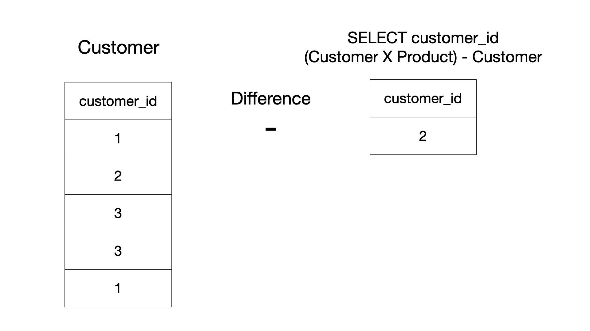

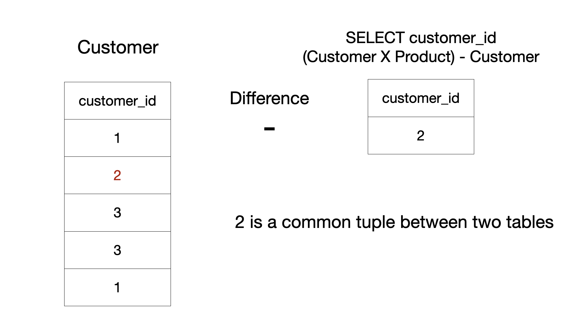

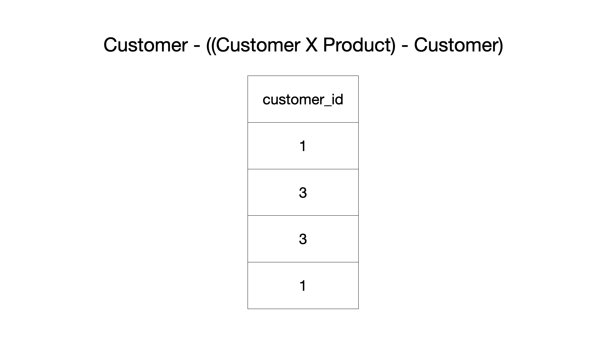

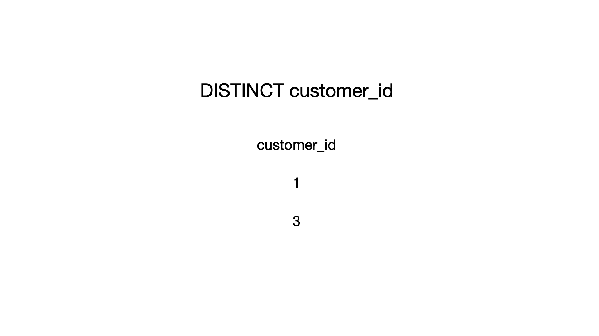

Also, we can optimize it using the `DISTINCT` keyword because comparing the result table of the cartesian product ,and the origin `Customer` table looked up too many rows. Thus, we can reduce the rows to see.

#### Algorithm

1. Use the cartesian product to make all possible sets (`customer_id,` `product_key`) with the `DISTINCT` keyword to decrease rows to compare.
2. Compare all possible sets and the `Customer` table to find the difference.
3. Find the customers who do not exist in the previous table.

#### Implementation

```mysql []
SELECT DISTINCT
  customer_id
FROM
  Customer
WHERE
  customer_id NOT IN (
    SELECT
      customer_id
    FROM
      (
        SELECT DISTINCT
          Customer.customer_id,
          Product.product_key
        FROM
          Customer,
          Product
      ) AS AllPossibleCases
    WHERE
      (customer_id, product_key) NOT IN (
        SELECT
          customer_id,
          product_key
        FROM
          Customer
      )
  );
```

---

### Conclusion

We recommend [Approach 1](#approach-1-count-how-many-products-each-customer-bought) due to its simplicity and performance. [Approach 2](#approach-2-use-nested-subquery-with-cartesian-product) uses the nested subquery that replaced _division_ and should look up too many rows to compare. For example, [Approach 1](#approach-1-count-how-many-products-each-customer-bought) needs to look up the `Customer` and `Product` tables once. However, both [Approach 2](#approach-2-use-nested-subquery-with-cartesian-product) need to look up rows for every subquery. Also, the cartesian product takes $\mathcal{O}(NM)$ time complexity if the number of rows in the `Customer` table is `N` and the number of rows in the `Product` table is `M`. The concept of relational algebra and how the _division_ operation could be replaced would be the alternative but not necessarily a better approach.