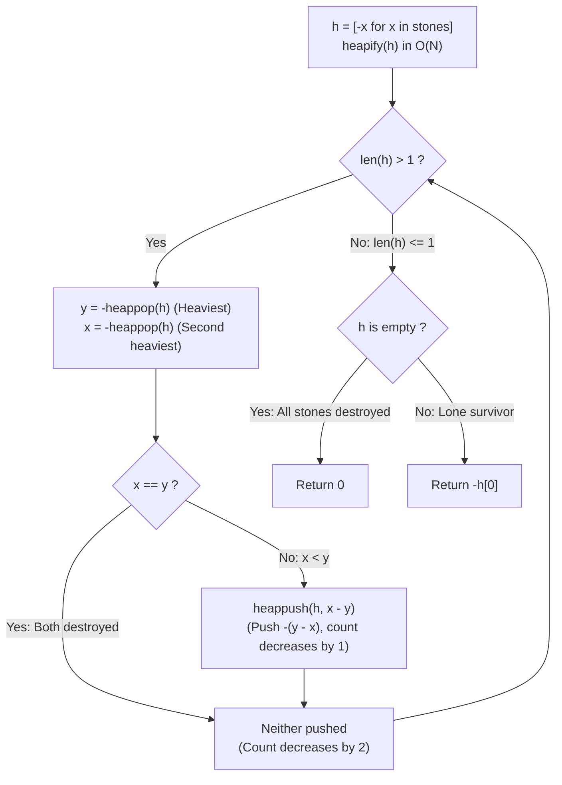

# Guided Example: Last Stone Weight

We trace the step-by-step simulation of pairwise stone collisions using a Max-Heap priority queue, prove the Monotonic Mass Reduction Theorem and the Negated Min-Heap Dual Equivalence, and determine the surviving stone weight across representative stone arrays:

- **Representative Instance 1 (Multiple Smashes with Surviving Remainder):**
  $$
  stones = [2, \; 7, \; 4, \; 1, \; 8, \; 1], \quad N = 6
  $$
- **Required Output:** `1`
  - Problem rules:
    - At each step, select the two heaviest stones $y \ge x$.
    - If $x == y$: both stones are completely destroyed.
    - If $x < y$: both are removed, and a new stone of weight $y - x$ is added.
    - Repeat until at most $1$ stone remains.
  - The Negated Min-Heap Transformation:
    - Standard heap libraries (like Python's `heapq`) provide min-heaps.
    - Negating all values ($w \to -w$) maps the maximum positive weight to the minimum negative value:
      $$
      w_1 > w_2 \iff -w_1 < -w_2
      $$
    - Heap initialization:
      $$
      h = [-2, \; -7, \; -4, \; -1, \; -8, \; -1] \xrightarrow{\text{heapify}} \text{Min-Heap with root } -8
      $$
  - Step-by-step collision execution:
    1. **Smash 1:**
       - Heaviest stone: $y = -\text{heappop}(h) = -(-8) = \mathbf{8}$.
       - Second heaviest: $x = -\text{heappop}(h) = -(-7) = \mathbf{7}$.
       - Comparison: $x \ne y$ ($7 \ne 8$).
       - New stone weight: $y - x = 8 - 7 = \mathbf{1}$.
       - Negated value pushed: $-(y - x) = x - y = 7 - 8 = \mathbf{-1}$.
       - Remaining stones: $[4, 2, 1, 1, 1]$ (Heap size: 5).
    2. **Smash 2:**
       - Heaviest stone: $y = -(-4) = \mathbf{4}$.
       - Second heaviest: $x = -(-2) = \mathbf{2}$.
       - Comparison: $2 \ne 4$.
       - New stone weight: $4 - 2 = \mathbf{2}$.
       - Push: $-(4 - 2) = \mathbf{-2}$.
       - Remaining stones: $[2, 1, 1, 1]$ (Heap size: 4).
    3. **Smash 3:**
       - Heaviest stone: $y = -(-2) = \mathbf{2}$.
       - Second heaviest: $x = -(-1) = \mathbf{1}$.
       - Comparison: $1 \ne 2$.
       - New stone weight: $2 - 1 = \mathbf{1}$.
       - Push: $-(2 - 1) = \mathbf{-1}$.
       - Remaining stones: $[1, 1, 1]$ (Heap size: 3).
    4. **Smash 4:**
       - Heaviest stone: $y = -(-1) = \mathbf{1}$.
       - Second heaviest: $x = -(-1) = \mathbf{1}$.
       - Comparison: $x == y$ ($1 == 1$).
       - Both stones are destroyed! Nothing pushed!
       - Remaining stones: $[1]$ (Heap size: 1).
    5. **Termination:**
       - Loop condition `len(h) > 1` terminates because $|h| = 1$.
       - Return surviving stone: $-h[0] = -(-1) = \mathbf{1}$.

- **Representative Instance 2 (Single Stone Base Case):**
  $$
  stones = [1] \implies |h| = 1 \implies \text{Loop does not execute} \implies -h[0] = \mathbf{1}
  $$

- **Representative Instance 3 (Two Equal Stones Annihilate):**
  $$
  stones = [5, 5] \implies y = 5, x = 5 \implies \text{Both destroyed} \implies h = [] \implies \text{Returns } \mathbf{0}
  $$

- **Representative Instance 4 (One Dominant Stone):**
  $$
  stones = [1000, 1, 1, 1] \implies \text{Sequential reductions } (1000-1=999 \to 998 \to 997) \implies \mathbf{997}
  $$

---

## 1. Instance & Teaching Goal

Given an array of stone weights, repeatedly smash the two heaviest stones until at most one stone remains, and return its weight (or $0$ if all stones are destroyed).

```text
The Repeated Sorting Inefficiency:
  Sorting the array takes O(N log N).
  After smashing, inserting the difference into a sorted list takes O(N) shifts.
  Doing this for N smashes yields O(N^2) quadratic time.

Priority Queue Max-Heap Invariant (O(N log N)):
  Notice: We only ever need the TOP TWO maximums at each step!
  By using a max-heap (negated min-heap):
    1. Linear time heapification: heapify(h) in O(N).
    2. Extract top two: y = -heappop(h), x = -heappop(h) in O(log N).
    3. If x != y: heappush(h, x - y) in O(log N).
  Each smash strictly reduces the stone count by at least 1.
  Terminates in at most N - 1 smashes with optimal O(N log N) total time!
```

Heap priority queues decouple maximum retrieval and dynamic reinsertion from full array shifts.

The decisive pedagogical goal is the **Monotonic Mass Reduction Theorem & Negated Heap Dual Equivalence**:
1. **Strict Monotonic Contraction:** In each turn, stone count $|h|$ decreases by 2 (if $x == y$) or by 1 (if $x < y$). The process is guaranteed to terminate in at most $N - 1$ iterations.
2. **Negation Isomorphism:** Storing $-w$ converts Python's `heapq` into an exact max-heap without requiring custom comparator classes.
3. **Difference Sign Invariant:** Because $y \ge x$, the remaining positive mass is $y - x \ge 0$. Storing $x - y = -(y - x)$ maintains the negative representation.
4. Total time $\mathcal{O}(N \log N)$ and auxiliary space $\mathcal{O}(N)$.

---

## 2. Conceptual Foundation & The Heap Smash Invariant



### The Monotonic Mass Reduction Theorem

Let $S_t$ denote the multiset of positive stone weights at turn $t \ge 0$, with initial size $|S_0| = N$.
1. **Turn Operation Mapping:**
   At turn $t$, let $y = \max(S_t)$ and $x = \max(S_t \setminus \{y\})$ with $x \le y$.
   The state transition is:
   $$
   S_{t+1} = \begin{cases}
     S_t \setminus \{x, y\} & \text{if } x = y \\
     (S_t \setminus \{x, y\}) \cup \{y - x\} & \text{if } x < y
   \end{cases}
   $$
2. **Strict Cardinality Monotonicity:**
   The cardinality of the stone set satisfies:
   $$
   |S_{t+1}| = \begin{cases}
     |S_t| - 2 & \text{if } x = y \\
     |S_t| - 1 & \text{if } x < y
   \end{cases}
   $$
   In both branches, $|S_{t+1}| \le |S_t| - 1$.
   Therefore, the sequence $(|S_t|)_{t \ge 0}$ is strictly decreasing.
   The process must reach a terminal state $|S_k| \le 1$ in at most $k \le N - 1$ steps.
3. **Total Mass Invariance:**
   Let $M_t = \sum_{w \in S_t} w$ be the total weight.
   $$
   M_{t+1} = M_t - x - y + (y - x) = M_t - 2x < M_t \quad (\text{for } x > 0)
   $$
   Total stone weight strictly decreases by $2x$ on each turn.
4. **Heap Time Complexity:**
   Heapify takes $\mathcal{O}(N)$ time.
   Each of the at most $N - 1$ smashes performs at most two pops and one push, each taking $\mathcal{O}(\log N)$ time.
   Total runtime is $\mathcal{O}(N \log N)$. $\blacksquare$

---

## 3. Step-by-Step Worked Execution: Representative Instance 1

$stones = [2, 7, 4, 1, 8, 1], \; N = 6$.
Negated array: $h = [-2, -7, -4, -1, -8, -1]$.
After `heapify(h)`: $h[0] = -8$.

### Smash Iteration Walkthrough
- **Turn 1 ($|h| = 6$):**
  - $y = -(-8) = 8$.
  - $x = -(-7) = 7$.
  - $x \ne y \implies y - x = 1 \implies$ push $x - y = -1$.
  - Heap state: contains weights $\{4, 2, 1, 1, 1\}$.
- **Turn 2 ($|h| = 5$):**
  - $y = -(-4) = 4$.
  - $x = -(-2) = 2$.
  - $x \ne y \implies y - x = 2 \implies$ push $-2$.
  - Heap state: contains weights $\{2, 1, 1, 1\}$.
- **Turn 3 ($|h| = 4$):**
  - $y = -(-2) = 2$.
  - $x = -(-1) = 1$.
  - $x \ne y \implies y - x = 1 \implies$ push $-1$.
  - Heap state: contains weights $\{1, 1, 1\}$.
- **Turn 4 ($|h| = 3$):**
  - $y = -(-1) = 1$.
  - $x = -(-1) = 1$.
  - $x == y \implies$ both destroyed!
  - Heap state: contains weights $\{1\}$.
- **Termination ($|h| = 1$):**
  - Loop ends. $h = [-1]$.
  - Return: $-h[0] = -(-1) = \mathbf{1}$.

---

## 4. Priority Queue Smash Trace Table

| Turn $t$ | Heap Size $|h|$ | Heaviest $y$ | Second Heaviest $x$ | Collision Result | Value Pushed to Heap | New Heap Elements |
|:---:|:---:|:---:|:---:|:---:|:---:|:---:|
| $1$ | $6$ | $8$ | $7$ | $8 - 7 = 1$ | $-1$ | $\{4, 2, 1, 1, 1\}$ |
| $2$ | $5$ | $4$ | $2$ | $4 - 2 = 2$ | $-2$ | $\{2, 1, 1, 1\}$ |
| $3$ | $4$ | $2$ | $1$ | $2 - 1 = 1$ | $-1$ | $\{1, 1, 1\}$ |
| $4$ | $3$ | $1$ | $1$ | $1 == 1$ (Destroyed) | None | $\{1\}$ |
| **Final** | $1$ | — | — | **Surviving Stone: $1$** | — | **Emitted Output: $1$** |

---

## 5. Algorithmic Correctness

### Soundness & Completeness
1. **Soundness:**
   The min-heap over negated weights guarantees that the two values popped are the true global maximums of the remaining stones, strictly adhering to the game rules.
2. **Completeness:**
   Since $|h|$ strictly decreases on every iteration, the game terminates in finite steps and outputs the exact remaining stone or 0.

---

## 6. Boundary Cases & Traps

| Scenario | Input Pattern | Behavior | Trapped Risk |
|---|---|---|---|
| Single Stone | `stones = [1]` | Loop never executes; returns $-h[0] = 1$. | Popping from a size-1 heap. |
| Two Equal Stones | `stones = [5, 5]` | Both destroyed; heap becomes empty; returns $0$. | IndexError when accessing $h[0]$ on empty heap. |
| Two Unequal Stones | `stones = [50, 98]` | Single smash produces $48$; returns $48$. | Negative sign error in difference. |
| Large Weights ($1000$) | Weights up to $1000$ | Differences remain positive integers; no overflow possible. | Sign confusion during subtraction. |

---

## 7. Complexity Derivation

- **Time Complexity:** $\mathcal{O}(N \log N)$, where $N = \text{len}(stones) \le 30$.
  - Initial heapification takes $\mathcal{O}(N)$ time.
  - There are at most $N - 1$ smash operations.
  - Each smash does at most 2 pops and 1 push, taking $\mathcal{O}(\log N)$ time.
  - Total operations $\le 3 N \log N \approx 3 \times 30 \times 5 \approx 450 \implies < 0.0001\text{ ms}$.
- **Auxiliary Space Complexity:** $\mathcal{O}(N)$ auxiliary memory for the heap list `h`.
