## Solution

---

### Approach 1: Array-Based Simulation

#### Intuition

Conceptually, the simplest way we could solve this problem is to repeatedly search for the 2 largest stones in the array, delete them, and then if they are not the same size, add the new stone size back in. We can repeat this process until there is only one stone left.

#### Algorithm

Because the array is not sorted, there is no need to preserve the original order. Removals should be done by swapping with the last value, not by shuffling all values along.

#### Implementation

```python
class Solution:
    def lastStoneWeight(self, stones: List[int]) -> int:

        def remove_largest():
            index_of_largest = stones.index(max(stones))
            # Remove largest stone
            return stones.pop(index_of_largest)

        while len(stones) > 1:
            stone_1 = remove_largest()
            stone_2 = remove_largest()
            if stone_1 != stone_2:
                stones.append(stone_1 - stone_2)

        return stones[0] if stones else 0
```

#### Complexity Analysis

Let $N$ be the **length of stones**. Here on LeetCode, we're only testing your code with cases where $N ≤ 30$. In an interview though, be very careful about such assumptions. It is very likely your interviewer expects you to come up with the best possible algorithm you could (thus handling the highest possible value of $N$ you can).

- Time complexity : $O(N^2)$.

    The only non-$O(1)$ method of `StoneArray` is `findAndRemoveMax()`. This method does a single pass over the array, to find the index of the maximum value. This pass has a cost of $O(N)$. Once we find the maximum value, we delete it, although this only has a cost of $O(1)$ because instead of shuffling along, we're simply swapping with the end.

    Each time around the main loop, there is a net loss of either 1 or 2 stones. Starting with $N$ stones and needing to get to $1$ stone, this is up to $N - 1$ iterations. On each of these iterations, it finds the maximum twice. In total, we get $O(N^2)$.

    Note that even if we'd shuffled instead of swapped with the end, the `findAndRemoveMax()` method still would have been $O(N)$, as the pass and then deletion are done one-after-the-other. However, it's often best to avoid needlessly large constants.

- Space complexity : $O(N)$ or $O(1)$.

    For the Python: We are not allocating any new space for data structures, and instead are modifying the input list. Note that this *modifies the input*. This has its pros and cons; it saves space, but it means that other functions can't use the same array.

    For the Java: We need to convert the input to an ArrayList, and therefore the `int`s to `Integer`s. It is possible to write a $O(1)$ space solution for Java, however it is long-winded and a lot of work for what is a poor overall approach anyway.

<br/>

---

### Approach 2: Sorted Array-Based Simulation

#### Intuition

*Note: This approach is no better than Approach 1. We're only including so that we can look at *why* it doesn't work as well as one might initially assume. See Approach 3 for the optimal approach.*

To simplify the search-for-maximum process, we could instead maintain a sorted array. We'd need to sort the array at the start, and then ensure that each time we need to add a stone back, that we're maintaining the sorted order.

Unfortunately, inserting a stone into a *sorted* array is an $O(N)$ operation. While we can use binary search to determine where we should put it, inserting it still ultimately requires shifting all of the stones after it down by one place. This makes the approach no better than the previous one from a complexity point-of-view (in fact, it's actually worse because the space complexity is now unlikely to be $O(1)$).

#### Implementation

```python
class Solution:
    def lastStoneWeight(self, stones: List[int]) -> int:
        stones.sort()
        while len(stones) > 1:
            stone_1 = stones.pop()
            stone_2 = stones.pop()
            if stone_1 != stone_2:
                bisect.insort(stones, stone_1 - stone_2)
        return stones[0] if stones else 0
```

#### Complexity Analysis

Let $N$ be the **length of stones**.

- Time complexity : $O(N^2)$.

    The first part of the algorithm is sorting the list. This has a cost of $O(N \, \log \, N)$.

    Like before, we're repeating the main loop up to $N - 1$ times. And again, we're doing an $O(N)$ operation each time; adding the new stone back into the array, maintaining sorted order by shuffling existing stones along to make space for it. Identifying the two largest stones was $O(1)$ in this approach, but unfortunately this was subsumed by the inefficient adds. This gives us a total of $O(N^2)$.

    Because $O(N^2)$ is strictly larger than $O(N \, \log \, N)$, we're left with a final time complexity of $O(N^2)$.

- Space complexity : Varies from $O(N)$ to $O(1)$.

    Like in Approach 1, we can choose whether or not to modify the input list. If we do modify the input list, this will cost anywhere from $O(N)$ to $O(1)$ space, depending on the sorting algorithm used. However, if we don't, it will always cost at least $O(N)$ to make a copy. Modifying the input has its pros and cons; it saves space, but it means that other functions can't use the same array.

An alternative to this approach is to simply sort inside the loop every time. This will be even worse, with a time complexity of $O(N^2 \, \log \, N)$.

<br/>

---

### Approach 3: Heap-Based Simulation

#### Intuition

Approach 1 found and removed the maximum stones in $O(N)$ time, and added the new stone in $O(1)$ time. Approach 2 inverted this, as finding and removing the maximum stones took $O(1)$ time, but adding the new stone took $O(N)$ time. In both cases, we're left with an overall time complexity of $O(N)$ per stone-smash turn.

We want to find a solution that makes both removing the maximums, and adding a new stone, *less than* $O(N)$.

For this kind of maximum-maintenance, we use a **Max-Heap**, also known as a **Max-Priority Queue**. A Max-Heap is a data structure that can take items, and can remove and return the maximum, with both operations taking $O(\log \, N)$ time. It does this by maintaining the items in a special order (within the array), or as a balanced binary tree. We don't need to know these details though, almost all programming languages have a Heap data structure!

Here is the pseudocode using a Heap.

```text
define function last_stone_weight(stones):
    heap = a new Max-Heap
    add all stones to heap
    while heap contains more than 1 stone:
        heavy_stone_1 = remove max from heap
        heavy_stone_2 = remove max from heap
        if heavy_stone_1 is heavier than heavy_stone_2:
            new_stone = heavy_stone_1 - heavy_stone_2
            add new_stone to heap
    if heap is empty:
        return 0
    return last stone on heap
```

#### Algorithm

While most programming languages have a **Heap/ Priority Queue** data structure, some, such as Python and Java, only have **Min-Heap**. Just as the name suggests, this is a Heap that instead of always returning the maximum item, it returns the minimum. There are two solutions to this problem:

1. Multiply all numbers going into the heap by `-1`, and then multiply them by `-1` to restore them when they come out.
2. Pass a comparator in (language-dependent).

#### Implementation

In Python, we'll use the first solution, and in Java, we'll use the second.

```python
class Solution:
    def lastStoneWeight(self, stones: List[int]) -> int:

        # Make all the stones negative. We want to do this *in place*, to keep the
        # space complexity of this algorithm at O(1). :-)
        for i in range(len(stones)):
            stones[i] *= -1

        # Heapify all the stones.
        heapq.heapify(stones)

        # While there is more than one stone left, remove the two
        # largest, smash them together, and insert the result
        # back into the heap if it is non-zero.
        while len(stones) > 1:
            stone_1 = heapq.heappop(stones)
            stone_2 = heapq.heappop(stones)
            if stone_1 != stone_2:
                heapq.heappush(stones, stone_1 - stone_2)

        # Check if there is a stone left to return. Convert it back
        # to positive.
        return -heapq.heappop(stones) if stones else 0
```

#### Complexity Analysis

Let $N$ be the **length of stones**.

- Time complexity : $O(N \, \log \, N)$.

    Converting an array into a Heap takes $O(N)$ time (it isn't actually sorting; it's putting them into an order that allows us to get the maximums, each in $O(\log \, N)$ time).

    Like before, the main loop iterates up to $N - 1$ times. This time however, it's doing up to three $O(\log \, N)$ operations each time; two removes, and an optional add. Like always, the three is an ignored constant. This means that we're doing $N \cdot$\mathcal{O}(\\log \, N)$= O(N \, \log \, N)$ operations.

- Space complexity : $O(N)$ or $O(\log \, N)$.

    In Python, `heapq.heapify()` is an in-place operation, so it uses $O(1)$ auxiliary space. However, the heap still stores `n` elements within the input list, which contributes $O(n)$ to total space complexity. So, the total space complexity is $O(n)$.

    In Java though, it's $O(N)$ to create the `PriorityQueue`.

    We could reduce the space complexity to $O(1)$ by implementing our own iterative heapfiy, if needed.

<br/>

---

### Approach 4: Bucket Sort

#### Intuition

*This approach is only viable when the maximum stone weight is small, or is at least smaller than the number of stones.*

Let $W$ be the maximum stone weight in the input array. We can create a bucket array of size $W + 1$, where each index of the bucket array represents a stone weight. Then, we can bucket "sort" the stones in $O(N)$ time by iterating over them and incrementing the relevant bucket array index by 1.

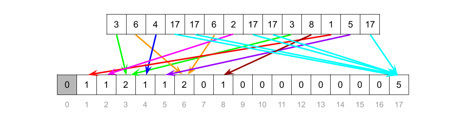

We can then process the buckets as shown in the following animation.

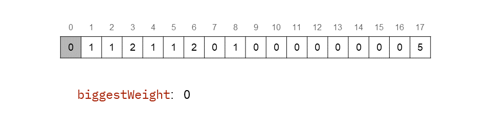

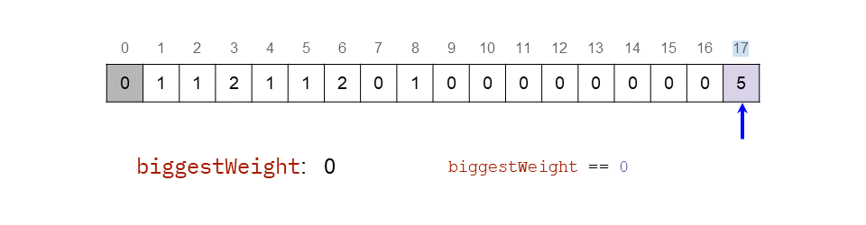

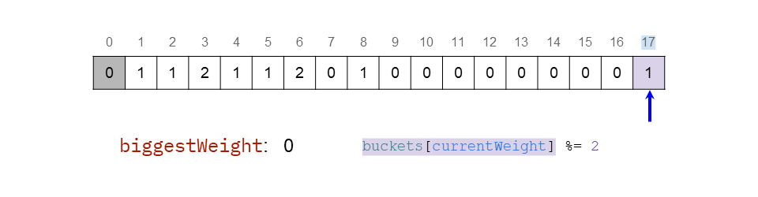

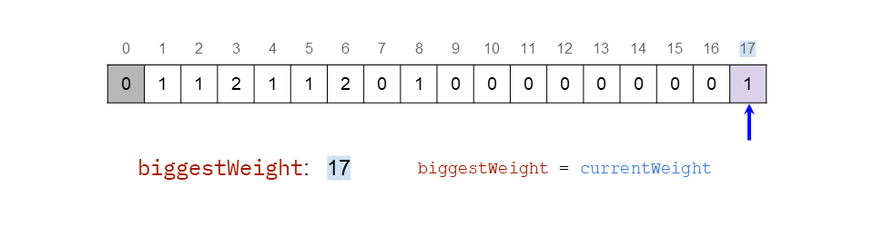

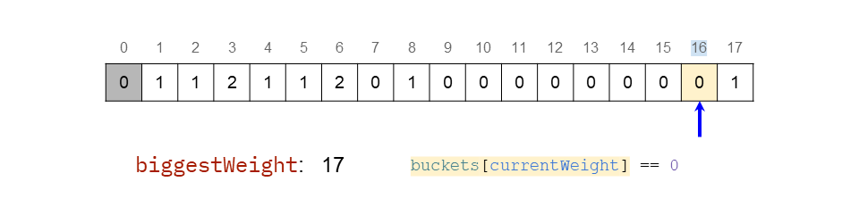

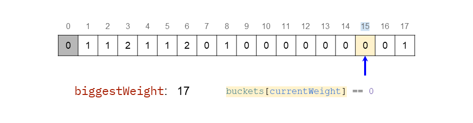

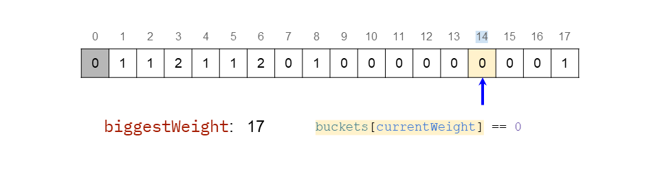

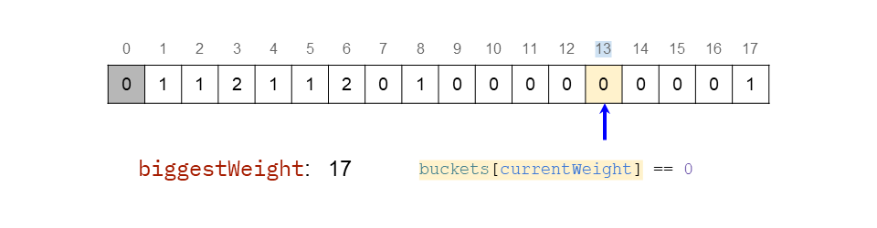

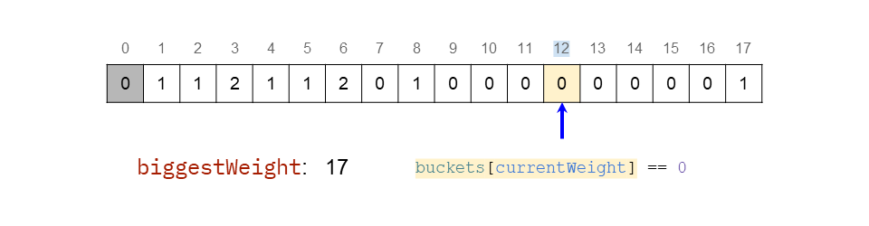

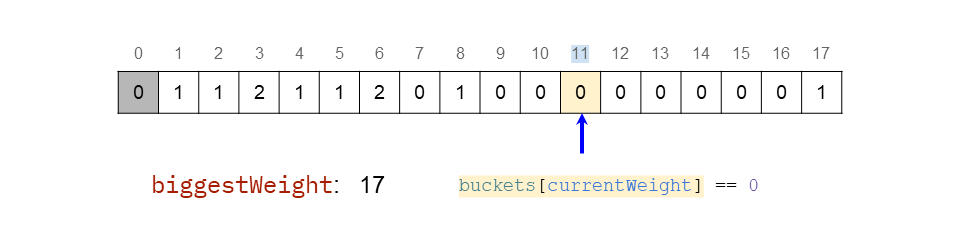

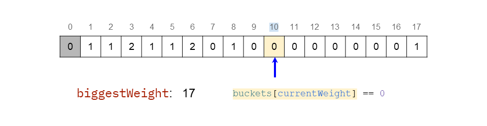

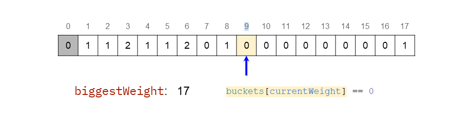

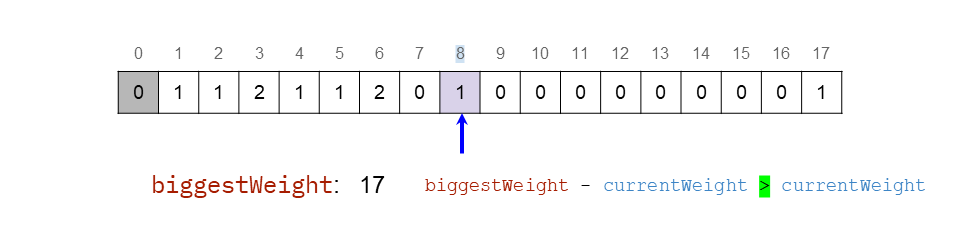

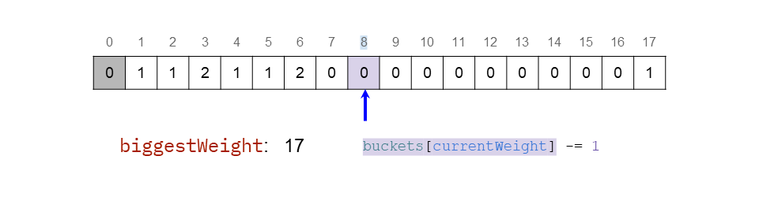

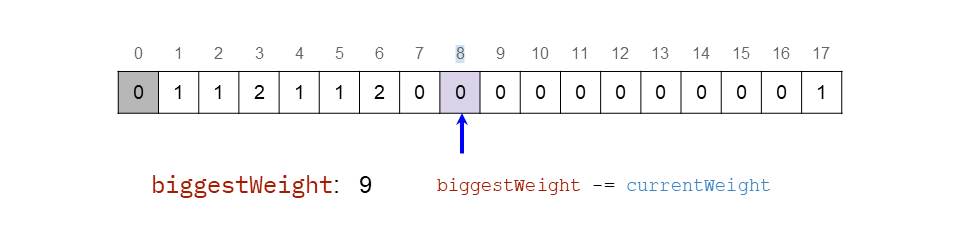

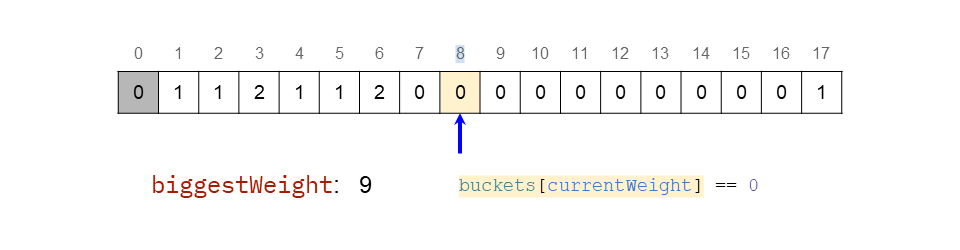

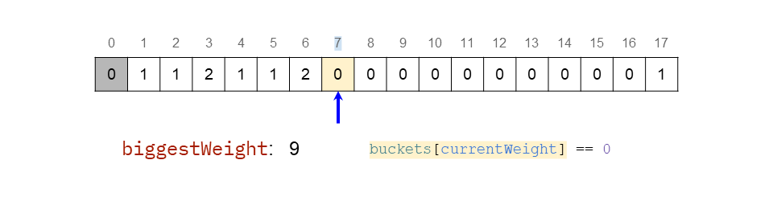

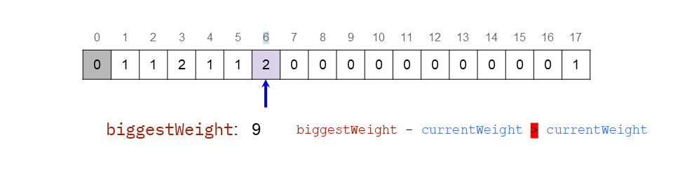

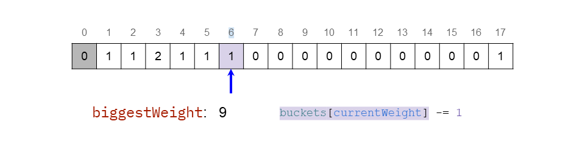

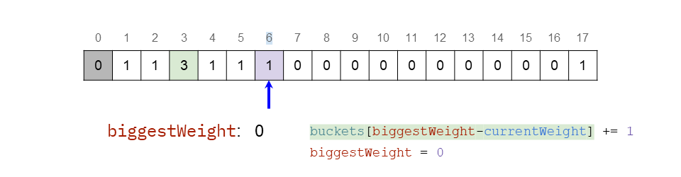

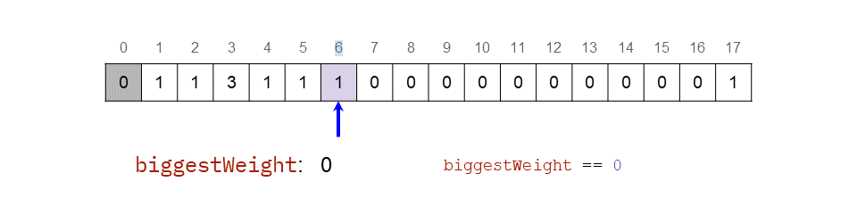

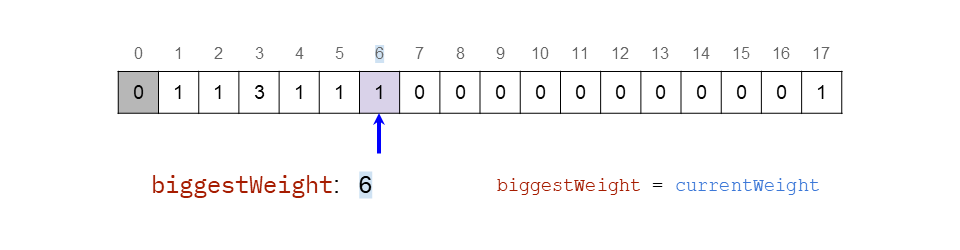

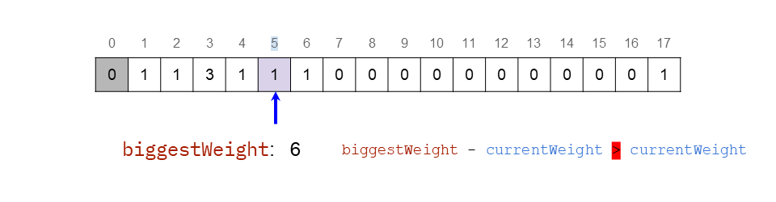

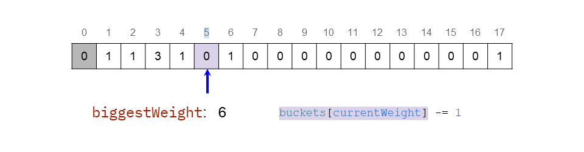

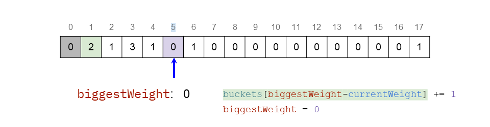

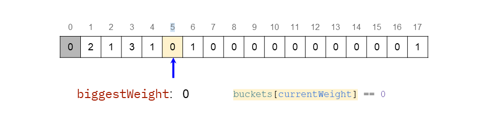

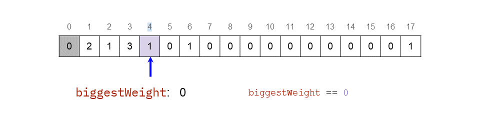

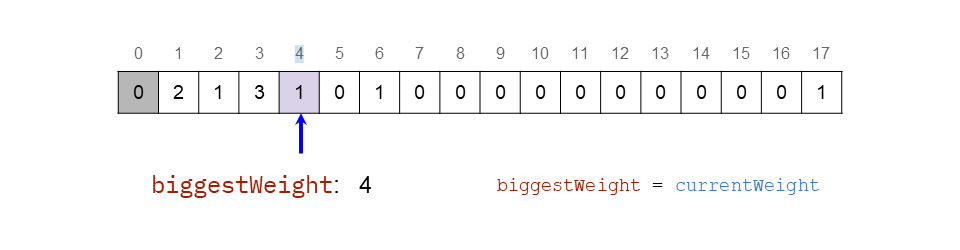

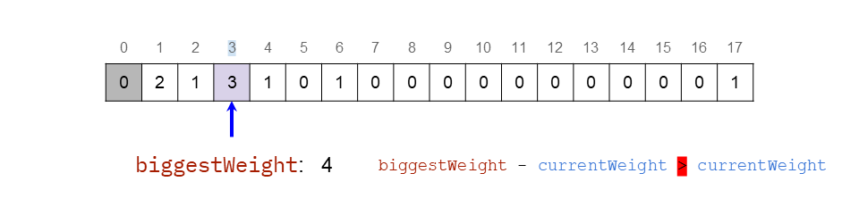

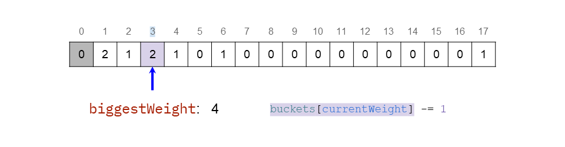

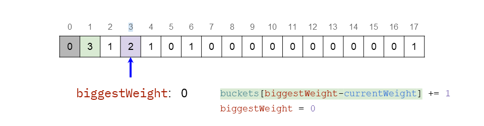

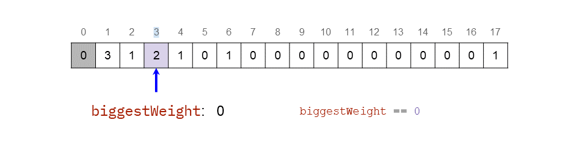

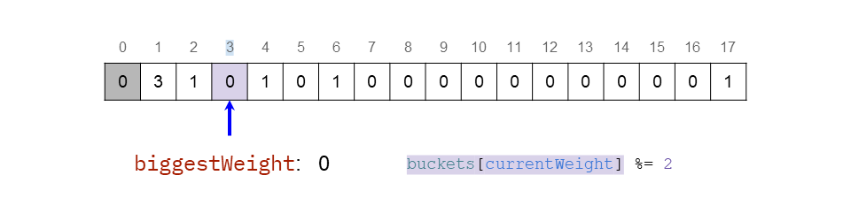

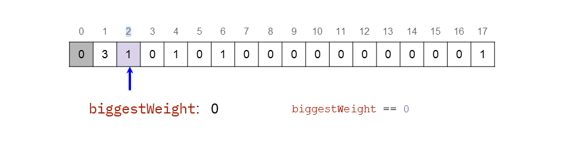

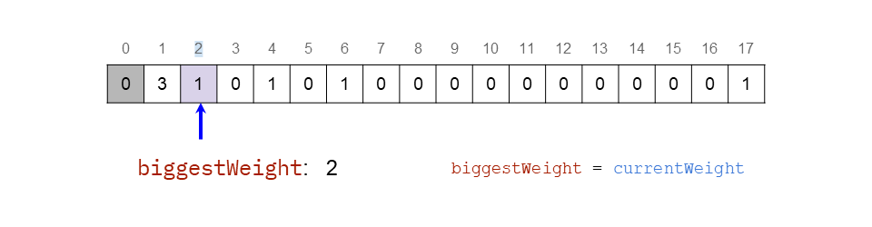

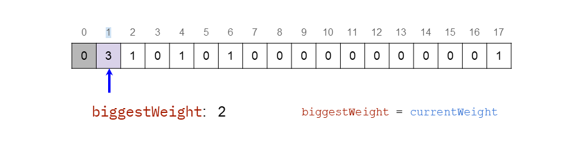

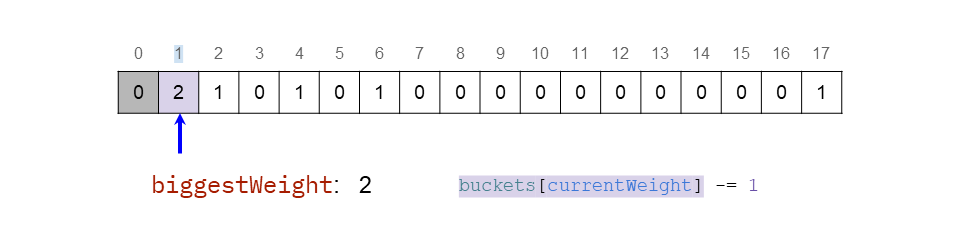

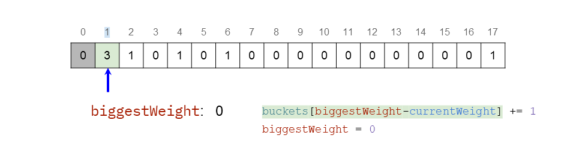

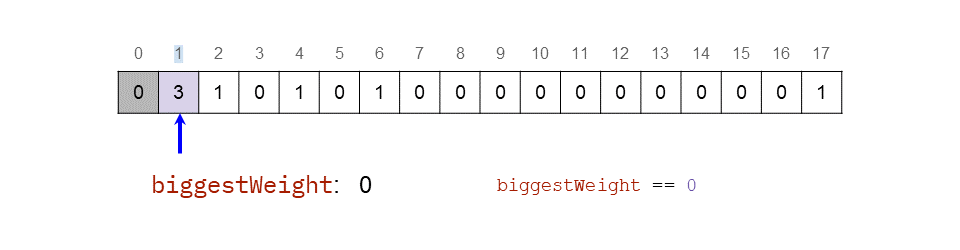


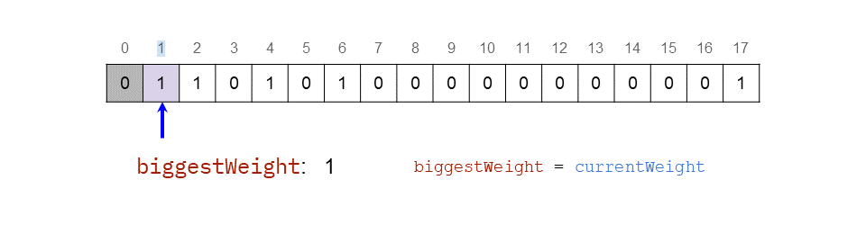

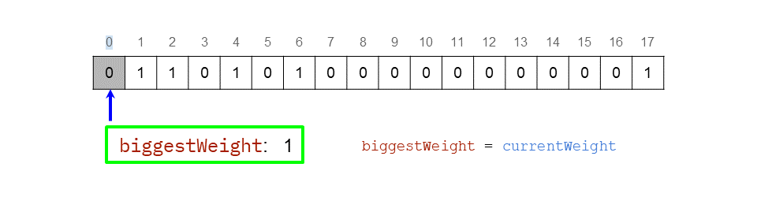

#### Implementation

```python
class Solution:
    def lastStoneWeight(self, stones: List[int]) -> int:

        # Set up the bucket array.
        max_weight = max(stones)
        buckets = [0] * (max_weight + 1)

        # Bucket sort.
        for weight in stones:
            buckets[weight] += 1

        # Scan through the weights.
        biggest_weight = 0
        current_weight = max_weight
        while current_weight > 0:
            if buckets[current_weight] == 0:
                current_weight -= 1
            elif biggest_weight == 0:
                buckets[current_weight] %= 2
                if buckets[current_weight] == 1:
                    biggest_weight = current_weight
                current_weight -= 1
            else:
                buckets[current_weight] -= 1
                if biggest_weight - current_weight <= current_weight:
                    buckets[biggest_weight - current_weight] += 1
                    biggest_weight = 0
                else:
                    biggest_weight -= current_weight
        return biggest_weight
```

#### Complexity Analysis

- Time complexity : $O(N + W)$.

    Putting the $N$ stones of the input array into the bucket array is $O(N)$, because inserting each stone is an $O(1)$ operation.

    In the worst case, the main loop iterates through all of the $W$ indexes of the bucket array. Processing each bucket is an $O(1)$ operation. This, therefore, is $O(W)$.

    Seeing as we don't know which is larger out of $N$ and $W$, we get a total of $O(N + W)$.

    Technically, this algorithm is *pseudo-polynomial*, as its time complexity is dependent on the *numeric value of the input*. Pseudo-polynomial algorithms are useful when there is no "true" polynomial alternative, but in situations such as this one where we have an $O(N \, \log \, N)$ alternative (Approach 3), they are only useful for very specific inputs.

    With the small values of $W$ that your code is tested against for this question here on LeetCode, this approach turns out to be faster than Approach 3. But that does *not* make it the better approach.

- Space complexity : $O(W)$.

    We allocated a new array of size $W$.

When I looked through the discussion forum for this question, I was surprised to see a number of people arguing that this approach is $O(N)$, on the basis that we could say $W$ is a constant, due to the problem description stating it has a maximum value of $1000$. The trouble with this argument is that $N$ also has a maximum specified (of $30$, in fact), and so it is arbitrary to argue that $W$ is a constant, yet $N$ is not. These constraints on LeetCode problems are intended to help you determine whether or not your algorithm will be fast enough. They are not supposed to imply some variables can be treated as "constants". A correct time/ space complexity should treat them as *unbounded*.

<br/>