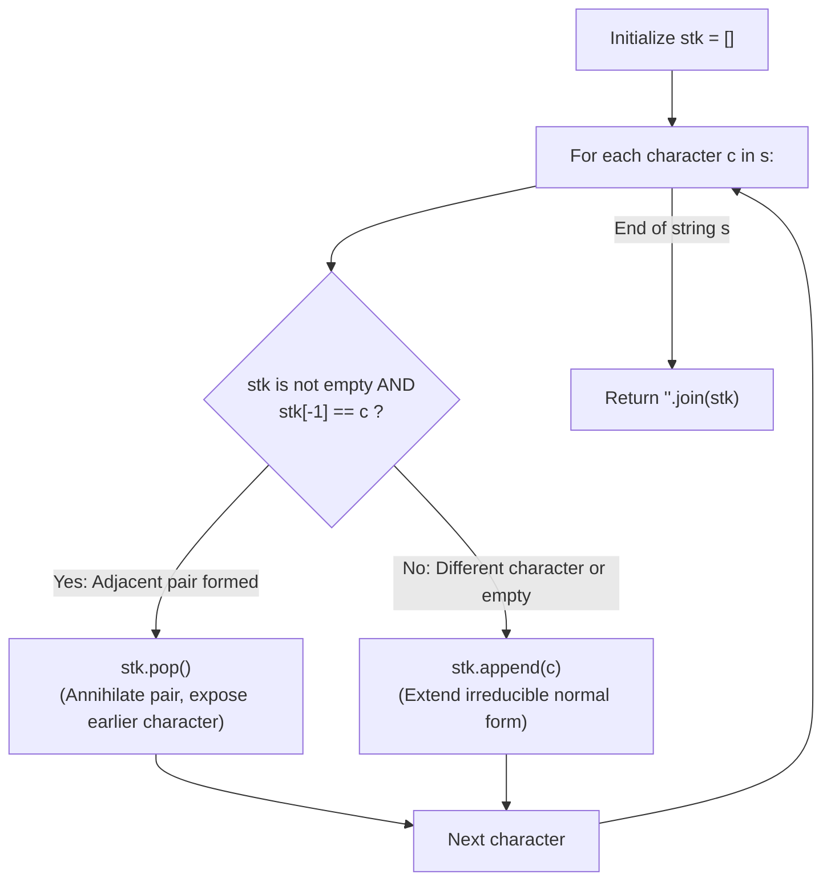

# Guided Example: Remove All Adjacent Duplicates In String

We trace the step-by-step reduction of adjacent duplicate characters using an online stack, prove the Free Group Confluence Theorem (Church-Rosser Property) and the Monotonic Prefix Normal-Form Invariant, and determine the canonical irreducible string across representative input instances:

- **Representative Instance 1 (Cascading Elimination Exposing Earlier Matches):**
  $$
  s = \text{"abbaca"}, \quad |s| = 6
  $$
- **Required Output:** `"ca"`
  - Problem rules:
    - Choose two adjacent and equal characters and delete both.
    - Repeat until no adjacent identical pair exists.
  - The Free Group Confluence Principle:
    - Define an equivalence relation on strings generated by the rewriting rule $c c \to \epsilon$ for all $c \in \{a, \dots, z\}$.
    - This is isomorphic to word reduction in the free group $\mathbb{Z}_2^{*26}$ where each generator satisfies $c^2 = 1$.
    - By the **Church-Rosser Theorem** (Newman's Lemma for terminating rewrite systems):
      $$
      \text{Every string } s \text{ reduces to a UNIQUE irreducible normal form, independent of the order of reductions!}
      $$
    - We do not need to rescan the string repeatedly or backtrack across alternative pairs.
  - The Online Stack Normal-Form Invariant:
    - Maintain a stack `stk`.
    - **Invariant:** After processing prefix $s[0 \dots i-1]$, `stk` holds the exact, unique normal form of that prefix.
    - Appending $c = s[i]$:
      - The only possible newly created adjacent pair is between the stack top `stk[-1]` and $c$.
      - If `stk` is non-empty and `stk[-1] == c`:
        The pair annihilates! Pop `stk[-1]`. The stack is restored to the already-verified normal form of the earlier prefix.
      - Otherwise:
        No cancellation occurs. Push $c$.
  - Step-by-step stack execution:
    1. Read $s[0] = \text{'a'}$: Stack empty $\implies$ push `'a'`. State: `['a']`.
    2. Read $s[1] = \text{'b'}$: Top is `'a'` ($\ne \text{'b'}$) $\implies$ push `'b'`. State: `['a', 'b']`.
    3. Read $s[2] = \text{'b'}$: Top is `'b'` ($== \text{'b'}$) $\implies$ **Annihilation!** Pop `'b'`. State: `['a']`.
    4. Read $s[3] = \text{'a'}$: Top is `'a'` ($== \text{'a'}$) $\implies$ **Cascade Annihilation!** Pop `'a'`. State: `[]`.
    5. Read $s[4] = \text{'c'}$: Stack empty $\implies$ push `'c'`. State: `['c']`.
    6. Read $s[5] = \text{'a'}$: Top is `'c'` ($\ne \text{'a'}$) $\implies$ push `'a'`. State: `['c', 'a']`.
  - Termination:
    - String consumed.
    - Join stack contents: `''.join(['c', 'a'])` = $\mathbf{\text{"ca"}}$.

- **Representative Instance 2 (Nested Symmetrical Cascade):**
  $$
  s = \text{"azxxzy"} \implies \text{'x'} \text{ cancels } \text{'x'} \to \text{'z'} \text{ cancels } \text{'z'} \to \text{"ay"}
  $$

- **Representative Instance 3 (Complete Cancellation):**
  $$
  s = \text{"abcddcba"} \implies \text{All characters cancel in reverse inward order} \implies \text{""}
  $$

---

## 1. Instance & Teaching Goal

Given a string `s`, repeatedly delete adjacent identical pairs until no such pairs remain, and return the final string.

```text
The Quadratic Rescanning Flaw:
  Searching for an adjacent duplicate pair takes O(N).
  Deleting it and reconstructing the string takes O(N).
  Doing this up to N/2 times results in O(N^2) quadratic runtime.

The Online Stack Invariant (Strictly Linear O(N)):
  Notice: Any deletion of 'cc' can only bring together the character immediately
  before the first 'c' and the character immediately after the second 'c'.
  A stack captures this local adjacency perfectly!
    For each character c in s:
      if stk and stk[-1] == c:
        stk.pop()       # Annihilate adjacent identical pair
      else:
        stk.append(c)   # No conflict, advance normal form
  Every character is pushed at most once and popped at most once.
  Guarantees O(N) linear time and O(N) space!
```

Modeling local cancellation via a stack captures arbitrary-depth cascading annihilations without multi-pass rescans.

The decisive pedagogical goal is the **Free Group Confluence Theorem & Online Stack Invariant**:
1. **Confluence (Church-Rosser):** The order in which duplicate pairs are deleted does not alter the terminal string. The final reduced string is unique.
2. **Inductive Prefix Invariance:** The stack always contains an irreducible string (containing no adjacent duplicates). Appending a character can only create a conflict at the top of the stack.
3. **Amortized Constant-Time Step:** Each input character triggers either a single $\mathcal{O}(1)$ push or a single $\mathcal{O}(1)$ pop, bounding total operations by $2|s|$.
4. Total time $\mathcal{O}(|s|)$ and auxiliary space $\mathcal{O}(|s|)$.

---

## 2. Conceptual Foundation & The Stack Reduction Invariant



### The Free Group Confluence & Reduction Theorem

Let $\Sigma$ be a finite alphabet, and let $\Sigma^*$ be the free monoid of words over $\Sigma$.
1. **Reduction Relation:**
   Define the binary relation $\to$ on $\Sigma^*$ by:
   $$
   u \, c \, c \, v \to u \, v \quad \text{for any } u, v \in \Sigma^*, \; c \in \Sigma
   $$
   A word $w \in \Sigma^*$ is *irreducible* (in normal form) if there do not exist $u, v, c$ such that $w = u \, c \, c \, v$.
2. **Local Confluence (Newman's Lemma):**
   Consider two overlapping reductions from a string:
   - If the reductions are disjoint ($u \, c_1 c_1 \, v \, c_2 c_2 \, w$), they commute trivially.
   - If the reductions overlap, the pattern must be $c c c$.
     Reducing the first pair yields $c$. Reducing the second pair also yields $c$.
   Therefore, the rewriting system is strongly locally confluent.
   Since every reduction step strictly decreases word length ($|uv| = |uccv| - 2$), the system is terminating.
   By Newman's Lemma, the reduction relation is **globally confluent**, and every word $w$ possesses a **unique normal form** $\text{NF}(w)$.
3. **Inductive Stack Invariant:**
   Let $S_i$ denote the stack contents after reading prefix $w_i = s[0 \dots i-1]$.
   - Base Case: $S_0 = \epsilon = \text{NF}(\epsilon)$ holds.
   - Inductive Step: Assume $S_i = \text{NF}(w_i)$.
     When $c = s[i]$ is read, the concatenated string is $w_{i+1} = w_i \, c$.
     By confluence, $\text{NF}(w_{i+1}) = \text{NF}(S_i \, c)$.
     Since $S_i$ is already irreducible:
     - If $S_i = u \, c$, then $S_i \, c = u \, c \, c \to u$. Since $u$ is a prefix of an irreducible word, $u$ is irreducible, so $\text{NF}(S_i \, c) = u = S_i \setminus \{c\}$.
       Popping the top precisely produces $u$.
     - If $S_i = \epsilon$ or $S_i$ ends in $c' \ne c$, no reduction rule can apply to $S_i \, c$. Thus $S_i \, c$ is already irreducible, so $\text{NF}(S_i \, c) = S_i \, c$.
       Pushing $c$ precisely produces $S_i \, c$.
   By mathematical induction, $S_n = \text{NF}(s)$ is the exact unique answer. $\blacksquare$

---

## 3. Step-by-Step Worked Execution: Representative Instance 1

$s = \text{"abbaca"}$.
Initialize `stk = []`.

### Character-by-Character Walkthrough
- **Index $0$ ($c = \text{'a'}$):**
  - `stk` is empty $\implies$ push `'a'`.
  - `stk = ['a']`.
- **Index $1$ ($c = \text{'b'}$):**
  - `stk[-1] = 'a' \ne 'b'` $\implies$ push `'b'`.
  - `stk = ['a', 'b']`.
- **Index $2$ ($c = \text{'b'}$):**
  - `stk[-1] = 'b' == 'b'` $\implies$ match detected!
  - `stk.pop()` $\implies$ `'b'` removed.
  - `stk = ['a']`.
- **Index $3$ ($c = \text{'a'}$):**
  - `stk[-1] = 'a' == 'a'` $\implies$ cascade match detected!
  - `stk.pop()` $\implies$ `'a'` removed.
  - `stk = []`.
- **Index $4$ ($c = \text{'c'}$):**
  - `stk` is empty $\implies$ push `'c'`.
  - `stk = ['c']`.
- **Index $5$ ($c = \text{'a'}$):**
  - `stk[-1] = 'c' \ne 'a'` $\implies$ push `'a'`.
  - `stk = ['c', 'a']`.

Final string: `''.join(stk)` = $\mathbf{\text{"ca"}}$.

---

## 4. Stack Trace Table

| Step $i$ | Character $s[i]$ | Stack Top Before Step | Action Taken | Stack After Step | Irreducible Prefix Meaning |
|:---:|:---:|:---:|:---:|:---:|:---:|
| $0$ | `'a'` | None (Empty) | Push `'a'` | `['a']` | `"a"` |
| $1$ | `'b'` | `'a'` | Push `'b'` | `['a', 'b']` | `"ab"` |
| $2$ | `'b'` | `'b'` | **Pop `'b'`** | `['a']` | `"abb"` reduces to `"a"` |
| $3$ | `'a'` | `'a'` | **Pop `'a'`** | `[]` | `"abba"` reduces to `""` |
| $4$ | `'c'` | None (Empty) | Push `'c'` | `['c']` | `"abbac"` reduces to `"c"` |
| $5$ | `'a'` | `'c'` | Push `'a'` | `['c', 'a']` | `"abbaca"` reduces to `"ca"` |

---

## 5. Algorithmic Correctness

### Soundness & Completeness
1. **Soundness:**
   Every pop operation corresponds to the elimination of an adjacent identical pair $c c$. No character is removed without a certified partner.
2. **Completeness:**
   By the Free Group Confluence Theorem, local stack reduction never misses any viable cancellation, and the final state is guaranteed to be free of adjacent duplicates.

---

## 6. Boundary Cases & Traps

| Scenario | Input Pattern | Behavior | Trapped Risk |
|---|---|---|---|
| Single Character | `s = "a"` | Stack contains `['a']`; returns `"a"`. | Premature empty string returns. |
| Complete Annihilation | `s = "aa"` or `"abba"` | All characters pop; returns empty string `""`. | Crashing on empty stack join. |
| No Adjacent Pairs | `s = "abcdef"` | No pops occur; returns `"abcdef"` unchanged. | Unnecessary allocations. |
| Deep Mirrored Cascade | `s = "abcddcba"` | Successive unwinding from middle outward; returns `""`. | Incomplete multi-level cascades. |

---

## 7. Complexity Derivation

- **Time Complexity:** $\mathcal{O}(N)$, where $N = \text{len}(s) \le 10^5$.
  - Each character is read once.
  - In each step, exactly one $\mathcal{O}(1)$ push or $\mathcal{O}(1)$ pop operation is performed.
  - Total operations $\le 2N \implies < 0.005\text{ s}$ for $N = 10^5$.
- **Auxiliary Space Complexity:** $\mathcal{O}(N)$ auxiliary memory for the stack list `stk`.
