[TOC]

## Solution

---

### Approach 1: Replace

One could use the standard replace function. The string consists of English lowercase letters, and hence all 26 possible duplicates are known in advance.

The idea is very simple:

1. Generate hash set of all 26 possible duplicates from `aa` to `zz`.

2. Iterate over those 26 duplicates and replace them all in the string by empty char.

Note that such a strategy could introduce some new duplicates, for example, `abbaca` -> `aaca`, and hence step number 2 sometimes should be repeated several times. The idea is to repeat step 2 until the string stops changing after the replacements. That could be checked by the string length.

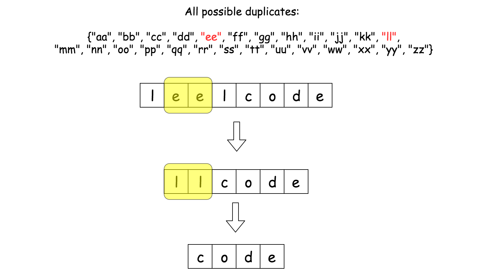

**Algorithm**

- Generate a hash set of all 26 possible duplicates from `aa` to `zz`.

- Initiate 'one step before' string length by $prevLength = -1$.

- While the previous length is still different from the current one $prevLength \neq \text{S.length}()$

- Set the 'one step before' length to be equal to the string length $prevLength = \text{S.length}()$.

- Iterate over all 26 duplicates and replace them in a string by empty char.

- Return S.

**Implementation**

```python
from string import ascii_lowercase
class Solution:
    def removeDuplicates(self, S: str) -> str:
        # generate 26 possible duplicates
        duplicates = {2 * ch for ch in ascii_lowercase}

        prev_length = -1
        while prev_length != len(S):
            prev_length = len(S)
            for d in duplicates:
                S = S.replace(d, '')

        return S
```

**Complexity Analysis**

Let $n$ be the length of string `S`.

- Time complexity: $O(n^2)$

  The `while` loop runs up to $O(n)$ times, and each call to `replace` takes $O(n)$ time. Since the `replace` function is called for each of the 26 duplicates in each iteration of the `while` loop, the total time complexity is $O(n^2)$.

- Space complexity: $O(n^2)$

  In the worst case, the repeated creation of new strings during the `replace` operations results in $O(n^2)$ space usage. This is because each call to `replace` creates a new string, and the total space used by all intermediate strings accumulates to $O(n^2)$.

  For example, in the worst case, the first iteration creates a string of length $n-2$, the second iteration creates a string of length $n-4$, and so on, until the final string is of length $0$ or $1$. The total space used is the sum of these lengths, which forms an arithmetic series summing to $O(n^2)$. This assumes that the memory for previous strings is not freed until the end of the program, leading to peak memory usage of $O(n^2)$.

<br />
<br />

---
### Approach 2: Stack

We could trade an extra space for speed. The idea is to use an output stack to keep track of only non-duplicate characters. Here is how it works:

- If the current string character equal to the last element in the stack?
Pop that last element out of the stack.

- If the current string character is _not_ equal to the last element in the stack?
Add the current character to the stack.

> Which data structure to use as the stack here?

Something that is fast to convert to a string for output, for example list in Python and StringBuilder in Java.

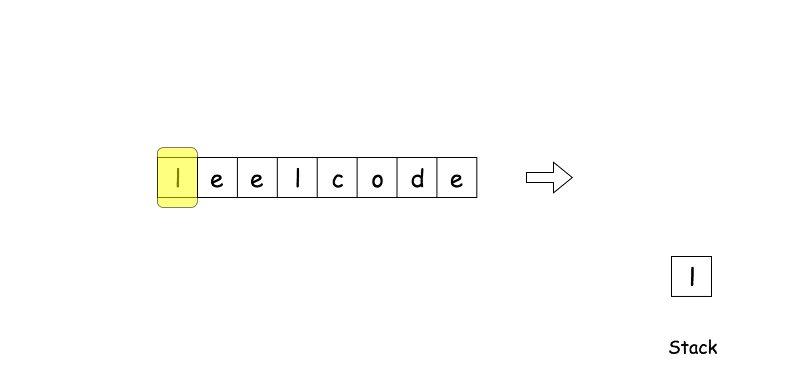

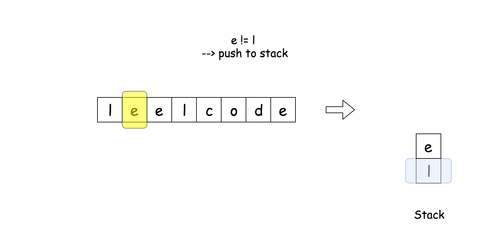

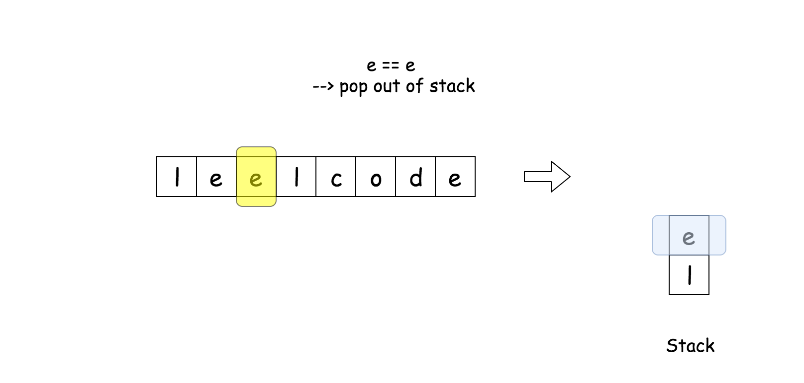

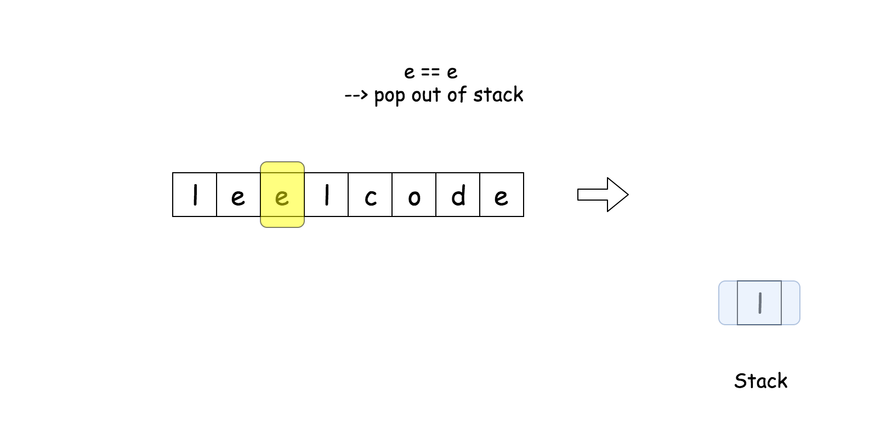

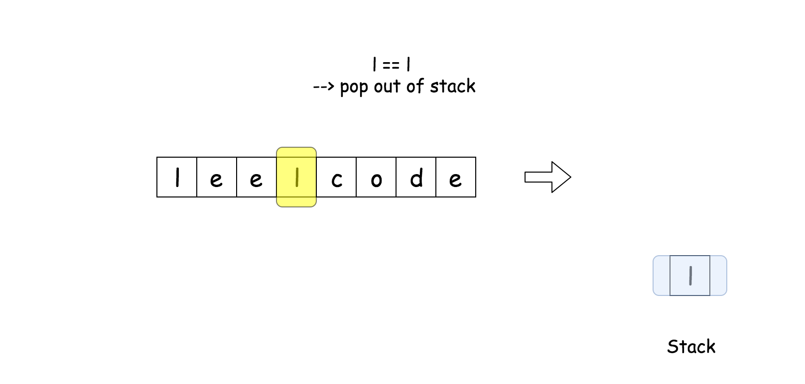

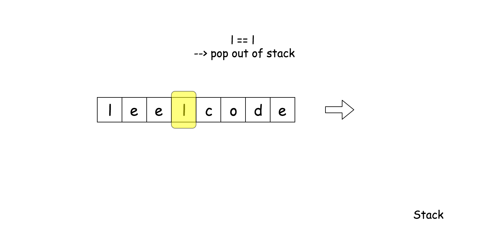

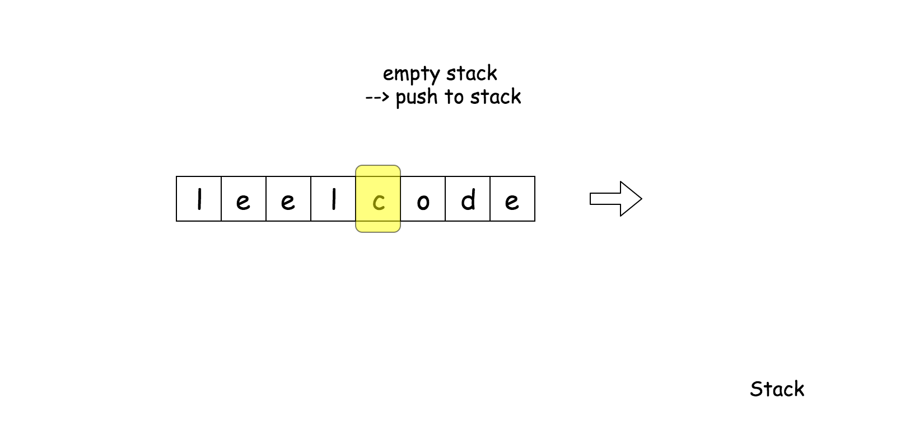

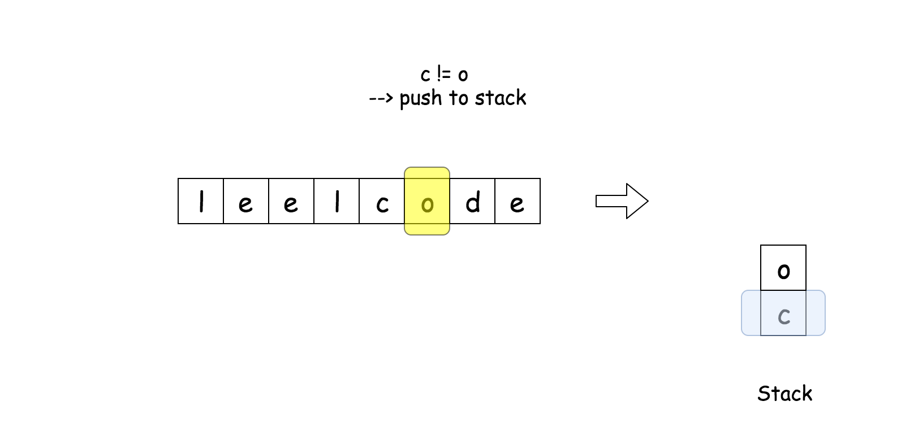

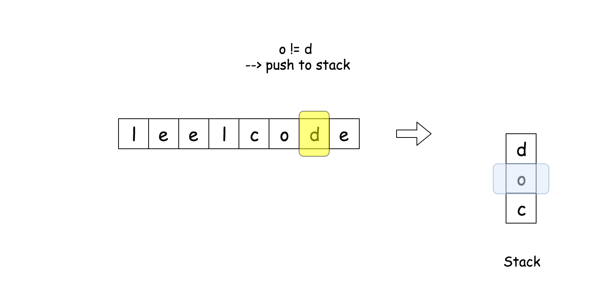

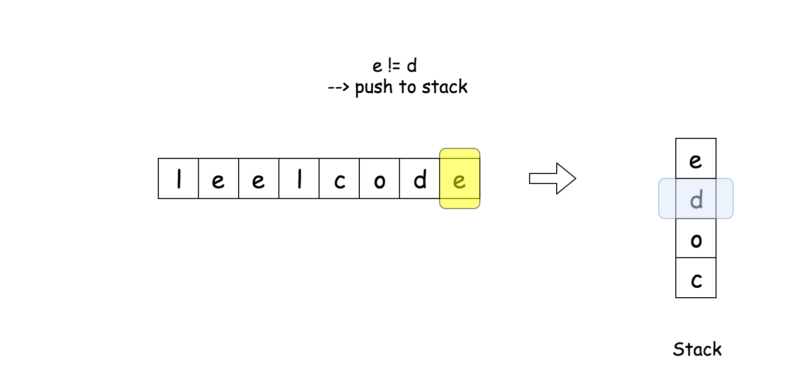

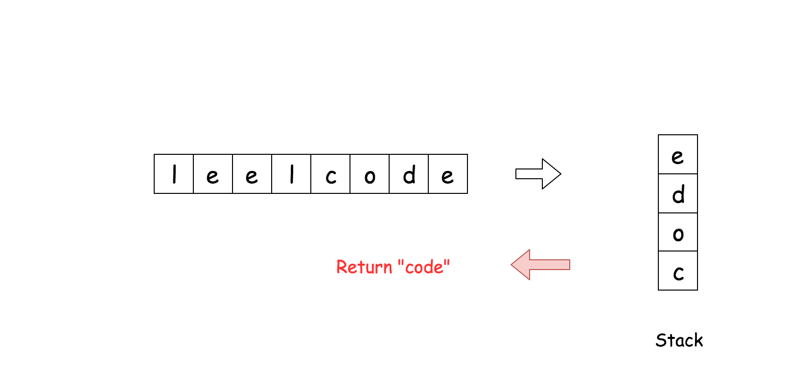

**Algorithm**

- Initiate an empty output stack.

- Iterate over all characters in the string.

- If the current element equal to the last element in the stack?
    Pop that last element out of the stack.

- If the current element is not equal to the last element in the stack?
    Add the current element into the stack.

- Convert stack into the string and return it.

**Implementation**

```python
class Solution:
    def removeDuplicates(self, S: str) -> str:
        output = []
        for ch in S:
            if output and ch == output[-1]:
                output.pop()
            else:
                output.append(ch)
        return ''.join(output)
```

**Complexity Analysis**

* Time complexity : $\mathcal{O}(N)$, where N is a string length.
* Space complexity : $\mathcal{O}(N - D)$ where D is a total length
for all duplicates.