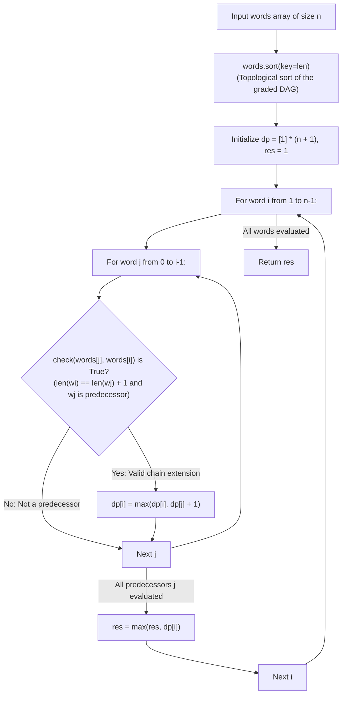

# Guided Example: Longest String Chain

We trace the step-by-step resolution of longest word chain discovery using a graded partially ordered set (poset) and topological dynamic programming, prove the Word Length Grading Theorem and the DAG Topological DP Invariant, and determine the maximal chain length across representative vocabulary sets:

- **Representative Instance 1 (Branching Predecessors with Length-Four Chain):**
  $$
  words = [\text{"a"}, \; \text{"b"}, \; \text{"ba"}, \; \text{"bca"}, \; \text{"bda"}, \; \text{"bdca"}]
  $$
- **Required Output:** `4`
  - Problem definitions:
    - $w_1$ is a predecessor of $w_2$ ($w_1 \prec w_2$) $\iff$ inserting exactly one letter anywhere into $w_1$ produces $w_2$.
    - A word chain is a sequence $w_1 \prec w_2 \prec \dots \prec w_k$.
    - Find the maximum chain length $k$.
  - The Graded Poset Invariant:
    - Crucial observation:
      $$
      w_1 \prec w_2 \implies |w_2| = |w_1| + 1
      $$
    - The predecessor relation strictly increases word length by $1$.
    - The graph of words is a **Graded Directed Acyclic Graph (DAG)** where directed edges $(u, v)$ only exist if $|v| = |u| + 1$.
    - Sorting words in non-decreasing order of string length yields a **guaranteed topological ordering**!
    - Processing words in length-sorted order ensures all candidate predecessors of $words[i]$ have already had their maximal incoming chains finalized!
  - Step-by-step DP execution:
    - Sorted words by length:
      $$
      words = [\text{"a"}, \; \text{"b"}, \; \text{"ba"}, \; \text{"bca"}, \; \text{"bda"}, \; \text{"bdca"}]
      $$
    - Initialize $dp = [1, 1, 1, 1, 1, 1]$ (each word forms a chain of length 1).
    - $i = 0$ (`"a"`): Length 1 $\implies dp[0] = \mathbf{1}$.
    - $i = 1$ (`"b"`): Length 1 $\implies dp[1] = \mathbf{1}$.
    - $i = 2$ (`"ba"`): Length 2:
      - Check $j = 0$ (`"a"`): $|ba| - |a| = 1$, `"a"` $\prec$ `"ba"` (insert `'b'`) $\implies dp[2] = \max(1, dp[0] + 1) = \mathbf{2}$.
      - Check $j = 1$ (`"b"`): $|ba| - |b| = 1$, `"b"` $\prec$ `"ba"` (insert `'a'`) $\implies dp[2] = \max(2, dp[1] + 1) = \mathbf{2}$.
      - $dp[2] = \mathbf{2}$.
    - $i = 3$ (`"bca"`): Length 3:
      - Predecessor candidate $j = 2$ (`"ba"`): $|bca| - |ba| = 1$, `"ba"` $\prec$ `"bca"` (insert `'c'`) $\implies dp[3] = \max(1, dp[2] + 1) = \mathbf{3}$.
      - $dp[3] = \mathbf{3}$.
    - $i = 4$ (`"bda"`): Length 3:
      - Candidate $j = 2$ (`"ba"`): `"ba"` $\prec$ `"bda"` (insert `'d'`) $\implies dp[4] = \max(1, dp[2] + 1) = \mathbf{3}$.
      - $dp[4] = \mathbf{3}$.
    - $i = 5$ (`"bdca"`): Length 4:
      - Candidate $j = 3$ (`"bca"`): $|bdca| - |bca| = 1$. Does `"bca"` $\prec$ `"bdca"`?
        - Two-pointer scan: match `'b'`, mismatch `'c' \ne 'd'`, match `'c'`, match `'a'`. Valid! Inserted `'d'`.
        - $dp[5] = \max(1, dp[3] + 1) = 3 + 1 = 4$.
      - Candidate $j = 4$ (`"bda"`): Does `"bda"` $\prec$ `"bdca"`?
        - Match `'b'`, match `'d'`, mismatch `'a' \ne 'c'`, match `'a'`. Valid! Inserted `'c'`.
        - $dp[5] = \max(4, dp[4] + 1) = 3 + 1 = \mathbf{4}$.
      - $dp[5] = \mathbf{4}$.
  - Global maximum:
    $$
    res = \max(1, 1, 2, 3, 3, 4) = \mathbf{4}
    $$
  - Maximal chain: `"a"` $\to$ `"ba"` $\to$ `"bda"` $\to$ `"bdca"`.

- **Representative Instance 2 (Monolithic 5-Word Chain):**
  $$
  words = [\text{"xb"}, \text{"xbc"}, \text{"cxbc"}, \text{"pcxbc"}, \text{"pcxbcf"}] \implies 1 \to 2 \to 3 \to 4 \to 5 \implies \mathbf{5}
  $$

- **Representative Instance 3 (Scrambled Letters Do Not Form Chain):**
  $$
  words = [\text{"abcd"}, \text{"dbqca"}] \implies \text{Order of letters changed} \implies \text{Not a predecessor} \implies \mathbf{1}
  $$

---

## 1. Instance & Teaching Goal

Given a list of words, find the length of the **longest word chain** where each word is formed by inserting exactly one letter into the preceding word without changing letter order.

```text
The Cycle & Search Misconception:
  Could words form cyclic dependencies?
  Do we need full depth-first search with visited cycle detection?

The Graded Poset Invariant (Topological Sorting by Length):
  Notice: w1 is a predecessor of w2  ===>  len(w2) MUST BE EXACTLY len(w1) + 1!
  Word length acts as a strict, strictly increasing grading function.
  Therefore:
    1. The predecessor graph is ALWAYS a Directed Acyclic Graph (DAG)!
    2. Sorting the words by string length is a VALID TOPOLOGICAL SORT!
    3. DP on this topological sort computes the longest path in O(N^2 * L) time:
         dp[i] = max(1, max_{j < i, w[j] is predecessor of w[i]} (dp[j] + 1))
  Completely eliminates graph cycle detection and exponential recursion!
```

Sorting words by length turns graph longest-path search into a structured 1D dynamic program.

The decisive pedagogical goal is the **Word Length Grading Theorem & Topological Poset DP**:
1. **Graded Poset Theorem:** The poset $(W, \prec)$ is graded by word length $\ell(w) = |w|$. Because every edge increases length by exactly 1, no directed cycles can exist.
2. **Topological Order by Length:** Sorting the array by $|w|$ ascending places all potential predecessors before successors, satisfying the DAG dynamic programming precondition.
3. **Subsequence Predecessor Lemma:** $w_1 \prec w_2 \iff |w_2| = |w_1| + 1$ and $w_1$ is an order-preserving subsequence of $w_2$ with exactly 1 inserted character.
4. Total time $\mathcal{O}(N \log N + N^2 L)$ and auxiliary space $\mathcal{O}(N)$.

---

## 2. Conceptual Foundation & The Graded Poset Invariant



### The Word Length Grading & DAG Topological Theorem

Let $W$ be a finite set of words over alphabet $\Sigma$.
1. **Predecessor Relation:**
   For $w_1, w_2 \in W$, $w_1 \prec w_2$ if and only if $|w_2| = |w_1| + 1$ and there exists an index $k \in [0, |w_1|]$ such that:
   $$
   w_2 = w_1[0 \dots k-1] \cdot c \cdot w_1[k \dots |w_1|-1] \quad \text{for some } c \in \Sigma
   $$
2. **Grading Function:**
   Define the rank function $\rho: W \to \mathbb{Z}^+$ by $\rho(w) = |w|$.
   For any edge $w_1 \prec w_2$:
   $$
   \rho(w_2) - \rho(w_1) = (|w_1| + 1) - |w_1| = 1
   $$
   Thus $\rho$ is a strict grading on the poset $(W, \prec)$.
   In particular, $\rho(w_2) > \rho(w_1)$ implies that the digraph $G = (W, \{(u, v) : u \prec v\})$ contains no directed cycles, forming a DAG.
3. **Topological Invariant:**
   Let $\pi$ be any permutation of $W$ sorted non-decreasingly by word length.
   If $u \prec v$, then $|u| < |v|$, so $u$ appears before $v$ in $\pi$.
   Therefore, $\pi$ is a topological sort of $G$.
4. **Dynamic Programming Recurrence:**
   The length of the longest chain terminating at word $i$ in $\pi$ satisfies:
   $$
   dp[i] = 1 + \max \Big( \{0\} \cup \{ dp[j] : j < i \land words[j] \prec words[i] \} \Big)
   $$
   Because $j < i$, all prerequisite values $dp[j]$ are already globally optimal when $dp[i]$ is computed. $\blacksquare$

---

## 3. Step-by-Step Worked Execution: Representative Instance 1

$words = [\text{"a"}, \text{"b"}, \text{"ba"}, \text{"bca"}, \text{"bda"}, \text{"bdca"}]$.
Sorted: lengths $[1, 1, 2, 3, 3, 4]$.
Initialize $dp = [1, 1, 1, 1, 1, 1], \; res = 1$.

### Word Chain Transitions
- **$i = 0$ (`"a"`):** $dp[0] = 1$.
- **$i = 1$ (`"b"`):** $dp[1] = 1$.
- **$i = 2$ (`"ba"`):**
  - $j = 0$ (`"a"`): `check("a", "ba")` = True $\implies dp[2] = \max(1, 1 + 1) = 2$.
  - $j = 1$ (`"b"`): `check("b", "ba")` = True $\implies dp[2] = \max(2, 1 + 1) = 2$.
  - $res = \max(1, 2) = 2$.
- **$i = 3$ (`"bca"`):**
  - $j = 2$ (`"ba"`): `check("ba", "bca")` = True $\implies dp[3] = \max(1, 2 + 1) = 3$.
  - $res = \max(2, 3) = 3$.
- **$i = 4$ (`"bda"`):**
  - $j = 2$ (`"ba"`): `check("ba", "bda")` = True $\implies dp[4] = \max(1, 2 + 1) = 3$.
  - $res = \max(3, 3) = 3$.
- **$i = 5$ (`"bdca"`):**
  - $j = 3$ (`"bca"`): `check("bca", "bdca")` = True $\implies dp[5] = \max(1, 3 + 1) = 4$.
  - $j = 4$ (`"bda"`): `check("bda", "bdca")` = True $\implies dp[5] = \max(4, 3 + 1) = 4$.
  - $res = \max(3, 4) = \mathbf{4}$.

Output: `4`.

---

## 4. Topologically Sorted DP Trace Table

| Word Index $i$ | Word $words[i]$ | Length $\lvert w \rvert$ | Valid Predecessors Found | Predecessor $dp$ Values | Calculated $dp[i]$ | Running Best $res$ |
|:---:|:---:|:---:|:---:|:---:|:---:|:---:|
| $0$ | `"a"` | $1$ | None | None | **$1$** | $1$ |
| $1$ | `"b"` | $1$ | None | None | **$1$** | $1$ |
| $2$ | `"ba"` | $2$ | `"a"`, `"b"` | $dp[0]=1, dp[1]=1$ | **$2$** | $2$ |
| $3$ | `"bca"` | $3$ | `"ba"` | $dp[2]=2$ | **$3$** | $3$ |
| $4$ | `"bda"` | $3$ | `"ba"` | $dp[2]=2$ | **$3$** | $3$ |
| $5$ | `"bdca"` | $4$ | `"bca"`, `"bda"` | $dp[3]=3, dp[4]=3$ | **$4$** | **$4$** |

---

## 5. Algorithmic Correctness

### Soundness & Completeness
1. **Soundness:**
   A transition $dp[i] = dp[j] + 1$ is executed only when `check(words[j], words[i])` verifies that $words[j]$ is an exact one-character insertion predecessor of $words[i]$.
2. **Completeness:**
   Because the words are topologically ordered by length, every legal predecessor $words[j]$ of $words[i]$ occurs earlier in the loop ($j < i$). The recurrence exhaustively tests all predecessors, guaranteeing the maximal chain is discovered.

---

## 6. Boundary Cases & Traps

| Scenario | Input Pattern | Behavior | Trapped Risk |
|---|---|---|---|
| Single Word | `words = ["word"]` | Loop does not execute; returns initial $res = 1$. | Out of bounds on $n = 1$. |
| Same Length Words | `["ab", "cd", "ef"]` | Length difference is 0; no predecessor accepted; returns $1$. | Chaining same-length anagrams. |
| Missing Intermediate Length | `["a", "abc", "abcd"]` | `"a"` and `"abc"` differ by 2; cannot connect; returns $2$ (`"abc" \to "abcd"`). | Skipping length levels in chain. |
| Insertion at Extremes | Prefix `"x" \to "ax"` or suffix `"a" \to "ab"` | Handled cleanly by two-pointer mismatch check. | Failing on boundary insertions. |

---

## 7. Complexity Derivation

- **Time Complexity:** $\mathcal{O}(N \log N + N^2 \cdot L)$, where $N = \text{len}(words) \le 1000$ and $L \le 16$ is the maximum string length.
  - Sorting takes $\mathcal{O}(N \log N)$ comparisons.
  - The nested loops test $\frac{N(N - 1)}{2} \approx 5 \times 10^5$ pairs.
  - The length filter and two-pointer check run in $\mathcal{O}(L)$ time per pair.
  - Total operations $\le 5 \times 10^5 \times 16 \approx 8 \times 10^6 \implies < 0.05\text{ s}$.
- **Auxiliary Space Complexity:** $\mathcal{O}(N)$ auxiliary memory for the DP table `dp`.
