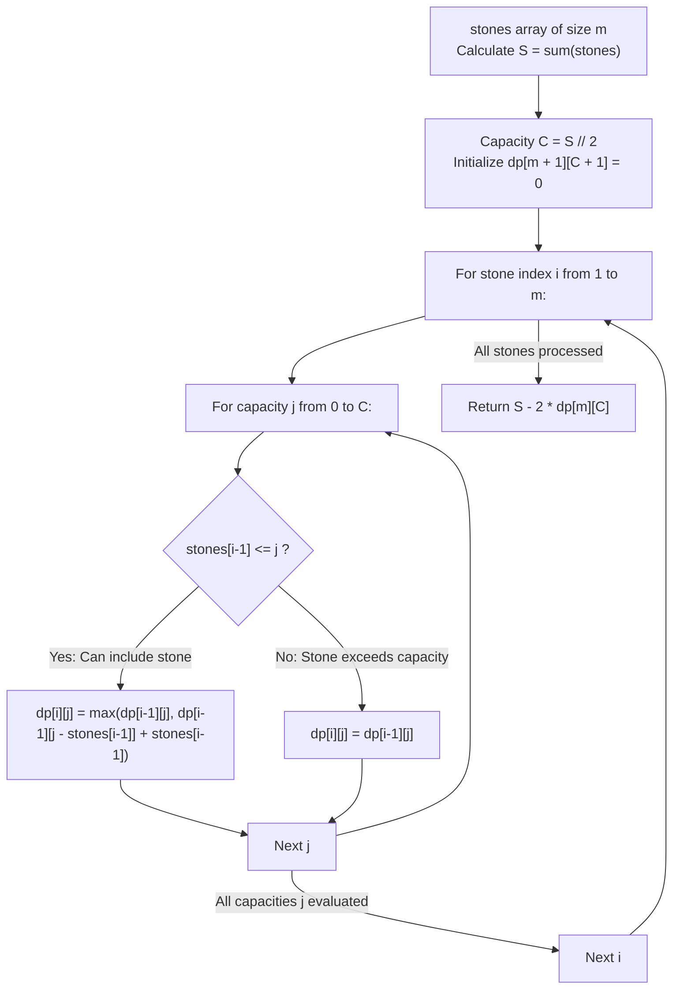

# Guided Example: Last Stone Weight II

We trace the step-by-step reduction of pairwise stone collisions to a 0-1 knapsack subset-sum partition, prove the Algebraic Sign Assignment Lemma and the Subset Sum Complementarity Theorem, and determine the minimal possible surviving stone weight across representative arrays:

- **Representative Instance 1 (Classic Six-Stone Multiset):**
  $$
  stones = [2, \; 7, \; 4, \; 1, \; 8, \; 1], \quad m = 6
  $$
- **Required Output:** `1`
  - Total mass calculation:
    $$
    S = \sum_{i=0}^{m-1} stones[i] = 2 + 7 + 4 + 1 + 8 + 1 = \mathbf{23}
    $$
  - Target partition capacity:
    $$
    C = \left\lfloor \frac{S}{2} \right\rfloor = \left\lfloor \frac{23}{2} \right\rfloor = \mathbf{11}
    $$
  - The Algebraic Sign Assignment Lemma:
    - In each smash, two stones $a$ and $b$ are replaced by $|a - b|$.
    - Inductively, the final stone weight from any valid collision tree has the form:
      $$
      \text{Final Weight} = \left| \sum_{i=0}^{m-1} \sigma_i \cdot stones[i] \right|, \quad \sigma_i \in \{-1, +1\}
      $$
    - Let $I_+$ be the subset of stones assigned positive signs, and $I_-$ the subset assigned negative signs.
    - Let $W = \sum_{i \in I_+} stones[i]$ be the sum of positive stones.
    - The sum of negative stones is:
      $$
      \sum_{i \in I_-} stones[i] = S - W
      $$
    - The remaining mass is the difference between the two subsets:
      $$
      |W - (S - W)| = |2W - S|
      $$
    - By choosing $W \le \lfloor S / 2 \rfloor$:
      $$
      \text{Final Weight} = S - 2W
      $$
    - Minimizing the final stone weight is **strictly equivalent to maximizing the subset sum $W \le \lfloor S / 2 \rfloor$**!
  - 0-1 Knapsack Dynamic Programming:
    - We want the maximum subset sum of $[2, 7, 4, 1, 8, 1]$ not exceeding $11$.
    - Examining subsets with sum $\le 11$:
      - Subset $\{8, 2, 1\}$ has sum $8 + 2 + 1 = \mathbf{11}$.
      - Subset $\{7, 4\}$ has sum $7 + 4 = \mathbf{11}$.
    - Since a subset sum of $11$ is achievable:
      $$
      W^* = 11
      $$
    - Minimal surviving weight:
      $$
      S - 2 W^* = 23 - 2(11) = 23 - 22 = \mathbf{1}
      $$

- **Representative Instance 2 (Larger Prime Weights):**
  $$
  stones = [31, 26, 33, 21, 40], \quad S = 151, \quad C = 75
  $$
  - Subsets bounded by $75$:
    - Subset $\{33, 40\} \implies 73$.
    - Subset $\{26, 21, \dots\} \le 73$.
    - Maximum achievable subset sum $\le 75$ is $W^* = 73$.
  - Minimal surviving weight:
    $$
    S - 2 W^* = 151 - 2(73) = 151 - 146 = \mathbf{5}
    $$

- **Representative Instance 3 (Perfect Balanced Partition):**
  $$
  stones = [1, 1] \implies S = 2, C = 1 \implies W^* = 1 \implies 2 - 2(1) = \mathbf{0}
  $$

- **Representative Instance 4 (Single Stone Base Case):**
  $$
  stones = [7] \implies S = 7, C = 3 \implies W^* = 0 \implies 7 - 2(0) = \mathbf{7}
  $$

---

## 1. Instance & Teaching Goal

Given an array of stone weights, choose any sequence of pairwise stone collisions to minimize the final remaining stone weight.

```text
The Greedy Fallacy:
  In problem 1046, we were forced to greedily smash the two heaviest stones.
  Greedily picking the heaviest stones for [2, 7, 4, 1, 8, 1] yields:
    (8, 7) -> 1; (4, 2) -> 2; (2, 1) -> 1; (1, 1) -> 0; remaining = 1.
  On [31, 26, 33, 21, 40], greedy yields suboptimal differences!

Subset-Sum 0-1 Knapsack Invariant (O(m * S)):
  Notice: Every collision sequence maps to an algebraic sign assignment:
    Weight = |sum_{i} (+/-) stones[i]| = |S - 2W|
  where W is the sum of a subset of stones.
  Minimizing |S - 2W| means finding a subset whose sum W is as close to S/2 as possible!
  1. Calculate S = sum(stones), C = S // 2.
  2. 0-1 Knapsack DP: dp[i][j] = max subset sum of first i stones with capacity j.
  3. Result = S - 2 * dp[m][C].
  Transforms arbitrary game tree search into a standard pseudo-polynomial 0-1 knapsack!
```

Recognizing that tree collisions decompose into binary partition signs converts an exponential search into an exact dynamic program.

The decisive pedagogical goal is the **Algebraic Sign Assignment Lemma & Subset Sum Partition Invariant**:
1. **Collision Sign Equivalence:** Any valid sequence of pairwise collisions defines a full binary tree whose leaves correspond to the stones with signs determined by parent branch directions.
2. **Knapsack Reduction:** Finding the closest subset sum to $S/2$ is isomorphic to the 0-1 Knapsack problem with capacity $\lfloor S / 2 \rfloor$ and identical item weights and values.
3. **Difference Minimization:** The minimum weight is exactly $S - 2 \cdot dp[m][\lfloor S / 2 \rfloor]$.
4. Total time $\mathcal{O}(m \cdot S)$ and auxiliary space $\mathcal{O}(m \cdot S)$ (or $\mathcal{O}(S)$).

---

## 2. Conceptual Foundation & The Knapsack Recurrence



### The Algebraic Sign Assignment & Subset Sum Theorem

Let $A = \{s_0, s_1, \dots, s_{m-1}\}$ be a multiset of positive integer weights.
1. **The Sign Representation Lemma:**
   Each turn replaces two numbers $x$ and $y$ with $|x - y|$.
   Because $|x - y| = \pm (x - y)$, by structural induction on the collision binary tree:
   $$
   \text{Value of root} = \sum_{i=0}^{m-1} \sigma_i \cdot s_i, \quad \sigma_i \in \{-1, +1\}
   $$
   subject to the condition that both signs $+1$ and $-1$ appear at least once (for $m \ge 2$).
2. **Partition Duality:**
   Partition the index set $\{0, \dots, m-1\}$ into two disjoint sets:
   $$
   I_+ = \{i : \sigma_i = +1\}, \quad I_- = \{i : \sigma_i = -1\}
   $$
   Let $W_1 = \sum_{i \in I_+} s_i$ and $W_2 = \sum_{i \in I_-} s_i$.
   Since every stone is in exactly one set:
   $$
   W_1 + W_2 = S = \sum_{i=0}^{m-1} s_i
   $$
   The root value is:
   $$
   |W_1 - W_2| = |W_1 - (S - W_1)| = |2 W_1 - S|
   $$
3. **Objective Transformation:**
   To minimize $|2 W_1 - S|$:
   Without loss of generality, let $W_1 \le W_2$. Then $W_1 \le \lfloor S / 2 \rfloor$, and $|2 W_1 - S| = S - 2 W_1$.
   To minimize $S - 2 W_1$, we must maximize $W_1$ over all achievable subset sums:
   $$
   \max W_1 \quad \text{subject to } W_1 = \sum_{i \in I_+} s_i \le \left\lfloor \frac{S}{2} \right\rfloor
   $$
4. **The 0-1 Knapsack Solution:**
   Let $dp[i][j]$ be the maximum subset sum from the prefix $s_0, \dots, s_{i-1}$ with total sum $\le j$:
   $$
   dp[i][j] = \begin{cases}
     dp[i-1][j] & \text{if } s_{i-1} > j \\
     \max(dp[i-1][j], \; dp[i-1][j - s_{i-1}] + s_{i-1}) & \text{if } s_{i-1} \le j
   \end{cases}
   $$
   The optimal value is $W^* = dp[m][\lfloor S / 2 \rfloor]$.
   The minimal remaining weight is $S - 2 W^*$. $\blacksquare$

---

## 3. Step-by-Step Worked Execution: Representative Instance 1

$stones = [2, 7, 4, 1, 8, 1], \; m = 6$.
$S = 2 + 7 + 4 + 1 + 8 + 1 = 23$.
$C = 23 // 2 = 11$.

### Item-by-Item Knapsack Progression
- **Initial:** $dp[0][j] = 0$ for all $j \in [0, 11]$.
- **Stone 1 ($s_0 = 2$):**
  - For $j \ge 2$: $dp[1][j] = 2$.
- **Stone 2 ($s_1 = 7$):**
  - For $j \in [0, 6]$: unchanged ($0$ or $2$).
  - For $j \in [7, 8]$: $\max(dp[1][j], dp[1][j-7] + 7) = 7$.
  - For $j \in [9, 11]$: $2 + 7 = 9$.
- **Stone 3 ($s_2 = 4$):**
  - Achievable sums $\le 11$ include: $0, 2, 4, 6, 7, 9, 11$ (via $7 + 4 = 11$).
  - For $j = 11$: $dp[3][11] = \max(9, dp[2][7] + 4) = 7 + 4 = \mathbf{11}$.
- **Stones 4, 5, 6 ($1, 8, 1$):**
  - The capacity $11$ is already reached: $dp[6][11] = \mathbf{11}$.

Final answer calculation:
$$
S - 2 \cdot dp[6][11] = 23 - 2(11) = 23 - 22 = \mathbf{1}
$$

---

## 4. 0-1 Knapsack Capacity State Table

| Stone Added | Stone Weight $s_{i-1}$ | Best Subset Sum for $j = 7$ | Best Subset Sum for $j = 9$ | Best Subset Sum for $j = 11$ | Achievable Subsets Near Target |
|:---:|:---:|:---:|:---:|:---:|:---:|
| Baseline | None | $0$ | $0$ | $0$ | $\emptyset$ |
| Stone 1 | $2$ | $2$ | $2$ | $2$ | $\{2\}$ |
| Stone 2 | $7$ | $7$ | $9$ | $9$ | $\{7\}, \{2, 7\}$ |
| **Stone 3** | **$4$** | **$7$** | **$9$** | **$11$** | **$\{7, 4\} \implies 11$** |
| Stone 4 | $1$ | $7$ | $10$ | $11$ | $\{7, 4\}, \{8, 2, 1\}$ |
| Stone 5 | $8$ | $8$ | $10$ | $11$ | $\{8, 2, 1\} \implies 11$ |
| Stone 6 | $1$ | $8$ | $10$ | **$11$** | **Max Subset Sum: $11$** |

---

## 5. Algorithmic Correctness

### Soundness & Completeness
1. **Soundness:**
   Any subset of stones $I_+$ corresponds to a valid bipartition of the collision tree, ensuring that $S - 2 W$ is achievable through a legal sequence of pairwise smashes.
2. **Completeness:**
   The 0-1 knapsack DP exhaustively evaluates every subset of stones whose sum does not exceed $\lfloor S / 2 \rfloor$. Therefore, no subset closer to $S/2$ can be missed.

---

## 6. Boundary Cases & Traps

| Scenario | Input Pattern | Behavior | Trapped Risk |
|---|---|---|---|
| Single Stone | `stones = [7]` | Capacity $C = 3$; $W^* = 0$; returns $7 - 2(0) = 7$. | Division by zero or negative capacity. |
| Perfect Equal Split | `stones = [1, 1]` | $S = 2, C = 1, W^* = 1$; returns $0$. | Returning 1 on even cancellation. |
| Large Dominant Stone | `stones = [20, 3, 2, 1]` | $S = 26, C = 13$; max sum from $\{3, 2, 1\}$ is $6$; returns $26 - 12 = 14$. | Assuming subsets can always balance. |
| All Equal Stones | `stones = [100, 100, 100]` | $S = 300, C = 150, W^* = 100$; returns $100$. | Redundant duplicate checks. |

---

## 7. Complexity Derivation

- **Time Complexity:** $\mathcal{O}(m \cdot S)$, where $m = \text{len}(stones) \le 30$ and $S = \sum stones \le 3000$.
  - The knapsack capacity is $C = \lfloor S / 2 \rfloor \le 1500$.
  - The DP table has $(m + 1) \times (C + 1) \le 31 \times 1501 \approx 4.6 \times 10^4$ states.
  - Each state is updated in $\mathcal{O}(1)$ operations.
  - Total time: $< 0.005\text{ s}$.
- **Auxiliary Space Complexity:** $\mathcal{O}(m \cdot S)$ auxiliary memory for the 2D DP table (can be optimized to $\mathcal{O}(S)$ with a 1D array).