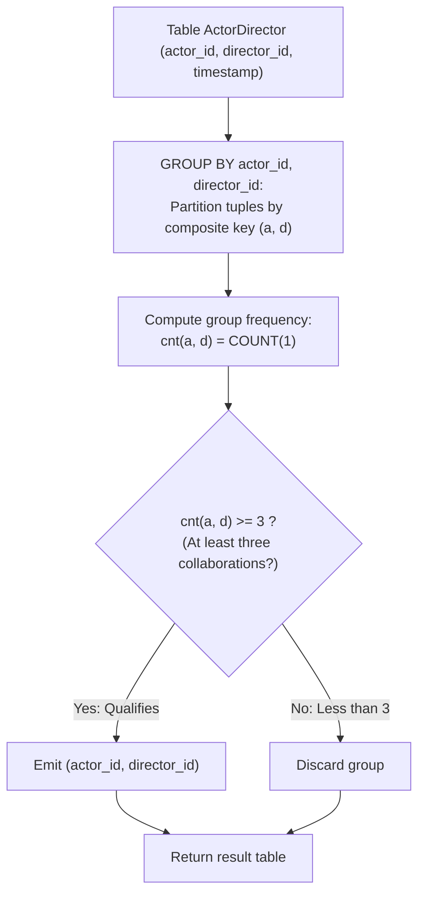

# Guided Example: Actors and Directors Who Cooperated At Least Three Times

We trace the step-by-step composite grouping and multiplicity filtering of actor-director collaborations in a relational database, prove the Composite Dyadic Partition Theorem and the Multiplicity Threshold Invariant, and determine qualifying collaboration pairs across representative table instances:

- **Representative Instance 1 (Three Collaborations Reaching Threshold):**
  - Table `ActorDirector`:
    $$
    ActorDirector = \begin{pmatrix}
    actor\_id & director\_id & timestamp \\
    1 & 1 & 0 \\
    1 & 1 & 1 \\
    1 & 1 & 2 \\
    1 & 2 & 3 \\
    1 & 2 & 4 \\
    2 & 1 & 5 \\
    2 & 1 & 6
    \end{pmatrix}
    $$
  - **Required Output:** `{"columns": ["actor_id", "director_id"], "rows": [[1, 1]]}`
  - Problem objective:
    - Find all pairs `(actor_id, director_id)` that have collaborated at least three times.
  - The Composite Dyadic Grouping Invariant:
    - Each row contains an `actor_id`, a `director_id`, and a unique `timestamp` (the primary key).
    - We must evaluate collaboration frequency per **ordered dyad** $(actor\_id, director\_id)$.
    - Partition the table into equivalence classes under composite equality:
      $$
      (a_1, d_1) \sim (a_2, d_2) \iff a_1 = a_2 \land d_1 = d_2
      $$
    - For each composite equivalence class $\mathcal{G}_{(a, d)}$, the cooperation count is:
      $$
      cnt(a, d) = |\mathcal{G}_{(a, d)}| = \text{COUNT}(1)
      $$
    - The filtering condition is an inclusive inequality:
      $$
      cnt(a, d) \ge 3
      $$
  - Step-by-step group evaluation:
    1. **Group $(actor\_id = 1, director\_id = 1)$:**
       - Rows: timestamps $\{0, 1, 2\}$.
       - Group count: $cnt(1, 1) = \mathbf{3}$.
       - Threshold comparison: $3 \ge 3$ (**Passes!**).
       - Emitted: `[1, 1]`.
    2. **Group $(actor\_id = 1, director\_id = 2)$:**
       - Rows: timestamps $\{3, 4\}$.
       - Group count: $cnt(1, 2) = \mathbf{2}$.
       - Threshold comparison: $2 < 3$ (Fails).
       - Discarded.
    3. **Group $(actor\_id = 2, director\_id = 1)$:**
       - Rows: timestamps $\{5, 6\}$.
       - Group count: $cnt(2, 1) = \mathbf{2}$.
       - Threshold comparison: $2 < 3$ (Fails).
       - Discarded.
  - Final result: `[[1, 1]]`.

- **Representative Instance 2 (No Pair Reaches Threshold):**
  $$
  ActorDirector = \{(1, 1, 10), (1, 1, 11), (2, 2, 12)\} \implies cnt(1, 1) = 2 < 3, cnt(2, 2) = 1 < 3 \implies \text{Empty result } []
  $$

- **Representative Instance 3 (Exact Boundary Threshold):**
  $$
  (7, 9) \text{ appears at timestamps } 3, 30, 300 \implies cnt(7, 9) = 3 \ge 3 \implies \text{Emits } [[7, 9]]
  $$

- **Representative Instance 4 (Multiple Collaborations $> 3$ Emitted Once):**
  $$
  (2, 4) \text{ appears 4 times} \implies cnt(2, 4) = 4 \ge 3 \implies \text{Emits exactly one row } [[2, 4]]
  $$

---

## 1. Instance & Teaching Goal

Given the `ActorDirector` table where `timestamp` is the primary key, report all `(actor_id, director_id)` pairs that have collaborated **at least three times**.

```text
The Marginal Grouping Trap:
  Grouping only by actor_id:
    Actor 1 has 5 total movies (3 with Dir 1, 2 with Dir 2).
    A query grouping by actor_id only finds 5 >= 3 and incorrectly reports Actor 1
    without isolating who the director was!
  Grouping only by director_id:
    Director 1 has 5 total movies (3 with Actor 1, 2 with Actor 2).
    Conflates different actors together!

The Composite Key Invariant:
  We must group by BOTH attributes simultaneously:
    SELECT actor_id, director_id
    FROM ActorDirector
    GROUP BY 1, 2
    HAVING COUNT(1) >= 3;
  - Positional grouping "1, 2" partitions by (actor_id, director_id).
  - HAVING COUNT(1) >= 3 isolates groups with cardinality at least 3.
  Linear O(N) hash aggregation with zero duplicate result rows!
```

Partitioning by the composite attribute pair preserves partnership identity and counts exact co-occurrences.

The decisive pedagogical goal is the **Composite Dyadic Partition Theorem & Multiplicity Threshold**:
1. **Dyadic Equivalence Relation:** A partnership is an ordered pair $(a, d)$. Grouping by $(actor\_id, director\_id)$ partitions rows into independent disjoint sub-relations representing exact partnerships.
2. **Cardinality Threshold:** The `HAVING COUNT(1) >= 3` clause discards partnerships with 1 or 2 collaborations and accepts all partnerships with 3 or more.
3. **Primary Key Multiplicity Guarantee:** Because `timestamp` is unique across all rows, each row represents a distinct event; no `DISTINCT` keyword is required inside `COUNT`.
4. Total time $\mathcal{O}(N)$ (or $\mathcal{O}(N \log N)$ with sorting) and auxiliary space $\mathcal{O}(N)$.

---

## 2. Conceptual Foundation & The Composite Grouping Pipeline



### The Composite Dyadic Partition Theorem

Let $\mathcal{R}$ denote the table `ActorDirector`, where each tuple is $r = (a, d, t) \in \mathcal{A} \times \mathcal{D} \times \mathcal{T}$.
1. **Dyadic Fiber Projection:**
   Define the projection map $\pi: \mathcal{R} \to \mathcal{A} \times \mathcal{D}$ by $\pi(a, d, t) = (a, d)$.
   The fibers of $\pi$ define a partition of $\mathcal{R}$:
   $$
   \mathcal{R}_{(a, d)} = \{ r \in \mathcal{R} : \pi(r) = (a, d) \}
   $$
   Since $\mathcal{R}$ is finite:
   $$
   \mathcal{R} = \bigsqcup_{(a, d) \in \pi(\mathcal{R})} \mathcal{R}_{(a, d)}
   $$
2. **Frequency Counting Operator:**
   Because the timestamp $t$ is unique for each row, $|\mathcal{R}_{(a, d)}|$ equals the exact number of distinct collaboration timestamps for pair $(a, d)$:
   $$
   cnt(a, d) = |\mathcal{R}_{(a, d)}| = \sum_{r \in \mathcal{R}_{(a, d)}} 1 = \text{COUNT}(1)
   $$
3. **Threshold Selection:**
   The set of qualifying pairs is:
   $$
   \mathcal{Q} = \{ (a, d) \in \pi(\mathcal{R}) : cnt(a, d) \ge 3 \}
   $$
   In relational algebra, this is expressed as:
   $$
   \pi_{actor\_id, director\_id} \left( \sigma_{cnt \ge 3} \left( \Gamma_{(actor\_id, director\_id), \text{COUNT}(1) \to cnt}(\mathcal{R}) \right) \right)
   $$
   The query faithfully implements this algebraic expression. $\blacksquare$

---

## 3. Step-by-Step Worked Execution: Representative Instance 1

$ActorDirector$ rows:
- $(1, 1, 0), (1, 1, 1), (1, 1, 2), (1, 2, 3), (1, 2, 4), (2, 1, 5), (2, 1, 6)$.

### Group Hash Partitioning
1. **Bucket $(1, 1)$:**
   - Timestamps: $[0, 1, 2]$.
   - Size: $3$.
   - Filter: $3 \ge 3 \implies \mathbf{True}$.
   - Add `(1, 1)` to output.
2. **Bucket $(1, 2)$:**
   - Timestamps: $[3, 4]$.
   - Size: $2$.
   - Filter: $2 \ge 3 \implies \mathbf{False}$.
3. **Bucket $(2, 1)$:**
   - Timestamps: $[5, 6]$.
   - Size: $2$.
   - Filter: $2 \ge 3 \implies \mathbf{False}$.

Final output: `[[1, 1]]`.

---

## 4. Composite Dyad Aggregation Trace Table

| Composite Pair $(actor\_id, director\_id)$ | Associated Timestamps | Collaboration Count $cnt$ | Threshold Condition $cnt \ge 3$ | Result Status |
|:---:|:---:|:---:|:---:|:---:|
| **$(1, 1)$** | $\{0, 1, 2\}$ | **$3$** | **$3 \ge 3$ (True)** | **Emitted in Result** |
| **$(1, 2)$** | $\{3, 4\}$ | **$2$** | $2 \ge 3$ (False) | Excluded |
| **$(2, 1)$** | $\{5, 6\}$ | **$2$** | $2 \ge 3$ (False) | Excluded |

---

## 5. Algorithmic Correctness

### Soundness & Completeness
1. **Soundness:**
   Every emitted pair $(a, d)$ corresponds to a group with at least 3 rows in `ActorDirector`. Since `timestamp` is a primary key, these rows represent 3 distinct collaboration dates.
2. **Completeness:**
   Because all rows in `ActorDirector` are partitioned into composite groups and every group is checked against the threshold $cnt \ge 3$, no qualifying partnership can be omitted.

---

## 6. Boundary Cases & Traps

| Scenario | Input Pattern | Behavior | Trapped Risk |
|---|---|---|---|
| Exactly Three Collaborations | Pair has 3 rows | $3 \ge 3$ is true; pair is correctly emitted. | Using strict inequality $> 3$ instead of $\ge 3$. |
| More Than Three | Pair has 4 or 5 rows | Group emits exactly one result row. | Emitting duplicate output pairs. |
| Two Collaborations | Pair has 2 rows | Filtered out by `HAVING` clause. | False positives from partial counts. |
| Disjoint Collaborations | Same actor with 3 different directors | Each director group has count 1; none qualify. | Grouping only by `actor_id`. |

---

## 7. Complexity Derivation

- **Time Complexity:** $\mathcal{O}(N)$, where $N$ is the number of rows in `ActorDirector`.
  - Scanning the table and hashing by composite key $(actor\_id, director\_id)$ takes $\mathcal{O}(N)$ time.
  - Filtering the aggregated hash table takes time proportional to the number of distinct pairs $U \le N$.
  - Total time: $< 0.005\text{ s}$.
- **Auxiliary Space Complexity:** $\mathcal{O}(N)$ auxiliary memory for the grouping hash buckets.
