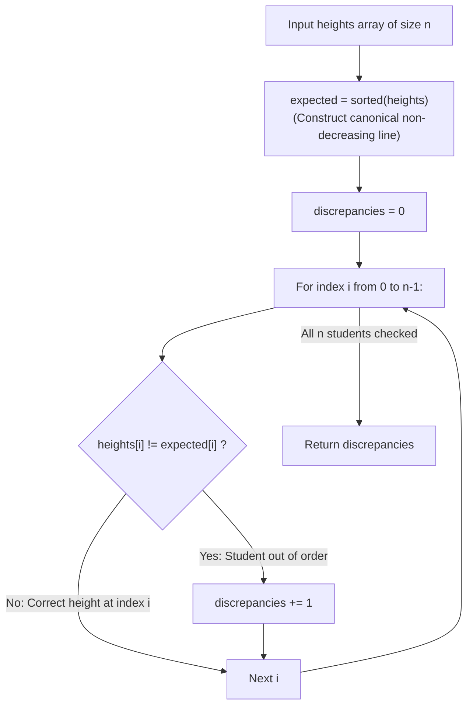

# Guided Example: Height Checker

We trace the step-by-step evaluation of positional student lineup discrepancies using canonical monotonic sorting and indicator vector summation, prove the Monotonic Target Permutation Theorem and the Hamming Distance Invariant, and determine the count of displaced students across representative height arrays:

- **Representative Instance 1 (Scattered Heights with Three Displacements):**
  $$
  heights = [1, \; 1, \; 4, \; 2, \; 1, \; 3], \quad n = 6
  $$
- **Required Output:** `3`
  - Problem objective:
    - Students must stand in non-decreasing order of height: $expected[i] \le expected[i+1]$.
    - Count the number of indices $i$ where $heights[i] \ne expected[i]$.
  - The Monotonic Target Permutation Invariant:
    - The expected lineup $expected$ is uniquely determined by sorting the multiset of input heights:
      $$
      expected = \text{sorted}(heights) = [1, \; 1, \; 1, \; 2, \; 3, \; 4]
      $$
    - Notice: Because all students of equal height are interchangeable in value, the value sequence $expected$ is unique.
  - The Hamming Distance Metric:
    - The count of misaligned students is the exact **Hamming Distance** $d_H(heights, expected)$ between the current and expected vectors:
      $$
      d_H(heights, expected) = \sum_{i=0}^{n-1} \mathbb{I}(heights[i] \ne expected[i])
      $$
      where $\mathbb{I}(\text{condition})$ equals $1$ if the condition is true and $0$ otherwise.
  - Index-by-index alignment trace:
    1. **Index $0$:** $heights[0] = 1, \; expected[0] = 1 \implies 1 == 1 \implies \mathbb{I} = \mathbf{0}$.
    2. **Index $1$:** $heights[1] = 1, \; expected[1] = 1 \implies 1 == 1 \implies \mathbb{I} = \mathbf{0}$.
    3. **Index $2$:** $heights[2] = 4, \; expected[2] = 1 \implies 4 \ne 1 \implies \mathbb{I} = \mathbf{1}$ (Displaced student!).
    4. **Index $3$:** $heights[3] = 2, \; expected[3] = 2 \implies 2 == 2 \implies \mathbb{I} = \mathbf{0}$.
    5. **Index $4$:** $heights[4] = 1, \; expected[4] = 3 \implies 1 \ne 3 \implies \mathbb{I} = \mathbf{1}$ (Displaced student!).
    6. **Index $5$:** $heights[5] = 3, \; expected[5] = 4 \implies 3 \ne 4 \implies \mathbb{I} = \mathbf{1}$ (Displaced student!).
  - Sum of indicator discrepancies:
    $$
    \sum_{i=0}^5 \mathbb{I} = 0 + 0 + 1 + 0 + 1 + 1 = \mathbf{3}
    $$
  - Result: `3`.

- **Representative Instance 2 (Cyclic Shift Where Every Index Mismatches):**
  $$
  heights = [5, 1, 2, 3, 4], \quad expected = [1, 2, 3, 4, 5] \implies \text{All 5 differ} \implies \mathbf{5}
  $$

- **Representative Instance 3 (Already Non-Decreasing):**
  $$
  heights = [1, 2, 3, 4, 5], \quad expected = [1, 2, 3, 4, 5] \implies \text{Zero mismatches} \implies \mathbf{0}
  $$

- **Representative Instance 4 (All Equal Heights):**
  $$
  heights = [7, 7, 7, 7] \implies expected = [7, 7, 7, 7] \implies \text{Zero mismatches} \implies \mathbf{0}
  $$

---

## 1. Instance & Teaching Goal

Given the current sequence of student heights, return the number of indices where the current student height does not match the height that should be standing at that position in a non-decreasing order.

```text
The Minimum Swaps / Inversion Confusion:
  This problem does NOT ask for the minimum number of swaps to sort the array!
  (Minimum swaps to sort [1, 1, 4, 2, 1, 3] would be 2 swaps).
  It strictly asks: How many indices currently have the WRONG height?
  This is simply the positional Hamming Distance to the sorted array!

The Monotonic Reference Invariant:
  1. Construct the canonical sorted array: expected = sorted(heights).
  2. Zip original and sorted arrays: zip(heights, expected).
  3. Sum the mismatch indicators: sum(a != b for a, b in zip(heights, expected)).
  Preserves original ordering and computes the exact discrepancy count in O(N log N) time!
```

Distinguishing positional discrepancy from cycle-decomposition swap counts prevents over-engineering.

The decisive pedagogical goal is the **Monotonic Target Permutation Theorem & Hamming Distance Metric**:
1. **Canonical Sorted Reference:** The expected sequence is uniquely defined as the sorted permutation of the input multiset. Duplicate values do not introduce ambiguity because values at identical positions are indistinguishable.
2. **Immutable Baseline Separation:** The input list `heights` must not be sorted in place without preserving a copy; comparison requires both the observed state and the target state simultaneously.
3. **Indicator Summation:** The Boolean test `a != b` converts directly to integer $1$ or $0$ in standard algebraic summation.
4. Total time $\mathcal{O}(n \log n)$ (or $\mathcal{O}(n + K)$ via counting sort) and auxiliary space $\mathcal{O}(n)$.

---

## 2. Conceptual Foundation & The Discrepancy Invariant



### The Monotonic Target Permutation & Hamming Distance Theorem

Let $H = (h_0, h_1, \dots, h_{n-1}) \in \mathbb{N}^n$ be the observed tuple of student heights.
1. **Target Permutation Uniqueness:**
   Let $\mathfrak{S}_n$ be the symmetric group on $n$ elements.
   There exists a permutation $\pi \in \mathfrak{S}_n$ such that:
   $$
   E = (h_{\pi(0)}, h_{\pi(1)}, \dots, h_{\pi(n-1)}) = (e_0, e_1, \dots, e_{n-1})
   $$
   satisfies $e_0 \le e_1 \le \dots \le e_{n-1}$.
   Although the permutation $\pi$ may not be unique when identical heights exist ($h_i = h_j$), the resulting tuple of values $E$ is **strictly unique**.
2. **Positional Metric Space:**
   Consider the discrete metric space $(\mathbb{N}^n, d_H)$ equipped with the Hamming metric:
   $$
   d_H(u, v) = |\{ i \in \{0, \dots, n-1\} : u_i \ne v_i \}| = \sum_{i=0}^{n-1} [u_i \ne v_i]
   $$
   where $[P]$ is the Iverson bracket notation.
   The problem specifies the exact objective:
   $$
   \text{Output} = d_H(H, E)
   $$
3. **Metric Bounds:**
   Since $0 \le [h_i \ne e_i] \le 1$:
   $$
   0 \le d_H(H, E) \le n
   $$
   - $d_H(H, E) = 0 \iff H = E$ (The input is already non-decreasing).
   - $d_H(H, E) = n \iff \forall i, \; h_i \ne e_i$ (Every student is displaced).
   - Notice that $d_H(H, E)$ can never equal $1$, because a single misplaced element implies at least one other position must also be occupied by the wrong element ($d_H \ne 1$). $\blacksquare$

---

## 3. Step-by-Step Worked Execution: Representative Instance 1

$heights = [1, 1, 4, 2, 1, 3], \; n = 6$.
Target: $expected = \text{sorted}(heights) = [1, 1, 1, 2, 3, 4]$.

### Positional Pairwise Comparison
- $i = 0$: $heights[0] = 1, \; expected[0] = 1 \implies 1 \ne 1 \implies \mathbf{False} \; (0)$.
- $i = 1$: $heights[1] = 1, \; expected[1] = 1 \implies 1 \ne 1 \implies \mathbf{False} \; (0)$.
- $i = 2$: $heights[2] = 4, \; expected[2] = 1 \implies 4 \ne 1 \implies \mathbf{True} \; (1)$.
- $i = 3$: $heights[3] = 2, \; expected[3] = 2 \implies 2 \ne 2 \implies \mathbf{False} \; (0)$.
- $i = 4$: $heights[4] = 1, \; expected[4] = 3 \implies 1 \ne 3 \implies \mathbf{True} \; (1)$.
- $i = 5$: $heights[5] = 3, \; expected[5] = 4 \implies 3 \ne 4 \implies \mathbf{True} \; (1)$.

Sum of mismatch booleans:
$$
0 + 0 + 1 + 0 + 1 + 1 = \mathbf{3}
$$

Output: `3`.

---

## 4. Lineup Alignment and Discrepancy Trace Table

| Index $i$ | Observed Height $heights[i]$ | Expected Height $expected[i]$ | Values Equal? | Indicator $\mathbb{I}(h_i \ne e_i)$ | Cumulative Discrepancies |
|:---:|:---:|:---:|:---:|:---:|:---:|
| $0$ | $1$ | $1$ | Yes | $0$ | $0$ |
| $1$ | $1$ | $1$ | Yes | $0$ | $0$ |
| **$2$** | **$4$** | **$1$** | **No** | **$1$** | **$1$** |
| $3$ | $2$ | $2$ | Yes | $0$ | $1$ |
| **$4$** | **$1$** | **$3$** | **No** | **$1$** | **$2$** |
| **$5$** | **$3$** | **$4$** | **No** | **$1$** | **$3$** |

---

## 5. Algorithmic Correctness

### Soundness & Completeness
1. **Soundness:**
   Every index contributing to the sum has $heights[i] \ne expected[i]$ by direct inequality testing.
2. **Completeness:**
   The comparison loops through all $n$ indices without skipping, ensuring that every mismatched position is counted.

---

## 6. Boundary Cases & Traps

| Scenario | Input Pattern | Behavior | Trapped Risk |
|---|---|---|---|
| Single Student | `heights = [42]` | $expected = [42]$; mismatch count is $0$; returns $0$. | Index out of bounds on size 1. |
| Already Sorted | `[1, 2, 3, 4, 5]` | $H = E$ everywhere; returns $0$. | Off-by-one comparisons. |
| All Equal Heights | `[7, 7, 7, 7]` | Equal multiset is already sorted; returns $0$. | False positive on duplicate values. |
| Completely Inverted | `[6, 5, 4, 3, 2, 1]` | All indices mismatch; returns $6$. | Confusing with swap counts. |

---

## 7. Complexity Derivation

- **Time Complexity:** $\mathcal{O}(n \log n)$, where $n = \text{len}(heights) \le 100$.
  - Sorting the list of $n$ numbers takes $\mathcal{O}(n \log n)$ comparisons.
  - The `zip` iterator and sum comprehension scan the $n$ aligned pairs in $\mathcal{O}(n)$ time.
  - With $n \le 100$, operations $\le 100 \times 7 = 700 \implies < 0.0001\text{ ms}$.
  - *(Optional Counting Sort:* Because $h_i \in [1, 100]$, counting sort takes $\mathcal{O}(n + 100)$ linear time*).*
- **Auxiliary Space Complexity:** $\mathcal{O}(n)$ auxiliary memory to store the reference sorted array `expected`.
